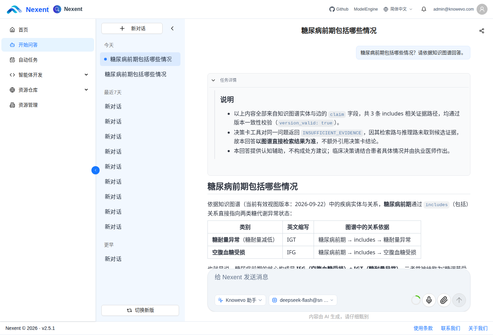
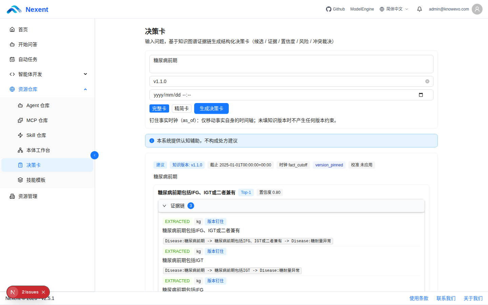
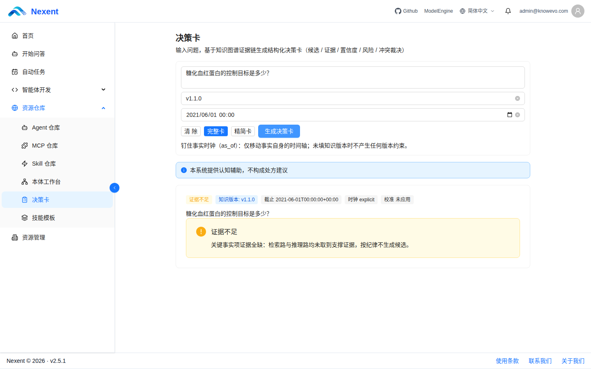
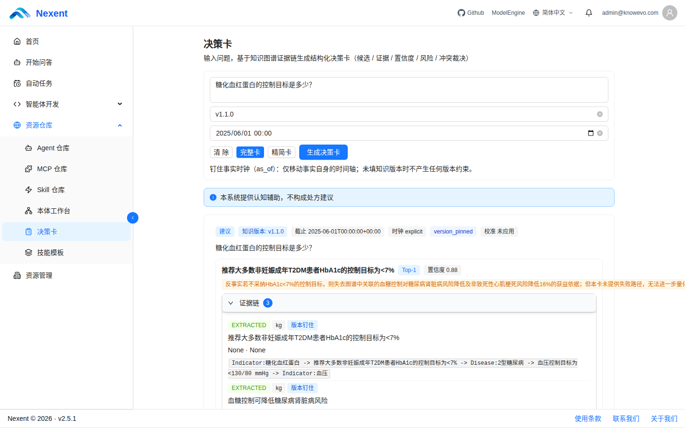
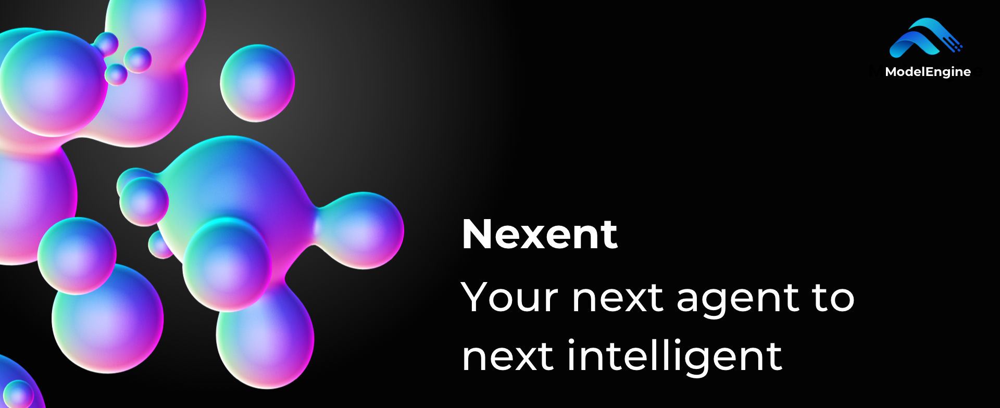

<div align="center">

# KnowEvo

**Domain Knowledge-Asset Cognition & Decision Intelligence · 领域知识资产认知与决策智能体**

*Turn dormant documents into versioned knowledge — answer with evidence, evolve with standards.*


[](https://github.com/ModelEngine-Group/nexent)

</div>

KnowEvo is a domain knowledge-asset cognition and decision agent built on **ModelEngine Nexent v2.5.1**（this fork's baseline, per the repository `VERSION` file）. It activates an organization's dormant documents — guidelines, specifications, manuals that nobody can reliably query — into a **versioned knowledge-graph asset**, then serves answers as **decision cards with complete evidence chains**, and keeps the whole asset **evolving incrementally as the underlying standards change**.

Three properties distinguish it from a plain RAG stack:

1. **Every answer carries a knowledge version stamp.** Questions are answered as-of a knowledge clock; a query about last year's guideline honestly refuses when the pinned version has no evidence, and answers when the current one does (bi-temporal version pinning).
2. **Retrieval and reasoning are dual-driven.** Factoid questions route to a retrieval path (knowledge base + graph search); multi-document, multi-hop questions route to a reasoning path (beam search over the versioned graph). The two paths are Skills, not hardcoded prompts.
3. **Evolution is a pipeline, not a re-index.** A standards update triggers change detection → affected-scope computation → a minimal sufficient update proposal → human review → a new graph version. Old versions stay queryable.

## ✨ Features

| Feature | Description |
|---------|-------------|
| **📦 Asset Pipeline (L1)** | Ingestion through the Nexent pipeline with fallback parsers, plus a registry that tracks document ID, modality, authority level, publish date and lineage |
| **🧠 Semi-Automatic Ontology & Versioned Graph (L2)** | Seed-guided ontology proposals with an explicit human-review budget, anchored extraction, three-stage entity alignment, and a bi-temporal property graph in PostgreSQL JSONB with recursive-CTE multi-hop |
| **🎴 Dual-Drive Decision Cards (L3)** | Route → retrieve or reason → fuse the evidence chain → render a decision card with knowledge-version stamp, uncertainty notes and honest refusals |
| **🔄 Standards-Aligned Evolution (L4)** | Change detection → affected scope → minimal sufficient update set → human confirmation; conflict detection/adjudication records; trajectories distilled into reusable Skill templates |
| **🔧 9 Custom MCP Tools** | `kg_search`, `asset_search`, `kg_stats`, `kg_multi_hop`, `kg_evolution_trace`, `ontology_diff`, `evidence_verify`, `decision_card_render`, `skill_template_apply` — one FastMCP instance, dual-registered into the platform Local MCP pipeline and a standalone SSE service, tool sets guaranteed identical on both faces |
| **📝 4 SKILLs, Least Privilege** | `domain-asset-cognition` (entry router) + `retrieval-path` / `reasoning-path` / `evidence-assembly`; each SKILL's frontmatter declares only the tools that layer needs |
| **🔍 ES Hybrid Retrieval** | Entity retrieval prefers Elasticsearch hybrid search and degrades gracefully (identical results) to PostgreSQL lexical retrieval when ES is absent or unhealthy |
| **🏭 GraphStore Dual-Backend Factory** | All graph queries converge behind a single `GraphStore` interface; `make_graph_store()` builds the configured backend (`pg_jsonb` by default, an in-memory backend as the second option) and rejects unknown backend names instead of silently binding one |

## 🔎 Numbers you can check

All figures below come from committed artifacts (JSON reports, database snapshots, test receipts) in the evaluation workspace — see [Reproduce](#-reproduce-the-evaluation).

- **Test baseline**: `1327 passed / 33 skipped` (0 failures) on the PostgreSQL-integrated KnowEvo suite.
- **Corpus → graph (medical domain)**: 58 public documents → 112 qualified segments → **1,019 entities / 1,337 relations / 136 evidence rows** → 33 traceable decision cards.
- **Cross-domain migration**: the same pipeline re-run unchanged on government (36/36 segments), finance (32/32) and manufacturing (30/40 valid segments) corpora.
- **Five-arm ablation** (20 questions × 3 runs, 112-segment graph): pure RAG 0.7069 → +graph retrieval 0.7500; the full A1–A4 + version-pin matrix ships in the report JSON.
- **Graph performance**: multi-hop query p95 = 12.5 ms on a 20k-entity / 30k-edge proof of concept; indexed bulk write path 54.15× faster than the naive baseline (124.1 s → 2.3 s).
- **Provenance**: evidence spans are verbatim-faithful at 238/238; model-attributed relation-evidence citations measure 0.9263 strict agreement under an independent judge.
- **Offline mechanism probes**: the algorithm probes run with no LLM and fixed seeds, in under a second, and are re-runnable by anyone.

## 🚀 Quick Start

### Requirements

- Docker 24+ and Docker Compose v2+
- 16 GB RAM recommended
- A model-gateway API key (configured in `deploy/env/.env`; only needed for LLM-backed features — tests and mechanism probes run without one)

### Deploy

```bash
git clone https://github.com/qianfenaichou/nexent.git
cd nexent

# Linux / macOS
bash deploy/knowevo/up.sh

# Windows (PowerShell)
.\deploy\knowevo\up.ps1
```

Then open `http://localhost:3000`, create a tenant and administrator, register your models, and create the KnowEvo agent. The full walkthrough — tenant initialization, model registration, agent/Skill/MCP configuration — is in `competition/docs/reproduce-README.md` (shipped with the evaluation workspace, not in the git tree).

### Reproduce the evaluation

The same document is the entry point for reproducing every number in this README: deployment → tenant setup → unit/integration suite → ablation pipeline → offline probes → database snapshot verification. Code-level and mechanism-level reproduction needs no credentials; end-to-end LLM evaluation uses your own gateway key.

> Note: the `competition/` directory (evaluation workspace: reports, probe scripts, screenshots, receipts) ships with the project archive rather than the git tree. Unpack it as described in the reproduce README.

## 📸 Screenshots

Real platform captures; the chat and decision-card shots are interlocked with rows in the database (each card ID is queryable).

| Chat QA with live tool calls | Decision card with evidence chain |
|---|---|
|  |  |

| Same question, knowledge clock 2021 → honest refusal | Same question, knowledge clock 2025 → recommendation with evidence |
|---|---|
|  |  |

## 🧩 What changed vs upstream

This repository is a fork of **[ModelEngine-Group/Nexent](https://github.com/ModelEngine-Group/nexent)** (MIT License). The upstream platform base is used unmodified; our changes concentrate in:

- `backend/services/knowevo/` — the KnowEvo service layer (graph store, ontology, decision, evolution, retrieval)
- `deploy/sql/migrations/` — the KnowEvo schema migrations (`v2.5.5_kw_001` … `kw_013`)
- `backend/tool_collection/mcp/` + `mcp_servers/knowevo_mcp/` — the custom MCP tool family
- `knowevo/` — interface contract documents for the service layer
- `frontend/features/` — knowledge graph, decision card, skill gallery and evolution board panels
- `competition/` — the evaluation workspace (corpus registry, experiment reports, probes, receipts)

Everything upstream — zero-code agent generation, multi-model integration, memory, marketplace, multi-tenancy — remains available and is documented in the upstream README below.

## 🙏 Acknowledgements & License

Built on [Nexent](https://github.com/ModelEngine-Group/nexent) by ModelEngine-Group. All upstream LICENSE and attribution are preserved. This fork is distributed under the same [MIT License](LICENSE).

---

## 中文简介（核心段落）

**KnowEvo · 领域知识资产认知与决策智能体**，基于 ModelEngine Nexent v2.5.1（fork 基线，以仓内 `VERSION` 为准）构建。它把组织侧「检索不到、分不清版本、答不可溯源」的沉睡文档，激活为**带版本戳的知识图谱资产**；问答以**带完整证据链的决策卡**形式输出；并随上游标准/规范的更新**增量进化**，旧版本持续可查。

**核心特性**：

- **L1 资产化管道**：摄取 + 专项解析兜底 + 资产登记（编号/模态/权威级/发布时间/血缘）
- **L2 半自动本体 + 版本化图谱**：种子引导提案 + 人审预算、三级实体对齐、PG JSONB 双时态图存储、递归 CTE 多跳
- **L3 检索-推理双驱动决策卡**：事实题走检索路，多跳题走版本钉住的推理路，输出带知识版本戳与诚实拒绝的决策卡
- **L4 标准对齐进化**：变更检测 → 受影响面 → 最小充分更新集 → 人审确认，冲突裁决留痕，轨迹沉淀为 Skill 模板
- **9 个自研 MCP 工具**（单一 FastMCP 实例双注册）+ **4 个最小权限 SKILL** + **ES 混合检索**（无 ES 时逐位退化 PG 词法）+ **GraphStore 双后端工厂**

**快速开始**：

```bash
git clone https://github.com/qianfenaichou/nexent.git
cd nexent
bash deploy/knowevo/up.sh        # Windows: .\deploy\knowevo\up.ps1
```

评测复现入口链见 `competition/docs/reproduce-README.md`（随评测工作区分发，不在 git 树内）：部署 → 租户/模型 → 测试套件 → 消融管线 → 离线探针 → 快照核对；代码与机制层无需任何密钥即可复现。

**可核验数字**：测试基线 1327 passed / 33 skipped；医疗域 58 份语料 → 112 合格段 → 1,019 实体 / 1,337 关系 / 136 证据 → 33 张可溯源决策卡；五臂消融 A1 纯 RAG 0.7069 → A2 +图检索 0.7500；多跳查询 p95 = 12.5 ms（2 万实体/3 万边 PoC）。

本仓库 fork 自 [ModelEngine-Group/Nexent](https://github.com/ModelEngine-Group/nexent)（MIT），平台底座零修改，改动集中于 KnowEvo 服务层、迁移、MCP 工具族、契约文档与评测工作区；上游许可证与署名完整保留。

---

（上游原 README 内容）

---



[](https://nexent.tech)
[](README.md)
[](README_CN.md)
[](https://modelengine-group.github.io/nexent)
[](https://hub.docker.com/repositories/nexent)
[](https://codecov.io/gh/ModelEngine-Group/nexent)

Nexent is a zero-code platform for auto-generating production-grade AI agents, built on **Harness Engineering** principles. It provides unified tools, skills, memory, and orchestration with built-in constraints, feedback loops, and control planes — no orchestration, no complex drag-and-drop required, using pure language to develop any agent you want.

> One prompt. Endless reach.

<video controls width="100%" style="max-width: 800px;">
  <source src="https://github.com/user-attachments/assets/db6b7f5a-9ee8-4327-ae6f-c5af896126b4" type="video/mp4" />
  <p><a href="https://github.com/user-attachments/assets/db6b7f5a-9ee8-4327-ae6f-c5af896126b4">Watch the demo video</a></p>
</video>

# 🚀 Get Started Now

> ⭐ Before you get started, please star us on [GitHub](https://github.com/ModelEngine-Group/nexent) — your support drives us forward!

## Deploy on Your Own

If you need to run Nexent locally or in your private infrastructure, we offer two deployment options:

### System Requirements

| Resource | Docker | Kubernetes |
|----------|--------|-------------|
| **CPU** | 4 cores (min) / 8 cores (rec.) | 4 cores (min) / 8 cores (rec.) |
| **Memory** | 8 GiB (min) / 16 GiB (rec.) | 16 GiB (min) / 64 GiB (rec.) |
| **Disk** | 40 GiB (min) / 100 GiB (rec.) | 100 GiB (min) / 200 GiB (rec.) |
| **Architecture** | x86_64 / ARM64 | x86_64 / ARM64 |
| **Software** | Docker 24+, Docker Compose v2+ | Kubernetes 1.24+, Helm 3+ |

> **Note:** Recommended configurations ensure optimal performance in production environments.

### Docker Deployment (Recommended for Individuals/Small Teams)

Quick and straightforward for most users. Prerequisites: Docker 24+ and Docker Compose v2+:

```bash
git clone https://github.com/ModelEngine-Group/nexent.git
cd nexent
bash deploy.sh docker
```

The root `deploy.sh` only forwards to the target deploy script; the native Docker implementation is `bash deploy/docker/deploy.sh`. The Docker and Kubernetes deploy scripts share the same deployment configuration model. Interactive runs show Bash TUI menus for component selection, port policy, and image source. `infrastructure` is required; `application`, `data-process`, and `supabase` are selected by default and can be disabled when you want a smaller deployment. Use `b`/Backspace to return to the previous TUI step and `q` to quit. Use `--defaults` to skip the TUI and deploy with saved `deploy.options` or built-in defaults. Non-interactive runs can also pass the same choices with `--version`, `--components`, `--port-policy development|production`, and `--image-source general|mainland|local-latest`. Successful deployments save non-sensitive choices to each deploy directory's `deploy.options` for reuse on the next run.

Docker and Kubernetes both use `deploy/env/.env` as the runtime configuration file. Existing `deploy/env/.env` is kept as-is. If it does not exist, the deploy scripts first reuse `docker/.env`, then fall back to `deploy/env/.env.example`. Monitoring-specific settings are generated from `deploy/env/monitoring.env.example` into `deploy/env/monitoring.env`.

Docker uninstall is handled by `bash uninstall.sh docker`. It can preserve or delete data volumes: run it interactively, pass `--delete-volumes true|false`, or use `bash uninstall.sh docker delete-all` to remove containers and persistent data.

Offline image packages can be built with `bash build.sh --package --target docker --compress true` or `bash deploy/offline/build_offline_package.sh --target docker --compress true`. The package includes image tar files, `load-images.sh`, `push-images.sh`, root deploy/uninstall entrypoints, deployment scripts, SQL files, `manifest.yaml`, and `checksums.txt`. Package deploys use saved `deploy.options` or built-in defaults without opening the TUI; add `--config` to configure interactively. Deploy with `bash deploy.sh --load-images docker ...` on the target host, or use `bash deploy.sh --push-images --image-registry-prefix registry.example.com/nexent docker ...` to push loaded images to an internal registry and deploy with that image prefix. When `--push-images` is used without a prefix, `deploy.sh` asks for it before `push-images.sh` prompts for the registry username and password.

For detailed deployment instructions, see [Docker Installation](https://modelengine-group.github.io/nexent/en/quick-start/installation.html).

### Kubernetes Deployment (For Enterprise Production)

Ideal for enterprise scenarios requiring high availability and elastic scaling. Prerequisites: Kubernetes 1.24+ and Helm 3+:

```bash
git clone https://github.com/ModelEngine-Group/nexent.git
cd nexent
bash deploy.sh k8s
```

The native Kubernetes implementation is `bash deploy/k8s/deploy.sh`. It installs two independent Helm releases: `nexent-infrastructure` for Elasticsearch, PostgreSQL, Redis, and MinIO, then `nexent` for application services after infrastructure and the Elasticsearch API key are ready. Use `--release-scope all|infrastructure|nexent` to operate both releases or either side independently. The script reads `deploy/env/.env` and renders explicit Helm ConfigMap and Secret overrides. Use `--persistence-mode local|dynamic|existing`, `--storage-class`/`--sc`, `--local-path`, `--local-node-name`, and `--existing-claim-prefix` to control PVC behavior.

Kubernetes uninstall is handled by `bash uninstall.sh k8s`. By default it removes `nexent` first and `nexent-infrastructure` second. The same `--release-scope` option supports application-only removal and dependency-protected infrastructure removal.

Kubernetes offline packages use the same builder with `--target k8s` or `--target all`. Run `load-images.sh` on every cluster node that needs the images, or use `--push-images --image-registry-prefix registry.example.com/nexent` to push the images to an internal registry before deploying with the same version, image source, and image registry prefix.

For detailed deployment instructions, see [Kubernetes Installation](https://modelengine-group.github.io/nexent/en/quick-start/kubernetes-installation.html).

# ✨ Core Features

Nexent provides a comprehensive feature set for building powerful AI agents:

| Feature | Description |
|---------|-------------|
| **⚙️ Multi-Model Integration** | OpenAI-compatible with any provider, full LLM/Embedding/VLM/STT/TTS coverage, supports domestic model switching |
| **🤖 Zero-Code Agent Generation** | Describe requirements in natural language, generate executable agents instantly, what you think is what you get |
| **🤝 A2A Agent Collaboration** | Agent-to-Agent protocol enables seamless multi-agent cooperation and distributed workflows |
| **🧠 Layered Memory Mechanism** | Two-tier memory (user-level + user-agent-level) for persistent context across conversations |
| **📝 Progressive Skill Disclosure** | Dynamically loads Skill into context, maximizing context window efficiency |
| **🗄️ Personal-Grade Knowledge Base** | Real-time import and intelligent retrieval for 20+ document formats, auto summaries, fine-grained access control |
| **🔧 MCP Tool Ecosystem** | Plug-and-play extension system with custom development and third-party MCP service support |
| **🌐 Internet Knowledge Integration** | Multi-source search blending real-time information with private data |
| **🔍 Knowledge-Level Traceability** | Precise citations and source verification, full transparency for every fact |
| **🎭 Multimodal Interaction** | Voice, text, images, files — comprehensive natural dialogue |
| **🔢 Agent Version Management** | Version iteration and history rollback, safe and controllable |
| **🏪 Agent Marketplace** | Official and community curated agents, one-click install and use |
| **👥 Multi-Tenancy & RBAC** | Multi-tenant isolation, role-based access control, fine-grained resource management |

# 🤝 Join Our Community

> *If you want to go fast, go alone; if you want to go far, go together.*

We have released **Nexent v2.0**! A comprehensive upgrade from v1.0, featuring A2A protocol support, progressive Skill disclosure, layered memory mechanism, user management with multi-tenancy, agent version management, agent marketplace, and more.

- **🗺️ Check our [Feature Map](https://github.com/orgs/ModelEngine-Group/projects/6)** to explore current and upcoming features.
- **🔍 Try the current build** and leave ideas or bugs in the [Issues](https://github.com/ModelEngine-Group/nexent/issues) tab.

> *Rome wasn't built in a day.*

If our vision speaks to you, jump in via the **[Contribution Guide](https://modelengine-group.github.io/nexent/en/contributing)** and shape Nexent with us.

Early contributors won't go unnoticed: from special badges and swag to other tangible rewards, we're committed to thanking the pioneers who help bring Nexent to life.

Most of all, we need visibility. Star ⭐ and watch the repo, share it with friends, and help more developers discover Nexent — your click brings new hands to the project and keeps the momentum growing.

# 📖 What's Next

Ready to dive deeper? Here are the main documentation entry points:

- **[Quick Start](https://modelengine-group.github.io/nexent/en/quick-start/installation.html)** — System requirements and deployment guide
- **[Core Features](https://modelengine-group.github.io/nexent/en/getting-started/features.html)** — Comprehensive feature documentation
- **[User Guide](https://modelengine-group.github.io/nexent/en/user-guide/home-page.html)** — Agent development and usage
- **[Developer Guide](https://modelengine-group.github.io/nexent/en/developer-guide/overview)** — Build from source and customization
- **[FAQ](https://modelengine-group.github.io/nexent/en/quick-start/faq.html)** — Common questions and troubleshooting

# 📄 License

Nexent is licensed under the [MIT License](LICENSE).
