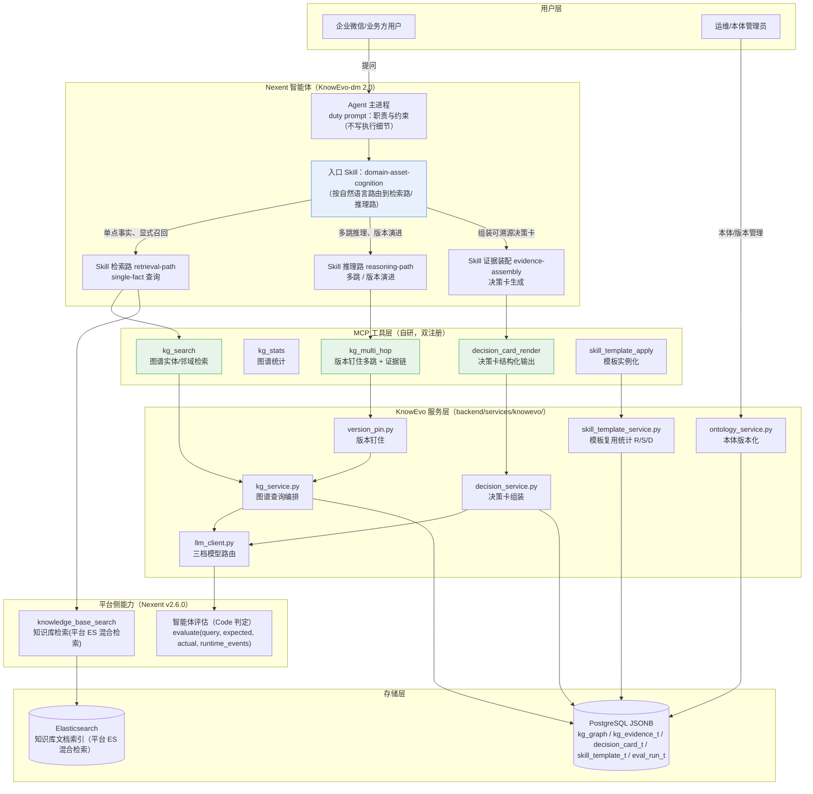

# 调用关系图（Call Graph）· Nexent-KnowEvo

> T-23 交付物之一（初赛《智能体设计思路及详细说明》的「调用关系图」素材母本）。
> 事实基准：平台 Nexus Nexent v2.6.0（fork·零修改）；代码核验于 2026-09-20，工具名/服务名与 `backend/` 实际实现一致。
> 用途：可直接渲染进 Word / PPT；也可在问答场景按「用户提问 → 决策卡」走一遍时对照本条链路上每一步落在哪个组件。

---

## 一、总体调用关系图（Mermaid）



---

## 二、关键链路逐条拆解

### 链路 1：检索-推理双驱动问答（示例问答截图对应路径）

```
用户提问
  → Agent（duty prompt 只定职责与约束）
  → 入口 Skill domain-asset-cognition（路由）
      ├─ 单点事实类（R 检索路）→ kg_search / knowledge_base_search
      └─ 多跳/演进类（S 推理路）→ kg_multi_hop（版本钉住多跳 + 证据链）
  → 证据装配 evidence-assembly → decision_card_render
  → 决策卡写决策卡库（decision_card_t）并对用户展示
```

- 对应真实服务：`kg_service.py`（查询编排）→ `version_pin.py`（版本钉住）→ `decision_service.py`（决策卡组装）。
- 示例问答截图回溯：`decision_card_t` 行按 `created_at` 倒序可查（T-23 验收 psql 命令）。

### 链路 2：知识图谱变更 → 增量演进（「可进化」核心路径）

```
行业新文档（新版指南 PDF）
  → Nexent 摄取管线（Unstructured）+ 专项解析兜底
  → ingest_graph（LLM 抽取 entities/edges，props 带 doc_id 证据链）
  → PgJsonbGraphStore 写入 kg_graph / kg_evidence_t
  → ontology_service.commit_version 发布本体新版本（fact_cutoff 显式设）
  → 版本钉住（version_pin）：旧版事实保留，多跳查询按版本语义取数
  → skill_template_apply 复用既有模板实例化新资产
```

### 链路 3：评测闭环（「可进化」三实据之一，零侵入）

```
评测集（testset-v1-seed 20 题）
  → 平台「智能体评估」Code 判定 evaluate(query, expected, actual, runtime_events)
  → eval_run_t 落库 → e2-ablation-report.json（A1/A2/A3/A4/E8 = 消融矩阵）
  → 结果回填决策卡/演进台账（evolution-log）
```

---

## 三、注册机制说明（工具「双注册」事实依据）

| 表面 | 位置 | 说明 |
|---|---|---|
| Local MCP（平台内注册） | `backend/tool_collection/mcp/kg_tools.py` | `SERVICE_NAME="knowevo"`，`KG_MCP_TOOL_NAMES = (kg_search, kg_stats, kg_multi_hop, decision_card_render, skill_template_apply)`；通过 `wire()` 把共享 FastMCP 实例挂载进上游的 `backend/tool_collection/mcp/local_mcp_service.py` |
| FastMCP 独立服务（SSE） | `mcp_servers/knowevo_mcp/server.py`（schema 单源：`mcp_servers/knowevo_mcp/schemas.py`） | `@mcp.tool()` 注册 5 个工具；本项目即「独立 FastMCP 服务」这一表面 |
| 平台侧工具 | `backend/apps/northbound_app.py` 等 | `knowledge_base_search` 为平台能力，Skill 直接引用；`asset_search` 仅 knowevo MCP 规格中的规划工具（backend 零实现/零注册），不列出 |

> 单 schema 双注册：`tool_schemas()` 与 `handlers()` 两个表面共享同一组 handler，保证「同一工具名全平台唯一」。