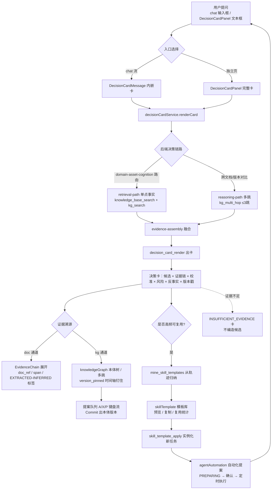

# 交互流程图：用户提问 → 决策卡 → 证据溯源 → 技能模板沉淀

> 产出：任务Q5b · C2-②（对应官方维度④「交互设计贴合用户使用需求，操作逻辑清晰」）。
> 本文件是维度④"操作逻辑清晰"的**唯一载体**：把四个前端 feature 串成一条可演示的闭环路径。
> 所有页面/路由/服务均以 `nexent/frontend/` 现有代码为准；本文件只描述、不新增入口（不碰路由/菜单注册，红线见文末）。
> 状态处理原则遵循 **坑 #71 错误态/空态/加载态二分**：错误态（可恢复、带重试）与空态（无数据）与加载态（Spin）三者严格分离，错误态永不伪装成空态或"无数据"。

---

## 一、四个 feature 的职责与入口

| Feature | 文件根 | 入口路由 / 挂载点 | 在闭环里的角色 |
|---|---|---|---|
| `decisionCard` | `frontend/features/decisionCard/` | 路由 `/decisionCard`（独立页）；`DecisionCardMessage.tsx` 挂载于 chat 流（`case "data"` 分支） | **起点 + 终点**：用户提问 → 渲染决策卡；chat 内嵌版同步展示 |
| `knowledgeGraph` | `frontend/features/knowledgeGraph/` | 路由 `/knowledgeGraph`（T-05b 工作台；直接 URL 可达，RBAC 门禁见坑 #48/#40） | **证据溯源后端**：本体树、提案队列、版本 Diff、K0 质量面板 |
| `skillTemplate` | `frontend/features/skillTemplate/` | 路由 `/skillTemplate` | **能力沉淀**：从决策卡轨迹归纳的参数化 SKILL.md 模板库 |
| `agentAutomation` | `frontend/features/agentAutomation/` | 无独立页，挂载于 chat 流（`automationProposal` 消息） | **闭环收口**：把高频决策转成可定时执行的自动化任务 |

> 资产看板（T-14 已砍）、进化看板（T-12 未做）——**不做**。闭环全部用上述四个**已有页面**讲严，不新增页面。

---

## 二、主路径（用户提问 → 决策卡 → 证据溯源 → 技能模板沉淀）

---

## 三、逐段交互细节（含三态处理）

### 3.1 提问 → 出卡（decisionCard）
- **输入**：`DecisionCardPanel` 文本框（≤500 字）+ 可选知识版本 / `as_of` 业务时间（钉住事实时钟，不钉版本）+ `full`/`lite` 模式。
- **加载态**：`loading` → 居中 `<Spin>`（`DecisionCardPanel.tsx:208`）。
- **错误态**：`renderError` → 持久 `<Alert type="error">` + **重试按钮**（`DecisionCardPanel.tsx:340` 之后注入），与"尚未生成"空态、`INSUFFICIENT_EVIDENCE` 业务态三者分离（坑 #71 判据）。
- **空态**：首次未生成 → `<Empty description="尚未生成决策卡">`。
- **业务态**：`INSUFFICIENT_EVIDENCE`（证据全缺）→ 黄色 warning 卡 + 不确定性说明，**宁可空卡不编造**。
- **chat 内嵌版**：`DecisionCardMessage.tsx` 复刻同一套 section，尺寸迷你；同样的 insufficient 二分。

### 3.2 证据溯源（knowledgeGraph + EvidenceChain）
- **doc 溯源**：`EvidenceChain.tsx` 折叠面板，每条证据带 `EXTRACTED | INFERRED` 标签、`source_channel`、`contested`（知识不一致红标）、`version_pinned`；未解析的 source 降级为"图谱内证据 / —"，**永不渲染裸 None**。
- **kg 溯源**：`OntologyTreePanel.tsx`——加载态 `<Spin>`、错误态 `<Alert>`（与空态分离，404 已映射到"无版本"空态）、空态 `<Empty>`、渲染失败再叠一层错误 Alert；锚定标准条目蓝框、废弃灰显。
- **提案队列**：`ProposalQueue.tsx` 的 A/X/P 键盘流（≤3 键/决策），加载/错误（带重试）/空态三分；`commitVersion` 后自动跳到本体树（闭环回 `KnowledgeGraphPage` 的 tab 联动）。

### 3.3 技能模板沉淀（skillTemplate → agentAutomation）
- **模板库**：`SkillTemplatePanel.tsx` 三态严格分离——`loadError`（瞬时抓取失败，**带重试**）≠ `templates===null`（永久"数据源待接线"警告，不编造行）≠ `length===0`（`<Empty>` 提示先跑 `mine_skill_templates`）。成功率列未回写时显示"未记录"tooltip，apply 不虚构。
- **实例化**：`skill_template_apply` MCP 工具（当前唯一后端暴露），`body_md` 变量注入由工具完成。
- **自动化收口**：`AutomationProposalCard.tsx` 的 `PREPARING` 加载态（旋转 + `aria-live`）、能力缺失红字提示、已确认绿字；编辑弹窗 `AutomationProposalEditor.tsx` 校验后再存。

---

## 四、闭环收口说明（"操作逻辑清晰"的落点）

1. **提问 → 出卡**：单输入、零歧义（决策卡页 + chat 双入口，行为一致）。
2. **出卡 → 溯源**：每条候选主张可展开证据链，doc/kg 双通道可回溯；空证据显示"无证据链"而非空白。
3. **溯源 → 沉淀**：本体版本提交后轨迹可归纳成模板；模板库预览/复制即取即用。
4. **沉淀 → 复用**：模板经 `skill_template_apply` 实例化，高频任务再经 `agentAutomation` 定时化，**回到提问入口**形成闭环。
5. **诚实降级**：证据不足→空卡；数据源未接线→明确警告；抓取失败→可重试错误态。**任何失败态都不伪装成"无数据"或"成功"**（坑 #71 纪律）。

---

## 五、红线与未做项

- **只看板不做**：资产看板 / 进化看板按冻结砍序不补；闭环全部用现有四页面讲严。
- **不碰接线文件**：路由注册（`SideNavigation` / `ROUTE_CONFIG`）、RBAC 迁移、后端 app 均不动；如需新增导航入口，停下报告。
- **状态处理零新增页面**：本流程图的承载物是"现有页面 + 本 md"，不新增 feature 文件（C2-① 仅补强现有 feature 的三态；C2-② 仅新增本文档）。
- **真实验收**：C2-① 的两处三态补强已通过 `tsc --noEmit`（exit 0）与 `next lint`（两文件 "No ESLint warnings or errors"），详见 §八 任务Q5b 小节。

---

## 六、与官方评分句的对应

维度④原句：「系统整体架构完整，**交互设计贴合用户使用需求，操作逻辑清晰**，明确规划可复用 Skill 工作流模板沉淀方案，具备通用推广价值」。
- "交互设计贴合用户需求 / 操作逻辑清晰" → 本文件 §三–§四 的四页面三态闭环 + 键盘流 + 诚实降级。
- "可复用 Skill 工作流模板沉淀方案" → C3 的 `skill-template-playbook.md`。
