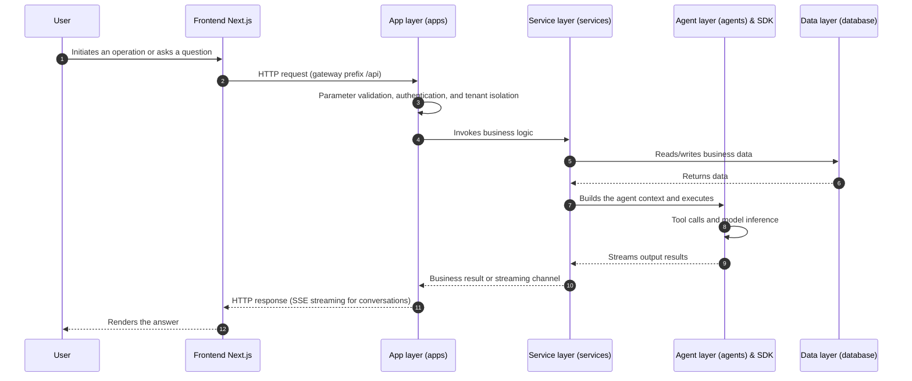

# Backend Architecture Overview

Nexent's backend is built with FastAPI and Python, providing a robust and scalable API platform for AI agent services.

## Technology Stack

- **Framework**: FastAPI
- **Language**: Python 3.11+
- **Database**: PostgreSQL + Redis + Elasticsearch (Elasticsearch also handles vector retrieval and memory indexing)
- **File Storage**: MinIO
- **Task Queue**: Celery + Ray
- **AI Framework**: smolagents (located in `sdk/nexent/`, the backend calls it through the SDK)
- **Vector Database**: Elasticsearch

## Directory Structure

```
backend/
├── apps/                         # API application layer (curated selection)
│   ├── app_factory.py           # FastAPI application factory (unified app creation and exception handling)
│   ├── agent_app.py             # Agent management APIs
│   ├── runtime_app.py           # Runtime agent execution APIs (/agent/run SSE)
│   ├── conversation_management_app.py  # Conversation management APIs
│   ├── conversation_share_app.py       # Conversation sharing APIs
│   ├── vectordatabase_app.py    # Knowledge base retrieval APIs
│   ├── model_managment_app.py   # Model management APIs (capacity suggestions / concurrency governance)
│   ├── voice_app.py             # Voice APIs (STT/TTS WebSocket)
│   ├── file_management_app.py   # File management APIs (upload / preview / signed URLs)
│   ├── remote_mcp_app.py        # MCP service and API→MCP conversion APIs (/mcp)
│   ├── mcp_management_app.py    # MCP tool management APIs (/mcp-tools)
│   ├── a2a_client_app.py        # A2A client APIs (external agent discovery/management)
│   ├── a2a_server_app.py        # A2A server APIs (publish local agents as A2A)
│   ├── northbound_app.py / northbound_base_app.py / northbound_knowledge_app.py  # Northbound open APIs (/nb/v1, /nb/a2a)
│   ├── skill_app.py             # Skill management and NL2Skill APIs
│   ├── prompt_template_app.py   # Prompt template management APIs
│   ├── agent_repository_app.py / skill_repository_app.py  # Agent/skill marketplace repository APIs
│   ├── agent_evaluation_app.py / evaluation_set_app.py / evaluator_app.py  # Evaluation APIs
│   ├── agent_automation_app.py  # Agent automation scheduled task APIs
│   ├── memory_record_app.py / memory_config_app.py / memory_dreaming_app.py / memory_long_term_app.py  # Memory management APIs
│   ├── api_key_app.py           # API key management APIs
│   ├── notification_app.py      # In-app notification APIs
│   ├── cas_app.py / oauth_app.py  # SSO login APIs
│   └── ...                      # Remaining modules (user/tenant/group/quota/monitoring/external retrieval sources, etc.)
├── services/                     # Business service layer
│   ├── agent_automation/        # Agent automation (intent analysis / scheduling engine / tool adapters)
│   ├── providers/               # Model provider adapters (dashscope/modelengine/silicon/tokenpony)
│   ├── agent_service.py         # Agent business logic
│   ├── memory_context_service.py  # Memory context construction (normalization / score fusion / time decay / MMR)
│   ├── memory_index_service.py  # Memory vector indexing (Elasticsearch per-tenant indexes)
│   ├── a2a_client_service.py / a2a_server_service.py  # A2A discovery and publishing
│   ├── northbound_service.py    # Northbound API business logic
│   ├── nl2skill_service.py      # NL2Skill streaming generation
│   ├── vectordatabase_service.py  # Search engine service
│   ├── model_health_service.py  # Model health checks
│   ├── prompt_service.py        # Prompt service
│   └── tenant_service.py        # Tenant service (plus 50+ services for model/memory/evaluation/skills, etc.)
├── database/                     # Data access layer
│   ├── client.py / db_models.py # Database connections and ORM models
│   ├── agent_db.py / agent_version_db.py  # Agent and version data
│   ├── conversation_db.py       # Conversation data operations
│   ├── a2a_agent_db.py          # A2A agent registration data
│   ├── memory_record_db.py and other memory-related modules  # Memory data operations
│   └── ...
├── agents/                       # Agent core logic
│   ├── agent_run_manager.py     # Agent execution manager
│   ├── create_agent_info.py     # Agent information creation (memory/tool mounting)
│   ├── nl2agent_agent.py        # NL2Agent temporary agent
│   ├── nl2skill_agent.py        # NL2Skill temporary agent
│   ├── preprocess_manager.py    # Preprocessing manager
│   └── default_agents/          # Default agent configurations
├── data_process/                 # Data processing module (Ray/Celery; app.py / ray_config.py / tasks.py / worker.py / utils.py)
├── permissions/                  # Permissions (RBAC/DAC/tenant isolation)
├── middleware/                   # Middleware (exception_handler.py)
├── tool_collection/              # Tool collection (LangChain compute tools / local MCP and NL2Agent tools)
├── adapters/                     # External SDK adapters (Jiuwen SDK, etc.)
├── ext_components/               # External integration components (AIDP knowledge base, etc.)
├── assets/                       # Static resources (stopwords, test audio, etc.)
├── utils/                        # Utility classes
│   ├── auth_utils.py / config_utils.py / monitoring.py
│   ├── nacos_client.py          # Nacos A2A queries
│   ├── a2a_http_client.py       # A2A HTTP client
│   └── ...
├── consts/                       # Constants definition (const.py is the single source of environment variables / model.py)
├── prompts/                      # Prompt templates
├── config_service.py             # Config service entry point
├── runtime_service.py            # Runtime service entry point
├── northbound_service.py         # Northbound open API service entry point (port 5013)
├── data_process_service.py       # Data processing service entry point
├── mcp_service.py                # MCP service entry point
└── pyproject.toml                # Python dependencies (managed with uv; install with uv sync)
```

## Architecture Responsibilities

### **Application Layer (apps)**
- API route definitions
- Request parameter validation
- Response formatting
- Authentication and authorization

### **Service Layer (services)**
- Core business logic implementation
- Data processing and transformation
- External service integration
- Business rule enforcement

### **Data Layer (database)**
- Database operations and ORM models
- Data access interfaces
- Transaction management
- Data consistency and integrity

### **Agent Layer (agents)**
- AI agent core logic and execution
- Tool calling and integration
- Reasoning and decision making
- Agent lifecycle management

### **Utility Layer (utils)**
- Common utility functions
- Configuration management
- Logging and monitoring
- Thread and process management

## Core Services

### Agent Management
- Agent creation and configuration
- Execution lifecycle management
- Tool integration and calling
- Performance monitoring

### Conversation Management
- Message handling and storage
- Context management
- History tracking
- Multi-tenant support

### Knowledge Base
- Document processing and indexing
- Vector search and retrieval
- Document summarization and clustered summaries

### File Management
- Multi-format file processing
- MinIO storage integration
- Batch processing capabilities
- Metadata extraction

### Model Integration
- Multiple model provider support
- Health monitoring and failover
- Load balancing and caching
- Performance optimization

## Data Flow Architecture

### 1. User Request Flow
```
User Input → Frontend Validation → API Call → Backend Routing → Business Service → Data Access → Database
```

### 2. AI Agent Execution Flow
```
User Message → Agent Creation → Tool Calling → Model Inference → Streaming Response → Result Storage
```

### 3. Knowledge Base File Processing Flow
```
File Upload → Temporary Storage → Data Processing → Vectorization → Knowledge Base Storage → Index Update
```

### 4. Real-time File Processing Flow
```
File Upload → Temporary Storage → Data Processing → Agent → Response
```

### 5. Backend Request Processing Sequence Diagram



## Deployment Architecture

### Container Services
- **nexent-config**: Config/edit-time service (port 5010)
- **nexent-runtime**: Runtime service (port 5014)
- **nexent-mcp**: MCP service (SSE port 5011, management API port 5015)
- **nexent-northbound**: Northbound open API service (port 5013)
- **nexent-data-process**: Data processing service (port 5012)
- **nexent-postgresql**: Database (port 5434)
- **nexent-elasticsearch**: Search engine (port 9210)
- **nexent-minio**: Object storage (port 9010)
- **nexent-redis**: Cache service (port 6379)

### Optional Services
- **nexent-openssh-server**: SSH server for Terminal tool (port 2222)

## Development Setup

### Environment Setup
```bash
cd backend
uv sync --extra data-process --extra test
uv pip install -e "../sdk[dev]"
```

### Service Startup
```bash
cd backend
python data_process_service.py   # Data processing service
python config_service.py         # Config service
python runtime_service.py        # Runtime service
python mcp_service.py            # MCP service
```

## Performance and Scalability

### Async Architecture
- Based on asyncio for high-performance async processing
- Thread-safe concurrent processing mechanisms
- Optimized for distributed task queues

### Caching Strategy
- Multi-layer caching for improved response speed
- Redis for session and temporary data
- Elasticsearch for search result caching

### Load Balancing
- Intelligent concurrent limiting
- Resource pool management
- Auto-scaling capabilities

For detailed backend development guidelines, see the [Developer Guide](../developer-guide/overview).

For skill development and management, see the [Skills System Documentation](./skills/index).