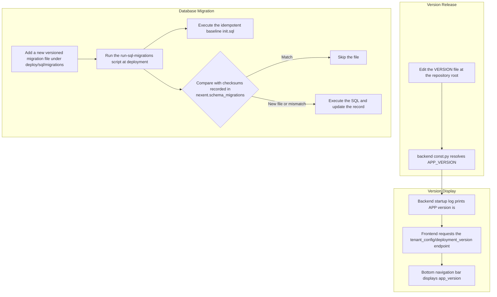

# Version Information Management

The Nexent project adopts a unified version management strategy to ensure consistency between frontend and backend version information. This document describes how to manage and update project version information.

## 📋 Version Number Format

Nexent uses Semantic Versioning:

- **Format**: `vMAJOR.MINOR.PATCH` or `vMAJOR.MINOR.PATCH.BUILD` (e.g., v2.5.0 or v2.5.0.1)
- **MAJOR**: Incompatible API changes
- **MINOR**: New functionality in a backwards-compatible manner
- **PATCH**: Backwards-compatible bug fixes
- **BUILD**: Optional minor version number for more granular bugfix versions

### 🏷️ Version Number Examples

- `v2.5.0` - Feature update release
- `v2.5.0.1` - Bugfix release with minor version number

## 🖥️ Frontend Version Management

### 📍 Version Information Location

Frontend version information is fetched from the backend via API.

- **Endpoint**: `GET /api/tenant_config/deployment_version` (returns `app_version` for the application version and `deployment_version` for the deployment mode speed/full)
- **Endpoint definition**: `frontend/services/api.ts`
- **Fetch logic**: `frontend/components/providers/deploymentProvider.tsx`
- **Display location**: `frontend/components/navigation/FooterLayout.tsx`

> Note: the hard-coded `APP_VERSION` in `frontend/const/constants.ts` is only a fallback for when the API fails; the actually displayed value is the `app_version` returned by the backend.

### 🔄 Version Update Process

1. **Update the backend version**

Edit the `VERSION` file at the repository root (see "Backend Version Management" below); the backend API will automatically return the new `app_version`.

2. **Verify Version Display**

   ```bash
   # Start the frontend service
   cd frontend
   npm run dev

   # Check the application version displayed at the bottom of the page
   ```

### 📺 Version Display

Frontend version information is displayed at the following location:

- **Location**: Bottom navigation bar (`FooterLayout.tsx`), located at the bottom left corner of the page.
- **Version Format**: `v2.5.0`
- **Additional info**: the `deployment_version` returned by the same endpoint distinguishes speed/full deployment modes and is not displayed directly as the version number

## ⚙️ Backend Version Management

### 📍 Version Information Location

The backend version number is read uniformly from the `VERSION` file at the repository root and resolved into `APP_VERSION` by `_resolve_app_version()` in `backend/consts/const.py`:

```python
# backend/consts/const.py
APP_VERSION = _resolve_app_version()
```

Resolution order (`_collect_version_candidates()`):

1. The file specified by the `APP_VERSION_FILE` environment variable (test/script hooks)
2. The in-container path `/opt/nexent/VERSION` (written by the runtime Dockerfile)
3. The repository root `VERSION` (local development)
4. Fallback default value `v2.2.1`

### 🔧 Version Configuration

To release a version, simply modify the `VERSION` file at the repository root — no code changes needed:

```
# VERSION
v2.5.0
```

### 📺 Version Display

When backend services start, they print version information in the logs (`backend/config_service.py` and `backend/runtime_service.py`):

```python
logger.info(f"APP version is: {APP_VERSION}")
```

### 🔄 Version Update Process

1. **Update the Version in Code**

```text
# Edit the VERSION file at the repository root
v2.5.0
```

2. **Verify Version Display**

   ```bash
   # Start the backend service
   cd backend
   python config_service.py

   # Check the version information in the startup logs
   # Output example: APP version is: v2.5.0
   ```

## 🗄️ Database Migration Rules

Database scripts are stored under `deploy/sql/` and executed by the migration runner (`deploy/common/run-sql-migrations.sh`) during deployment/upgrade:

- **Baseline script**: `deploy/sql/init.sql`, executed unconditionally on every startup; statements must remain idempotent (e.g., `CREATE TABLE IF NOT EXISTS`).
- **Versioned migrations**: located in `deploy/sql/migrations/`; the migration runner uses the SQL file name as the migration ID and records the current file checksum in the `nexent.schema_migrations` table.
- **Do not modify already-deployed SQL files**: content changes cause checksum mismatches and re-execution, and may cascade-replay all subsequent migration files. For merged historical migrations (e.g., `v2.4_merged_migrations.sql`), even a comment-only change triggers a cascade.
- **New changes**: create a new versioned migration file (e.g., `v2.6.0_xxxx_*.sql`) and keep statements idempotent.

## 🔄 Version Release / Migration Flow



