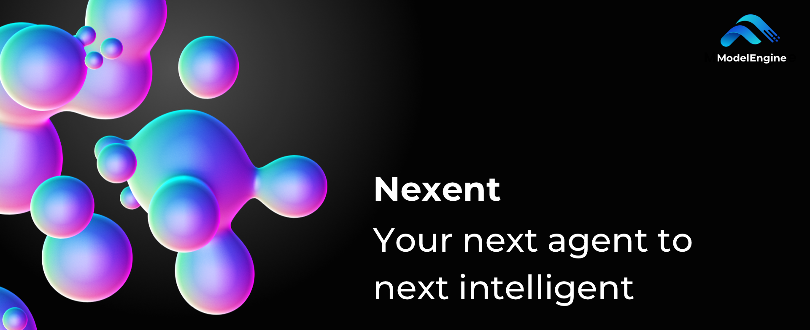

# Nexent

Nexent is a zero-code agent platform built on **Harness Engineering** principles. Describe your goal in natural language, and the system generates an agent configuration and helps configure tools, Skills, knowledge bases, memory, and collaborative agents. You can then debug, publish, and continuously iterate on the generated agent without manually orchestrating complex workflows.

> One prompt. Endless reach.

## 🎬 Demo Video

<video controls width="100%" style="max-width: 800px;">
  <source src="https://github.com/user-attachments/assets/b844e05d-5277-4509-9463-1c5b3516f11e" type="video/mp4" />
  
Your browser does not support the video tag. <a href="https://github.com/user-attachments/assets/b844e05d-5277-4509-9463-1c5b3516f11e">View the demo video</a>

</video>

## 🤝 Join Our Community

> *If you want to go fast, go alone; if you want to go far, go together.*

This documentation corresponds to **Nexent v2.5.0**. This release enhances natural-language agent generation (NL2Agent), tool and Skill recommendations, isolated sandbox execution, generated file handling, layered memory, personal knowledge-base capacity, and northbound APIs. The platform also supports A2A agent collaboration, MCP tools, knowledge-base retrieval, multimodal interaction, version management, and multi-tenant access control.

- **🗺️ Check our [Feature Map](https://github.com/orgs/ModelEngine-Group/projects/6)** to explore current and upcoming features.
- **🔍 Try the current build** and leave ideas or bugs in the [Issues](https://github.com/ModelEngine-Group/nexent/issues) tab.

> *Rome wasn't built in a day.*

If our vision speaks to you, jump in via the **[Contribution Guide](../contributing)** and shape Nexent with us.

Early contributors won't go unnoticed: from special badges and swag to other tangible rewards, we're committed to thanking the pioneers who help bring Nexent to life.

Most of all, we need visibility. Star ⭐ and watch the [GitHub repository](https://github.com/ModelEngine-Group/nexent), share it with friends, and help more developers discover Nexent — your click brings new hands to the project and keeps the momentum growing.

## ✨ Key Features

Nexent v2.5.0 provides the following core capabilities:

- **⚙️ Multi-Model Integration** — Centrally manage LLM, Embedding, Rerank, image, video, audio, STT, and TTS models
- **🤖 Zero-Code Agent Generation** — Clarify requirements through multi-turn natural-language conversations, recommend resources, and generate a debuggable agent configuration
- **🤝 A2A Agent Collaboration** — Agent-to-Agent protocol for seamless multi-agent workflows
- **🧠 Layered Memory Architecture** — Tenant, User, and Agent memory, with Dreaming for consolidating long-term memory
- **📝 Progressive Skill Disclosure** — Load Skill instructions and resources on demand and execute scripts in an isolated sandbox
- **🗄️ Personal Knowledge Bases** — Support multiple document formats, intelligent retrieval, access permissions, and capacity quotas
- **🔧 MCP Tool Ecosystem** — A plug-and-play extensible tool system with support for custom development
- **🌐 Internet Knowledge Integration** — Multi-source hybrid search blending real-time web with private data
- **🔍 Knowledge-Level Traceability** — Precise citations and source verification so that every fact can be traced
- **🎭 Multimodal and File Processing** — Accept text, image, audio, video, and document inputs, and display generated files for preview or download
- **🔢 Agent Version Management** — Iterate through versions and review history with safe, controlled rollbacks
- **🏪 Resource Marketplace** — Share and reuse agents, MCP services, and Skills, with listing approval support
- **👥 Delegated Administration** — Multi-tenant isolation, RBAC, user groups, resource authorization, API keys, and knowledge-base capacity management

For detailed feature information and examples, see our **[Features Guide](./features)**.

## 🏗️ Software Architecture

Nexent separates configuration management, agent runtime, MCP, northbound APIs, data processing, and the web frontend into independent services that can be deployed with Docker Compose or Kubernetes. PostgreSQL, Elasticsearch, Redis, and MinIO respectively provide business-data storage, retrieval indexes, caching and task queues, and object storage.

### 🌐 Layered Architecture Design

- **Frontend Layer** — Modern user interface built with Next.js + React + TypeScript
- **API Service Layer** — FastAPI-based configuration, runtime, MCP, northbound, and data-processing APIs
- **Business Logic Layer** — Agent, conversation, knowledge-base, model, memory, permission, and marketplace management
- **Data Layer** — PostgreSQL, Elasticsearch, Redis, and MinIO store different types of data

### 🚀 Core Service Architecture

- **Agent Services** — Generate and run agents with SmolAgents and stream results through the Runtime service
- **Sandbox and File Workspace** — Run model-generated code and Skill scripts in isolation and synchronize generated files to object storage
- **Data Processing Services** — Parse, chunk, and vectorize documents to build indexes for knowledge-base retrieval
- **MCP Ecosystem** — Provide unified access to remote, containerized, and custom API tools

### ⚡ Distributed Features

- **Asynchronous and Streaming Processing** — Use asynchronous tasks and SSE to continuously return agent execution results
- **Service Decomposition** — Deploy and scale configuration, runtime, and data-processing services independently
- **Containerized Deployment** — Provide both Docker Compose and Helm deployment options

For detailed architectural design and technical implementation, see our **[Software Architecture](./software-architecture)**.

## ⚡ Quick Start

Ready to get started? Here are your next steps:

1. **📋 [Installation & Deployment](../quick-start/installation)** — System requirements and deployment guide
2. **🔧 [Developer Guide](../developer-guide/overview)** — Build from source and customize
3. **❓ [FAQ](../quick-start/faq)** — Common questions and troubleshooting

## 💬 Community & contact

Join our [Discord community](https://discord.gg/tb5H3S3wyv) to chat with other developers and get help!

## 📄 License

Nexent is licensed under the [MIT License](../license).
