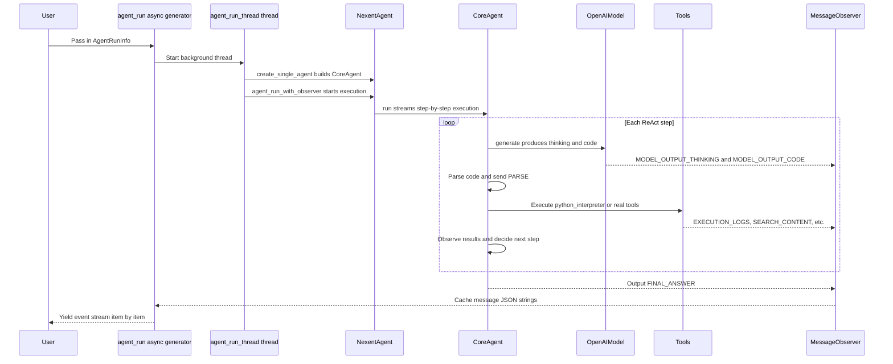

# AI Agent Development Overview

Nexent provides a comprehensive framework for developing and deploying AI agents with advanced capabilities including tool integration, reasoning, and multi-modal interactions.

## 🏗️ Agent Architecture

### Core Components

#### NexentAgent - Enterprise Agent Framework
The core of Nexent's agent system, providing complete intelligent agent solutions:

- **Multi-model Support**: Supports OpenAI, vision language models, long-context models, etc.
- **MCP Integration**: Seamless integration with Model Context Protocol tool ecosystem
- **Dynamic Tool Loading**: Supports dynamic creation and management of local and MCP tools
- **Distributed Execution**: High-performance execution engine based on thread pools and async architecture
- **State Management**: Complete task state tracking and error recovery mechanisms

#### CoreAgent - Code Execution Engine
Inherits and enhances SmolAgents' `CodeAgent`, providing the following key capabilities:

- **Python Code Execution**: Supports parsing and executing Python code for dynamic task processing
- **Multi-language Support**: Built-in Chinese and English prompt templates, switchable as needed
- **Streaming Output**: Real-time streaming display of model output through MessageObserver
- **Step Tracking**: Records and displays each step of Agent execution for debugging and monitoring
- **Interrupt Control**: Supports task interruption and graceful stop mechanisms
- **Error Handling**: Complete error handling mechanisms to improve stability
- **State Management**: Maintains and passes execution state, supports continuous processing of complex tasks

CoreAgent implements the ReAct framework's think-act-observe loop:
1. **Think**: Use large language models to generate solution code
2. **Act**: Execute the generated Python code
3. **Observe**: Collect execution results and logs
4. **Repeat**: Continue thinking and executing based on observation results until task completion

### 🧩 Context Management
Context management and compression are enabled via `AgentConfig.context_manager_config` (corresponding to `ContextManagerConfig`, see core/agents/context/config.py). Based on it, NexentAgent builds a `ContextManager` and a `ManagedContextRuntime`, which automatically compress long-conversation history and record metrics; the context runtime supports adaptive compression based on ContextItems, where compression output is a Markdown summary and executable output is rejected.

### 🗺️ Planning Agent
Supports plan-first-then-execute: CreatePlanTool / UpdatePlanStepTool generate and maintain a plan todo list (plan_repo.py), working with ParallelExecutorTool to concurrently dispatch multiple sub-agents.

### 📦 Sandbox
Code execution uses the local LocalPythonExecutor by default (no sandbox). After configuring `SandboxConfig` (core/agents/sandbox.py) via `AgentConfig.sandbox_policy` / `AgentRunInfo.sandbox_config`, Docker/WASM-level sandbox isolation can be enabled; `scope` supports `session` (default: one container per run, destroyed when the run ends) and `system` (a system-level shared persistent container, with an independent kernel per run).

### 🛡️ Guardrail Safety Screening
Built-in input/output content safety checkpoints (guardrail checkpoints) can block sensitive content.

### 📡 MessageObserver - Streaming Message Processing
Core implementation of the message observer pattern for handling Agent's streaming output:

- **Streaming Output Capture**: Real-time capture of model-generated tokens
- **Process Type Distinction**: Format output based on different processing stages (model output, code parsing, execution logs, etc.)
- **Multi-language Support**: Supports Chinese and English output formats
- **Unified Interface**: Provides unified processing for messages from different sources

Common processing stages of the ProcessType enumeration include (see `nexent.core.utils.observer.ProcessType` for the full definition):
- `STEP_COUNT`: Current execution step
- `MODEL_OUTPUT_THINKING`: Model thinking process output
- `MODEL_OUTPUT_CODE`: Model code generation output
- `PARSE`: Code parsing results
- `EXECUTION_LOGS`: Code execution results
- `AGENT_NEW_RUN`: Agent basic information
- `FINAL_ANSWER`: Final summary results
- `SEARCH_CONTENT`: Search result content
- `PICTURE_WEB`: Web image processing results

## 🤖 Agent Development

Core usage examples now live in [Basic Usage](../basic-usage#using-agent_run-recommended-for-streaming), including both `CoreAgent.run` and the streaming `agent_run` helper. This page focuses on module concepts (architecture, MessageObserver, patterns) rather than code walkthroughs.

### Agent Run Flowchart

The following diagram shows the real call chain of `agent_run` (based on core/agents/run_agent.py, nexent_agent.py, core_agent.py):



## 🛠️ Tool Integration

### Custom Tool Development

Nexent implements tool systems based on [Model Context Protocol (MCP)](https://github.com/modelcontextprotocol/python-sdk).

#### Developing New Tools:
1. Implement logic in `backend/tool_collection/mcp/local_mcp_service.py`
2. Register with `@mcp.tool()` decorator
3. Restart MCP service

#### Example:
```python
@mcp.tool(name="my_tool", description="My custom tool")
def my_tool(param1: str, param2: int) -> str:
    # Implement tool logic
    return f"Processed result: {param1} {param2}"
```

## 🎯 Agent Execution Patterns

### ReAct Pattern
Standard execution pattern for problem-solving agents:
1. **Reasoning**: Analyze problems and develop methods
2. **Action**: Execute tools or generate code
3. **Observation**: Check results and outputs
4. **Iteration**: Continue until task completion

### Multi-Agent Collaboration
- **Hierarchical Agents**: Management agents coordinate working agents
- **Specialized Agents**: Domain-specific agents for specific tasks
- **Communication Protocols**: Standardized message passing between agents

### Error Handling and Recovery
- **Graceful Degradation**: Fallback strategies when tools fail
- **State Persistence**: Save agent state for recovery
- **Retry Mechanisms**: Automatic retry with backoff strategies

## ⚡ Performance Optimization

### Execution Efficiency
- **Parallel Tool Execution**: Concurrent execution of independent tools
- **Caching Strategies**: Cache model responses and tool results
- **Resource Management**: Efficient memory and computation usage

### Monitoring and Debugging
- **Execution Tracking**: Detailed logs of agent decisions
- **Performance Metrics**: Time and resource usage tracking
- **Debug Mode**: Detailed output during development

## 📋 Best Practices

### Agent Design
1. **Clear Objectives**: Define specific, measurable agent goals
2. **Appropriate Tools**: Choose tools that match agent capabilities
3. **Strong Prompts**: Create comprehensive system prompts
4. **Error Handling**: Implement comprehensive error recovery

### Development Workflow
1. **Iterative Development**: Incremental building and testing
2. **Prompt Engineering**: Optimize prompts based on test results
3. **Tool Testing**: Validate individual tools before integration
4. **Performance Testing**: Monitor and optimize execution speed

### Production Deployment
1. **Resource Allocation**: Ensure adequate computational resources
2. **Monitoring Setup**: Implement comprehensive logging and alerting
3. **Scaling Strategy**: Plan for increased load and usage
4. **Security Considerations**: Validate inputs and protect API access

For detailed implementation examples and advanced patterns, please refer to the [Developer Guide](../../developer-guide/overview).