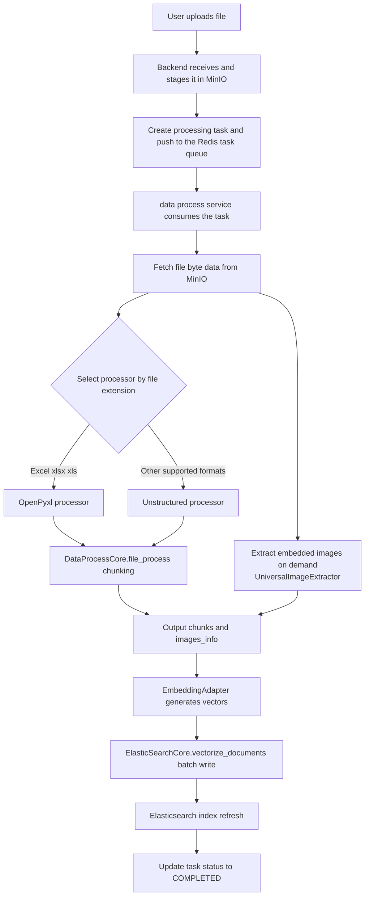

# DataProcessCore Usage Guide

## 📋 Overview

`DataProcessCore` is a unified file processing core class that supports automatic detection and processing of multiple file formats, providing flexible chunking strategies and multiple input source support.

## ⭐ Key Features

### 1. Core Processing Method: `file_process()`

**Function Signature:**
```python
def file_process(self,
                file_data: bytes,
                filename: str,
                chunking_strategy: str = "basic",
                processor: Optional[str] = None,
                **params) -> Tuple[List[Dict], List[Dict]]
```

**Parameters:**

| Parameter | Type | Required | Description | Options |
|-----------|------|----------|-------------|---------|
| `file_data` | `bytes` | Yes | File byte data (for in-memory processing) | Any valid byte data |
| `filename` | `str` | Yes | Filename (used to auto-detect the file type and select the processor) | Any valid filename |
| `chunking_strategy` | `str` | No | Chunking strategy | `"basic"`, `"by_title"`, `"none"` |
| `processor` | `str` | No | Explicitly specify a processor (auto-selected based on the file extension when omitted) | `"Unstructured"`, `"OpenPyxl"` |
| `**params` | `dict` | No | Additional processing parameters | See parameter details below |

**Chunking Strategy (`chunking_strategy`) Details:**

| Strategy | Description | Use Case | Output Characteristics |
|----------|-------------|----------|----------------------|
| `"basic"` | Basic chunking strategy | Most document processing scenarios | Automatic chunking based on content length |
| `"by_title"` | Title-based chunking | Structured documents (e.g., technical docs, reports) | Chunks divided at title boundaries |
| `"none"` | No chunking | Short documents or when full content is needed | Returns a single chunk containing all content |

**Processor Selection Rules:**

- Extensions in `EXCEL_EXTENSIONS` (`.xlsx`, `.xls`) → use the `OpenPyxl` processor
- Other supported extensions → use the `Unstructured` processor
- When `params` contains `model_type="multi_embedding"` and the extension is in `EXTRACT_IMAGE_EXTENSIONS` (`.pdf`, `.doc`, `.docx`, `.xls`, `.xlsx`, `.ppt`, `.pptx`), `UniversalImageExtractor` is additionally used to extract images embedded in the document

**Additional Parameters (`**params`) Details:**

| Parameter | Type | Default | Description | Applicable Processor |
|-----------|------|---------|-------------|---------------------|
| `max_characters` | `int` | `1536` | Maximum number of characters per chunk | Generic (Unstructured) |
| `new_after_n_chars` | `int` | `1024` | Start a new chunk after this character count | Generic (Unstructured) |
| `strategy` | `str` | `"fast"` | Processing strategy | Generic (Unstructured) |
| `skip_infer_table_types` | `list` | `[]` | Table types to skip inference for | Generic (Unstructured) |
| `task_id` | `str` | `""` | Task identifier | Generic (Unstructured) |
| `model_type` | `str` | None | Embedding model type; `"multi_embedding"` triggers image extraction | Generic |

**Return Value Format:**

Returns `Tuple[List[Dict], List[Dict]]`, i.e. `(chunks, images_info)`:

**Common fields of chunks (the chunk list):**
| Field | Type | Description | Example |
|-------|------|-------------|---------|
| `content` | `str` | Text content | `"This is the first paragraph of the document..."` |
| `filename` | `str` | Filename | `"document.pdf"` |

**Optional fields:**
| Field | Type | Description | Example |
|-------|------|-------------|---------|
| `metadata` | `dict` | Metadata information (optional) | `{"chunk_index": 0, "source_type": "..."}` |
| `language` | `str` | Language identifier (optional) | `"en"` |

**images_info (the image information list):**
A list of metadata dictionaries for the extracted embedded images; an empty list when image extraction is not triggered.

## 📁 Supported File Types

### Excel Files
- `.xlsx` - Excel 2007 and later
- `.xls` - Excel 97-2003

### Generic Files
- `.txt` - Plain text files
- `.pdf` - PDF documents
- `.docx` - Word 2007 and later
- `.doc` - Word 97-2003
- `.html`, `.htm` - HTML documents
- `.md` - Markdown files
- `.rtf` - Rich Text Format
- `.odt` - OpenDocument text
- `.pptx` - PowerPoint 2007 and later
- `.ppt` - PowerPoint 97-2003
- `.epub` - EPUB e-books
- `.xml` - XML data files
- `.json` - JSON data files
- `.csv` - Comma-separated values files

## 💡 Usage Examples

### Example 1: Processing a local text file (read into memory first)
```python
from nexent.data_process import DataProcessCore

core = DataProcessCore()

# Read the file into memory (file_process only accepts in-memory byte data)
with open("/path/to/document.txt", "rb") as f:
    file_bytes = f.read()

chunks, images_info = core.file_process(
    file_data=file_bytes,
    filename="document.txt",
    chunking_strategy="basic"
)

print(f"Processed into {len(chunks)} chunks")
for i, chunk in enumerate(chunks):
    print(f"Chunk {i}: {chunk['content'][:100]}...")
```

### Example 2: Processing an Excel file
```python
with open("/path/to/spreadsheet.xlsx", "rb") as f:
    file_bytes = f.read()

chunks, images_info = core.file_process(
    file_data=file_bytes,
    filename="spreadsheet.xlsx",
    chunking_strategy="none"  # Excel files usually do not need chunking
)

for chunk in chunks:
    print(f"File: {chunk['filename']}")
    print(f"Content: {chunk['content']}")
    print(f"Metadata: {chunk.get('metadata')}")
```

### Example 3: Processing an in-memory PDF with custom parameters
```python
with open("/path/to/document.pdf", "rb") as f:
    file_bytes = f.read()

chunks, images_info = core.file_process(
    file_data=file_bytes,
    filename="document.pdf",
    chunking_strategy="by_title",
    max_characters=2000  # custom parameter
)
```

### Example 4: Extracting embedded images for multi-modal embedding
```python
chunks, images_info = core.file_process(
    file_data=file_bytes,
    filename="report.docx",
    chunking_strategy="basic",
    model_type="multi_embedding"  # triggers UniversalImageExtractor to extract embedded images
)
print(f"Extracted {len(images_info)} images")
```

### Example 5: Splitting a large file
```python
parts = core.file_split(
    file_data=file_bytes,
    filename="large_document.pdf",
    max_size=10 * 1024 * 1024,  # maximum 10MB per part (optional parameter)
)
print(f"Split into {len(parts)} parts")
```

## 🛠️ Helper Methods

### 1. Get supported file types
```python
core = DataProcessCore()
supported_types = core.get_supported_file_types()
print("Excel files:", supported_types["excel"])
print("Generic files:", supported_types["generic"])
```

### 2. Validate a file type
```python
is_supported = core.validate_file_type("document.pdf")
print(f"Is PDF supported: {is_supported}")
```

### 3. Get processor information
```python
info = core.get_processor_info("spreadsheet.xlsx")
print(f"Processor type: {info['processor_type']}")
print(f"File extension: {info['file_extension']}")
print(f"Is supported: {info['is_supported']}")
```

### 4. Get supported strategies and processor types
```python
strategies = core.get_supported_strategies()
processors = core.get_supported_processors()
print(f"Supported chunking strategies: {strategies}")
print(f"Supported processor types: {processors}")
```

## ⚠️ Error Handling

### Common Exceptions

| Exception | Trigger Condition | Solution |
|-----------|-------------------|----------|
| `ValueError` | Invalid parameters (e.g., an unsupported chunking strategy or processor type) | Check the parameter values |
| `UnsupportedFileFormatError` | The file extension is unsupported, or the type cannot be identified from the in-memory bytes (type detection from memory fails when libmagic is not installed) | Check that the file extension is supported; make sure libmagic is installed before processing in-memory bytes |
| `ImportError` | A required processing dependency is missing (e.g., unstructured) | Install the `nexent[data_process]` extra |
| `RuntimeError` | `file_split()` failed | Check the logs to locate the split error |

> 💡 **libmagic dependency note**: `file_process()` only accepts in-memory byte data, and unstructured relies on the system libmagic to detect the file type from memory bytes. Linux/macOS usually provide it by default; Windows does not ship libmagic by default, so install it first (e.g., `pip install python-magic-bin`), otherwise processing formats such as `.txt` will raise `UnsupportedFileFormatError`.

### Error Handling Example
```python
from unstructured.partition.common import UnsupportedFileFormatError

try:
    chunks, images_info = core.file_process(
        file_data=file_bytes,
        filename="document.txt",
        chunking_strategy="invalid_strategy"
    )
except ValueError as e:
    print(f"Invalid parameter: {e}")
except UnsupportedFileFormatError as e:
    print(f"Unsupported or unrecognizable file type: {e}")
except ImportError as e:
    print(f"Missing dependency: {e}")
except Exception as e:
    print(f"Processing failed: {e}")
```

## 🚀 Performance Optimization Tips

1. **Choose an appropriate chunking strategy**:
   - Use `"none"` for small files
   - Use `"basic"` for large files
   - Use `"by_title"` for structured documents

2. **Tune chunking parameters**:
   - Adjust `max_characters` based on downstream processing needs
   - Balance processing speed and memory usage

3. **File type optimization**:
   - Excel files usually do not need chunking
   - For PDF files, a larger `max_characters` is recommended

4. **Batch processing**:
   - Reuse `DataProcessCore` instances
   - Avoid repeated initialization

## 🔄 Data Processing Flow

Data processing in the Nexent system follows these flow patterns:

### 1. User Request Flow
```
User input → Frontend validation → API call → Backend routing → Business service → Data access → Database
```

### 2. AI Agent Execution Flow
```
User message → Agent creation → Tool call → Model inference → Streaming response → Result storage
```

### 3. Knowledge Base File Processing Flow

```
File upload → Temporary storage → Data processing → Vectorization → Knowledge base storage → Index update
```

**Data processing/ingestion flow diagram** (the full pipeline based on the current implementation):



**Detailed steps**:
1. **File upload**: the frontend receives the file uploaded by the user
2. **Temporary storage**: the file is stored in MinIO
3. **Task queuing**: a processing task is created and pushed to the Redis task queue
4. **Data processing**: the data process service consumes the task, and `DataProcessCore.file_process()` performs format parsing and chunking (`file_split()` can pre-split oversized files); for multi-modal embedding scenarios, embedded images are extracted at the same time
5. **Vectorization**: vector representations are generated by the `EmbeddingAdapter` embedding model
6. **Knowledge base storage**: the processed content is written to Elasticsearch in batches via `ElasticSearchCore.vectorize_documents()`
7. **Index update**: the search index is refreshed and task statuses are updated to support retrieval

### 4. Real-time File Processing Flow
```
File upload → Temporary storage → Data processing → Agent processing → Real-time answer
```

**Detailed steps**:
1. **File upload**: the user uploads a file in the conversation
2. **Temporary storage**: the file is temporarily saved for processing
3. **Data processing**: file content and structure are extracted in real time
4. **Agent processing**: the AI agent analyzes the file content
5. **Real-time answer**: an immediate reply is provided based on the file content

### Data Processing Optimization Strategies

- **Asynchronous processing**: use an async task queue for large file processing
- **Batch operations**: use batch optimizations when processing multiple files
- **Caching**: cache processing results for repeated files
- **Streaming processing**: in-memory streaming processing for large files
