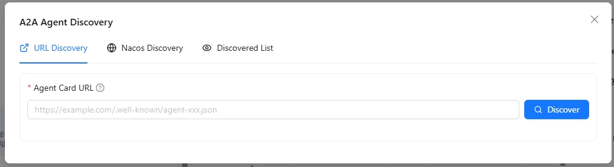
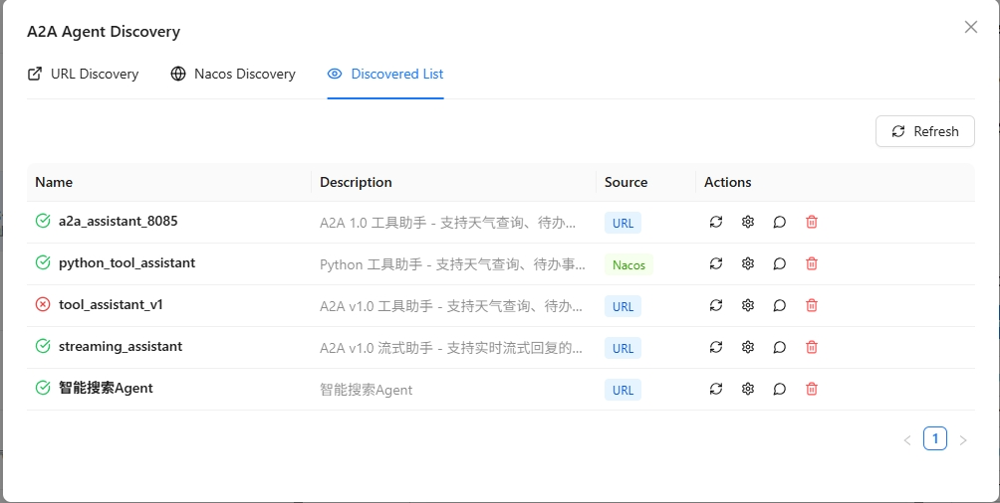

# Add External A2A Agents

Nexent supports integrating third-party Agents through the **A2A (Agent-to-Agent) protocol**, letting agents from different platforms work together. This page explains how to add and manage external A2A agents.

## 🤝 Sources of Collaborative Agents

In **Agent Development → Collaborative Agents**, you can add two kinds of collaborative agents:

- **Internal Agents**: agents published on the platform
- **External A2A Agents**: third-party agents discovered through the A2A protocol

  

## 🌐 Add External A2A Agents

Nexent provides two ways to discover external A2A agents: **URL discovery** and **Nacos discovery**.

### Discover Agent via URL

If you know the Agent Card address of the target agent, use the URL discovery method.

  

1. In the **Collaborative Agents** tab, click **Add External Agent**
2. Select the **URL Discovery** tab
3. Fill in the Agent Card URL, for example: `https://example.com/.well-known/agent.json`
4. If the Agent Card requires authentication, fill in a JSON object in **Custom Request Headers**, for example: `{"Authorization": "Bearer <token>"}`
5. Click **Discover**; the system automatically fetches the agent's information
6. After a successful discovery, review the agent's name, description, and capabilities
7. Click **Add to List** to finish adding the agent

> 💡 **Tip**: Custom request headers are saved with the external agent and used only for retrieving and refreshing the Agent Card. They are never used for subsequent agent calls. When rediscovering the same URL, leave the field empty to keep the current configuration; enter `{}` to clear it.

> 💡 **Tip**: The Agent Card is an A2A 1.0–compliant description file containing the agent's name, description, calling address, and capabilities.

### Discover Agent via Nacos

If your agents are registered in the Nacos service discovery platform, use Nacos discovery to integrate them in batches.

  

1. In the **Collaborative Agents** tab, click **Add External Agent**
2. Select the **Nacos Discovery** tab
3. On first use, configure the Nacos connection info:
   - **Nacos Server Address**: e.g. `http://127.0.0.1:8848`
   - **Namespace ID**: optional
   - **Group Name**: default `DEFAULT_GROUP`
   - **Username/Password**: optional
4. Click **Save Configuration** to save the Nacos connection info
5. Fill in the agent service name to scan
6. Click **Scan**; the system fetches matching agent info from Nacos
7. Pick the agents you need from the scan results to add them to the list

> ⚠️ **Note**: Make sure Nacos is running and the target agents are correctly registered.

## 🛠️ Manage Discovered External Agents

In the **External A2A Agent** list you can view and manage every discovered agent:

  

1. **View Agent Details**: click the agent card to see the full info: name, description, URL, capability list, etc.
2. **Test Agent**: click **Test** to send a test message and verify the agent works
3. **Chat with Agent**: click **Chat** to open a chat window and interact in real time
4. **Configure Call Protocol**: click **Protocol Configuration** to choose how to call this agent:
   - **HTTP + JSON**: REST-style calls
   - **JSON-RPC**: JSON-RPC 2.0 calls
5. **Configure Authentication**: if the Agent Card declares `securitySchemes` and `securityRequirements`, click **Agent Authentication** and fill in the required values. Nexent places each value in the header, query parameter, or cookie specified by the Card; all fields in the same requirement must be configured together.
6. **Refresh Agent Information**: click **Refresh** to re-fetch the latest Agent Card after the agent's info changes
7. **Remove Agent**: click **Remove** to delete the agent from the discovered list

> 💡 **Use cases**:
>
> - Use URL discovery to quickly integrate a known third-party agent service
> - Use Nacos discovery to bulk-integrate all agents from the same registry
> - Configure protocols to meet different agent vendors' requirements

## 🔌 Integrate DataAgent via URL

[DataAgent](https://gitcode.com/datagallery/dataagent) is an agent platform that supports the A2A protocol. The following steps show how to integrate it with Nexent:

1. Start DataAgent in A2A service mode by following the [DataAgent documentation](https://gitcode.com/datagallery/dataagent#%F0%9F%8C%90-a2a-10-%E6%9C%8D%E5%8A%A1%E6%A8%A1%E5%BC%8F)
   > Nexent does not currently support agents that require authentication. Do not set `auth-token` when starting DataAgent.

   

     
   

2. In Nexent, choose **URL Discovery**, fill in `http://<IP>:9999/.well-known/agent-card.json`, and click **Discover**
3. Once discovered, set the **Protocol Configuration** to **HTTP + JSON** to start using the agent
