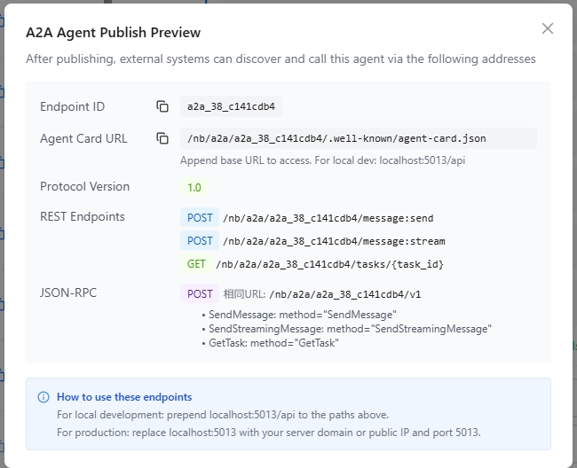
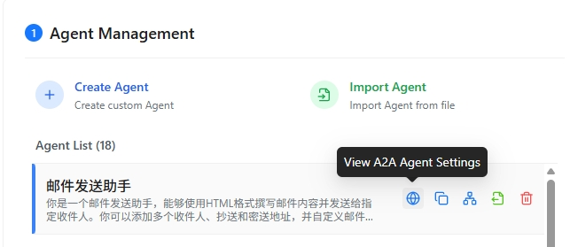

# Publish as A2A Agent

Nexent supports exposing published agents as A2A 1.0–compliant agents so that external systems can discover and call them via REST or JSON-RPC. This page describes how to publish an A2A agent and how to call one.

## 🚀 Publish Steps

1. Open **Agent Development** and create or edit an agent
2. Finish the configuration and save
3. Click **Publish**
4. In the publish options, check **Publish as A2A Agent**
5. Confirm the publish

<div style="display: flex; justify-content: left;">
  
</div>

After a successful publish, the system displays the A2A agent's call info:

<div style="display: flex; justify-content: left;">
  
</div>

| Field                 | Description                                                                                |
| --------------------- | ------------------------------------------------------------------------------------------ |
| **Endpoint ID**       | Unique identifier for the A2A agent                                                        |
| **Agent Card URL**    | Agent discovery endpoint; external systems use this URL to fetch the agent description     |
| **Protocol Version**  | A2A protocol version; currently 1.0                                                        |
| **REST Endpoint**     | REST-style API endpoint                                                                    |
| **JSON-RPC Endpoint** | JSON-RPC 2.0 calling endpoint                                                              |

In the agent list, click the leftmost icon to view detailed calling information for the A2A agent.



## 📞 Calling Methods

A published A2A agent supports both REST and JSON-RPC. Pick whichever fits your use case.

### REST API

```bash
# Get Agent Card (for Agent discovery)
GET /nb/a2a/{endpoint_id}/.well-known/agent-card.json

# Send synchronous message
POST /nb/a2a/{endpoint_id}/message:send
Content-Type: application/json

{
  "message": {
    "role": "user",
    "content": "Please help me complete a task"
  }
}

# Send streaming message (SSE)
POST /nb/a2a/{endpoint_id}/message:stream
Content-Type: application/json

{
  "message": {
    "role": "user",
    "content": "Please help me complete a task"
  }
}

# Get task status
GET /nb/a2a/{endpoint_id}/tasks/{task_id}
```

### JSON-RPC 2.0

```bash
POST /nb/a2a/{endpoint_id}/v1
Content-Type: application/json

# Send synchronous message
{
  "jsonrpc": "2.0",
  "method": "SendMessage",
  "params": {
    "message": {
      "role": "user",
      "content": "Please help me complete a task"
    }
  },
  "id": 1
}

# Send streaming message
{
  "jsonrpc": "2.0",
  "method": "SendStreamingMessage",
  "params": {
    "message": {
      "role": "user",
      "content": "Please help me complete a task"
    }
  },
  "id": 2
}

# Get task status
{
  "jsonrpc": "2.0",
  "method": "GetTask",
  "params": {
    "taskId": "task_abc123"
  },
  "id": 3
}
```

### Local Development Path Prefixes

| Deployment    | Path Prefix                          |
| ------------- | ------------------------------------ |
| Docker        | `http://localhost:5013/nb/a2a`       |
| Kubernetes    | `http://localhost:30013/nb/a2a`      |
| Production    | Replace with the server domain or public IP |

> 💡 **Tip**: A2A calls require valid authentication in the request header (`Authorization: Bearer {access_key}`). Generate the API key from **Personal Info → Generate API Key**.

> ⚠️ **Notes**:
>
> - The Agent Card is cached; the refresh interval is 1 hour
> - To update the agent's info, you must republish the agent version

## 🔐 Authentication

Calling an A2A agent uses the same API key as the Northbound API:

```http
Authorization: Bearer {access_key}
```

Create and copy the key from **Personal Info → Generate API Key**.

## 🏷️ Version Management

- Published A2A agents cannot be modified, but you can publish new versions
- After a republish, external systems pick up the new info through the refreshed Agent Card

## ❓ FAQ

### Q: Can normal publishing and A2A publishing be enabled at the same time?

Yes. When publishing, leave the default Northbound RESTful API enabled and also check **Publish as A2A Agent** to support both calling methods.

### Q: My A2A call returns 401. Why?

Confirm the request header contains a valid `Authorization` field and that `access_key` is correct.

### Q: How do I update an already-published A2A agent?

Republish the agent version. The new info becomes visible to callers through the refreshed Agent Card.
