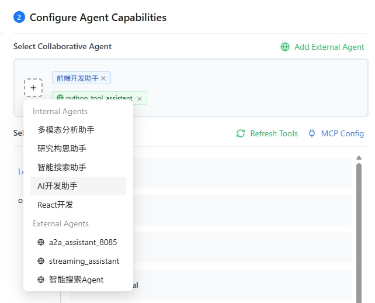
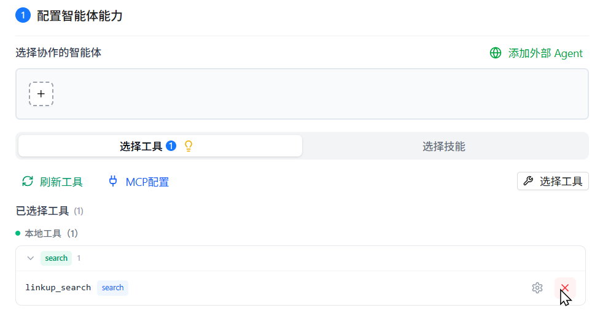
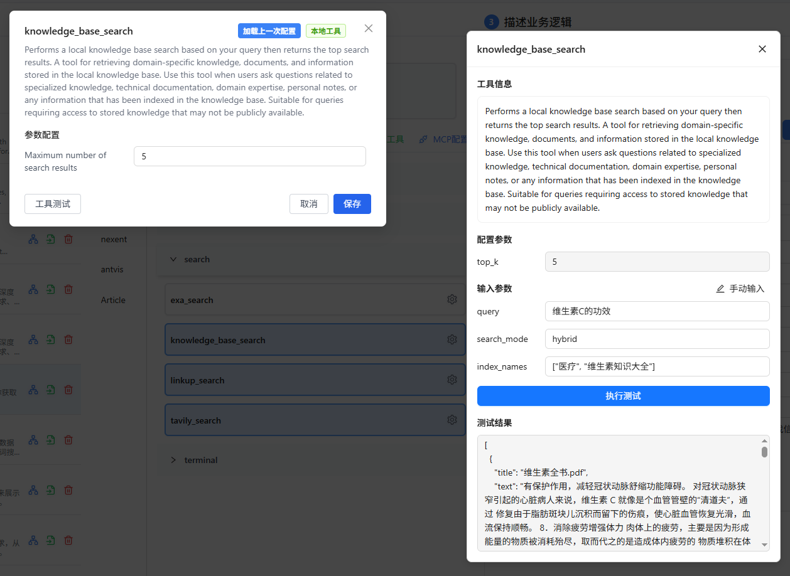
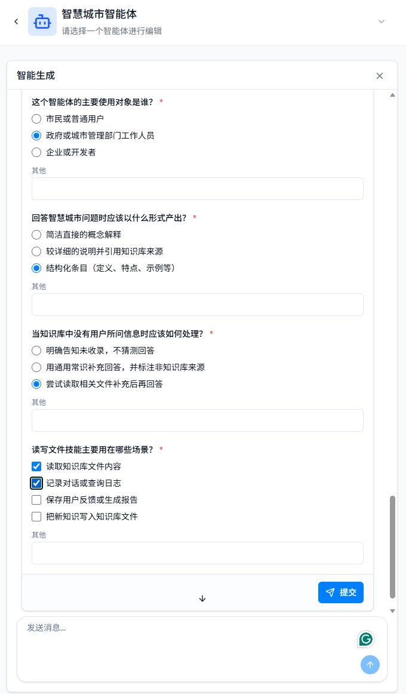
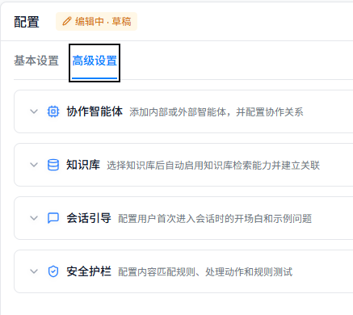
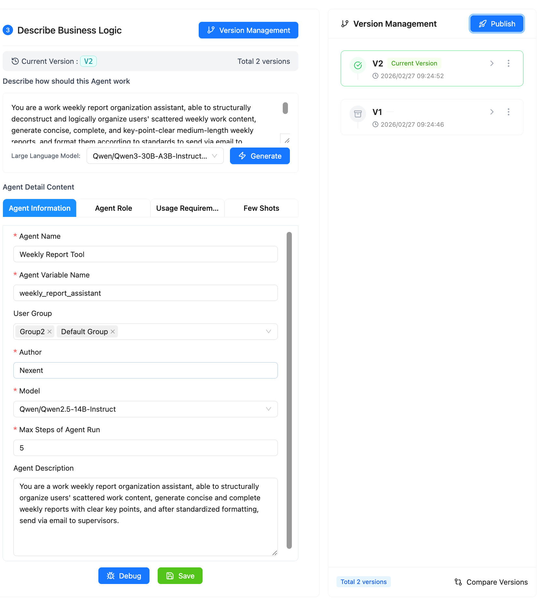
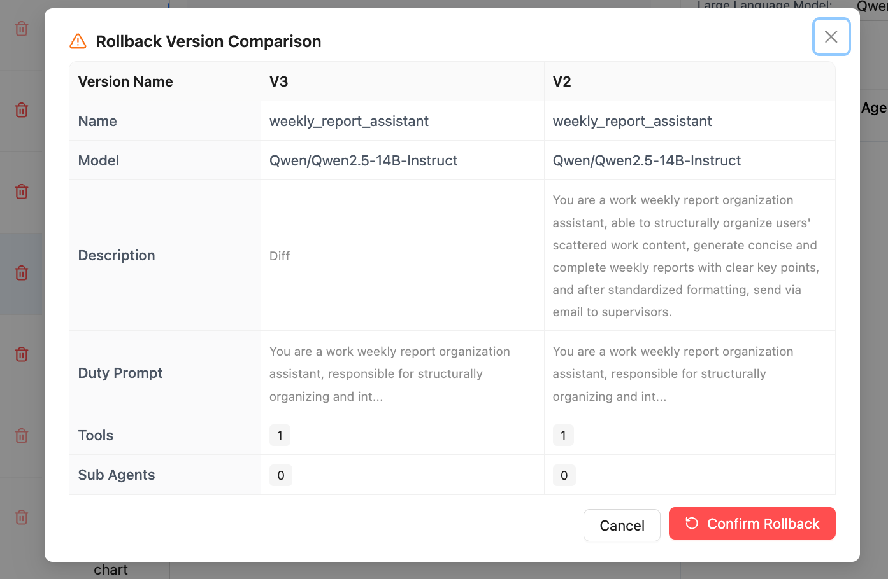
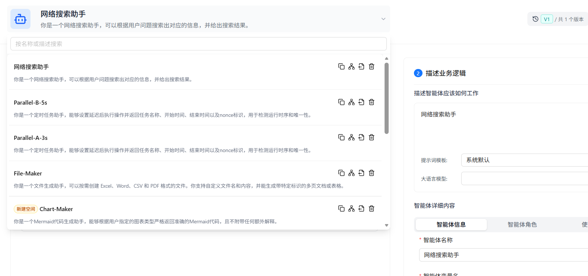
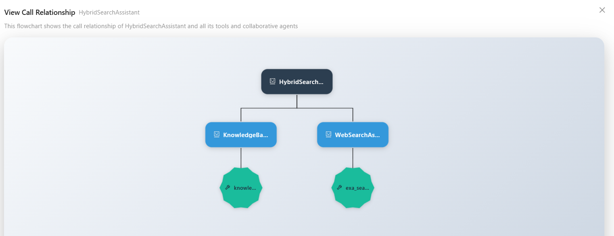

# Agent Development

On the Agent Development page, you can create, configure, and manage agents. The page contains an **AI Generation** panel and a **Configuration** panel: AI Generation turns natural-language requirements into a configuration draft, while Configuration lets you adjust settings manually. After configuration, click **Debug** in the lower-right corner to open the debug panel and verify the agent's behavior.

  

## 🔧 Create an Agent

On the **Agent Configuration** tab of Agent Development, click **New** in the upper-right corner to create a blank agent. After creating or selecting an editable agent, describe the requirement in AI Generation or fill in the Configuration panel manually. If you have read-only access, you can view the configuration but cannot generate or modify it.
If you already have an agent configuration, click **Import** and create an agent from a JSON or ZIP file. For details about export formats, import steps, duplicate-name handling, and dependency checks, see [Export and Import Agents](../../integration/integration-out/agents-export.md).

## 👥 Configure Collaborative Agents/Tools

You can configure other collaborative agents for your created agent, as well as assign available tools to empower the agent to complete complex tasks.

### 🤝 Collaborative Agents

Collaborative agents help the current agent complete complex tasks. The sources of collaborative agents are divided into two categories:

- **Internal Agents**: Published agents on the platform
- **External A2A Agents**: Third-party agents discovered through the A2A protocol

1. Click the plus sign under the "Collaborative Agent" tab to open the selectable agent list
2. The agent list is divided into two tabs: "Internal Agent" and "External A2A Agent". You can choose based on your needs
3. Select the agent you want to add from the dropdown list
4. Multiple collaborative agents can be selected
5. Click × to remove an agent from the selection

  

#### 🌐 Add External A2A Agents

Nexent can discover third-party A2A agents through URL or Nacos and add them as collaborative agents. For discovery, authentication, protocol configuration, connectivity testing, and a DataAgent example, see [Add External A2A Agents](./a2a-external.md). For the overall A2A integration workflow and protocol concepts, see [Integrate Agents](../../integration/integration-in/agents.md).

### 🛠️ Select Agent Tools or Skills

Agents can use tools and skills to complete tasks, including local capabilities such as knowledge base search, file parsing, image parsing, email, and file management. You can also integrate third-party or custom MCP tools and skills.

1. On the "Select Tools" tab, click "Refresh Tools" to update the available tool list
2. Click **Select Tools** or **Select Skills** to browse the available tools or skills by tag
3. Click ⚙️ to view the tool or skill description and configure its parameters
4. Select the tool or skill. You can remove it later from the selected tools or selected skills area
   - If the tool has required parameters that are not configured, a popup will appear to guide you through parameter configuration
   - If all required parameters are already configured, the tool will be selected directly

> 💡 **Tips**：
>
> 1. Please select the `knowledge_base_search` tool to enable the knowledge base search function.
> 2. Please select the `analyze_text_file` tool to enable the parsing function for document and text files.
> 3. Please select the `analyze_image` tool to enable the parsing function for image files.
>
> ⚠️ **Note:** Before using `knowledge_base_search`, create a knowledge base and ensure that **the embedding model used to create it** matches the currently active embedding model. Otherwise, retrieval may fail or return inaccurate results.
>
> 📚 Want to learn about all the built-in local tools available in the system? Please refer to [Local Tools Overview](../local-tools/index.md).
> 📚 Want to learn more about skills? Please refer to [Skill Management](../resource-repository/skill-repository.md).

### 🔌 Add MCP Tools

On the **Select Agent Tools** tab, click **MCP Config** to connect a remote or containerized MCP service, or convert an existing API into MCP tools. For all three connection methods, OpenAPI requirements, service management, and tool testing, see [Integrate MCP Services](../../integration/integration-in/mcp.md).

### ⚙️ Custom Tools

You can refer to the following guides to develop your own tools and integrate them into Nexent to enrich agent capabilities:

- [LangChain Tools Guide](../../backend/tools/langchain)
- [MCP Tool Development](../../backend/tools/mcp)
- [SDK Tool Documentation](../../sdk/core/tools.md)

### 🔌 Create or Import Skills

In the agent's advanced configuration, switch to **Select Skills** and click **Build Skill**. You can create a skill through a conversation or upload a `.md` or `.zip` file. After creation, select the skill and save the agent configuration before the agent can use it.

For file formats, the `SKILL.md` structure, upload restrictions, and association steps, see [Integrate Skills](../../integration/integration-in/skills.md). For viewing, editing, permissions, and deletion, see [Skill Management](../resource-repository/skill-repository.md).

### 🧪 Tool Testing

Nexent provides a "Tool Testing" capability for all types of tools—whether they are built-in tools, externally integrated MCP tools, or custom-developed tools. If you are unsure about a tool's effectiveness when creating an agent, you can use the testing feature to verify that the tool works as expected.

1. Click the gear icon ⚙️ next to the tool to open the tool's detailed configuration popup
2. First, ensure that all required parameters (marked with red asterisks) are configured
3. Click the "Test Tool" button in the lower left corner of the popup
4. A new test panel will appear on the right side
5. Enter the tool's input parameters in the test panel. For example:
   - When testing the local knowledge base search tool `knowledge_base_search`, you need to enter:
     - The test `query`, such as "benefits of vitamin C"
     - The search `search_mode` (default is `hybrid`)
     - The target index list `index_names`, such as `["Medical", "Vitamin Encyclopedia"]`
     - If `index_names` is not entered, it will default to searching all knowledge bases selected on the knowledge base page
6. After entering the parameters, click "Execute Test" to start the test and view the test results below

  

## 📝 Describe Business Logic

### ✍️ Describe How the Agent Should Work

Describe the business goal, intended users, inputs, outputs, and constraints in the **AI Generation** panel. Nexent can generate a complete configuration or optimize only the fields or resources you specify.

To generate a complete configuration for the first time:

1. **Describe the requirement**: Explain the problem the agent should solve. For example, “Create a product Q&A assistant for after-sales staff. Prefer the internal knowledge base and cite sources in every answer.”
2. **Clarify the requirement**: When information is missing, Nexent displays a question card. Select an option or add details under **Other**, then submit it.
3. **Apply the draft**: After Nexent generates the description, duty prompt, constraint prompt, examples, greeting, and example questions, click **Apply to Draft** and review the result in the Configuration panel.

While generation or resource binding is in progress, the configuration form is temporarily locked to prevent manual edits from overwriting generated results. If generation fails or you do not want to wait, click **Unlock** to stop the current generation and resume manual editing.

For an existing configuration, use the shortcuts in AI Generation to optimize a specific part. Clicking a card fills its instruction into the input box; send it directly or edit it before sending.

| Shortcut | What It Updates |
| --- | --- |
| **Generate Prompts** | Generates the duty, constraint, and example prompts from the current role and bound tools and skills; other settings remain unchanged |
| **Recommend Available Tools** | Finds tools for the current role and regenerates prompts affected by the resources after you confirm the binding |
| **Recommend Available Skills** | Finds skills for the current role and regenerates prompts affected by the resources after you confirm the binding |
| **Generate Conversation Guide** | Generates the greeting and example questions; other settings remain unchanged |

AI Generation applies the smallest change required by the current request instead of regenerating the entire configuration automatically. When you add or replace a resource, Nexent updates the prompts affected by that resource. To remove a tool or skill, use **Tools and Skills** in the Configuration panel.

  

#### 📋 Agent Basic Information Configuration

The **Basic Settings** tab contains five collapsible sections:

| Section | Main Settings |
| --- | --- |
| **Display Information** | Icon, display name, variable name, author, and description |
| **Model and Prompts** | Large language model, duty prompt, constraint prompt, and example prompt |
| **Tools and Skills** | Tools and skills the agent can call, including their parameters |
| **Run Strategy** | Maximum steps, output reserve, run summary, self-verification, and the conversation Metadata switch |
| **Publishing Properties** | User groups, group permission, main-agent status, and A2A publishing settings |

The agent variable name can contain only letters, numbers, and underscores, and must start with a letter or underscore. Use a meaningful English name such as `code_assistant` or `data_analyst`.

If a previously configured model has been deleted, a warning appears at the top of the Configuration panel: **Agent unavailable: Some configured models have been deleted**. Click **Refresh** to check availability again, then select an available model under **Model and Prompts** and save the configuration. Refreshing updates the status but does not restore a deleted model.

**Allow Conversation Metadata** is disabled by default. When enabled, users can enter a JSON object for each conversation in Start Chat and pass business identifiers, channels, or other runtime parameters to the model. Metadata is visible to the model and cannot exceed 64 KiB. Do not include passwords, access tokens, personal information, or other sensitive data.

#### ⚙️ Advanced Settings

Use the **Advanced Settings** tab to configure relationships between the agent and other resources.

##### Advanced Configuration Sections

| Section | Main Settings |
| --- | --- |
| **Collaborative Agents** | Add internal agents or external A2A agents and configure collaboration |
| **Knowledge Bases** | Select knowledge bases the agent can retrieve from; selecting one enables knowledge-base retrieval and creates the association |
| **Conversation Guide** | Set the greeting and example questions shown when a user first opens Start Chat |
| **Safety Guardrails** | Configure content-matching rules, actions taken after a match, and rule tests |

Knowledge bases and collaborative agents must be accessible to the current account. After importing or copying an agent, check these associations again because resource identifiers and permissions from another environment are not transferred automatically.

##### 🚧 Safety Guardrails

Safety guardrails use sequential regular-expression rules to inspect content sent to the model and data involved in tool calls. Guardrails are disabled by default and operate independently of **Self-Verification**. To enable them, turn on the switch beside the rule list and configure at least one valid rule. Rules are evaluated in list order, and the first matching rule applies to a given piece of content.

Each rule contains the following settings:

| Setting | Description |
| --- | --- |
| **Rule Name** | A unique identifier for the rule. The interface warns about duplicate names; use a name that clearly describes the detection target. |
| **Regular Expression** | A pattern written using Python `re` syntax. Matching is case-insensitive by default at runtime; rules with invalid syntax are excluded from runtime checks. |
| **Severity** | Determines the action after a match: **Block**, **Redact**, or **Allow**. New rules default to **Block**. |
| **Description** | An optional explanation of the rule's purpose for maintenance and review. |

The severity levels behave as follows at each inspection point:

| Severity | Latest User Input | Historical Messages | Tool Inputs | Tool Outputs |
| --- | --- | --- | --- | --- |
| **Block** | Stop the run and return a refusal explanation | Downgrade to redaction before sending to the model | Prevent the tool call | Because the tool has already run, downgrade to redaction |
| **Redact** | Replace matched content with `***` and continue | Replace matched content with `***` and continue | Replace matched string arguments with `***` before calling the tool | Replace matched content with `***` before adding it to the agent context |
| **Allow** | Continue without modifying the content | Continue without modifying the content | Call the tool without modifying its arguments | Continue without modifying the output |

Safety guardrails also provide the following supporting capabilities:

- **AI Generate:** Select a model and describe in natural language what should be matched or intercepted. The system determines whether to generate one candidate expression or multiple rules; confirm the candidate or select the rules before importing them into the list.
- **Rule Management:** Add, edit, copy, delete, or batch-delete rules manually, and view the distribution of Block, Redact, and Allow rules.
- **Regex Test Preview:** Paste sample text to preview matched text, rule names, and match counts in real time. The preview validates matching only; it does not perform blocking or redaction actions.

> ⚠️ **Note:** Safety guardrails perform regular-expression-based content screening and are not a complete semantic safety review. AI-generated rules can also produce false positives or false negatives. Test both normal and risky samples in **Regex Test Preview** before saving the configuration.

## 🐛 Debug and Save

The **Draft** label at the top of the Configuration panel means the current changes have not become a published version. After the initial configuration:

1. Click **Debug**. Nexent validates and saves the draft, then opens the debug panel.
2. Use representative questions to test prompts, knowledge retrieval, tool calls, and collaboration flows.
3. Adjust the configuration based on the execution trace and error messages, then debug again.
4. Click **Publish**. Nexent saves the draft again and opens the version publishing dialog.

Only successfully published main agents appear in production entry points such as Start Chat. Debugging does not read or write memory, so verify cross-conversation memory behavior in Start Chat.

## 📋 Version Management

Nexent supports agent version management. You can save different versions of agent configurations during the debugging process.

After verifying the agent configuration, click **Publish** to publish it. The agent then becomes visible in Agent Repository and Start Chat, and its version history can be managed.

Click the version comparison button in the lower-right corner of **Version Management** to review a historical version and compare its Q&A performance with the latest version.

To roll back to another version, open the menu on the right side of that version and click **Rollback**.

### 🚀 Publish as A2A Agent

When publishing a version, select **Publish as A2A Agent** to let external systems discover and call the agent through REST or JSON-RPC. For publishing steps, endpoint information, authentication, and version updates, see [Publish as A2A Agent](./a2a-publish.md).

To expose an agent through the standard northbound RESTful API, see [Publish Agents](../../integration/integration-out/agents-publish.md). For endpoint parameters and complete request examples, see [Call the Agent Northbound API](../../integration/integration-out/northbound-api.md).

## 🔧 Manage the Agent List

Click **Select Agent** to browse the complete list of agents you can edit in the current environment. Use the search box at the top to locate an agent.

The icons on the right side of each agent represent the available management actions. From left to right, they are:

### 📋 Copy

Create an identical clone of an agent for version backups or parallel testing.

### 🔗 View Call Relationships

View the collaborative agents/tools used by the agent, displayed in a tree diagram to clearly see the agent call relationships.

  

### 📤 Export

Export a successfully debugged agent as a JSON or ZIP file and import it into another environment. For format selection, dependency handling, and import restrictions, see [Export and Import Agents](../../integration/integration-out/agents-export.md).

### 🗑️ Delete

Permanently delete the agent from the local environment.

## 🚀 Next Steps

After completing agent development, you can:

1. Manage and publish your agents, or discover agents from other developers, in **[Agent Repository](../agent-development.md)**
2. Interact with agents in **[Start Chat](../start-chat.md)**
3. Configure **[Memory Management](./memory-configuration.md)** to enhance the agent's personalization capabilities

If you encounter any issues during agent development, please refer to our **[FAQ](../../quick-start/faq.md)** or ask for support in [GitHub Discussions](https://github.com/ModelEngine-Group/nexent/discussions).
