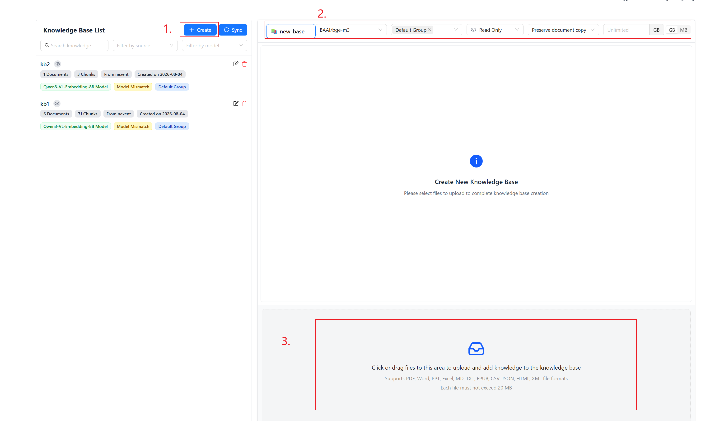
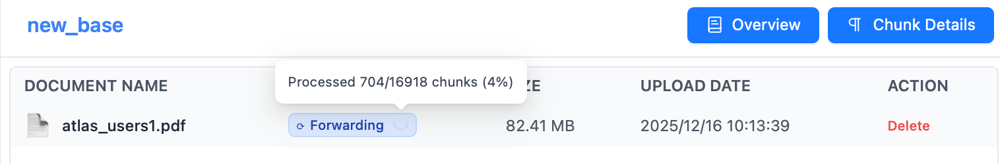
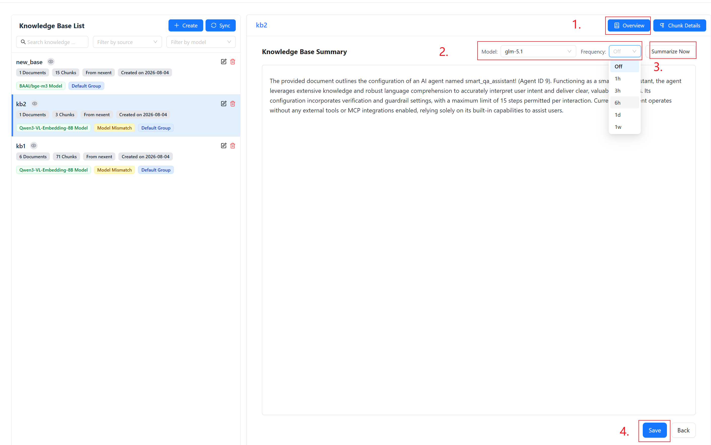
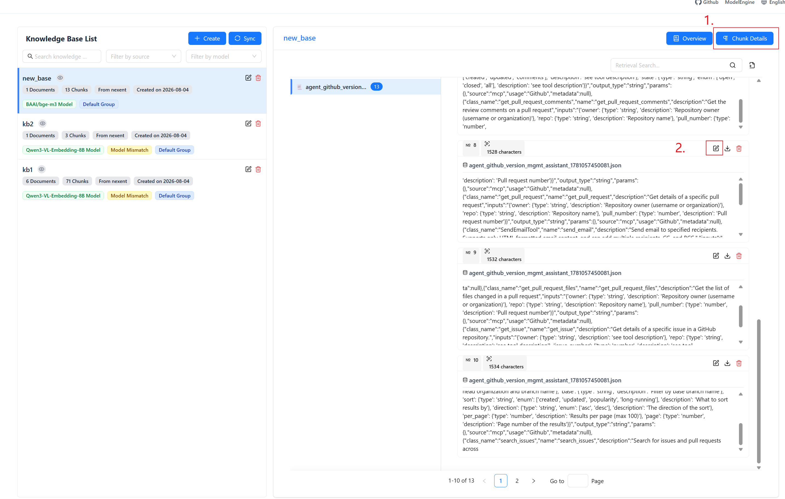
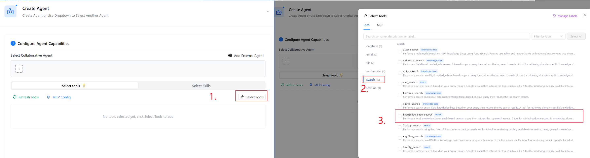
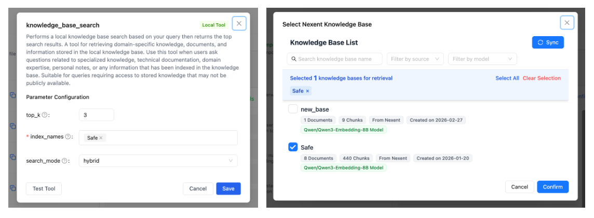
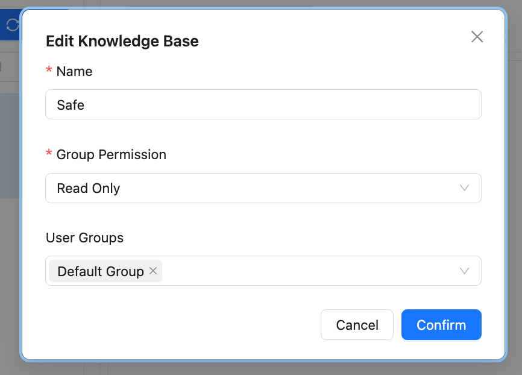

# Knowledge Configuration

Create and manage knowledge bases, upload documents, and generate summaries. Knowledge bases are critical information sources that let agents securely use your private data.

## 🔧 Create a Knowledge Base

1. Click **Create Knowledge Base** at the top of the left-side list
2. In the creation panel, fill in the following fields:

| Field | Description |
|-------|-------------|
| **Name** | Required. Must be unique and can only contain Chinese characters or lowercase letters. Spaces, slashes, and other special characters are not allowed. The system automatically checks for duplicates as you type |
| **Embedding Model** | Choose the vector model used to embed your documents. Models fall into two groups: **Text Embedding (embedding)** and **Multimodal Embedding (multi_embedding)**. Selecting a multimodal model automatically enables vectorization of non-text content such as images. See [Embedding Model Types](#embedding-model-types) |
| **User Groups** | Select which user groups can access this knowledge base (multi-select) |
| **In-Group Permission** | Controls what group members can do: **Edit** — upload and delete files; **Read Only** — view and search only; **Private** — only the creator can access |
| **Preserve Source File** | When enabled, uploaded files are kept in the system for later re-processing or download. When disabled, only the vectorized data is stored |
| **Storage Quota** | Optional. Set a storage cap for the knowledge base (switchable between GB and MB). The system raises a warning when storage usage approaches the quota |

3. After configuring the fields above, select files to upload in the upload area below (or skip and upload later)
4. Once files are uploaded, the knowledge base is created and processing begins automatically

## 📁 Upload Files

### Upload Files

1. Select a knowledge base from the list
2. Click the upload area to pick files (multi-select supported) or drag them in directly
3. Nexent automatically parses files, extracts text, and vectorizes the content
4. Track the processing status in the document list

:::tip File Size Limit
Maximum upload size per file is **20 MB**. Files exceeding this limit cannot be uploaded.
:::

### Document Processing Status

Uploaded files go through multiple stages. There are 6 distinct statuses:

| Status | Description |
|--------|-------------|
| Waiting | File uploaded and queued for processing |
| **Parsing** | System is extracting text content from the file |
| **Ingesting** | Text is being vectorized and written into the vector database |
| **Ready** | Processing complete — the document is available for retrieval |
| **Parse Failed** | An error occurred during parsing. Hover over the status icon to see the detailed error reason and troubleshooting suggestions |
| **Ingest Failed** | An error occurred during vectorization. Hover over the status icon to see the detailed error reason and troubleshooting suggestions |

💡 Hover over the status icon to view real-time progress (e.g., "23/50 chunks processed") and error details for failed documents.

### Supported File Formats

Nexent supports multiple file formats, including:

- **Text:** .txt, .md, .json
- **PDF:** .pdf
- **Word:** .docx
- **PowerPoint:** .pptx
- **Excel:** .xlsx
- **EPUB:** .epub
- **Data files:** .csv
- **Web content:** .html, .xml

## 📊 Knowledge Base Summary

Give every knowledge base a clear summary so agents can pick the right source during retrieval.

### Generate and Edit Summaries Manually

1. Click **Details** to the right of the knowledge base name to open the overview page
2. In the overview page, choose an LLM model and click **Auto Summary** to generate a description
3. Edit the generated text to improve accuracy
4. Click **Save** to store your changes

### Scheduled Auto-Summary

In addition to manual triggers, you can configure **scheduled auto-summary** to let the system periodically regenerate the knowledge base summary in the background:

| Frequency | Description |
|-----------|-------------|
| 1 Hour | High-frequency updates — suitable for knowledge bases with frequent content changes |
| 3 Hours | Medium-high frequency updates |
| 6 Hours | Medium frequency updates |
| 1 Day | Once a day — suitable for most scenarios |
| 1 Week | Once a week — suitable for mostly static knowledge bases |

Select the frequency in the summary section of the overview page. The system intelligently checks whether the knowledge base has received document updates since the last run; if no new documents have been added or changed, the generation is skipped to save resources.

## 📂 Chunk Management

After upload, each document is split into multiple **Chunks**. Each chunk contains a segment of text and has a corresponding vector index entry. You can perform fine-grained management on chunks.

### Viewing Chunks

1. Click a knowledge base name to open the document list
2. Click the **Chunk Details** tab at the top
3. All documents in the knowledge base are listed at the top of the page. Click any document to view all of its chunks
4. Chunks are displayed as cards showing the chunk content and the source file name

### Searching Chunks

Use the search box on the Chunk Details page to search for chunks. The system performs a hybrid search combining keyword matching and semantic matching, and returns results ranked by overall relevance.

### Manually Managing Chunks

| Action | Description |
|--------|-------------|
| **Create** | Add a custom chunk manually on the Chunk Details page |
| **Edit** | Click a chunk card to enter edit mode and modify its text content |
| **Delete** | Remove unwanted chunks |
| **Download** | Export chunk content as a download |

:::warning Model Compatibility Restriction
Chunk edit and create operations depend on embedding model consistency. If the model configuration has changed, these operations may be automatically disabled to prevent incompatible vector data from being written.
:::

## 🧩 Embedding Model Types

Embedding models in the system are divided into two categories:

- **Text Embedding models (embedding)**: For vectorizing pure text documents (e.g., BGE, M3E)
- **Multimodal Embedding models (multi_embedding)**: Can process both text and image content (e.g., DashScope, Jina)

The embedding model selected when a knowledge base is created remains bound to that knowledge base for its entire lifecycle. Choose the appropriate model type based on your document content when creating a knowledge base.

## 🔧 Using Knowledge Bases

Nexent supports binding knowledge bases to agents. When creating an agent, enable the appropriate knowledge retrieval tool in the tool configuration panel and select the associated knowledge bases.

For Nexent-native knowledge bases, enable the **knowledge_base_search** tool:

Inside the tool configuration modal, you will see the list of bound knowledge bases with search and multi-select support. Each knowledge base displays its embedding model name so you can confirm compatibility before binding.

## 🔍 Knowledge Base Management

### View Knowledge Bases

1. **Knowledge Base List**
   - The left column lists every created knowledge base
   - Supports searching by name and filtering by knowledge source or embedding model
   - Each knowledge base card shows the following information:

   | Info | Description |
   |------|-------------|
   | Name | The name set at creation time |
   | Document Count | Total number of uploaded documents |
   | Chunk Count | Total number of document chunks after splitting |
   | Source | Knowledge base origin (Nexent native / external source) |
   | Created At | Date when the knowledge base was created |
   | Embedding Model | Name of the bound embedding model |
   | Multimodal Badge | Shown if multimodal support is enabled |
   | User Group Tags | Names of the user groups this knowledge base is visible to |
   | Permission Icon | Your current access level for this knowledge base (hover over the icon to see details) |
   | No Source File Badge | Shown when "Preserve Source File" is disabled |

2. **Knowledge Base Details**
   - Click a knowledge base name to view all documents
   - Click **Details** to open the overview page for viewing and editing the summary

> Click **Edit** to manage the knowledge base name, visible user groups, and in-group permissions

### Edit Knowledge Bases

1. **Delete Knowledge Base**
   - Click **Delete** to the right of the knowledge base row
   - Confirm the deletion (irreversible)

2. **Delete or Add Files**
   - Inside the document list, click **Delete** to remove a document
   - Use the upload area below the document list to add new files

## 🚀 Next Steps

After completing knowledge base configuration, we recommend you continue with:

1. **[Agent Development](../agent-development)** – Create and configure agents
2. **[Start Chat](../start-chat)** – Interact with your agent

Need help? Check the **[FAQ](../../quick-start/faq.md)** or open a thread in [GitHub Discussions](https://github.com/ModelEngine-Group/nexent/discussions).
