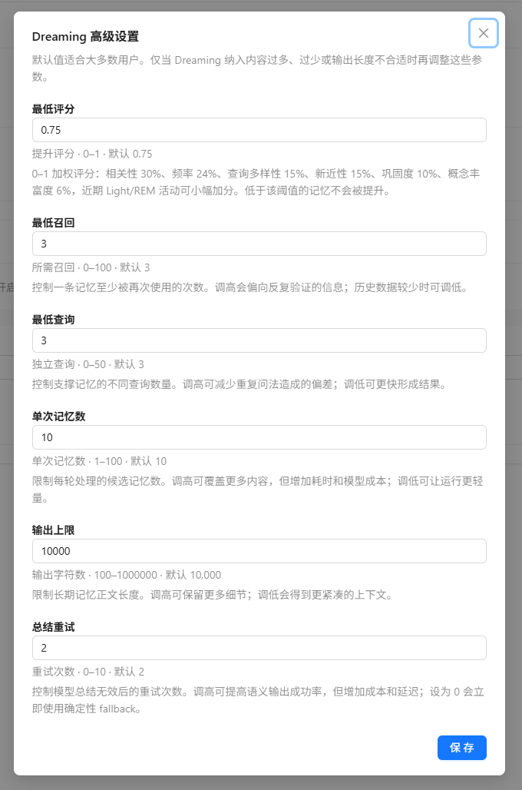
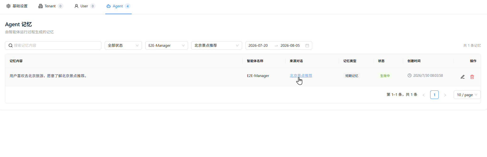

# Memory Configuration

Nexent's memory capability preserves reusable information across multiple turns and conversations. The current memory system uses a **three-level Tenant, User, and Agent architecture**: the Tenant and User levels store long-term memories, while the Agent level stores short-term memories generated through interactions between a specific user and a specific agent.

When memory is enabled, the system loads long-term memories and retrieves relevant Agent short-term memories before the agent runs. Before producing its final response, the agent also determines whether the current conversation contains new information worth saving.

## 🎯 How It Works

During a normal conversation, memory works as follows:

1. Load the current tenant's Tenant long-term memories and the current user's User long-term memories.
2. Use the user's latest question to search the short-term memories associated with the current user and agent.
3. Add the available long-term memories and retrieved short-term memories to the agent context.
4. Generate a response using the memories, current question, tool results, and conversation history.
5. Before returning the final response, determine whether the conversation introduced new user preferences, task objectives, action plans, recent progress, or corrective reflections. If so, summarize them as concise Agent short-term memories.

Memory operations are performed through built-in tools. You can inspect tool execution status to confirm the memory-loading trace. If memory retrieval fails, the system skips memory and continues the current task so that a memory service issue does not interrupt the entire conversation.

> 💡 **Note:** Memory retrieval and writing are disabled in agent debug mode to prevent test data from affecting production memories. Use **Start Chat** to verify cross-conversation memory behavior.

## ⚙️ Open Memory Configuration

1. Click **Memory Configuration** in the left navigation bar.
2. The page contains four tabs: **Base Settings**, **Tenant**, **User**, and **Agent**.
3. The Tenant and User tabs show long-term memory documents and versions; the Agent tab shows short-term memory records.

### Base Settings

**Memory Capability** is the master switch:

| Setting | Default | Description |
| --- | --- | --- |
| **Memory Capability** | Enabled | When enabled, normal conversations load, retrieve, and write memories. Disabling it stops agents from using memory but does not delete existing records. |

Changes to the switch are saved immediately. If saving fails, the page restores the previous state and displays an error message.

Base Settings also provides the Dreaming schedule and advanced parameters described below.

## 📚 Three-Level Memory Architecture

The current system uses only the following three memory levels:

| Level | Visibility and Scope | Primary Source | How It Is Used |
| --- | --- | --- | --- |
| **Tenant** | Shared within the current tenant | Manually maintained by authorized users | Loads the active version as organization-level long-term context |
| **User** | Visible only to the current user | Maintained manually or generated by Dreaming | Loads the active version as personal long-term context |
| **Agent** | Isolated to the current user and a specific agent | Summarized automatically during production conversations | Retrieves relevant short-term memories for the current question |

### Tenant Memory

Tenant memory stores stable information that applies across the organization, such as:

- Company terminology and standardized wording
- Common working conventions and process principles
- Organization-level preferences or constraints
- Facts that multiple users and agents need to reference

Agents do not write Tenant memories automatically. Only users with permission to create Tenant memories can see the **New Memory** button; these memories are typically maintained by tenant administrators.

### User Memory

User memory belongs only to the current user and is suitable for stable personal information that should be reused across agents, such as:

- Preferred language, format, and writing style
- Long-term working habits
- Ongoing project context
- Personal requirements that all agents should follow

User memory belongs only to the current user and can be reused across agents for language preferences, working habits, and ongoing project context. The user can edit it directly or use Dreaming to consolidate short-term memories into a new version.

### Agent Memory

Agent memories are generated automatically during production conversations and are bound to both the current user and current agent. They may store:

- Preferences the user expresses to that agent
- Current task objectives
- Action plans and recent progress
- Reflections derived from user feedback, errors, or failed results

Agent memories for the same user-agent pair can be recalled across conversations, but they are not automatically shared across users or agents. Main agents and collaborative agents also maintain separate Agent memories.

Before saving a memory, the agent must evaluate, summarize, and deduplicate it into a concise, reusable entry. Full conversations, temporary calculations, intermediate noise, unverified assumptions, duplicate content, sensitive credentials, and information the user explicitly asked to forget should not be written to memory. A single agent run can automatically save at most three Agent short-term memories.

## 🌙 Use Dreaming to Consolidate Long-Term Memory

Dreaming analyzes the current user's accumulated Agent short-term memories, selects information that has been recalled repeatedly, validated by different questions, and remains relevant to recent work, then generates a new User long-term memory version. Dreaming is always available, but it runs on a schedule only after automatic execution is enabled.

### Run Manually or on a Schedule

- Click **Dream Now** to add a task to the background queue. The page shows queued, running-stage, completed, or failed status.
- Automatic execution supports daily, weekly, and fixed-hour intervals, and calculates the next run using the time zone displayed on the page.
- If a Dreaming task is already running for the same user, duplicate requests are skipped to avoid concurrent updates to the same long-term memory version.
- If no short-term memory reaches the stability threshold, Nexent does not create an empty version. Run Dreaming again after more useful interactions accumulate.
- A Dreaming failure does not damage the currently active long-term memory version.

Dreaming collects short-term signals, identifies stable patterns, selects candidates, and generates long-term memory in sequence. It relies on a dedicated background worker. If a task remains queued for a long time, ask an administrator to check the corresponding service.

### Advanced Parameters

The defaults are suitable for most users. Adjust them only when Dreaming includes too much or too little content, or the output length is unsuitable.

| Parameter | Default | Purpose |
| --- | ---: | --- |
| **Minimum Score** | 0.75 | Memories below this combined stability score are not promoted |
| **Minimum Recalls** | 3 | Requires a short-term memory to have been reused at least this many times |
| **Minimum Queries** | 3 | Requires support from this many distinct questions |
| **Memories per Run** | 10 | Maximum number of candidate short-term memories processed in one run |
| **Output Limit** | 10,000 characters | Maximum length of the User long-term memory document |
| **Summary Retries** | 2 | Maximum retries when the model returns an invalid summary |

Lowering the first three values creates long-term memory sooner but may include information that is not yet stable. Increasing the candidate count, output limit, or retry count usually increases execution time and model cost.

## 🗂️ View and Filter Memories

The Tenant, User, and Agent tabs display memory records in tables, including memory content, type, status, and creation time.

All levels support:

- Searching by memory content
- Filtering by status
- Viewing the number of filtered results
- Paginated browsing with 10, 20, or 50 records per page

The Agent tab also supports:

- Filtering by agent, source conversation, or creation date range
- Viewing the agent name and source conversation
- Clicking the source conversation title to return to the conversation that generated the memory

### Memory Status

| Status | Description |
| --- | --- |
| **Active** | The memory can participate in short-term retrieval and can be selected as a Dreaming candidate. |
| **Archived** | The memory remains in the list but is excluded from runtime loading and retrieval. |
| **Disabled** | The memory is temporarily unavailable. This status can be set manually or caused by an Agent memory being incompatible with the current embedding model. |

## ✍️ Maintain Long-Term and Short-Term Memory

### Edit Long-Term Memory

The Tenant and User tabs display the currently active version. Click **Edit** to modify the Markdown content, switch between editing and preview, and save the result as a new manual version. One long-term memory document can contain up to 10,000 characters.

If another operation updates the active version before you save, Nexent rejects the overwrite to prevent concurrent changes from losing data. Reload the latest version and merge your changes before saving again.

### View History and Switch Versions

The version list shows the version number, source, and creation time. Sources include manual edits and Dreaming. Select a historical version to inspect it, or click **Set as Active Version** and confirm. Future agent runs use the selected version while other versions remain in history.

### Edit and Delete Agent Memory

- Click **Edit** on a record to modify its content or status. Each entry can contain up to 500 characters.
- Click **Delete** and confirm to remove the record from retrieval. The page does not provide a restore action.
- You cannot manually create short-term memory on the Agent tab; production conversations generate it automatically.
- Records incompatible with the current embedding model cannot be edited but can still be deleted.

## 🔍 Memory Retrieval and Context Usage

Different levels are used differently:

- **Tenant / User long-term memories:** Active long-term memories are read from storage and supplied directly to the agent as persistent context, without semantic-similarity filtering.
- **Agent short-term memories:** The latest user question is used for vector retrieval. The results are then filtered through relevance fusion, time decay, similarity deduplication, and the context budget before the most useful entries are supplied to the agent.

Tenant and User memories should therefore remain concise and stable, because excessive content directly consumes model context. Agent memories can accumulate gradually through interactions; the system prioritizes content that is more relevant to the current question, more recent, and non-duplicative.

## 🧩 Embedding Models and Agent Memory

Generating and retrieving Agent short-term memories depends on the tenant's currently configured embedding model. When opening **Memory Configuration** or **Start Chat**, the system displays a prompt if the tenant has not configured an embedding model.

Without an available embedding model:

- Tenant and User long-term memories remain stored and are managed as long-term context.
- Agent short-term memories cannot be generated or retrieved normally.

After switching embedding models, Agent memories indexed with the previous model may be incompatible with the current index. The page automatically synchronizes their status when loading records:

| Embedding Compatibility | Synchronized Status |
| --- | --- |
| Incompatible | Disabled |
| Compatible | Active |

If you switch back to an embedding model compatible with the original records, disabled Agent memories become **Active** again.

## 💡 Usage Tips

### Write High-Quality Memories

Each memory should express one clear fact that can be reused over time.

✅ `The user prefers technical proposals to present the conclusion before the risks.`

❌ Not recommended: `The user likes concise answers, often works at night, manages several projects, and wants everything presented in tables.`

Follow these guidelines:

1. **Keep memories atomic:** Each entry should describe only one preference, fact, objective, or piece of progress.
2. **Avoid temporary information:** Do not save one-off calculations or short-lived irrelevant details.
3. **Maintain memories regularly:** Archive or delete outdated content.
4. **Control the number of long-term memories:** Tenant and User memories are supplied as persistent context, so avoid verbose, duplicate, or contradictory entries.
5. **Protect privacy:** Do not store passwords, access tokens, keys, or unnecessary sensitive personal information.

## 🚀 Next Steps

After configuring memory, you can:

1. Start multiple conversations with the same agent in **[Start Chat](../start-chat)** to verify cross-conversation memory.
2. Check the embedding model in **[Model Configuration](./model-configuration.md)**.
3. Continue creating and adjusting agents in **[Agent Configuration](./agent-configuration.md)**.

If you encounter any issues, refer to the **[FAQ](../../quick-start/faq.md)** or visit [GitHub Discussions](https://github.com/ModelEngine-Group/nexent/discussions) for support.
