# Model Configuration

The Model Configuration module lets you add and configure AI models — large language models, embedding models, rerank models, multimodal models, and voice models. Nexent supports multiple providers so you can pick the best option for each scenario.

## 🤖 Model Configuration

### 🛠️ Add Custom Models

#### Add a Single Model

1. **Add a custom model**
   - Click **Add Model** to open the dialog.
2. **Select model type**
   - Choose Large Language Model, Embedding Model, Image Understanding Model, Image Generation Model, Video Understanding Model, Rerank Model, Speech-to-Text Model or Text-to-Speech Model.
3. **Configure model parameters**
   - **Model Name (required):** The name you send in API requests.
   - **Display Name:** Optional label shown in the UI (defaults to the model name).
   - **Model URL (required):** API endpoint from the provider.
   - **API Key:** Your provider key.

> ⚠️ **Notes**
> 1. Model names usually follow `series/model`. Example: `Qwen/Qwen3-8B`.
> 2. API endpoints come from the provider docs. For SiliconFlow, examples include `https://api.siliconflow.cn/v1` (LLM, VLM) and `https://api.siliconflow.cn/v1/embeddings` (embedding).
> 3. Generate API keys from the provider's key management console.

4. **Connectivity verification**
   - Click **Verify** to send a test request and confirm connectivity.
5. **Save model**
   - Click **Add** to place the model in the available list.

  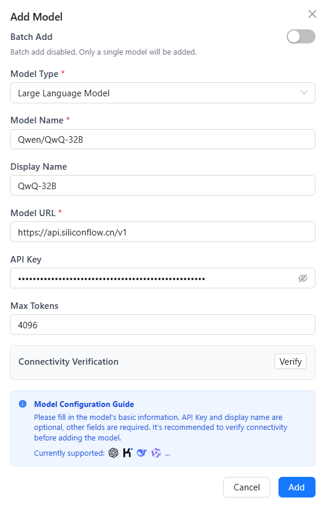

#### Batch Add Models

Use batch import to speed up onboarding:

1. Enable the **Batch Add Models** toggle in the dialog.
2. Select a **model provider**.
3. Choose the **model type** (LLM/Embedding/VLM/Rerank/STT/TTS).
4. Enter the **API Key** (required).
5. Click **Fetch Models** to retrieve the provider list.
6. Toggle on the models you need (disabled by default).
7. Click **Add** to save every selected model at once.

  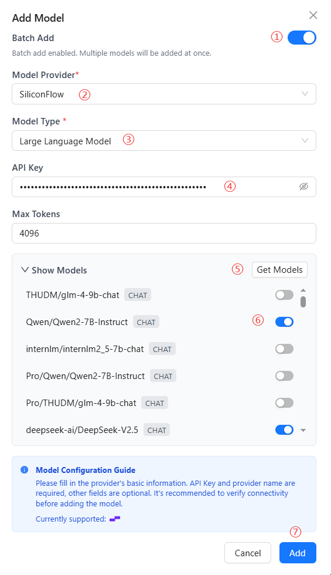

### 🔧 Edit Custom Models

Modify or delete models anytime:

1. Click **Edit Custom Models**.
2. Select the model type (LLM/Embedding/VLM/Rerank/STT/TTS).
3. Choose between batch editing or single-model editing.
4. For batch edits, toggle models on/off or click **Edit Config** in the upper-right to change settings in bulk.
5. For single models, click the trash icon 🗑️ to delete, or click the model name to open the edit dialog.

  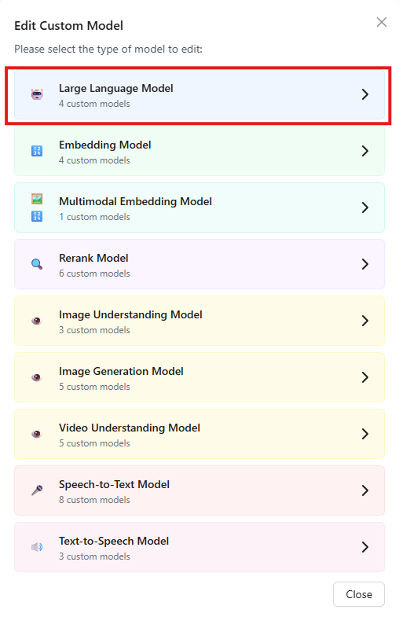
  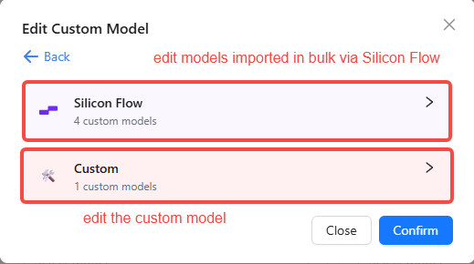

 

  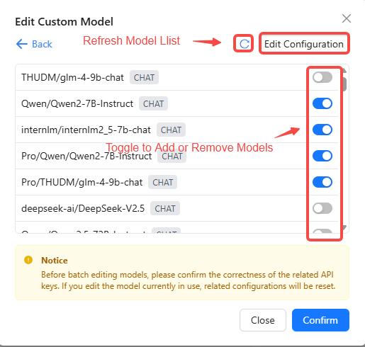
  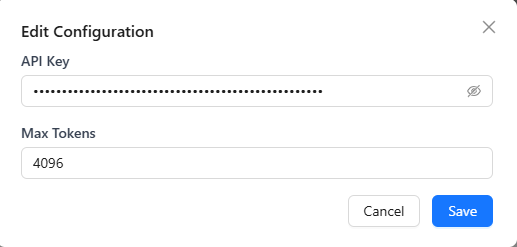

 

  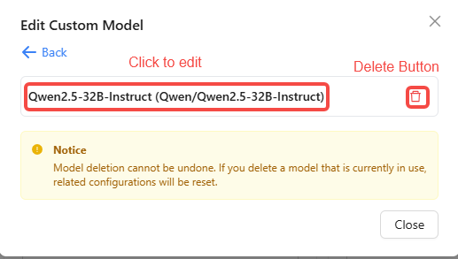
  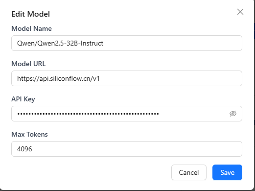

### ⚙️ Configure System Models

After adding models, assign the platform-level defaults. These models handle system tasks such as title generation, real-time file reading, and multimodal parsing. Individual agents can still choose their own run-time models.

#### Base Model

- Used for core platform features (title generation, real-time file access, basic text processing).
- Choose any added large language model from the dropdown.

#### Large Language Model

The large language model serves as the system's core reasoning engine, responsible for processing users' natural language requests, generating responses, executing code, analyzing data, and other complex tasks. Choosing an appropriate large language model can significantly improve the agent's conversational quality and task-handling capabilities.

- Click the Large Language Model dropdown and select one from the added large language models.

#### Embedding Model

Embedding models are primarily used for vectorization processing of text, images, and other data in knowledge bases, forming the foundation for efficient retrieval and semantic understanding. Configuring an appropriate embedding model can significantly improve knowledge base search accuracy and multimodal data processing capabilities.

- Click the embedding model dropdown to select one from the added embedding models.
- Embedding model configuration affects the stable operation of knowledge bases.

Choose appropriate document chunk size and chunks per request based on model capabilities. Smaller chunks provide more stability, but may affect file parsing quality.

  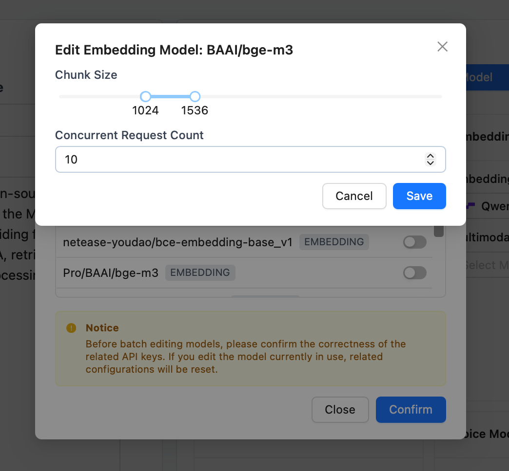

#### Rerank Model

The rerank model performs semantic matching and scoring on initially filtered documents to ensure the most relevant answers are ranked first, improving retrieval accuracy and efficiency. Configuring an appropriate rerank model can significantly improve knowledge base retrieval effectiveness.

- Click the Rerank Model dropdown to select one from the added rerank models.

#### Multimodal Models

Multimodal models combine visual and language capabilities to handle complex scenarios containing text, images, and other types of information.

- **Image Understanding Model**: Can analyze and understand image content, extract key information, and answer questions related to images. Click the Image Understanding Model dropdown to select one from the added models.
- **Image Generation Model**: Can generate images based on text descriptions, supporting creative design, content creation, and other scenarios. Click the Image Generation Model dropdown to select one from the added models.
- **Video Understanding Model**: Can analyze and understand video content, extract key information, generate summaries, or answer questions related to videos. Click the Video Understanding Model dropdown to select one from the added models.

#### Voice Models

Voice models enable bidirectional conversion between speech and text, supporting voice interaction scenarios.

- **Text-to-Speech Model**: Converts text content into natural, fluent speech output in real-time, enabling the system to interact with users in a near-human voice. With low latency and high-fidelity speech generation capabilities, it ensures a smooth and natural auditory experience during conversations. Click the Text-to-Speech Model dropdown to select one from the added models.
- **Speech-to-Text Model**: Converts user voice input into text in real-time, enabling accurate understanding and parsing of voice commands and natural language. With high-precision speech transcription and noise robustness, it ensures stable recognition of user intent even in complex environments. Click the Speech-to-Text Model dropdown to select one from the added models.

  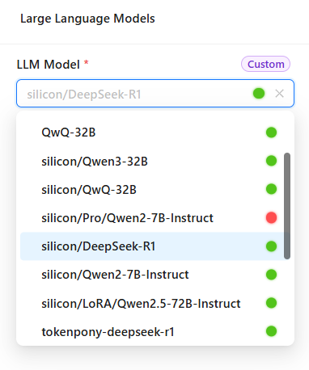
  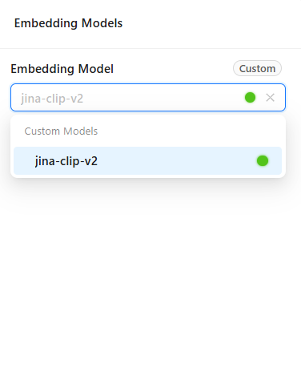
  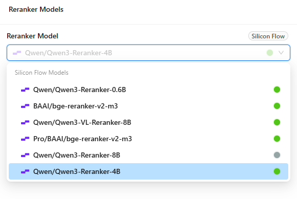
  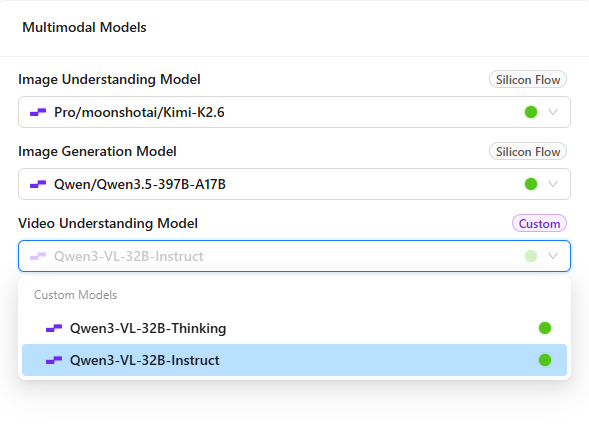
  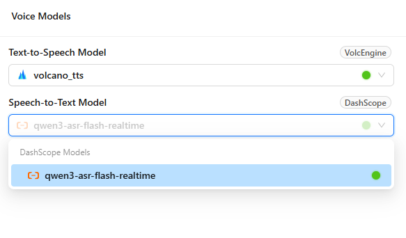

### ✅ Check Model Connectivity

Run regular connectivity checks to keep the platform healthy:

1. Click **Check Model Connectivity**.
2. Nexent tests every configured system model automatically.

Status indicators:

- 🔵 **Blue dot** – Checking in progress.
- 🔴 **Red dot** – Connection failed; review configuration or network.
- 🟢 **Green dot** – Connection is healthy.

Troubleshooting tips:

- Confirm network stability.
- Ensure the API key is valid and not expired.
- Check the provider's service status.
- Review firewall and security policies.

### 🤖 Supported Providers

#### Large Language Models

Nexent supports any **OpenAI-compatible** provider, including:

- [SiliconFlow](https://siliconflow.cn/)
- [Ali Bailian](https://bailian.console.aliyun.com/)
- [TokenPony](https://www.tokenpony.cn/)
- [DeepSeek](https://platform.deepseek.com/)
- [OpenAI](https://platform.openai.com/)
- [Anthropic](https://console.anthropic.com/)
- [Moonshot](https://platform.moonshot.cn/)

Getting started:

1. Sign up at the provider's portal.
2. Create and copy an API key.
3. Locate the API endpoint (usually ending with `/v1`).
4. Click **Add Custom Model** in Nexent and fill in the required fields.

#### Multimodal Models

Use the same API key and URL as LLMs but specify a multimodal model name, for example **Qwen/Qwen2.5-VL-32B-Instruct** on SiliconFlow.

#### Embedding Models

Use the same API key as LLMs but typically a different endpoint (often `/v1/embeddings`), for example **BAAI/bge-m3** from SiliconFlow.

#### Rerank Models

Use the same API key as LLMs but typically a different endpoint (often `/v1/rerank`).

#### Speech Models

Currently supports VolcEngine Voice and Aliyun Bailian voice models. VolcEngine requires `appid` and `token`, while Aliyun Bailian uses the same API key as the large language model.

**VolcEngine**
- **Website**: [volcengine.com/product/voice-tech](https://www.volcengine.com/product/voice-tech)
- **Free tier**: Available for individual use
- **Highlights**: High-quality Chinese/English TTS
- Recommended models: **Doubao Text-to-Speech Model 2.0** and **Large Model Streaming Speech Recognition**
- **Getting started**:

  1. Register a VolcEngine account.
  2. Enable the Voice Technology service.
  3. Create an app and generate `appid` and `token`.
  4. Configure the TTS/STT settings in the Add Model page.

**Aliyun Bailian**
- **Website**: [aliyun.com/benefit/scene/voice](https://www.aliyun.com/benefit/scene/voice)
- Recommended models: **Qwen3-TTS-Instruct-Flash-Realtime / Qwen3-TTS-Flash-Realtime** and **Qwen3-ASR-Flash-Realtime**
- **Getting started**:

  1. Register an Aliyun account.
  2. Enable the Qwen real-time voice service.
  3. Create an app and generate an API Key.
  4. Configure the TTS/STT settings in the Add Model page.

## 💡 Need Help

If you run into provider issues:

1. Review the provider's documentation.
2. Check API key permissions and quotas.
3. Test with the provider's official samples.
4. Ask the community in our [Discord server](https://discord.gg/tb5H3S3wyv).

## 🚀 Next Steps

After closing the Model Configuration flow, continue with:

1. **[Knowledge Base](./knowledge-configuration)** – Create and manage knowledge bases.
2. **[Agent Configuration](./agent-configuration)** – Build and configure agents.

Need help? Check the **[FAQ](../../quick-start/faq)** or open a thread in [GitHub Discussions](https://github.com/ModelEngine-Group/nexent/discussions).
