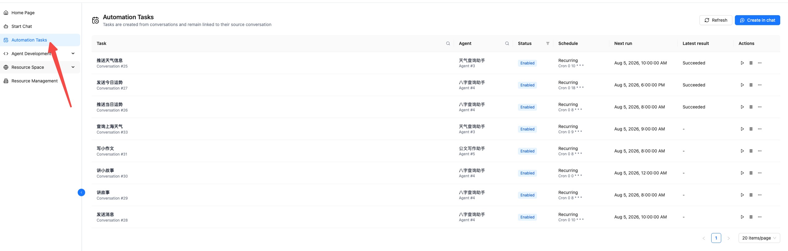
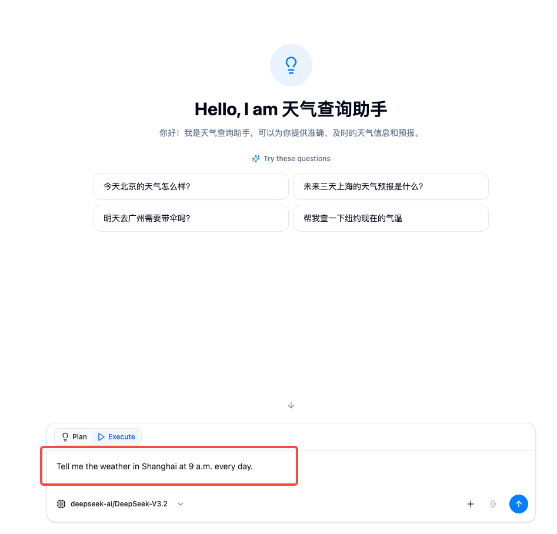
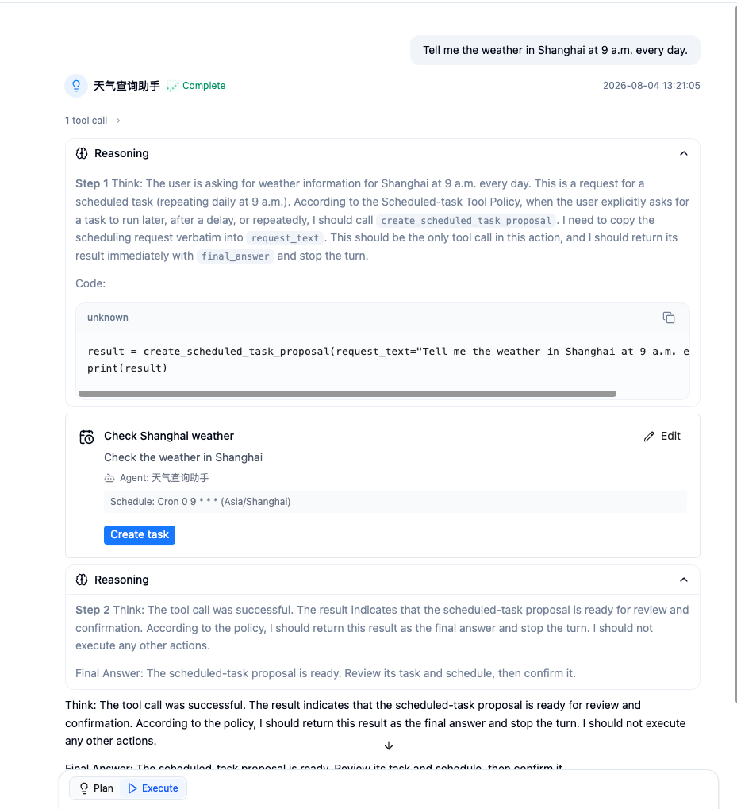
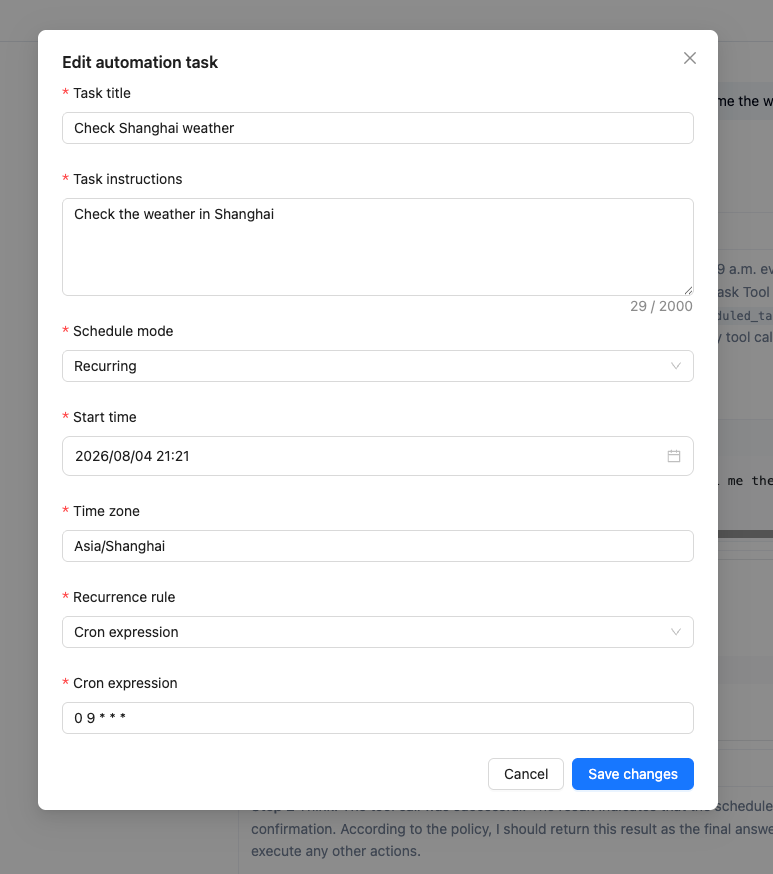
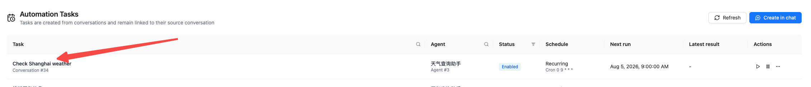
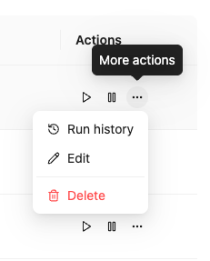
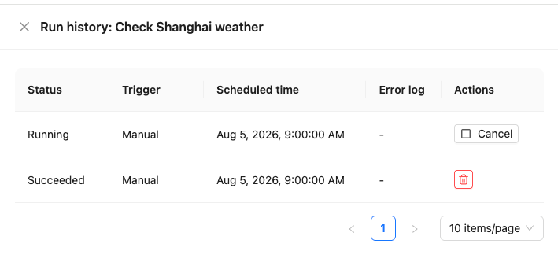

# Automation Tasks

Automation tasks let an agent perform work at a future time or on a recurring schedule. Describe what to do and when to do it in a conversation. Nexent generates a pending task proposal for your review; after you confirm it, the task remains linked to that conversation and writes every run result back to it.

For example, you can ask an agent to:

- summarize project progress every day at 9:00 AM;
- check service health every 30 minutes;
- generate a weekly report tomorrow at 3:00 PM.

> **Important:** An automation proposal only creates a schedule. It does not perform the requested business action immediately. The task starts running on its schedule only after you confirm its creation.

## Before You Start

Before creating a task, make sure that:

1. a working language model is configured under [Model Configuration](./agent-development/model-configuration);
2. an agent is created and saved under [Agent Development](./agent-development);
3. the agent has the tools, knowledge bases, Skills, memory, or other agents required by the task;
4. you can access the conversation used to create the task.

If a required capability is missing, the proposal asks you to configure the agent before the task can be created.

## Create an Automation Task

### 1. Open the Creation Entry

Select **Automation Tasks** in the left navigation, then click **Create in chat** in the upper-right corner. Nexent opens a new conversation.

You can also open [Start Chat](./start-chat) directly, select an agent, and submit a scheduled request.

<div style="display: flex; justify-content: center;">
  
</div>

### 2. Select an Agent and Describe the Task

Select the agent that should perform the task. In the same message, specify:

- **Business action:** what one run should accomplish;
- **Execution time:** a clear future date and time for a one-time task;
- **Recurrence:** a fixed interval or calendar schedule for a recurring task;
- **Time zone:** specify an IANA time zone such as `Asia/Shanghai` or `UTC` when it differs from the default;
- **End condition:** include an end time or maximum run count when needed.

Recommended wording:

```text
Every day at 9:00 AM, summarize yesterday's project progress and list the issues that need attention.
```

One-time example:

```text
Generate this week's project report tomorrow at 3:00 PM.
```

Fixed-interval example:

```text
Check the service status every 30 minutes and list any unhealthy services.
```

If the request is missing the business action, date, time, or recurrence, the agent asks for the most important missing detail. Immediate requests, questions about data at a particular time, and requests that only explain a time expression are not treated as automation tasks.

<div style="display: flex; justify-content: center;">
  
</div>

### 3. Review the Proposal

When Nexent detects an automation request, it displays a task proposal in the conversation. Review the following fields:

- **Task title:** the name shown in the task list;
- **Task instructions:** the single-run instruction executed on every trigger;
- **Agent:** the agent that will perform the task;
- **Schedule:** one-time or recurring mode, start time, time zone, and recurrence rule;
- **Capability status:** whether the agent currently has the required capabilities.

Nexent separates phrases such as “every day at 9:00 AM” from the task instructions and saves them in the schedule. This is expected—the instructions describe one run, while the schedule controls when it runs.

<div style="display: flex; justify-content: center;">
  
</div>

### 4. Edit the Proposal

Click **Edit** in the upper-right corner of the proposal card to change:

- task title;
- task instructions;
- schedule mode: run once or recurring;
- start time;
- time zone;
- recurrence rule: a Cron expression or fixed interval.

Fixed intervals are entered in seconds. The page and backend validate the minimum interval according to the deployment settings. Cron uses the standard five-field format:

```text
minute hour day month weekday
```

Common examples:

| Requirement | Cron expression |
| --- | --- |
| Every day at 9:00 AM | `0 9 * * *` |
| Every weekday at 6:30 PM | `30 18 * * 1-5` |
| At the start of every hour | `0 * * * *` |
| At 9:00 AM on the first day of every month | `0 9 1 * *` |

Cron is evaluated in the time zone shown in the proposal. A one-time execution time must be in the future.

<div style="display: flex; justify-content: center;">
  
</div>

### 5. Confirm Creation

After verifying the proposal, click **Create task**. The proposal card displays the task ID after creation succeeds. Return to **Automation Tasks** to find the new task in the list; click its name to open the linked conversation.

If the proposal reports missing capabilities, click **Configure agent**, add the required capabilities, then return to the conversation and create the task again. One conversation can have only one active automation task. Start a new conversation when you need another task.

<div style="display: flex; justify-content: center;">
  
</div>

## Manage Automation Tasks

Open **Automation Tasks** from the left navigation to see tasks created by the current user. The list shows:

- task name and linked conversation;
- executing agent;
- current status;
- one-time or recurring schedule;
- next run time;
- latest run result.

Click a task name to open its linked conversation. You can filter by task name, agent name, and status, and use pagination or refresh to update the list.


### Run Now

Click **Run now** in the Actions column to start a manual run without waiting for the schedule. A successful manual run does not change the next scheduled run of a recurring task.

The linked conversation cannot run multiple agent jobs at the same time. If an agent run or automation run is already active in that conversation, the new run is skipped and appears as **Skipped** in run history.

### Pause and Resume

- Click **Pause** to stop future scheduled triggers;
- Click **Resume** to calculate the next run from the current time and the existing schedule;
- A recurring task is **Paused by system** after five consecutive failures or timeouts. Fix the agent configuration or task instructions, then resume it manually;
- A completed one-time task has no future schedule and cannot be resumed. Create a new task or use **Run now** when you need to run it again.

### Use the More Actions Menu

The **More actions** menu provides the **Run history**, **Edit**, and **Delete** entries.

<div style="display: flex; justify-content: center;">
  
</div>

### Edit a Task

Select **More actions** > **Edit** to change:

- task name;
- task instructions;
- task type and first run time;
- recurrence rule, fixed interval, or Cron expression;
- timeout for one run.

The executing agent cannot be changed in this dialog. To use a different agent, create a new task from a new conversation.

The timeout is entered in seconds. Its default is 1,800 seconds (30 minutes), and the current page accepts a minimum of 60 seconds. A run that exceeds the timeout is marked **Timed out**.

### View Run History

Select **More actions** > **Run history** to view:

- run status;
- trigger type: manual or scheduled;
- scheduled time;
- error log;
- available run actions.

You can cancel a **Queued** or **Running** run. A finished run record can be deleted without deleting the task. Deleted run records cannot be recovered.

<div style="display: flex; justify-content: center;">
  
</div>

### Delete a Task

Select **More actions** > **Delete** and confirm to stop all future scheduled runs. The linked conversation and its message history remain available. If the task is running, Nexent also requests cancellation of the active run.

Conversely, deleting the linked conversation also deletes its automation task and cancels active runs.

## Status Reference

### Task Statuses

| Status | Meaning |
| --- | --- |
| Enabled | The task is waiting for its next scheduled run |
| Running | A run is currently in progress |
| Paused | The user paused the task |
| Paused by system | The system paused the task after repeated failures, timeouts, or an invalid schedule |
| Completed | A one-time task finished, or a recurring task reached its end condition |

### Run Statuses

| Status | Meaning |
| --- | --- |
| Queued | The run was created and is waiting to start |
| Running | The agent is executing the task |
| Succeeded | The run completed successfully |
| Failed | The run failed because of a capability, configuration, or execution error |
| Skipped | Another run was already active in the linked conversation |
| Canceled | The user canceled the run |
| Timed out | The run exceeded the task timeout |

## Limitations and Notes

- **One task per conversation:** A conversation can have only one active automation task. Use separate conversations for separate tasks.
- **Temporary attachments are not persistent inputs:** The current version cannot use an attachment from the proposal message as long-term automation input. Describe a stable data source instead, or configure a knowledge base or tool on the agent.
- **Dependencies are checked before every run:** A run fails if a required tool, knowledge base, Skill, memory configuration, or other agent has been deleted or is unavailable. Check the error log in run history.
- **Results are written to the linked conversation:** Each run's instruction and output are saved in the conversation, which you can open by clicking the task name.
- **Missed recurring runs are not replayed:** Recurring triggers missed while the service is unavailable are skipped. After recovery, Nexent calculates the next future run.
- **Tasks are visible to their creator:** In normal multi-user mode, task lists and run histories are isolated by tenant and creating user.

## Frequently Asked Questions

### Why was no proposal generated?

Make sure the message includes both a specific business action and a future time or recurrence. A vague request such as “keep an eye on this regularly” is missing an actionable task and schedule. Immediate requests do not create automation proposals.

### Why can't I create a task with an attachment?

A temporary attachment is not a reliable input for future runs. Put the content in a knowledge base or another stable data source, configure it on the agent, then describe what the task should process.

### Why can't the task be created?

Common causes include a time in the past, incomplete time or recurrence details, an invalid Cron expression, an interval below the system limit, missing agent capabilities, or another active task already linked to the conversation.

### Why is a run marked Skipped?

An agent run or another automation run was already active in the linked conversation. Nexent avoids concurrent writes to the same conversation and does not start the new run.

### Why is the task Paused by system?

A recurring task is automatically paused after five consecutive failures or timeouts, or when its schedule is invalid during recovery. Review run history and the latest error, fix the agent capability, model, tool, or task instructions, then resume the task.

### Does deleting a task delete its conversation?

No. Deleting a task stops future runs but keeps the linked conversation. However, deleting the linked conversation also deletes its automation task.

## Next Steps

- [Start Chat](./start-chat): select an agent and create an automation task in natural language.
- [Agent Development](./agent-development): configure the model, tools, knowledge bases, Skills, and memory required by the task.
- [Model Configuration](./agent-development/model-configuration): verify the language model used by the task.
