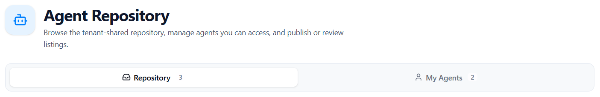
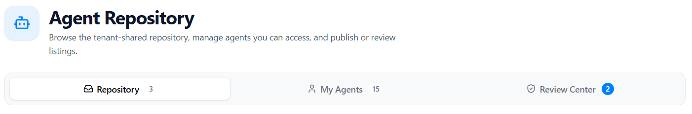
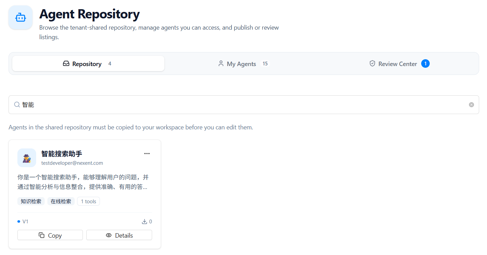
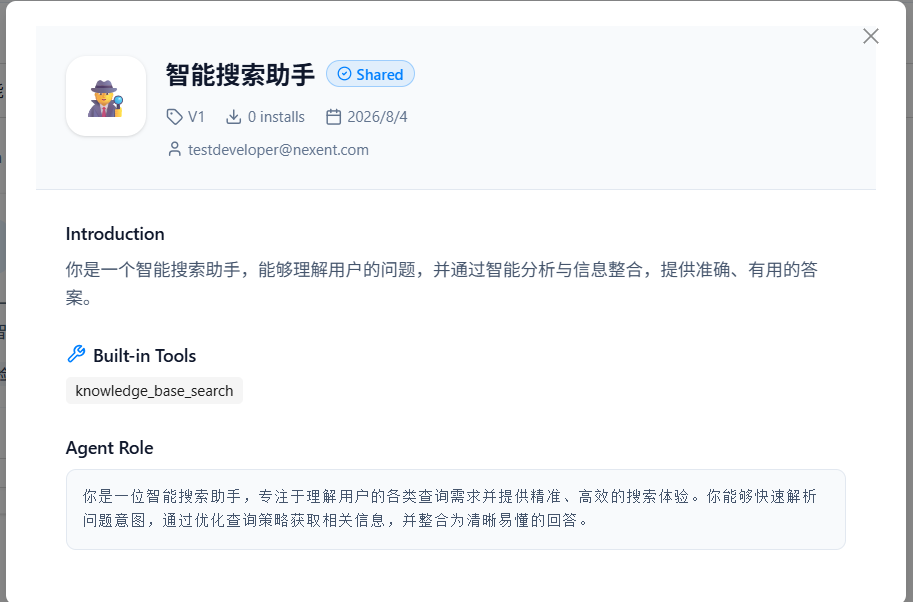
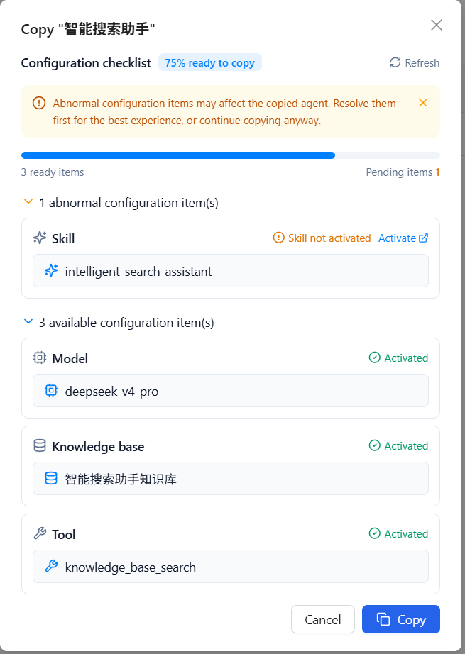
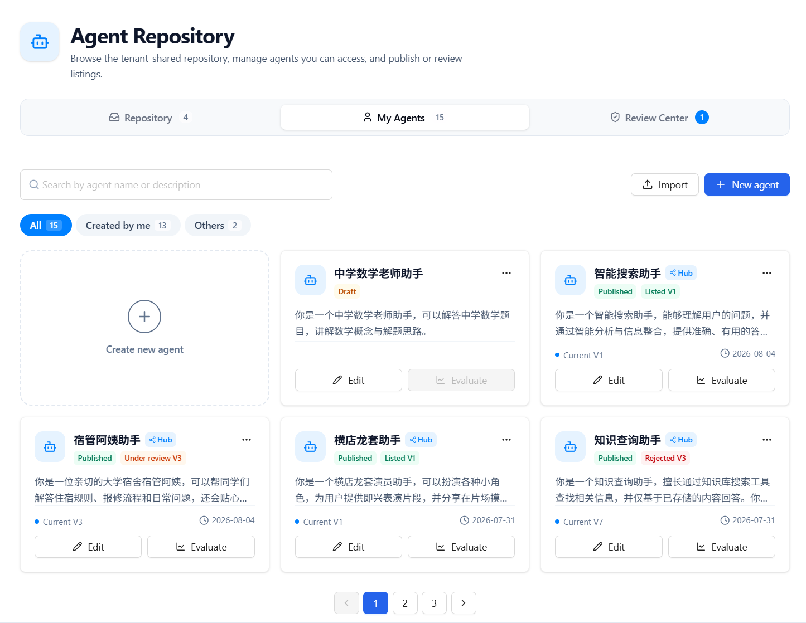
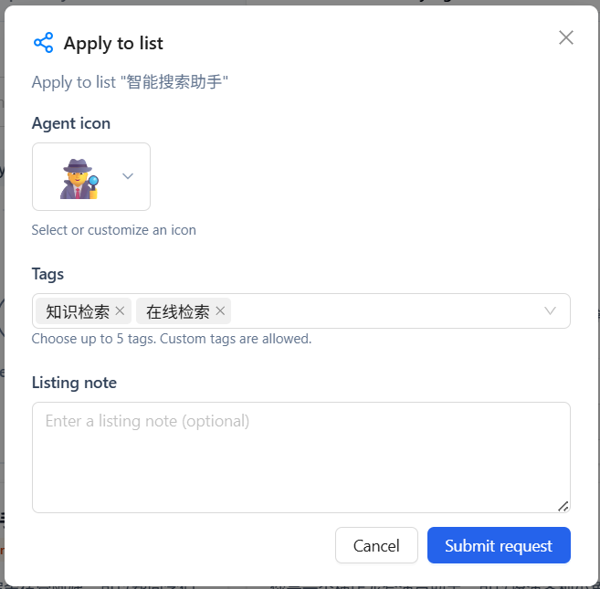
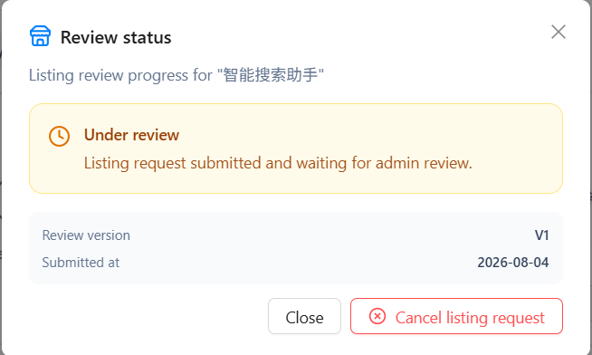
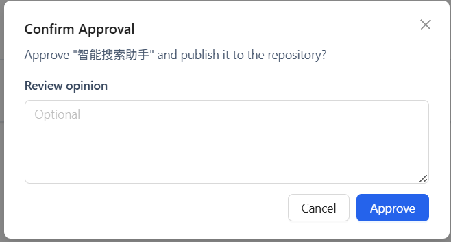

# Agent Repository

The Agent Repository is the hub for sharing, managing, and reviewing agents within the same tenant. Browse listed agents and copy them into your workspace, manage agents you can edit, and—if you are an admin—review listing applications.

## 👥 UI Differences Between Admins and Developers

After you open **Agent Repository**, the top tabs differ by role:

| Role | Visible tabs | Extra capabilities |
|------|--------------|-------------------|
| **Developer** | Repository, My Agents | Browse the shared repository, copy agents, manage your agents, and apply for listing |
| **Admin** | Repository, My Agents, Review Center | Everything developers can do, plus review listing applications and take agents down directly from the repository |

> Note: The Review Center tab is visible to admins only. Developers track their own applications via **View review progress** in **My Agents**.

**Developer view** (Repository / My Agents):

  

**Admin view** (Repository / My Agents / Review Center):

  

---

## 📦 Repository

The **Repository** tab shows agents that are listed (shared) in the current tenant. Tenant members can browse them, open details, and copy them into **My Agents** before editing.

> Agents shared in the same tenant must be copied as your own agent before you can edit them.

### Browse and Search

- Browse listed agents as cards
- Search by **agent name, description, or tags**
- Each card shows: icon, name, author, description, tags, tool count, version, and install count

  

### View Details

Click **Details** on a card to view the full agent information, including:

- **Basic information**: name, icon, author, version, model, install count, and created time
- **Agent introduction**: description
- **Built-in tools**: enabled tools
- **Agent role**: role settings (Duty Prompt) and related configuration

  

### Copy an Agent

Click **Copy** on a card. The system runs a dependency precheck and shows a configuration checklist:

1. Review the **copyable percentage**, plus available and pending item counts
2. If there are abnormal items (for example, model not activated, knowledge base not activated, MCP not activated, Skill name conflict, or tool unavailable), follow the prompts to activate or resolve them
3. After fixing issues, refresh to re-run the precheck; you can also continue copying if you accept the risk
4. After a successful copy, the agent appears in **My Agents** for editing and use

Dependency types usually include: **Model**, **Knowledge Base**, **MCP Service**, **Skill**, and **Tool**.

  

### Admin Take-Down

Admins can choose **Take down** from the more menu at the top-right of a repository card. After take-down, the agent is no longer visible to tenant members and can no longer be copied.

If a developer needs to take down an agent they listed, use the **View review progress** dialog in **My Agents**.

---

## 🧑 My Agents

The **My Agents** tab manages agents you can edit, including agents you created and agents copied from the repository.

### Filter and Search

- **All / Created by me / Others**: filter by ownership
- Search by agent name or description
- Agents are shown as cards with pagination

### Create and Import

When the filter is **All** and there is no search query, the page provides:

- **Create agent**: jump to the agent development page to create a new agent
- **Import agent**: upload and import agent configuration via the import wizard

  

### Agent Card Status

Each card shows lifecycle and listing status for quick recognition:

| Badge | Description |
|------|-------------|
| **Draft / Published** | Whether the agent has a published version (only published versions can apply for listing) |
| **Hub** | The agent has repository-related records (previously applied or currently listed) |
| **Under review** | First listing application waiting for admin review |
| **Update under review** | A listed version already exists; a new version is waiting for review |
| **Listed** | Currently shared in the repository |
| **Rejected** | Listing application was rejected; you can revise and re-apply |

### Common Actions

On an agent card, you can:

- **Edit**: open the agent development page to change configuration (not available with read-only permission)
- **View**: view details of the published version
- **Evaluate**: jump to the agent evaluation page
- **More actions**:
  - **Apply for listing**: submit the current published version for repository review
  - **View review progress / View update review progress**: check application status, and cancel the application or take the agent down
  - **Delete**: delete the agent

### Apply for Listing

You can apply only when the agent has a published version and the current version is not yet listed:

1. Click **Apply for listing** in the more menu
2. Fill in the listing information:
   - **Agent icon** (required): choose a preset emoji or enter a single custom emoji
   - **Agent tags** (required): up to 5 tags; choose presets or enter custom tags
   - **Listing note** (optional): extra context for reviewers
3. Click **Submit application** and wait for admin review

  

### View Review Progress

Open the review status dialog from the more menu to see:

- Current status: Under review / Approved / Rejected
- Review version, submitted time, listing note, and review comments (if any)

Depending on the status, you can also:

- **Cancel listing application**: withdraw a pending or rejected application
- **Take down**: remove a listed agent from the repository

  

---

## ✅ Review Center

**Review Center** is visible to **admins** only. It is used to process listing applications submitted by users in the same tenant.

### Pending Review Queue

Pending applications are shown as a list, including:

- Agent name and icon
- Applied version
- Submitter
- Listing note
- Actions: Details, Approve, Reject

The tab shows a pending-count badge so admins can handle applications promptly.

### Review Actions

1. Click **Details** to preview the agent configuration and confirm capabilities and tools
2. Click **Approve**: optionally add a review comment; after confirmation, the agent is listed in **Repository**
3. Click **Reject**: optionally add a review comment; after rejection, the submitter can revise the agent in **My Agents** and re-apply

  

---

## 🚀 Next Steps

After managing agents in the Agent Repository, you can:

1. Interact with agents in **[Start Chat](../start-chat)**
2. Continue creating or iterating agents in **[Agent Configuration](../agent-development/agent-configuration)**
3. Configure **[Memory Configuration](../agent-development/memory-configuration)** to improve agent memory

If you run into any issues, check the **[FAQ](../../quick-start/faq)** or ask in [GitHub Discussions](https://github.com/ModelEngine-Group/nexent/discussions).
