# MCP Repository

The MCP Repository is the hub for sharing, managing, and reviewing MCP (Model Context Protocol) services within a tenant. You can browse MCP services published to the community and install them with one click, manage the MCP services you have permission to edit, and (as an administrator) review publication applications.

## 👥 Interface Differences for Administrators and Developers

After entering **MCP Repository**, the tabs shown at the top of the page vary by role:

| Role | Visible Tabs | Available Capabilities |
|------|--------------|------------------------|
| **Developer** | Repository, My MCP | Browse the shared repository, install MCP services, add MCP services, manage your own services and apply to publish them |
| **Administrator** | Repository, My MCP, Review Center | In addition to developer capabilities, review publication applications and delist services directly from the repository |

> Tip: The Review Center tab is only visible to administrators. Developers can track the result of their applications via **View Review Progress** in the upper-right corner of the MCP card in **My MCP**.

**Developer view** (Repository / My MCP):

  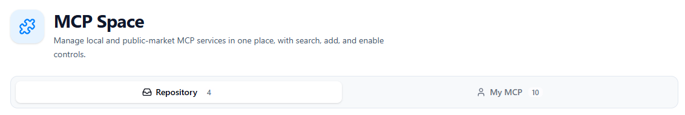

**Administrator view** (Repository / My MCP / Review Center):

  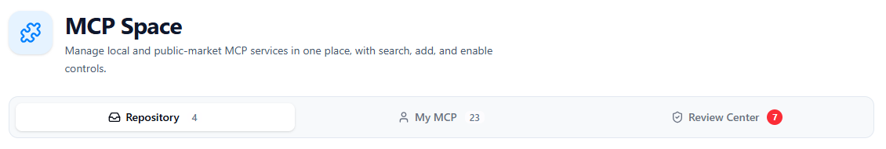

---

## 📦 Repository

The **Repository** tab displays the MCP services that have been published (shared) within the tenant. You can browse them, view details, and install them into **My MCP** with one click.

### Browsing and Searching

- Published MCP services are displayed as cards
- Search by **name or tags**
- Each card shows: name, description, tags, and install count

  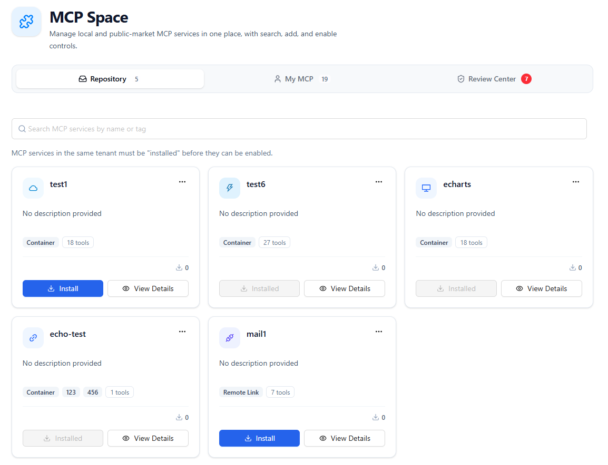

### Viewing Details

Click the **View Details** button on a card to view the complete information about the MCP service.

  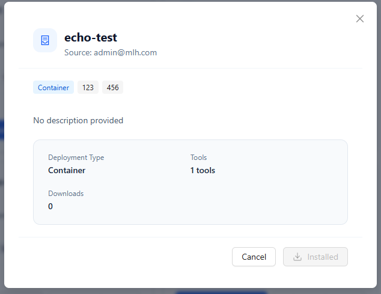

### Installing a Service

Click **Install** on a card, fill in the required information, and click **Confirm** to add it. The system automatically installs and configures the service. Installed services show an **Installed** status, avoiding duplicate imports.

After installation, the service appears in **My MCP**, and the tools it provides are automatically synced to the agent's tool selection list.

  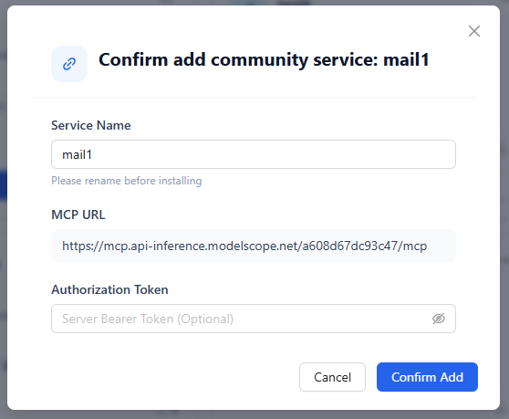

### Administrators: Delisting Services

Administrators can directly **delist** a published service from the repository card. After delisting, the service is no longer visible to tenant members and can no longer be installed.

If a developer needs to delist their own published service, they can do so in **My MCP** through the **View Review Progress** dialog.

  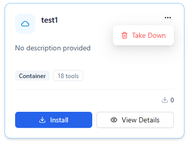

---

## 🧑 My MCP

The **My MCP** tab is used to manage the MCP services you have permission to edit, including services you created yourself, services to which tenant members have granted you edit permission, and services installed from the repository.

### Adding a Service

Click **Add MCP Service** to open the add dialog, which supports multiple integration sources.

#### Custom Add

Four deployment types are supported:

| Deployment Type | Use Case | Key Configuration |
|-----------------|----------|-------------------|
| **Remote URL** | An independently deployed MCP service (HTTP / SSE) | Service URL, Authorization Token, custom request headers |
| **Container** | An MCP service running as a container | Container configuration JSON (mcpServers), port number |
| **API** | An HTTP API described by an OpenAPI spec | Service URL, OpenAPI JSON (required, format auto-validated) |
| **Local Image Upload** | An existing Docker image (.tar file) | Upload .tar image file, port number |

> Local image upload is only shown after an administrator enables the **Upload Image** feature in the deployment.

#### Port Notes

Port behavior is automatically determined by how Nexent itself is deployed:

- **Docker / Kubernetes deployment**: Container ports use a unified default port, automatically allocated and locked by the system, and cannot be modified. Multiple MCP services can reuse the same port without conflicting.
- **Local deployment**: The port is set by the user. A **Recommended Port** button fetches an available port with one click, and port occupancy is automatically detected.

#### Importing from an External MCP Market

Browse the community-maintained external MCP market, choose **Remote** or **Container** as the integration method, fill in the required environment variable parameters, and import with one click.

  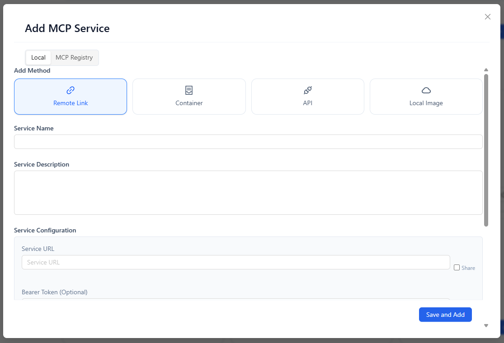

### Service Card Statuses

Each card shows runtime and publication statuses:

| Indicator | Description |
|-----------|-------------|
| **Enabled** | Whether the service is enabled; tools from a disabled service no longer appear in the agent tool selection |
| **Under Review** | The publication application is pending administrator review |
| **Published** | Currently shared in the repository |
| **Rejected** | The publication application was not approved; you can modify and re-apply |

  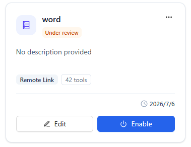

### Common Operations

In the service card or detail dialog, you can:

- **Edit**: Modify the name, description, URL, Authorization Token, tags, and other content
- **Enable / Disable**: Control the service state with a toggle
- **View Tool List**: View all tools provided by the service
- **Container Management**: View container logs and the configuration JSON used at creation time (containerized services)

  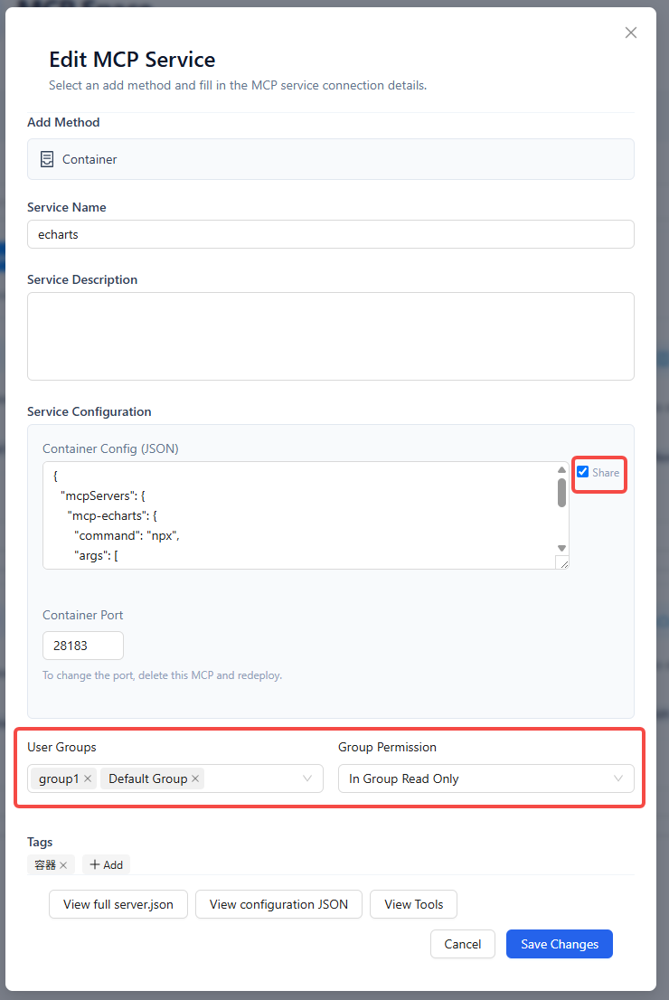

- **More Actions**:
  - **Apply to Publish**: Submit the service to the repository for review
  - **Connectivity Check**: Run a connection test to check the MCP service connection status
  - **View Review Progress**: View the application status, and cancel the application or delist the service
  - **Delete**: Delete the service; containerized services also have their container resources cleaned up

  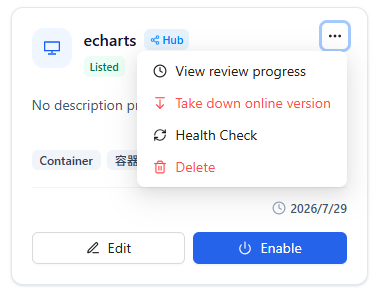

### Sharing Configuration

When adding or editing a service, you can check user groups and user permissions to share the service configuration with other members, making it easy to reuse within the team.

### Applying to Publish

1. On the create or edit page, check the MCP service configuration fields (service URL, Authorization Token, custom request headers, container configuration). The checked configuration will be shared to the repository.
2. In the More menu, click **Apply to Publish**
3. Fill in the publication information:
   - **Publication Notes** (optional): A note to the reviewer
4. Click **Submit Application** and wait for the administrator to review.

> You must check at least one shared configuration field before applying to publish.

### Viewing Review Progress

Open the review status dialog from the More menu to see:

- Current status: Under Review / Approved / Rejected
- Review comments (if any)

Depending on the status, you can also:

- **Cancel Publication Application**: Withdraw a pending or rejected application
- **Delist**: Withdraw a published service from the repository

  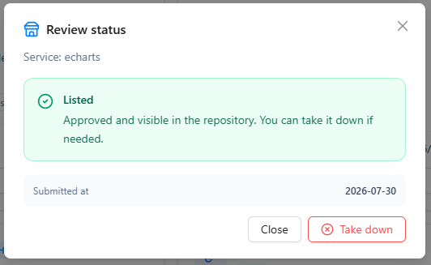

---

## ✅ Review Center

The **Review Center** is only visible to **administrators** and is used to process publication applications submitted by users.

### Pending Review Queue

The page displays pending applications in a list, including:

- Service name and deployment method
- Submitter
- Publication notes
- Action buttons: Details, Approve, Reject

A badge on the tab shows the number of pending items, so administrators can handle them promptly.

### Review Actions

1. Click **Details** to preview the service configuration and confirm whether it is appropriate
2. Click **Approve**: Optionally fill in review comments; after confirmation, the service is published to the **Repository**
3. Click **Reject**: Optionally fill in review comments; after rejection, the submitter can modify and re-apply in **My MCP**

  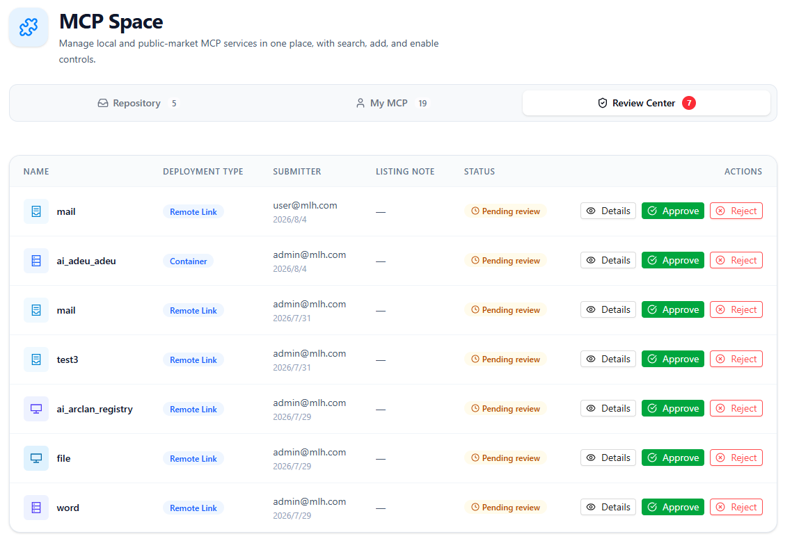

---

## 🚀 Next Steps

After managing your MCP services in the MCP Repository, you can:

1. Configure MCP tools for your agents in **[Agent Development](../agent-development)**
2. Experience agents calling MCP tools in **[Start Chat](../start-chat)**
3. Continue browsing **[Skill Repository](./skill-repository)** to learn how skills and MCP work together

If you encounter any issues while using Nexent, please refer to our **[FAQ](../../quick-start/faq)** or ask for support in [GitHub Discussions](https://github.com/ModelEngine-Group/nexent/discussions).
