# Start Chat

The Start Chat page is the primary entry point for interacting with agents. On this page, you can chat with agents, upload files and attachments, use voice input, manage conversation history, and complete tasks such as file processing, knowledge retrieval, and document generation.

## 1. Select an Agent

### 1. Open the Start Chat Home Page

When you open the Start Chat page, the agent list is displayed by default. You must select an agent before starting a conversation.

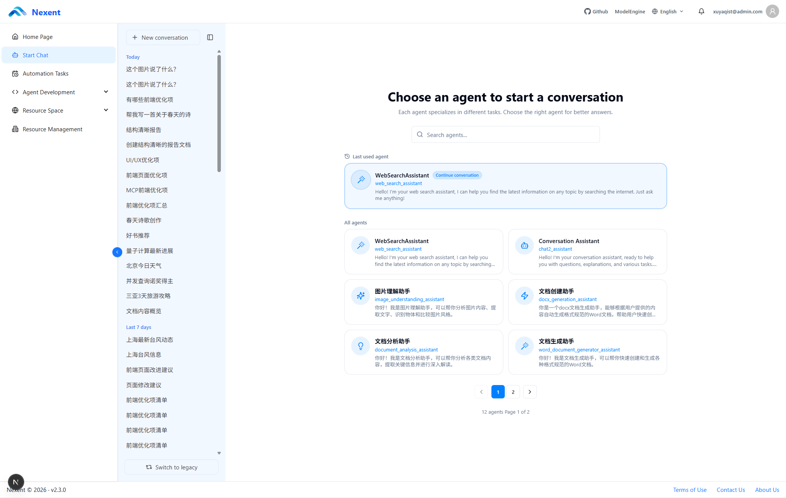

### 2. Select an Available Agent

Only agents that meet all of the following conditions appear on the Start Chat page:

- **Published**: The agent has been published.
- **Set as a primary agent**: The agent is configured as a primary agent.
- **Available to the current user**: The current user has permission to use the agent.

Each agent card displays the agent icon, display name, English identifier, and functional description or greeting.

You can search in real time by keyword, including the agent name, description, or developer. The system records recently used agents and provides quick access to them. The list is automatically paginated when it contains more than one page.

## 2. Agent Home Page

After selecting an agent, you are taken to its home page. The page mainly consists of the following areas:

- **Conversation history area on the left**: Manage conversation history.
- **Welcome area on the right**: Display agent information and example questions.
- **Input area at the bottom**: Enter questions, upload attachments, and select a conversation mode.

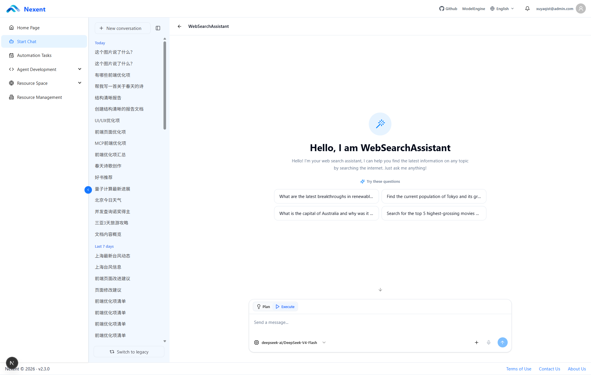

### 1. Conversation History Area

The left sidebar displays the conversation history for the current agent.

#### Create a New Conversation

- Click the **New Conversation** button at the top of the sidebar to create a conversation.
- New conversations use the currently selected agent by default.
- When starting a new task, create a new conversation to prevent previous context from affecting the task.

#### View the Conversation List

- View all historical conversations for the current agent.
- Conversations are sorted chronologically.
- Click an existing conversation to view it or continue asking questions.
- Conversation titles are generated automatically by the system.

#### Manage Conversation Records

The following conversation management operations are currently supported:

| Operation | Description |
| --- | --- |
| Rename conversation | Change the conversation title. |
| Delete conversation | Delete the conversation record. |
| Batch delete | Enter selection mode, select multiple conversations, and delete them together. |

> **Note**: Deletion cannot be undone. Batch deletion also cancels and removes automation tasks bound to the selected conversations. Confirm the number of selected conversations before continuing.

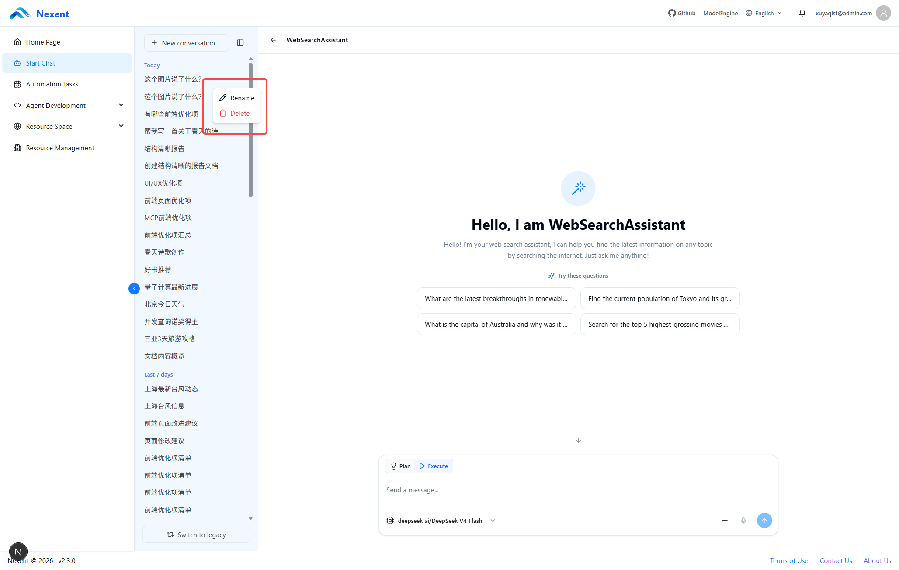

### 2. Agent Greeting and Example Questions

The center of the agent home page displays the agent's greeting, which introduces its purpose and capabilities, along with preset example questions. The agent developer configures the greeting and example questions on the agent configuration page. Clicking an example question automatically fills it into the input box. You can edit it before sending or send it directly.

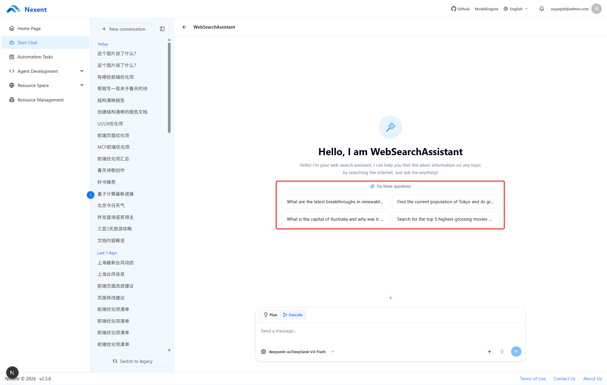

### 3. Input Box and Conversation Modes

The input area at the bottom is used to enter questions, upload attachments, use voice input, and send messages.

#### Execution Mode and Planning Mode

Two mode-switching buttons, **Execute** and **Plan**, are available above the input box.

- **Execution mode**: The agent enters the ReAct loop directly and continues until the task is complete or the maximum number of steps is reached. This mode is suitable for simple and well-defined questions.

- **Planning mode**: This mode is suitable for complex tasks. Before execution, the agent breaks the task into multiple ordered steps. A plan and the execution status of each step are displayed as cards above the input box. Step statuses include pending, in progress, completed, and skipped. A plan must contain at least 3 steps and no more than 8 steps. The agent executes the steps in order and automatically updates each status after the step is completed.

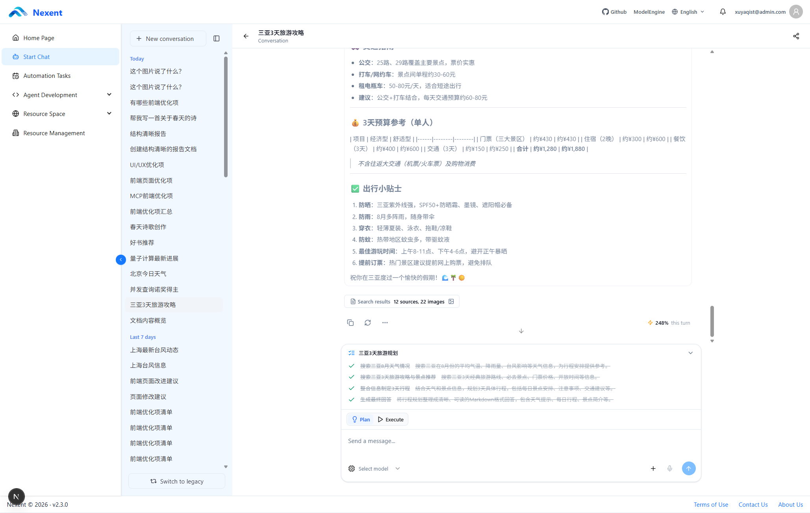

#### Select a Model

If multiple available models have been added on the agent configuration page, you can switch between them below the input box. The model selector displays only the models configured for the current agent.

#### Set Conversation Metadata

If the agent developer enabled **Allow Conversation Metadata** under **Run Strategy**, a **Metadata** button appears in the input area. Click it and enter a JSON object, for example:

```json
{
  "customer_id": "C-1024",
  "channel": "support"
}
```

- Metadata is bound to the current conversation and is used by subsequent agent runs in that conversation.
- It must be a JSON object and cannot exceed 64 KiB. Saving an empty object `{}` clears the stored Metadata.
- Metadata is visible to the model. Do not include passwords, access tokens, personal information, or other sensitive data.

#### Upload Attachments

You can upload attachments in the input box and ask the agent to analyze, summarize, or otherwise process their contents.

**Upload methods**:

- Click the file upload button on the right side of the input box.
- Drag a file directly into the input area.

**Supported file types**:

| Type | File formats |
| --- | --- |
| Images | `image/*` (JPG, PNG, GIF, and other formats) |
| Documents | PDF, Word (`.docx`), Excel (`.xlsx`), PowerPoint (`.pptx`), EPUB (`.epub`) |
| Text | Markdown (`.md`), plain text (`.txt`), JSON (`.json`), CSV (`.csv`), XML (`.xml`), HTML (`.html`) |
| Other | Other file formats are processed as regular attachments. |

**File quantity and size limits**:

- You can upload up to **50 attachments** in a single message.
- Each attachment can be up to **100 MB**. Files exceeding this limit are rejected.
- Deployment administrators can configure a lower front-end upload limit. If the limit shown on the page is lower than 100 MB, follow the limit shown in the current environment.

> **Note**:
>
> - The parsing capabilities required for different file types depend on the agent configuration.
> - Image files require the agent to have a vision model and image parsing tools configured.
> - Document files require the corresponding document parsing tools to be configured for the agent.

**Using attachment content in a conversation**: Uploaded attachments are sent to the agent as context. The agent can read and analyze their contents and use them to answer questions or perform tasks.


#### Voice Input

You can use the microphone icon to enter a voice question.

**Prerequisites**:

- Speech recognition (STT) must be enabled in the system configuration.
- The first time you use voice input, you must authorize the browser to access your microphone.

**Procedure**:

1. Click the microphone button in the lower-right corner of the input box.
2. If this is your first time using voice input, the browser requests microphone permission. Click **Allow**.
3. Clearly speak your question.
4. The system converts your speech to text in real time and displays it in the input box.
5. Review and edit the recognized text.
6. Click the Send button or press Enter to send the message.

> **Tip**: For better speech recognition, use voice input in a quiet environment and articulate clearly.

#### Send Messages

**Sending methods**:

- Click the Send button on the right side of the input box.
- Press the Enter key on your keyboard.

**Keyboard shortcuts**:

| Shortcut | Function |
| --- | --- |
| Enter | Send a message. |
| Shift + Enter | Insert a line break. |

**Sending status**:

- While the agent is processing a request, the Send button changes to a Stop button.
- Click the Stop button to interrupt the current execution.

## 3. Conversation Execution

Agents use the ReAct workflow, so processing a task may include multiple rounds of reasoning and execution.

### 1. Memory Retrieval

If memory is configured for the agent, the system retrieves relevant memories after you send a question and before it formally begins executing the task.

Retrieved memories may include:

- Information you provided in the past.
- Your preferences.
- Relevant content from previous tasks.
- Long-term information saved by the agent.

Relevant memories are used as context for the current task, helping the agent generate a response that better matches your needs.

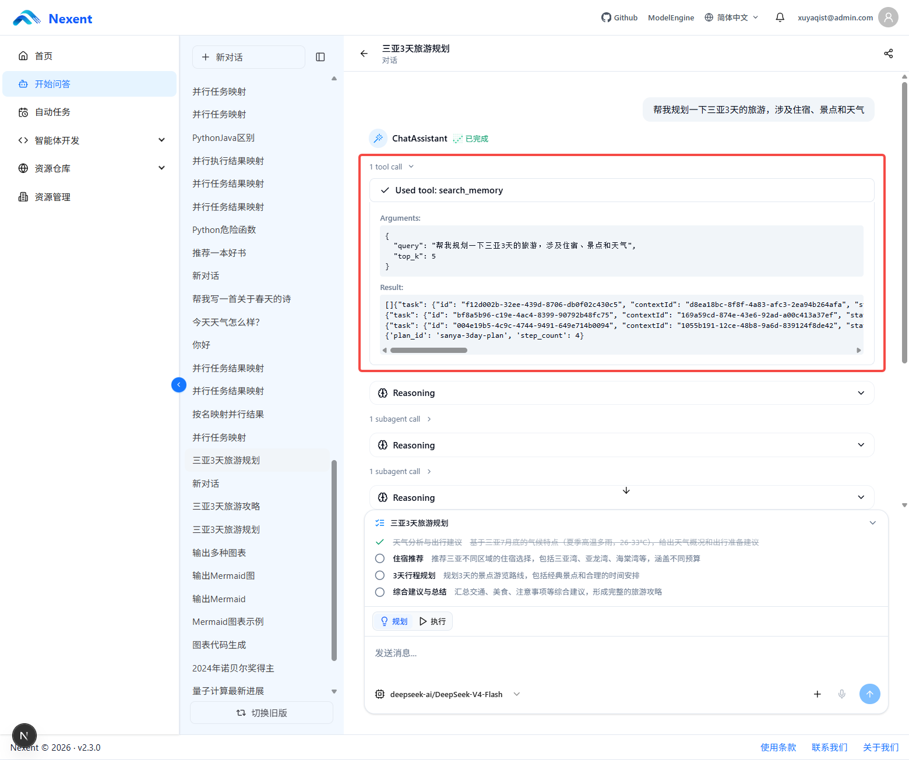

### 2. ReAct Execution Flow

Nexent agents are implemented using the CodeAgent from [smolagents](https://github.com/huggingface/smolagents) and use the ReAct (Reasoning + Acting) workflow. The core loop is:

- **Think**: The model analyzes the current task state and determines the next action. For agents with planning mode enabled, the model first evaluates task complexity. If it expects that more than three steps will be required, it generates a structured plan.

- **Code**: The model outputs action instructions as Python code. Executable code is wrapped in `<code>...</code>` tags, while code intended only for display is wrapped in `<DISPLAY:language>...</DISPLAY>` tags.

- **Observe**: After the code is executed, the system returns the actual result, marked as `Observation:`. The model must continue reasoning based on the actual result and must not fabricate an observation before execution.


The loop repeats the reasoning process in the front end until the model determines that it can generate the final answer directly or the maximum number of steps is reached. The final answer is output in Markdown format and supports headings, lists, tables, code blocks, and links. When retrieval tools are used, citation markers such as `[[letter+number]]` must be added after the relevant content to support traceability.

### 3. View Code and Tool Calls

On the conversation page, you can view key information from the agent's execution process:

- **Reasoning process**: The agent's reasoning analysis.
- **Generated executable code**: The code written by the agent for execution.
- **Tools called**: The specific tools used.
- **Tool input parameters**: The parameters passed to the tools.
- **Tool output**: The results returned by the tools.

This information is displayed as collapsible cards in the conversation area:

- **Reasoning cards** with a mind-map icon display the agent's reasoning process.
- **Tool call cards** with a tool icon display the tool name, call status, and execution result.

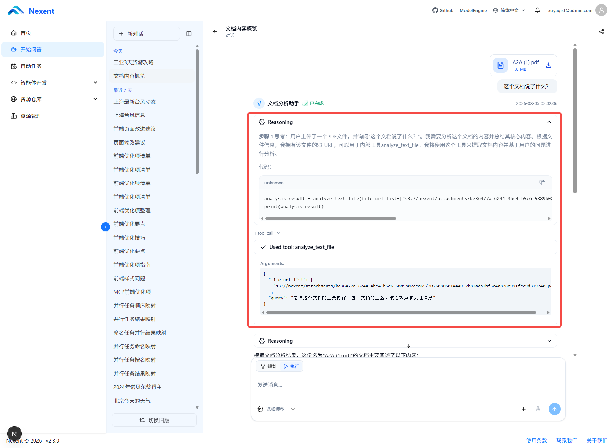

### 4. Automatic Error Correction

If the code generated by the agent has a problem, the system provides a degree of automatic error correction.

Based on execution errors, the agent may:

1. Analyze the cause of the error.
2. Modify the generated code or parameters.
3. Execute the task again.
4. Continue processing based on the new execution result.

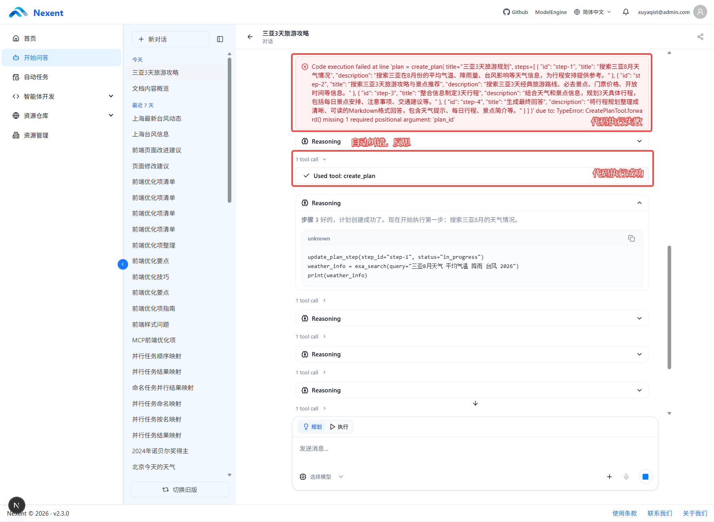

> **Note**: Automatic error correction depends on the model's capabilities, tool implementation, and task complexity. It cannot guarantee that every error will be fixed automatically.

### 5. Maximum Execution Steps

The agent developer can set the maximum number of execution steps on the agent configuration page.

When the agent reaches the maximum number of steps:

- The system stops further execution.
- The current conversation may not complete the entire task.
- The page returns the execution results obtained so far or a stop notification.

> **Recommendation**: Set the maximum number of execution steps according to the complexity of the task.

### 6. Parallel Tool Calls

When a task requires multiple independent tools at the same time, the agent can call them in parallel to reduce the overall waiting time.

For example, the agent can perform the following operations simultaneously:

- Retrieve information from multiple knowledge bases.
- Search multiple web pages.
- Analyze multiple files.
- Perform multiple data processing operations.

Parallel calls are displayed as a combined tool call card showing the number of calls and the execution status of each call.


### 7. Parallel Subagents

The agent can call multiple subagents to process different subtasks as needed.

Multiple subagents can work in parallel. The primary agent is responsible for:

- Breaking down complex tasks.
- Assigning subtasks to different subagents.
- Aggregating the subagent results.
- Generating the final response.

Subagent calls are displayed as nested cards showing:

- The subagent name.
- A description of the task assigned to the subagent.
- The execution status, such as running or completed.

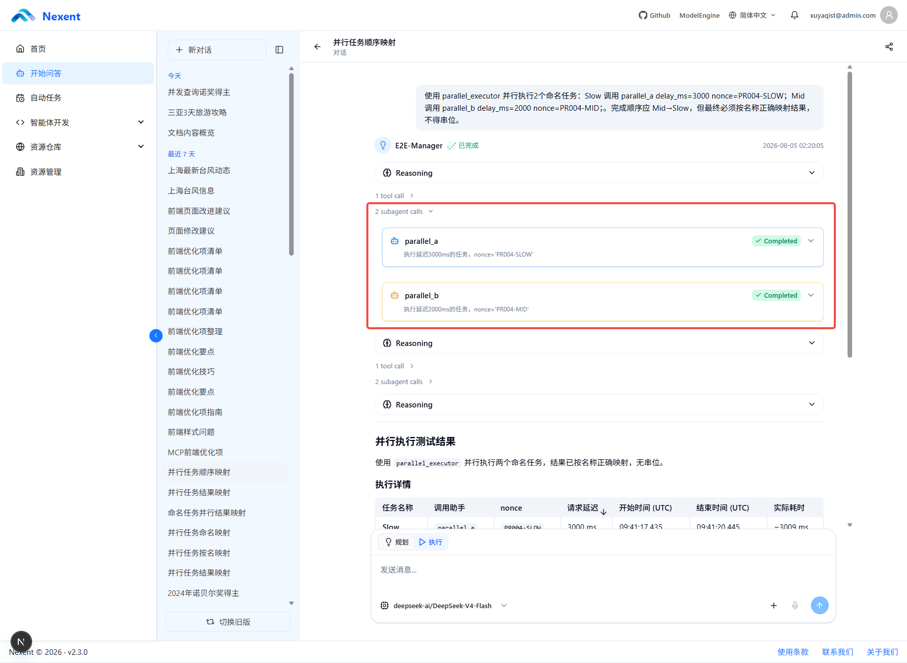

### 8. Self-Check

Self-check is a layered ReAct self-validation capability configured for an agent. It checks for obvious problems at key execution points and before generating the final answer. This feature is disabled by default. The conversation page displays the self-check process only after self-validation has been enabled for the agent.

#### Trigger Points

When self-check is enabled, the system performs checks at the following key points according to the agent configuration:

- **Before a tool call**: Checks whether the generated execution code is empty, whether the Python syntax is valid, and whether there are obvious unauthorized or dangerous operations. If tool-specific checks are configured, it also checks whether the relevant tools were called or the required information was output.
- **After a tool call or code execution**: Checks whether the execution result is empty and whether it contains error signals.
- **After knowledge retrieval**: Checks whether the retrieval results contain usable evidence.
- **After a subagent handoff**: Checks whether the subagent returned a conclusion with substantive content.
- **Before generating the final answer**: Checks whether the answer is empty, whether internal execution markers or unreplaced placeholders remain, and whether errors that occurred earlier have been explained in the answer.

#### Final Answer Validation

For tasks that require evidence or are relatively complex, the system can also use a validation model to perform additional checks on a candidate answer. The validation model evaluates the following based on the user task and execution process:

- Whether the answer addresses the user's goal.
- Whether the conclusions are supported by sufficient evidence.
- Whether tool errors have been handled.
- Whether the citation format is correct.
- Whether the output format is safe and complete.

Lightweight greetings and similar conversations receive basic checks and may not require external evidence. Whether validation is performed, how strict it is, and how the validation model is used are determined by the agent's self-validation configuration.

#### Self-Check Results

The self-check panel displays the checking process and results as collapsible cards. It may show the following statuses:

- **Self-check in progress**: The system is preparing or performing a check.
- **Basic self-check passed**: Key checks passed.
- **Final self-check passed**: The final answer passed validation.
- **Self-check found items requiring attention**: A problem was found, but it does not block execution.
- **Self-check failed, correcting**: The current candidate answer did not pass, and the agent will continue correcting it based on feedback.
- **Self-check blocked the current action**: The current action failed a blocking check, so the system will not continue with that action.
- **Final self-check failed**: The answer still did not pass after the allowed validation rounds.

The panel may also display validation scores, failed checks, user-visible messages, and repair suggestions. Validation events do not display the validation model's internal reasoning text. Instead, they display structured check results.

#### Handling Self-Check Failures

When a key check fails, the system sends the failure criteria and repair instructions to the agent as feedback. The agent may:

1. Modify the execution code or tool parameters.
2. Call tools again or retrieve additional evidence.
3. Generate the final answer again.
4. Return a controlled explanation identifying the failed checks, reasons, and recommendations if validation cannot be passed.

The maximum number of final-answer validation attempts is determined by the agent configuration. The default is up to 2 rounds of final-answer validation. Self-check cannot guarantee that all business errors will be detected and does not replace manual confirmation of file contents, data accuracy, or business results.


### 9. Completion Indicator

When the agent completes the task:

- A **Completed** indicator, consisting of a green dot and text, appears at the end of the response.
- The execution duration is displayed.
- The Token usage for the conversation is displayed.

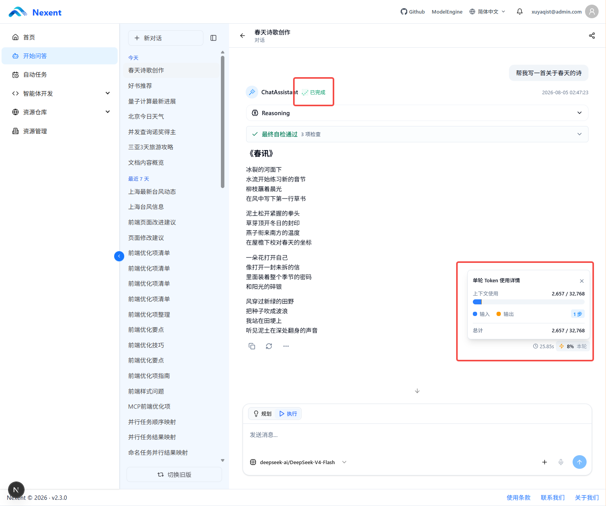

## 4. Knowledge Retrieval and Source Traceability

When knowledge retrieval tools are configured for the agent, you can view the sources cited in the response during the conversation.

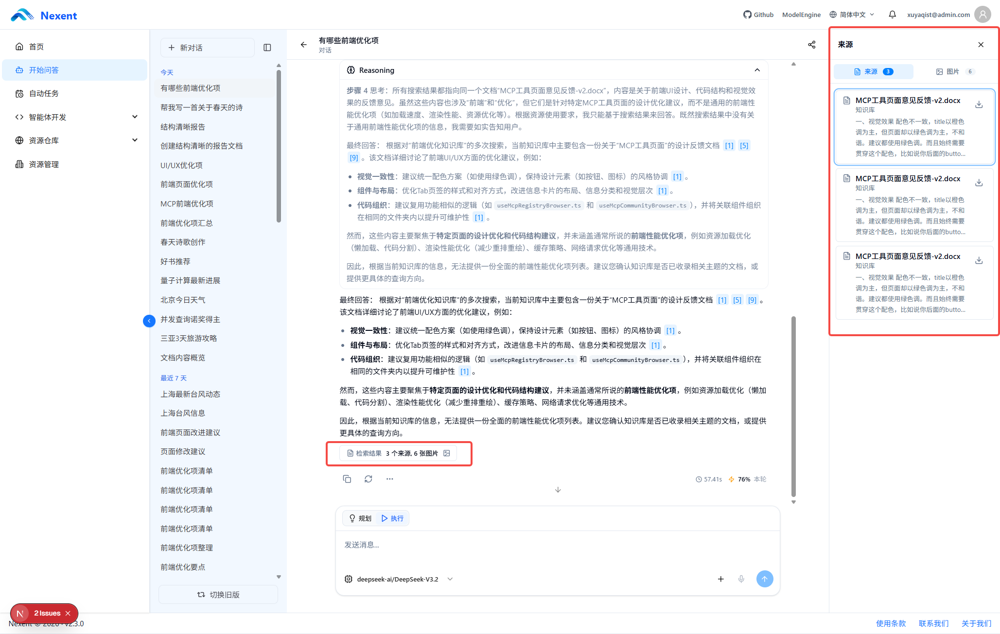

### 1. View Citation Sources

After the conversation is complete, the response area displays a **View Sources** button if the agent called a knowledge retrieval tool. Click this button to view the knowledge content used by the agent in the right-side panel.

### 2. Right-Side Source Panel

The source panel contains two tabs:

#### Sources Tab

Displays the knowledge sources cited in the agent's response.

**Local knowledge base results**:

- Knowledge base name.
- Source file name.
- Text block title.
- Matched text.
- Relevant citation excerpts.

**Web search results**:

- Web page title.
- Source URL.
- Web page summary or cited content.
- Relevant images or other online resources.

You can use a source link to view the original web page.

#### Images Tab

- Displays related images retrieved through web search.
- Click an image to preview it at full size.
- Displays the title of the web page where the image was found.

## 5. Image Processing

When a vision model and image parsing tools are configured for the agent, you can upload images and ask the agent to analyze them.

### 1. Upload Images

You can upload images in the following ways:

| Upload method | Instructions |
| --- | --- |
| Click the upload button | Click the file upload button on the right side of the input box and select an image. |
| Drag and drop | Drag an image file directly into the conversation area. |
| Select from the input box | Select an image in the file picker in the input box. |

### 2. Image Analysis

The agent can perform the following types of tasks based on image content:

- **Describe image content**: Identify and describe scenes, people, objects, and other elements in the image.
- **Recognize text in images**: Extract text from the image using OCR.
- **Analyze objects, scenes, or structures**: Identify object categories, scene types, chart structures, and other visual elements.
- **Answer image-related questions**: Answer questions based on the image content.
- **Organize or make judgments based on image content**: Analyze, summarize, or reason from information in the image.

> **Note**: Image processing capabilities depend on whether the agent has a vision model and the corresponding tools configured.

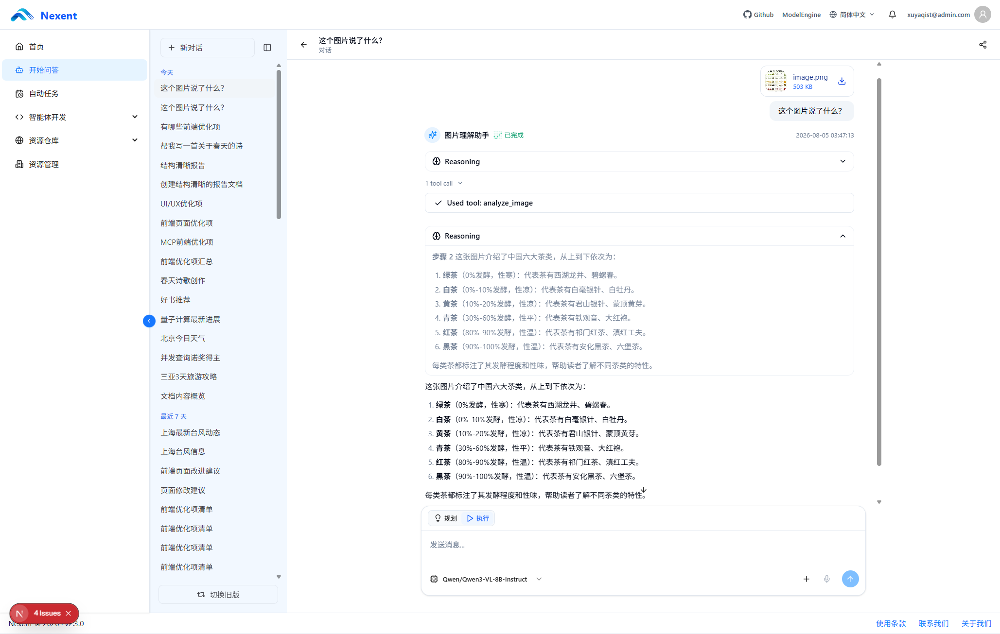

### 3. Image Source Citations

If an image comes from web search, related thumbnails are displayed in the Images tab of the right-side source panel. Click a thumbnail to view the full-size image.

## 6. Document Processing and Generation

### 1. Document Analysis

> **Tip**: To analyze documents, configure the official `analyze_text_file` tool for the agent.

You can upload documents and ask the agent to perform the following operations:

- **Summarize content**: Extract the main content and key points from a document.
- **Extract key information**: Extract important data, facts, or information from a document.
- **Answer questions about a document**: Answer questions based on the document content.
- **Analyze structure**: Analyze the document organization and relationships between sections.
- **Compare content**: Compare differences between multiple documents.
- **Organize data**: Convert data in a document into a table or another format.

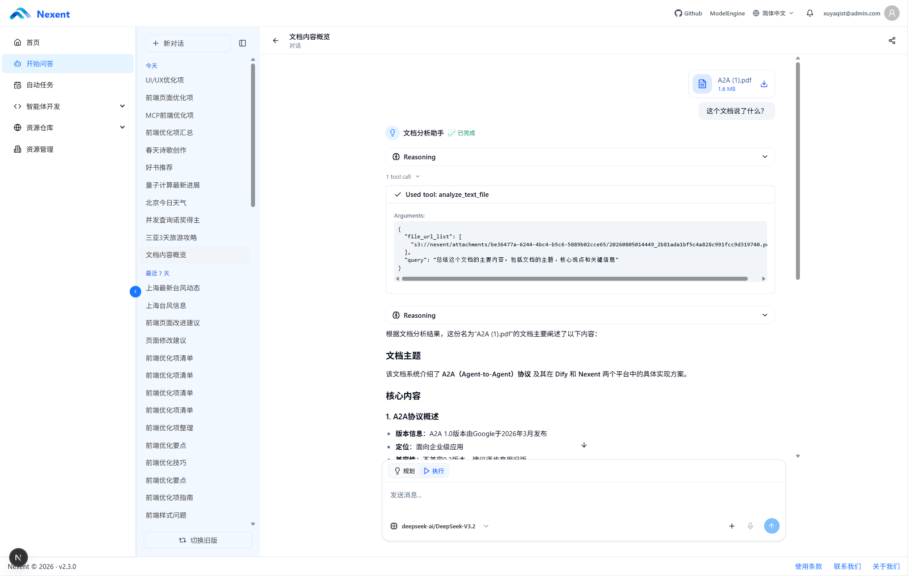

### 2. Document Generation

> **Tip**: To generate a Word document (`.docx`), configure the official `create-docx` Skill for the agent. Document generation capabilities depend on the tools and Skills configured for the agent.

The agent can generate documents based on your requirements or conversation content, such as reports, proposals, explanatory documents, spreadsheets, and presentations.

Files generated by a tool or skill are written to the current run's sandbox workspace and then uploaded to platform storage. File links in agent responses use stable storage references, which the page converts into currently accessible URLs when you open or download them. This avoids expired temporary signed links in conversation history.


Generated documents can be previewed and downloaded directly in the conversation.

### 3. Document Preview and Download

After a document is generated, you can perform the following actions on the conversation page:

- **View file content**: Click a file card or link to preview supported formats.
- **Check the generated result**: Confirm that the document meets your requirements.
- **Continue editing**: Ask the agent to modify or supplement the document.
- **Download a file**: Use the file card's download action or the download button in the preview.

If a format cannot be previewed in the browser, download it and open it in a local application. Generated files depend on the tools or skills configured for the agent; a normal text response does not automatically create a file.

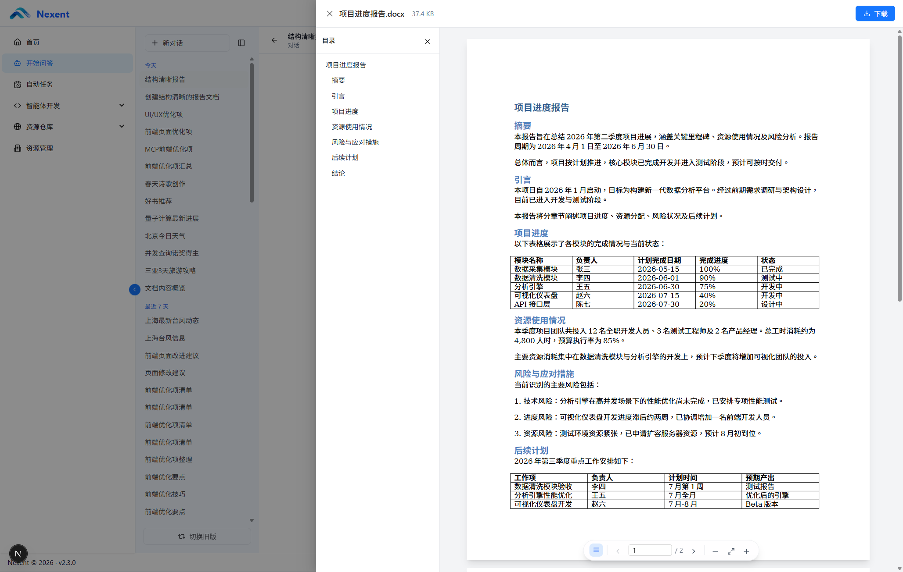

## 7. Mermaid Diagrams

When an agent generates Mermaid diagram code, the conversation page can render it as a visual diagram.

### Supported Diagram Types

The following diagram types are supported:

| Diagram type | Description |
| --- | --- |
| Flowchart | Shows processes and decision paths. |
| Sequence diagram | Shows the order of interactions between objects. |
| Class diagram | Shows the structure and relationships between classes. |
| State diagram | Shows state transition processes. |
| Gantt chart | Shows a project timeline. |
| Mindmap | Shows the hierarchy of a topic. |
| Entity-relationship diagram | Shows relationships between data entities. |

### Diagram Interaction

Generated diagrams support the following interactions:

- **Hover to enlarge**: Display an enlarge button when you hover over the diagram.
- **View full screen**: Click the enlarge button to view the diagram in full-screen mode.
- **Pan by dragging**: Drag to move the view in full-screen mode.
- **Zoom with the mouse wheel**: Zoom the diagram with the mouse wheel.
- **Reset the view**: Reset the zoom level and position.

> **Tip**: If diagram rendering fails, the original code is displayed along with a **Diagram failed to render** message.

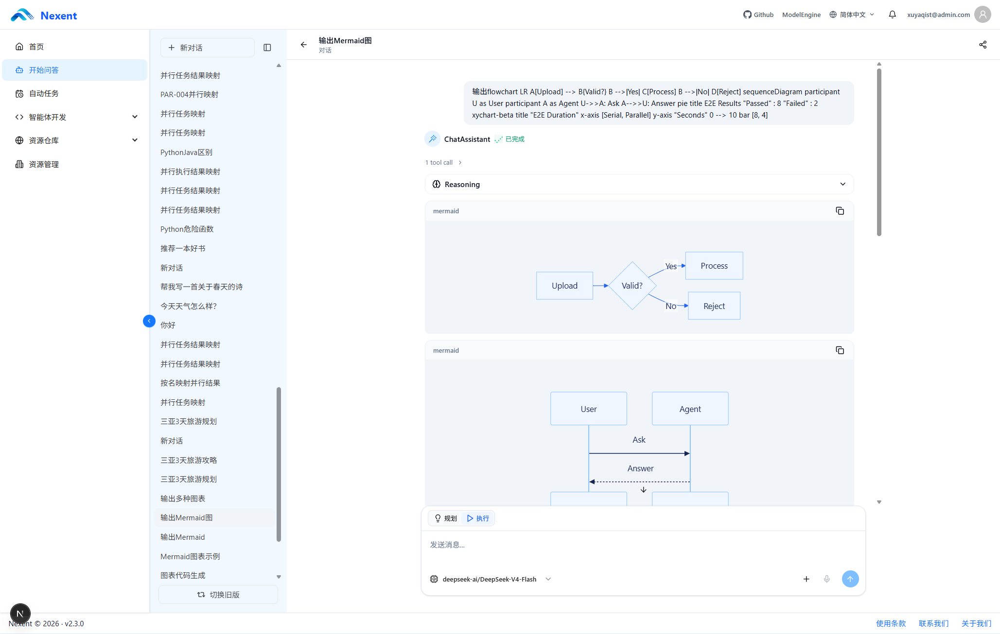

## 8. Conversation Interactions

### 1. Refresh a Response

If you are not satisfied with the current response or want the agent to generate the result again, you can use the refresh function.

**How to refresh**:

- Click the refresh button with the circular arrow icon below the agent's response.
- Or resend the same question in the input box.

**What refreshing does**:

- Resubmits the current question.
- Runs the agent processing flow again.
- Generates a new response.

> **Note**: Refreshing a response consumes additional Token resources.

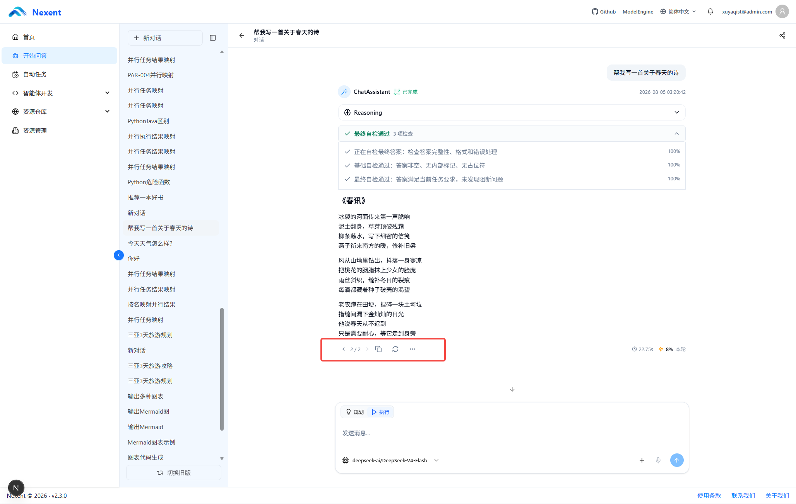

### 2. Copy a Response

You can copy the agent's response.

**How to copy**: Click the copy button with the clipboard icon below the response.

After the response is copied successfully, the button icon briefly changes to a check mark.

### 3. Export to Markdown

You can export the complete conversation as Markdown.

**How to export**: Click **Export Markdown** in the **More** menu below the response.

### 4. Share a Conversation

You can generate a share link so that other people can view the conversation.

**Sharing workflow**:

1. Click the Share button next to the conversation title to enter sharing mode.
2. Choose whether to share the entire conversation or specific question-and-answer pairs.
3. Click **Copy Link** to generate the share link.
4. The share link is copied to the clipboard.

**Shared content**:

- The selected user questions and agent responses.
- Source citations used by the agent.
- Related images, if applicable.

**Features of a shared page**:

- The shared page is read-only.
- Other users can view the conversation but cannot continue it.
- The source panel remains available.

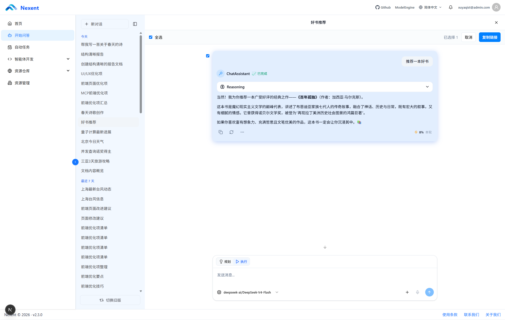

### 5. Batch Manage Conversations

The conversation management page supports deleting multiple conversations at once. In batch management mode, you can select conversations individually or select all currently loaded conversations, then delete them together.

To delete conversations in batches:

1. Enter batch management mode from the conversation history area.
2. Select the conversations to delete, or use **Select All** to select all currently loaded conversations.
3. Check the number of selected conversations, click **Delete**, and complete the operation in the confirmation dialog.

> **Note**: Deletion cannot be undone. Batch deletion also cancels and removes automation tasks bound to the selected conversations. Review your selection carefully before confirming.

<div style="display: flex; justify-content: center; align-items: flex-start; gap: 16px;">
  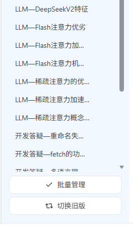
  
</div>


## 9. Background Operation Mode

When an agent processes a complex task or generates a file, execution may take a long time. You can leave the current conversation page while the system continues processing the task in the background.

### 1. Continue Task Execution

After you leave the current conversation page, the agent can continue executing unfinished tasks.

- The task continues running on the server.
- Execution is not affected if you close the browser or switch pages.

### 2. Return to View Results

When you re-enter the original conversation, you can view:

- The execution process records that have already been generated.
- The execution status of each step.
- The final generated result.

### 3. Stop Execution

If you are still on the current page, you can stop the agent at any time:

- While the agent is executing, the Send button changes to a Stop button with a square icon.
- Click the Stop button to interrupt the current execution.
- Results from completed steps are retained.

## 10. Shortcuts and Navigation

### 1. Return to the Agent List

On the conversation page, click the Back button in the upper-left corner to return to the agent selection list.

### 2. Switch to the Legacy Interface

The bottom of the left sidebar provides a **Switch to Legacy** entry. Click it to return to the legacy conversation interface.

### 3. Collapse the Sidebar

On desktop, the sidebar can be collapsed or expanded. Click the collapse button to hide the conversation history area and expand the main conversation area.

On mobile, the sidebar is collapsed by default. Click the expand button to open it temporarily.


