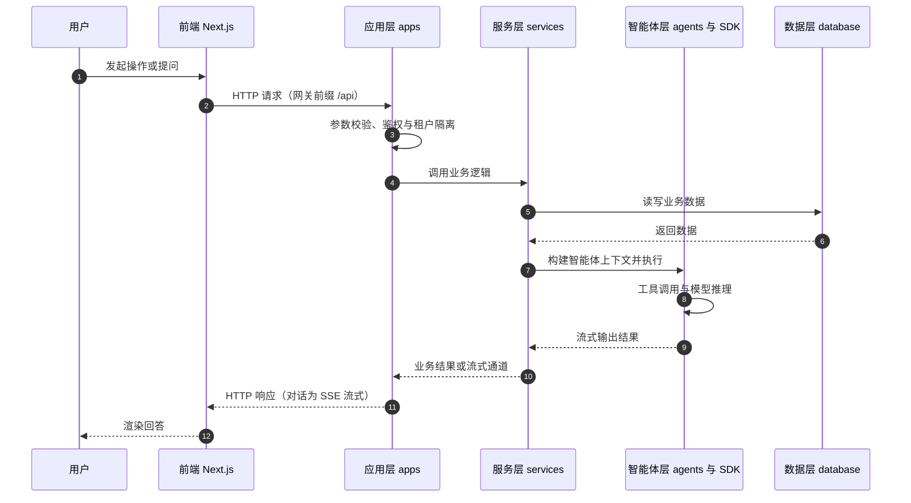

# 后端架构概览

Nexent 的后端采用 FastAPI 和 Python 构建，为 AI 智能体服务提供强大且可扩展的 API 平台。

## 技术栈

- **框架**: FastAPI
- **语言**: Python 3.11+
- **数据库**: PostgreSQL + Redis + Elasticsearch（Elasticsearch 同时承担向量检索与记忆索引）
- **文件存储**: MinIO
- **任务队列**: Celery + Ray
- **AI框架**: smolagents（位于 `sdk/nexent/`，backend 通过 SDK 调用）
- **向量数据库**: Elasticsearch

## 目录结构

```
backend/
├── apps/                         # API 应用层（精选）
│   ├── app_factory.py           # FastAPI 应用工厂（统一创建 app、异常处理）
│   ├── agent_app.py             # 智能体管理 API
│   ├── runtime_app.py           # 运行态智能体执行 API（/agent/run SSE）
│   ├── conversation_management_app.py  # 对话管理 API
│   ├── conversation_share_app.py       # 会话分享 API
│   ├── vectordatabase_app.py    # 知识库检索 API
│   ├── model_managment_app.py   # 模型管理 API（含容量建议/并发治理）
│   ├── voice_app.py             # 语音 API（STT/TTS WebSocket）
│   ├── file_management_app.py   # 文件管理 API（上传/预览/签名URL）
│   ├── remote_mcp_app.py        # MCP 服务与 API→MCP 转换 API（/mcp）
│   ├── mcp_management_app.py    # MCP 工具管理 API（/mcp-tools）
│   ├── a2a_client_app.py        # A2A 客户端 API（外部 Agent 发现/管理）
│   ├── a2a_server_app.py        # A2A 服务端 API（本地 Agent 发布为 A2A）
│   ├── northbound_app.py / northbound_base_app.py / northbound_knowledge_app.py  # 北向开放 API（/nb/v1、/nb/a2a）
│   ├── skill_app.py             # 技能管理与 NL2Skill API
│   ├── prompt_template_app.py   # 提示词模板管理 API
│   ├── agent_repository_app.py / skill_repository_app.py  # Agent/技能市场仓库 API
│   ├── agent_evaluation_app.py / evaluation_set_app.py / evaluator_app.py  # 评测 API
│   ├── agent_automation_app.py  # 智能体自动化定时任务 API
│   ├── memory_record_app.py / memory_config_app.py / memory_dreaming_app.py / memory_long_term_app.py  # 记忆管理 API
│   ├── api_key_app.py           # API Key 管理 API
│   ├── notification_app.py      # 站内通知 API
│   ├── cas_app.py / oauth_app.py  # SSO 登录 API
│   └── ...                      # 其余模块（用户/租户/分组/配额/监控/外部检索源等）
├── services/                     # 业务服务层
│   ├── agent_automation/        # 智能体自动化（意图分析/调度引擎/工具适配）
│   ├── providers/               # 模型提供商适配（dashscope/modelengine/silicon/tokenpony）
│   ├── agent_service.py         # 智能体业务逻辑
│   ├── memory_context_service.py  # 记忆上下文构建（归一化/分数融合/时间衰减/MMR）
│   ├── memory_index_service.py  # 记忆向量索引（Elasticsearch per-tenant 索引）
│   ├── a2a_client_service.py / a2a_server_service.py  # A2A 发现与发布
│   ├── northbound_service.py    # 北向 API 业务逻辑
│   ├── nl2skill_service.py      # NL2Skill 流式生成
│   ├── vectordatabase_service.py  # 搜索引擎服务
│   ├── model_health_service.py  # 模型健康检查
│   ├── prompt_service.py        # 提示词服务
│   └── tenant_service.py        # 租户服务（及模型/记忆/评测/技能等 50+ 服务）
├── database/                     # 数据访问层
│   ├── client.py / db_models.py # 数据库连接与 ORM 模型
│   ├── agent_db.py / agent_version_db.py  # 智能体与版本数据
│   ├── conversation_db.py       # 对话数据操作
│   ├── a2a_agent_db.py          # A2A Agent 注册数据
│   ├── memory_record_db.py 等记忆相关  # 记忆数据操作
│   └── ...
├── agents/                       # 智能体核心逻辑
│   ├── agent_run_manager.py     # 智能体运行管理器
│   ├── create_agent_info.py     # 智能体信息创建（含记忆/工具挂载）
│   ├── nl2agent_agent.py        # NL2Agent 临时 Agent
│   ├── nl2skill_agent.py        # NL2Skill 临时 Agent
│   ├── preprocess_manager.py    # 预处理管理器
│   └── default_agents/          # 默认智能体配置
├── data_process/                 # 数据处理模块（Ray/Celery，app.py / ray_config.py / tasks.py / worker.py / utils.py）
├── permissions/                  # 权限（RBAC/DAC/租户隔离）
├── middleware/                   # 中间件（exception_handler.py）
├── tool_collection/              # 工具集（langchain 计算工具 / MCP 本地与 NL2Agent 工具）
├── adapters/                     # 外部 SDK 适配（九问 SDK 等）
├── ext_components/               # 外部集成组件（AIDP 知识库等）
├── assets/                       # 静态资源（停用词、测试音频等）
├── utils/                        # 工具类
│   ├── auth_utils.py / config_utils.py / monitoring.py
│   ├── nacos_client.py          # Nacos A2A 查询
│   ├── a2a_http_client.py       # A2A HTTP 客户端
│   └── ...
├── consts/                       # 常量定义（const.py 环境变量唯一来源 / model.py）
├── prompts/                      # 提示词模板
├── config_service.py             # 编辑态服务入口
├── runtime_service.py            # 运行态服务入口
├── northbound_service.py         # 北向开放 API 服务入口（端口 5013）
├── data_process_service.py       # 数据处理服务入口
├── mcp_service.py                # MCP 服务入口
└── pyproject.toml                # Python 依赖（uv 管理，uv sync 安装）
```

## 架构职责

### **应用层 (apps)**
- API路由定义
- 请求参数验证
- 响应格式化
- 身份验证和授权

### **服务层 (services)**
- 核心业务逻辑实现
- 数据处理和转换
- 外部服务集成
- 业务规则执行

### **数据层 (database)**
- 数据库操作和ORM模型
- 数据访问接口
- 事务管理
- 数据一致性和完整性

### **代理层 (agents)**
- AI代理核心逻辑和执行
- 工具调用和集成
- 推理和决策制定
- 代理生命周期管理

### **工具层 (utils)**
- 通用工具函数
- 配置管理
- 日志和监控
- 线程和进程管理

## 核心服务

### 代理管理
- 代理创建和配置
- 执行生命周期管理
- 工具集成和调用
- 性能监控

### 对话管理
- 消息处理和存储
- 上下文管理
- 历史记录跟踪
- 多租户支持

### 知识库
- 文档处理和索引
- 向量搜索和检索
- 文档摘要与聚类总结

### 文件管理
- 多格式文件处理
- MinIO存储集成
- 批处理能力
- 元数据提取

### 模型集成
- 多模型提供商支持
- 健康监控和故障转移
- 负载均衡和缓存
- 性能优化

## 前后端交互流程

### 1. 用户请求流程
```
用户输入 → 前端验证 → API调用 → 后端路由 → 业务服务 → 数据访问 → 数据库
```

### 2. AI Agent执行流程
```
用户消息 → Agent创建 → 工具调用 → 模型推理 → 流式响应 → 结果保存
```

### 3. 知识库文件处理流程
```
文件上传 → 临时存储 → 数据处理 → 向量化 → 知识库存储 → 索引更新
```

### 4. 实时文件处理流程
```
文件上传 → 临时存储 → 数据处理 → Agent → 回答
```

### 5. 前后端交互流程图



## 部署架构

### 容器服务
- **nexent-config**: 编辑态/配置服务 (端口 5010)
- **nexent-runtime**: 运行态服务 (端口 5014)
- **nexent-mcp**: MCP 服务 (SSE 端口 5011，管理 API 端口 5015)
- **nexent-northbound**: 北向开放 API 服务 (端口 5013)
- **nexent-data-process**: 数据处理服务 (端口 5012)
- **nexent-postgresql**: 数据库 (端口 5434)
- **nexent-elasticsearch**: 搜索引擎 (端口 9210)
- **nexent-minio**: 对象存储 (端口 9010)
- **nexent-redis**: 缓存服务 (端口 6379)

### 可选服务
- **nexent-openssh-server**: 终端工具的SSH服务器 (端口 2222)

## 开发设置

### 环境搭建
```bash
cd backend
uv sync --extra data-process --extra test
uv pip install -e "../sdk[dev]"
```

### 服务启动
```bash
cd backend
python data_process_service.py   # 数据处理服务
python config_service.py         # 编辑态服务
python runtime_service.py        # 运行态服务
python mcp_service.py            # MCP服务
```

## 性能和可扩展性

### 异步架构
- 基于asyncio的高性能异步处理
- 线程安全的并发处理机制
- 针对分布式任务队列优化

### 缓存策略
- 多层缓存提升响应速度
- Redis用于会话和临时数据
- Elasticsearch用于搜索结果缓存

### 负载均衡
- 智能并发限制
- 资源池管理
- 自动扩展能力

详细的后端开发指南，请参阅 [开发者指南](../developer-guide/overview)。