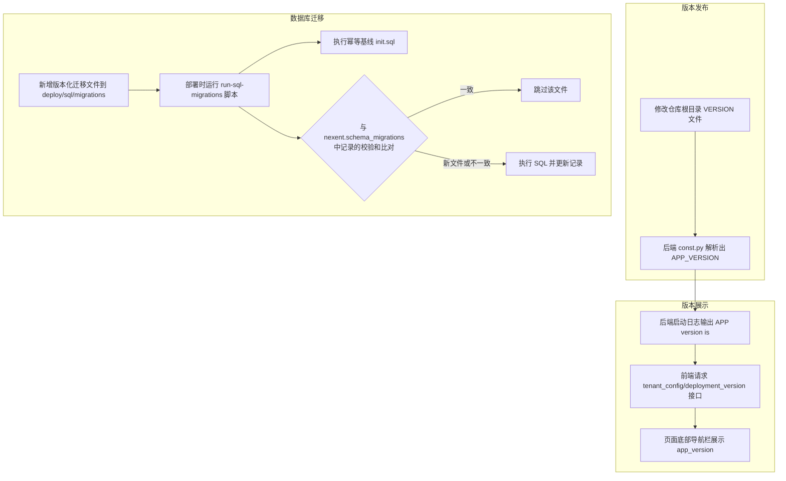

# 版本信息管理

Nexent 项目采用统一的版本管理策略，确保前端和后端版本信息的一致性。本文档介绍如何管理和更新项目版本信息。

## 📋 版本号格式

Nexent 使用语义化版本控制：

- **格式**: `vMAJOR.MINOR.PATCH` 或 `vMAJOR.MINOR.PATCH.BUILD` (例如：v2.5.0 或 v2.5.0.1)
- **MAJOR**: 不兼容的 API 修改
- **MINOR**: 向下兼容的功能性新增
- **PATCH**: 向下兼容的问题修正
- **BUILD**: 可选的小版本号，用于更细粒度的 bugfix 版本

### 🏷️ 版本号示例

- `v2.5.0` - 功能更新版本
- `v2.5.0.1` - 包含小版本号的 bugfix 版本

## 🖥️ 前端版本管理

### 📍 版本信息位置

前端版本信息通过接口从后端获取。

- **接口**: `GET /api/tenant_config/deployment_version`（返回 `app_version` 应用版本号与 `deployment_version` 部署模式 speed/full）
- **端点定义**: `frontend/services/api.ts`
- **获取逻辑**: `frontend/components/providers/deploymentProvider.tsx`
- **显示位置**: `frontend/components/navigation/FooterLayout.tsx`

> 说明：`frontend/const/constants.ts` 中硬编码的 `APP_VERSION` 仅作为接口失败时的回退值，实际展示以后端返回的 `app_version` 为准。

### 🔄 版本更新流程

1. **在代码中更新后端版本**

编辑仓库根目录的 `VERSION` 文件（见下文"后端版本管理"），后端接口会自动返回新的 `app_version`。

2. **验证版本显示**

   ```bash
   # 启动前端服务
   cd frontend
   npm run dev

   # 在页面底部检查应用版本显示
   ```

### 📺 版本显示

前端版本信息在以下位置显示：

- 位置：页面底部导航栏（`FooterLayout.tsx`），位于页面左下角
- 版本格式：`v2.5.0`
- 附加信息：同一接口返回的 `deployment_version` 用于区分 speed/full 部署模式，不直接展示为版本号

## ⚙️ 后端版本管理

### 📍 版本信息位置

后端版本号统一读取仓库根目录的 `VERSION` 文件，由 `backend/consts/const.py` 中的 `_resolve_app_version()` 解析为 `APP_VERSION`：

```python
# backend/consts/const.py
APP_VERSION = _resolve_app_version()
```

解析顺序（`_collect_version_candidates()`）：

1. 环境变量 `APP_VERSION_FILE` 指定的文件（测试/脚本钩子）
2. 容器内路径 `/opt/nexent/VERSION`（由运行时 Dockerfile 写入）
3. 仓库根目录 `VERSION`（本地开发）
4. 兜底默认值 `v2.2.1`

### 🔧 版本配置

发版时直接修改仓库根目录的 `VERSION` 文件即可，无需改动代码：

```
# VERSION
v2.5.0
```

### 📺 版本显示

后端服务启动时会在日志中打印版本信息（`backend/config_service.py` 与 `backend/runtime_service.py`）：

```python
logger.info(f"APP version is: {APP_VERSION}")
```

### 🔄 版本更新流程

1. **在代码中更新版本**

```text
# 编辑仓库根目录 VERSION 文件
v2.5.0
```

2. **验证版本显示**

   ```bash
   # 启动后端服务
   cd backend
   python config_service.py

   # 查看启动日志中的版本信息
   # 输出示例：APP version is: v2.5.0
   ```

## 🗄️ 数据库迁移规则

数据库脚本统一放在 `deploy/sql/`，由迁移运行器（`deploy/common/run-sql-migrations.sh`）在部署/升级时执行：

- **基线脚本**: `deploy/sql/init.sql`，每次启动无条件执行，语句必须保持幂等（如 `CREATE TABLE IF NOT EXISTS`）。
- **版本化迁移**: 位于 `deploy/sql/migrations/`，迁移运行器以 SQL 文件名作为迁移 ID，并把当前文件校验和记录在 `nexent.schema_migrations` 表中。
- **不可修改已部署的 SQL 文件**：文件内容变化会导致校验和不匹配而重新执行，并可能级联重放其后的所有迁移文件。对已合并的历史迁移（如 `v2.4_merged_migrations.sql`），即使只改注释也会触发级联。
- **新增变更**：新建一个版本化迁移文件（例如 `v2.6.0_xxxx_*.sql`），并保持语句幂等。

## 🔄 版本发布/迁移流程图


