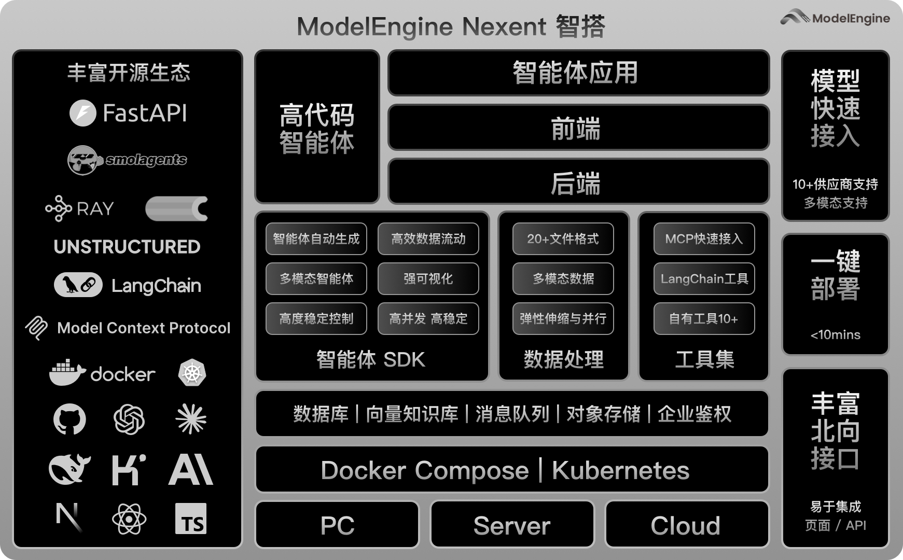

# 软件架构

Nexent 将 Web、配置管理、智能体运行、MCP、北向接口和数据处理拆分为独立服务。各服务通过明确的 API 协作，并使用 PostgreSQL、Elasticsearch、Redis 和 MinIO 保存不同类型的数据。项目同时提供 Docker Compose 和 Kubernetes 部署方案。



## 🏗️ 整体架构设计

Nexent 的软件架构遵循分层设计原则，从上到下分为以下几个核心层次：

### 🌐 前端层（Frontend Layer）
- **技术栈**：Next.js + React + TypeScript
- **功能**：智能体生成与配置、问答交互、资源管理和多模态文件上传
- **特性**：响应式设计、SSE 流式结果、WebSocket 语音通信和国际化（i18n）

### 🔌 API 网关层（API Gateway Layer）
后端由多个基于 FastAPI 的 API 服务组成：

| 服务 | 端口 | 说明 |
|------|------|------|
| **nexent-config** | 5010 | 配置 API：智能体、会话、模型、知识库、记忆、权限和资源管理 |
| **nexent-runtime** | 5014 | 运行时 API：智能体执行、沙箱协调和流式响应 |
| **nexent-mcp** | 5011/5015 | MCP API 与 FastMCP 服务：MCP 配置、工具发现和容器管理 |
| **nexent-northbound** | 5013 | 北向 API：外部调用、会话管理和 A2A 接口 |
| **nexent-data-process** | 5012 | 数据处理 API：文档解析、分块、向量化和索引 |

### 🧠 业务逻辑层（Business Logic Layer）
后端采用清晰的分层架构：

#### App 层（`backend/apps/`）
- **职责**：HTTP 边界层 - 解析/验证输入、调用服务、映射错误到 HTTP
- **核心模块**：
  - `agent_app.py` - 智能体 CRUD、版本管理、流式执行
  - `conversation_management_app.py` - 多轮对话、历史追踪
  - `api_key_app.py` / `quota_app.py` - API Key 与容量管理
  - `model_managment_app.py` - 模型配置、健康检查
  - `skill_app.py` - 技能创建与管理
  - `knowledge_summary_app.py` - 知识库操作
  - `remote_mcp_app.py` - 远程 MCP 工具管理
  - `a2a_client_app.py` / `a2a_server_app.py` - A2A 协议支持

#### Service 层（`backend/services/`）
- **职责**：核心业务逻辑编排，协调仓库/SDK
- **核心模块**：
  - `agent_service.py` - 智能体生命周期、配置与运行请求编排
  - `runtime_proxy_service.py` - 将问答和调试请求转发到 Runtime
  - `agent_version_service.py` - 版本发布、回滚、对比
  - `model_management_service.py` / `model_gateway_service.py` - 模型管理与统一适配
  - `memory_config_service.py` - 记忆配置、上下文构建
  - `conversation_management_service.py` - 会话管理、历史持久化
  - `skill_service.py` - 技能生成、模板处理
  - `nl2agent_service.py` - 自然语言生成智能体的会话与草稿管理
  - `data_process_service.py` - 文档处理管道
  - `mcp_container_service.py` - MCP 容器生命周期管理
  - `remote_mcp_service.py` - 远程 MCP 服务器集成
  - `a2a_client_service.py` / `a2a_server_service.py` - A2A 智能体通信
  - `redis_service.py` - 缓存、分布式锁、会话存储

#### 智能体核心层（`backend/agents/`）
- **职责**：基于 SmolAgents 的智能体执行框架
- **核心组件**：
  - `agent_run_manager.py` - 智能体运行生命周期、工作区与流式协调
  - `create_agent_info.py` - 智能体配置、工具和沙箱环境构建
  - `preprocess_manager.py` - 文档预处理编排
  - `skill_creation_agent.py` - LLM 驱动的技能生成

### 📊 数据层（Data Layer）
分布式数据存储架构，包含多种专用数据库：

#### 🗄️ 结构化数据存储
- **PostgreSQL**（端口 5434）：主关系型数据库
  - 用户和租户管理（`user_tenant_db.py`）
  - 智能体配置和版本（`agent_db.py`、`agent_version_db.py`）
  - 工具定义和实例（`tool_db.py`）
  - 对话历史（`conversation_db.py`）
  - 群组和权限管理（`group_db.py`、`role_permission_db.py`）
  - 记忆配置（`memory_config_db.py`）
  - 技能定义（`skill_db.py`）
- **特性**：ACID 事务、关系完整性、多租户支持

#### 🔍 向量搜索与全文搜索
- **Elasticsearch**（端口 9210）：向量和全文搜索引擎
  - 知识库存储（`knowledge_db.py`）
  - 向量相似度搜索、混合搜索
  - 语义分块和索引
- **特性**：可扩展搜索、相关性排序、大规模优化

#### 💾 缓存层
- **Redis**（端口 6379）：高性能内存数据库
  - 会话缓存
  - 临时数据存储
  - 分布式锁（`redis_service.py`）
  - Celery 任务队列的消息代理
- **特性**：亚毫秒级延迟、AOF 持久化

#### 📁 对象存储
- **MinIO**（端口 9010/9011）：分布式对象存储
  - 文件上传和附件（`attachment_db.py`）
  - 知识库文档存储
  - 预览文件和沙箱生成产物
- **特性**：S3 兼容 API、大文件处理

智能体运行时还使用独立工作区保存本次运行的输入与输出。Docker 部署通过 `nexent-agent-workspace` 卷共享工作区；Kubernetes 部署使用 `nexent-workspace` PVC。运行结束后，需保留的产物会同步到 MinIO，临时工作目录由后端清理。

## 🔧 核心服务架构

### 🤖 智能体服务（Agent Services）
```
智能体框架（基于 SmolAgents）：
├── 智能体创建与配置
│   ├── NL2Agent 需求澄清与配置生成
│   ├── 工具与 Skill 推荐、安装和绑定
│   ├── 子智能体关系管理
│   └── 版本控制与发布
├── 智能体执行引擎
│   ├── 流式响应（SSE）
│   ├── 工具调用与编排
│   ├── 多模型与多模态输入
│   └── 记忆上下文构建
├── 隔离执行与文件处理
│   ├── Docker 或其他级别的代码沙箱
│   ├── session / system 生命周期范围
│   ├── Skill 脚本隔离执行
│   └── 运行工作区与 MinIO 产物同步
├── 版本管理
│   ├── 发布与回滚
│   ├── 版本对比
│   └── A2A 智能体卡片注册
└── 生命周期管理
    ├── 运行注册与追踪
    ├── 停止与清理
    └── 预处理协调
```

### 📈 数据处理服务（Data Processing Services）
```
分布式数据处理管道：
├── 文档摄入
│   ├── 多格式支持（20+ 格式）
│   ├── PDF 解析与 OCR
│   └── 表格结构提取
├── 分块与处理
│   ├── 语义分块算法
│   ├── Celery 批量处理
│   └── Ray 分布式计算
├── 向量化与索引
│   ├── Embedding 生成
│   ├── Elasticsearch 索引
│   └── 增量更新
└── 预览生成
    ├── PDF 预览转换
    └── 图片缩略图生成
```

### 🌐 MCP 生态系统（MCP Ecosystem）
```
模型上下文协议集成：
├── 本地 MCP 服务
│   ├── 稳定的内置工具
│   └── Docker 容器化工具
├── 远程 MCP 服务
│   ├── 动态远程 MCP 服务器代理
│   └── 外部 API 工具集成
├── MCP 容器管理
│   ├── 容器生命周期（Docker）
│   ├── 日志聚合
│   └── 资源监控
└── FastMCP 服务器
    ├── 工具注册与发现
    └── 标准化工具接口
```

### 🔄 A2A 协议支持（A2A Protocol Support）
```
智能体间通信：
├── A2A 客户端
│   ├── 智能体卡片发现
│   ├── 任务提交与流式处理
│   └── 响应处理
├── A2A 服务器
│   ├── 智能体卡片注册
│   ├── 任务处理
│   └── 消息流式传输
└── 智能体适配器
    ├── Nexent ↔ A2A 协议转换
    └── 技能执行协调
```

## 🚀 分布式架构特性

### ⚡ 异步处理架构
- **基础框架**：基于 asyncio 的高性能异步处理
- **任务队列**：Celery + Redis 分布式任务执行
- **计算框架**：Ray 用于数据处理中的分布式计算
- **流式处理**：Server-Sent Events（SSE）实现实时流式响应
- **并发控制**：线程安全的并发处理机制

### 🔄 微服务设计
```
服务拆分策略：
├── nexent-config (5010)
│   └── 智能体 CRUD、配置、用户管理
├── nexent-runtime (5014)
│   └── 智能体执行、沙箱协调、文件产物和流式响应
├── nexent-mcp (5011/5015)
│   └── MCP 工具协议、容器管理
├── nexent-northbound (5013)
│   └── 外部 API、A2A 协议、合作伙伴集成
├── nexent-data-process (5012)
│   └── 文档处理、向量化、Celery 工作者
├── nexent-web (3000)
│   └── 前端 Next.js 应用
├── nexent-sandbox（按运行策略创建）
│   └── 隔离执行模型生成的代码和 Skill 脚本
└── 可选服务
    ├── nexent-redis (6379) - 缓存和消息代理
    ├── nexent-elasticsearch (9210) - 向量搜索
    ├── nexent-postgresql (5434) - 关系数据
    └── nexent-minio (9010) - 对象存储
```

### 🌍 容器化部署
```
Docker Compose 编排：
├── 应用服务容器化
├── 沙箱镜像与独立工作区卷
├── 数据库服务隔离
├── 网络层安全配置（bridge 网络）
├── 卷挂载数据持久化
├── 健康检查与自动重启
└── 对应的 Kubernetes Helm 部署方案
```

## 🔐 安全与扩展性

### 🛡️ 安全架构
- **身份验证**：支持本地账号、OAuth、CAS 和北向 API Key
- **授权**：基于角色的访问控制（RBAC）和用户组权限
- **数据安全**：租户数据隔离，敏感配置由服务端管理
- **运行隔离**：部署环境默认使用 Docker 沙箱，并限制网络、Shell、CPU、内存和单步执行时间

### 📈 可扩展性设计
- **服务扩展**：配置、运行、北向接口和数据处理服务可独立部署
- **资源控制**：沙箱和数据处理服务可分别设置计算资源
- **存储扩展**：MinIO 保存对象，Elasticsearch 保存检索索引
- **缓存与任务**：Redis 用于缓存、锁和 Celery 消息代理

### 🔧 模块化架构
- **松耦合设计**：服务间低依赖、接口标准化
- **插件化架构**：工具和模型的热插拔
- **配置管理**：环境隔离、动态配置更新
- **单一数据源**：环境变量集中管理于 `backend/consts/const.py`

## 🔄 数据流架构

### 📥 用户请求流
```
用户输入 → Web 前端 → nexent-config 或 nexent-northbound
    → App 层校验 → Service 层编排
    → 数据访问（Database 层）→ PostgreSQL/Elasticsearch/Redis/MinIO
```

### 🤖 智能体执行流
```
用户消息 → nexent-config / nexent-northbound
    → Runtime Proxy → nexent-runtime
    → 记忆与 Metadata 上下文构建 → 工具和沙箱执行
    → 模型推理 → SSE 流式响应
    → 文件产物同步 → 对话最终持久化
```

### 📚 知识库处理流
```
文件上传 → nexent-config → nexent-data-process
    → 文档解析 → 分块 → 向量化
    → Elasticsearch 索引 → 搜索就绪
```

### ⚡ 实时处理流
```
实时输入 → 流式端点 → 异步处理
    → SSE 流 → 前端展示
```

## 🎯 架构优势

### 🏢 企业级特性
- **可部署性**：服务拆分、健康检查和自动重启
- **高性能**：异步处理、Redis 缓存、向量搜索优化
- **并发处理**：异步接口、任务队列和独立 Runtime
- **监控友好**：OpenTelemetry 可观测性、Grafana Tempo 追踪、结构化日志

### 🔧 开发友好
- **模块化开发**：清晰的分层架构（App → Service → Database）
- **标准化接口**：统一的 API 设计（FastAPI）
- **灵活配置**：环境配置、热重载
- **易于测试**：完善的测试套件、依赖注入

### 🌱 生态兼容
- **MCP 标准**：完整的模型上下文协议实现
- **A2A 协议**：智能体间通信支持
- **开源生态**：集成 SmolAgents、FastMCP、LangChain
- **云原生**：支持 Docker Compose 和 Kubernetes 部署
- **多模型支持**：兼容主流 AI 模型提供商

---

这套架构将配置管理、智能体执行和数据处理分开，使不同部署场景能够按需选择组件，并为工具扩展、运行隔离和外部系统集成提供清晰边界。
