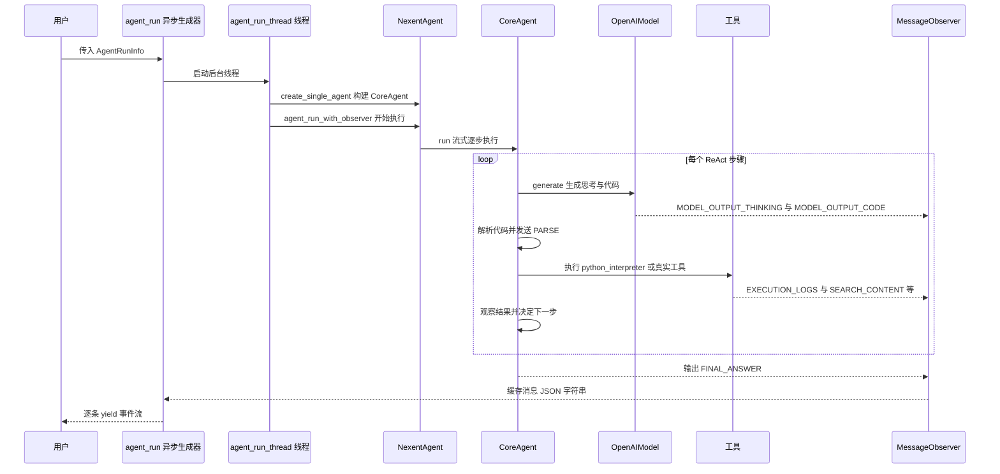

# AI 智能体开发概览

Nexent 提供全面的 AI 智能体开发和部署框架，具备高级功能，包括工具集成、推理和多模态交互。

## 🏗️ 智能体架构

### 核心组件

#### NexentAgent - 企业级智能体框架
Nexent 智能体系统的核心，提供完整的智能体解决方案：

- **多模型支持**: 支持 OpenAI、视觉语言模型、长上下文模型等
- **MCP 集成**: 无缝集成 Model Context Protocol 工具生态
- **动态工具加载**: 支持本地工具和 MCP 工具的动态创建和管理
- **分布式执行**: 基于线程池和异步架构的高性能执行引擎
- **状态管理**: 完善的任务状态追踪和错误恢复机制

#### CoreAgent - 代码执行引擎
继承并增强了 SmolAgents 的 `CodeAgent`，提供以下关键能力：

- **Python代码执行**: 支持解析和执行Python代码，能够动态处理任务
- **多语言支持**: 内置中英文提示词模板，可根据需要切换语言
- **流式输出**: 通过 MessageObserver 实现模型输出的实时流式显示
- **步骤追踪**: 记录并展示Agent执行的每个步骤，便于调试和监控
- **中断控制**: 支持任务中断和优雅停止机制
- **错误处理**: 完善的错误处理机制，提高稳定性
- **状态管理**: 维护和传递执行状态，支持复杂任务的连续处理

CoreAgent 实现了ReAct框架的思考-行动-观察循环：
1. **思考**: 使用大语言模型生成解决方案代码
2. **行动**: 执行生成的Python代码
3. **观察**: 收集执行结果和日志
4. **重复**: 根据观察结果继续思考和执行，直到任务完成

### 🧩 上下文管理
通过 `AgentConfig.context_manager_config`（对应 `ContextManagerConfig`，见 core/agents/context/config.py）开启上下文管理与压缩，NexentAgent 据此构建 `ContextManager` 与 `ManagedContextRuntime`，长对话自动压缩历史并记录指标；上下文运行时基于 ContextItems 支持自适应压缩，压缩产物为 Markdown 摘要且拒绝可执行输出。

### 🗺️ Planning Agent
支持先规划后执行：通过 CreatePlanTool / UpdatePlanStepTool 生成与维护计划待办列表（plan_repo.py），配合 ParallelExecutorTool 并发调度多个子智能体。

### 📦 沙箱
代码执行默认使用本地 LocalPythonExecutor（不启用沙箱）。通过 `AgentConfig.sandbox_policy` / `AgentRunInfo.sandbox_config` 配置 `SandboxConfig`（core/agents/sandbox.py）后，可启用 Docker/WASM 级别的沙箱隔离；`scope` 支持 `session`（默认，每次运行一个容器，运行结束销毁）与 `system`（系统级共享持久容器，每个运行使用独立内核）。

### 🛡️ Guardrail 安全筛查
内置输入/输出内容安全检查点（guardrail checkpoints），敏感内容可拦截。

### 📡 MessageObserver - 流式消息处理
消息观察者模式的核心实现，用于处理 Agent 的流式输出：

- **流式输出捕获**: 实时捕获模型生成的token
- **过程类型区分**: 根据不同的处理阶段（模型输出、代码解析、执行日志等）格式化输出
- **多语言支持**: 支持中英文输出格式
- **统一接口**: 为不同来源的消息提供统一处理方式

ProcessType枚举的常用处理阶段包括（完整定义见 `nexent.core.utils.observer.ProcessType`）：
- `STEP_COUNT`: 当前执行步骤
- `MODEL_OUTPUT_THINKING`: 模型思考过程输出
- `MODEL_OUTPUT_CODE`: 模型代码生成输出
- `PARSE`: 代码解析结果
- `EXECUTION_LOGS`: 代码执行结果
- `AGENT_NEW_RUN`: Agent基本信息
- `FINAL_ANSWER`: 最终总结结果
- `SEARCH_CONTENT`: 搜索结果内容
- `PICTURE_WEB`: 网络图片处理结果

## 🤖 智能体开发

具体的代码示例已集中到 [基本使用](../basic-usage#使用-agent_run推荐的流式运行方式)，其中包含 `CoreAgent.run` 与流式的 `agent_run`。本页仅保留模块层面的概念和能力描述。

### Agent 运行流程图

下图展示 `agent_run` 的真实调用链（基于 core/agents/run_agent.py、nexent_agent.py、core_agent.py）：



## 🛠️ 工具集成

### 自定义工具开发

Nexent 基于 [Model Context Protocol (MCP)](https://github.com/modelcontextprotocol/python-sdk) 实现工具系统。

#### 开发新工具:
1. 在 `backend/tool_collection/mcp/local_mcp_service.py` 实现逻辑
2. 用 `@mcp.tool()` 装饰器注册
3. 重启 MCP 服务

#### 示例:
```python
@mcp.tool(name="my_tool", description="我的自定义工具")
def my_tool(param1: str, param2: int) -> str:
    # 实现工具逻辑
    return f"处理结果: {param1} {param2}"
```

## 🎯 智能体执行模式

### ReAct 模式
问题解决智能体的标准执行模式：
1. **推理**: 分析问题并制定方法
2. **行动**: 执行工具或生成代码
3. **观察**: 检查结果和输出
4. **迭代**: 继续直到任务完成

### 多智能体协作
- **分层智能体**: 管理智能体协调工作智能体
- **专业智能体**: 特定任务的领域专用智能体
- **通信协议**: 智能体间的标准化消息传递

### 错误处理和恢复
- **优雅降级**: 工具失败时的备选策略
- **状态持久化**: 保存智能体状态以便恢复
- **重试机制**: 带退避策略的自动重试

## ⚡ 性能优化

### 执行效率
- **并行工具执行**: 独立工具的并发运行
- **缓存策略**: 缓存模型响应和工具结果
- **资源管理**: 高效的内存和计算使用

### 监控和调试
- **执行跟踪**: 智能体决策的详细日志
- **性能指标**: 时间和资源使用追踪
- **调试模式**: 开发时的详细输出

## 📋 最佳实践

### 智能体设计
1. **明确目标**: 定义具体、可测量的智能体目标
2. **适当工具**: 选择与智能体能力匹配的工具
3. **强大提示词**: 创建全面的系统提示词
4. **错误处理**: 实现全面的错误恢复

### 开发工作流
1. **迭代开发**: 增量构建和测试
2. **提示词工程**: 基于测试结果优化提示词
3. **工具测试**: 集成前验证单个工具
4. **性能测试**: 监控和优化执行速度

### 生产部署
1. **资源分配**: 确保充足的计算资源
2. **监控设置**: 实现全面的日志和告警
3. **扩展策略**: 规划增加的负载和使用
4. **安全考虑**: 验证输入并保护API访问

详细的实现示例和高级模式，请参阅 [开发者指南](../../developer-guide/overview)。