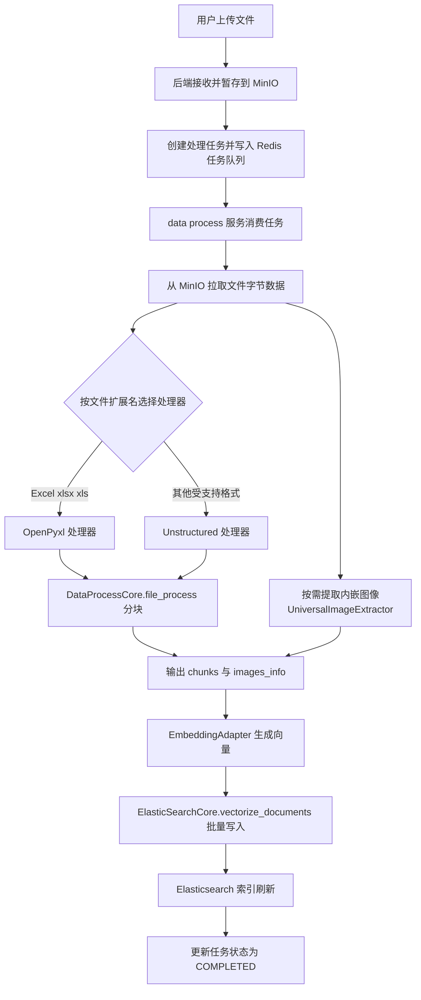

# DataProcessCore 使用指南

## 📋 概述

`DataProcessCore` 是一个统一的文件处理核心类，支持多种文件格式的自动检测和处理，提供灵活的分块策略和多种输入源支持。

## ⭐ 主要功能

### 1. 核心处理方法：`file_process()`

**函数签名：**
```python
def file_process(self, 
                file_data: bytes, 
                filename: str, 
                chunking_strategy: str = "basic", 
                processor: Optional[str] = None, 
                **params) -> Tuple[List[Dict], List[Dict]]
```

**参数说明：**

| 参数名 | 类型 | 必需 | 描述 | 可选值 |
|--------|------|------|------|--------|
| `file_data` | `bytes` | 是 | 文件的字节数据（用于内存处理） | 任何有效的字节数据 |
| `filename` | `str` | 是 | 文件名（用于自动检测文件类型和选择处理器） | 任何有效的文件名 |
| `chunking_strategy` | `str` | 否 | 分块策略 | `"basic"`, `"by_title"`, `"none"` |
| `processor` | `str` | 否 | 指定处理器（不指定时根据文件扩展名自动选择） | `"Unstructured"`, `"OpenPyxl"` |
| `**params` | `dict` | 否 | 额外的处理参数 | 见下方参数详情 |

**分块策略 (`chunking_strategy`) 详解：**

| 策略值 | 描述 | 适用场景 | 输出特点 |
|--------|------|----------|----------|
| `"basic"` | 基础分块策略 | 大多数文档处理场景 | 根据内容长度自动分块 |
| `"by_title"` | 按标题分块 | 结构化文档（如技术文档、报告） | 以标题为界限进行分块 |
| `"none"` | 不分块 | 短文档或需要完整内容的场景 | 返回单个包含全部内容的块 |

**处理器选择规则：**

- 扩展名在 `EXCEL_EXTENSIONS`（`.xlsx`、`.xls`）中 → 使用 `OpenPyxl` 处理器
- 其他支持的扩展名 → 使用 `Unstructured` 处理器
- 当 `params` 中 `model_type="multi_embedding"` 且扩展名在 `EXTRACT_IMAGE_EXTENSIONS`（`.pdf`、`.doc`、`.docx`、`.xls`、`.xlsx`、`.ppt`、`.pptx`）中时，会额外使用 `UniversalImageExtractor` 提取文档内嵌图像

**额外参数 (`**params`) 详解：**

| 参数名 | 类型 | 默认值 | 描述 | 适用处理器 |
|--------|------|--------|------|-----------|
| `max_characters` | `int` | `1536` | 每个块的最大字符数 | Generic（Unstructured） |
| `new_after_n_chars` | `int` | `1024` | 达到此字符数后开始新块 | Generic（Unstructured） |
| `strategy` | `str` | `"fast"` | 处理策略 | Generic（Unstructured） |
| `skip_infer_table_types` | `list` | `[]` | 跳过推断的表格类型 | Generic（Unstructured） |
| `task_id` | `str` | `""` | 任务标识符 | Generic（Unstructured） |
| `model_type` | `str` | 无 | 嵌入模型类型；`"multi_embedding"` 时触发图像提取 | 通用 |

**返回值格式：**

返回 `Tuple[List[Dict], List[Dict]]`，即 `(chunks, images_info)`：

**chunks（分块列表）通用字段：**
| 字段名 | 类型 | 描述 | 示例 |
|--------|------|------|------|
| `content` | `str` | 文本内容 | `"这是文档的第一段..."` |
| `filename` | `str` | 文件名 | `"document.pdf"` |

**可选字段：**
| 字段名 | 类型 | 描述 | 示例 |
|--------|------|------|------|
| `metadata` | `dict` | 元数据信息（可选） | `{"chunk_index": 0, "source_type": "..."}` |
| `language` | `str` | 语言标识（可选） | `"en"` |

**images_info（图像信息列表）：**
提取到的内嵌图像元数据字典列表，未触发图像提取时为空列表。

## 📁 支持的文件类型

### Excel文件
- `.xlsx` - Excel 2007及更高版本
- `.xls` - Excel 97-2003版本

### 通用文件
- `.txt` - 纯文本文件
- `.pdf` - PDF文档
- `.docx` - Word 2007及更高版本
- `.doc` - Word 97-2003版本
- `.html`, `.htm` - HTML文档
- `.md` - Markdown文件
- `.rtf` - 富文本格式
- `.odt` - OpenDocument文本
- `.pptx` - PowerPoint 2007及更高版本
- `.ppt` - PowerPoint 97-2003版本
- `.epub` - EPUB电子书
- `.xml` - XML数据文件
- `.json` - JSON数据文件
- `.csv` - 逗号分隔值文件

## 💡 使用示例

### 示例1：处理本地文本文件（读入内存后处理）
```python
from nexent.data_process import DataProcessCore

core = DataProcessCore()

# 读取文件到内存（file_process 仅支持内存字节数据输入）
with open("/path/to/document.txt", "rb") as f:
    file_bytes = f.read()

chunks, images_info = core.file_process(
    file_data=file_bytes,
    filename="document.txt",
    chunking_strategy="basic"
)

print(f"处理得到 {len(chunks)} 个块")
for i, chunk in enumerate(chunks):
    print(f"块 {i}: {chunk['content'][:100]}...")
```

### 示例2：处理Excel文件
```python
with open("/path/to/spreadsheet.xlsx", "rb") as f:
    file_bytes = f.read()

chunks, images_info = core.file_process(
    file_data=file_bytes,
    filename="spreadsheet.xlsx",
    chunking_strategy="none"  # Excel通常不需要分块
)

for chunk in chunks:
    print(f"文件: {chunk['filename']}")
    print(f"内容: {chunk['content']}")
    print(f"元数据: {chunk.get('metadata')}")
```

### 示例3：处理内存中的PDF并自定义参数
```python
with open("/path/to/document.pdf", "rb") as f:
    file_bytes = f.read()

chunks, images_info = core.file_process(
    file_data=file_bytes,
    filename="document.pdf",
    chunking_strategy="by_title",
    max_characters=2000  # 自定义参数
)
```

### 示例4：多模态嵌入场景下提取文档内嵌图像
```python
chunks, images_info = core.file_process(
    file_data=file_bytes,
    filename="report.docx",
    chunking_strategy="basic",
    model_type="multi_embedding"  # 触发 UniversalImageExtractor 提取内嵌图像
)
print(f"提取到 {len(images_info)} 张图像")
```

### 示例5：拆分大文件
```python
parts = core.file_split(
    file_data=file_bytes,
    filename="large_document.pdf",
    max_size=10 * 1024 * 1024,  # 每个分片最大 10MB（可选参数）
)
print(f"拆分为 {len(parts)} 个分片")
```

## 🛠️ 辅助方法

### 1. 获取支持的文件类型
```python
core = DataProcessCore()
supported_types = core.get_supported_file_types()
print("Excel文件:", supported_types["excel"])
print("通用文件:", supported_types["generic"])
```

### 2. 验证文件类型
```python
is_supported = core.validate_file_type("document.pdf")
print(f"PDF文件是否支持: {is_supported}")
```

### 3. 获取处理器信息
```python
info = core.get_processor_info("spreadsheet.xlsx")
print(f"处理器类型: {info['processor_type']}")
print(f"文件扩展名: {info['file_extension']}")
print(f"是否支持: {info['is_supported']}")
```

### 4. 获取支持的策略和处理器类型
```python
strategies = core.get_supported_strategies()
processors = core.get_supported_processors()
print(f"支持的分块策略: {strategies}")
print(f"支持的处理器类型: {processors}")
```

## ⚠️ 错误处理

### 常见异常

| 异常类型 | 触发条件 | 解决方案 |
|----------|----------|----------|
| `ValueError` | 参数无效（如不支持的分块策略或处理器类型） | 检查参数取值 |
| `UnsupportedFileFormatError` | 文件扩展名不受支持，或内存字节无法识别出类型（未安装 libmagic 时从内存检测类型会失败） | 检查文件扩展名是否受支持；处理内存字节前确认已安装 libmagic |
| `ImportError` | 缺少必需的处理依赖（如 unstructured） | 安装 `nexent[data_process]` extra |
| `RuntimeError` | `file_split()` 拆分失败 | 查看日志定位拆分错误 |

> 💡 **libmagic 依赖提示**：`file_process()` 仅支持内存字节数据输入，unstructured 从内存字节检测文件类型依赖系统 libmagic。Linux/macOS 一般默认可用；Windows 默认无 libmagic，需要先安装（如 `pip install python-magic-bin`），否则处理 `.txt` 等格式会抛出 `UnsupportedFileFormatError`。

### 错误处理示例
```python
from unstructured.partition.common import UnsupportedFileFormatError

try:
    chunks, images_info = core.file_process(
        file_data=file_bytes,
        filename="document.txt",
        chunking_strategy="invalid_strategy"
    )
except ValueError as e:
    print(f"参数错误: {e}")
except UnsupportedFileFormatError as e:
    print(f"文件类型不受支持或无法识别: {e}")
except ImportError as e:
    print(f"缺少依赖: {e}")
except Exception as e:
    print(f"处理失败: {e}")
```

## 🚀 性能优化建议

1. **选择合适的分块策略**：
   - 小文件使用 `"none"`
   - 大文件使用 `"basic"`
   - 结构化文档使用 `"by_title"`

2. **调整分块参数**：
   - 根据下游处理需求调整 `max_characters`
   - 平衡处理速度和内存使用

3. **文件类型优化**：
   - Excel文件通常不需要分块
   - PDF文件建议使用较大的 `max_characters`

4. **批量处理**：
   - 复用 `DataProcessCore` 实例
   - 避免重复初始化

## 🔄 数据处理流程

Nexent 系统中的数据处理遵循以下流程模式：

### 1. 用户请求流程
```
用户输入 → 前端验证 → API调用 → 后端路由 → 业务服务 → 数据访问 → 数据库
```

### 2. AI Agent执行流程
```
用户消息 → Agent创建 → 工具调用 → 模型推理 → 流式响应 → 结果保存
```

### 3. 知识库文件处理流程

```
文件上传 → 临时存储 → 数据处理 → 向量化 → 知识库存储 → 索引更新
```

**数据处理/入库流程图**（基于当前实现的完整链路）：



**详细步骤**：
1. **文件上传**: 前端接收用户上传的文件
2. **临时存储**: 文件存储到 MinIO
3. **任务排队**: 创建处理任务并写入 Redis 任务队列
4. **数据处理**: data process 服务消费任务，`DataProcessCore.file_process()` 完成格式解析与分块（`file_split()` 可预先拆分超大文件），多模态嵌入场景下同时提取内嵌图像
5. **向量化**: 通过 `EmbeddingAdapter` 嵌入模型生成向量表示
6. **知识库存储**: 将处理后的内容经 `ElasticSearchCore.vectorize_documents()` 批量写入 Elasticsearch
7. **索引更新**: 刷新搜索索引并更新任务状态以支持检索

### 4. 实时文件处理流程
```
文件上传 → 临时存储 → 数据处理 → Agent处理 → 实时回答
```

**详细步骤**：
1. **文件上传**: 用户在对话中上传文件
2. **临时存储**: 文件临时保存用于处理
3. **数据处理**: 实时提取文件内容和结构
4. **Agent处理**: AI智能体分析文件内容
5. **实时回答**: 基于文件内容提供即时回复

### 数据处理优化策略

- **异步处理**: 大文件处理使用异步任务队列
- **批量操作**: 多文件处理时使用批量优化
- **缓存机制**: 重复文件的处理结果缓存
- **流式处理**: 大文件的内存流式处理