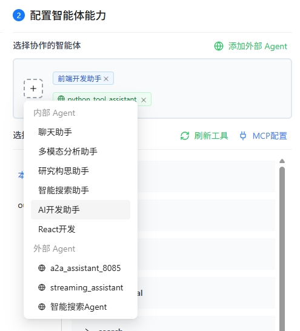
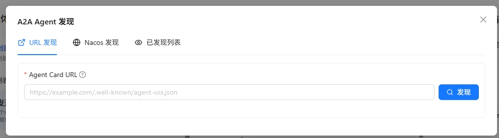
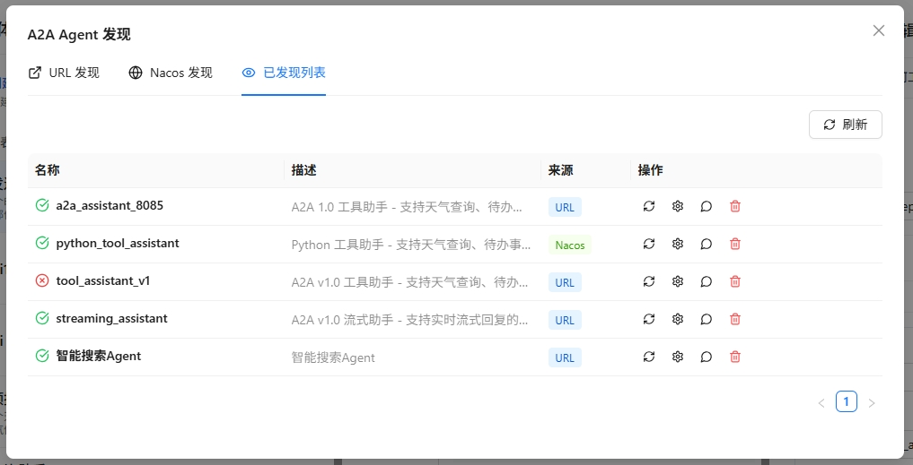
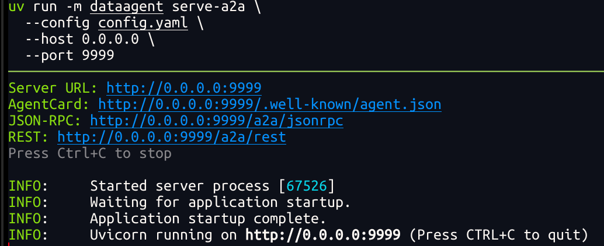

# 添加外部 A2A Agent

Nexent 支持通过 **A2A（Agent-to-Agent）协议**接入第三方 Agent，让跨平台的智能体可以互相协作。本页介绍如何添加与管理外部 A2A Agent。

## 🤝 协作 Agent 的来源

在 **智能体开发 → 协作 Agent** 中，您可以添加两类协作 Agent：

- **内部 Agent**：平台已发布的智能体
- **外部 A2A Agent**：通过 A2A 协议发现的第三方 Agent

  

## 🌐 添加外部 A2A Agent

Nexent 提供两种发现外部 A2A Agent 的方式：**URL 发现** 和 **Nacos 发现**。

### 通过 URL 发现 Agent

如果您知道目标 Agent 的 Agent Card 地址，可以使用 URL 发现方式。

  

1. 在「协作 Agent」页签下点击「添加外部 Agent」
2. 选择「URL 发现」页签
3. 填写 Agent Card URL，例如：`https://example.com/.well-known/agent.json`
4. 如果目标 Agent Card 需要认证，在「自定义请求头」中填写 JSON 对象，例如：`{"Authorization": "Bearer <token>"}`
5. 点击「发现」按钮，系统会自动获取 Agent 的相关信息
6. 发现成功后，可以查看 Agent 的名称、描述、能力等信息
7. 点击「添加到列表」完成添加

> 💡 **提示**：自定义请求头会随该外部 Agent 保存，仅用于获取和刷新 Agent Card，不会用于后续调用 Agent。再次发现同一 URL 时，留空会保留现有配置，填写 `{}` 可清空配置。

> 💡 **提示**：Agent Card 是符合 A2A 1.0 规范的 Agent 描述文件，包含了 Agent 的名称、描述、调用地址、能力等信息。

### 通过 Nacos 发现 Agent

如果您的 Agent 注册在 Nacos 服务发现平台，可以使用 Nacos 发现方式批量接入。

  

1. 在「协作 Agent」页签下点击「添加外部 Agent」
2. 选择「Nacos 发现」页签
3. 首次使用时，需要先配置 Nacos 连接信息：
   - **Nacos 服务器地址**：填写 Nacos 服务器地址，如 `http://127.0.0.1:8848`
   - **命名空间 ID**：填写 Nacos 命名空间 ID（可选）
   - **分组名**：填写服务分组名，默认为 `DEFAULT_GROUP`
   - **用户名/密码**：填写 Nacos 访问凭证（可选）
4. 点击「保存配置」保存 Nacos 连接信息
5. 填写要扫描的 Agent 服务名称
6. 点击「扫描」按钮，系统会从 Nacos 中获取匹配的 Agent 信息
7. 扫描结果会列出所有匹配的 Agent，可以选择需要的 Agent 添加到列表

> ⚠️ **注意**：确保 Nacos 服务正常运行，且目标 Agent 已正确注册到 Nacos。

## 🛠️ 管理已发现的外部 Agent

在「外部 A2A Agent」列表中，您可以查看和管理所有已发现的外部 Agent：

  

1. **查看 Agent 详情**：点击 Agent 卡片，可以查看其完整信息，包括名称、描述、URL、能力列表等
2. **测试 Agent**：点击「测试」按钮，可以向该 Agent 发送测试消息，验证其是否正常工作
3. **与 Agent 对话**：点击「对话」按钮，可以打开对话窗口，与该 Agent 进行实时交互
4. **配置调用协议**：点击「协议配置」按钮，可以选择该 Agent 的调用协议：
   - **HTTP + JSON**：使用 REST API 风格调用
   - **JSON-RPC**：使用 JSON-RPC 协议调用
5. **配置调用认证**：如果 Agent Card 声明了 `securitySchemes` 和 `securityRequirements`，点击「Agent 认证」按钮，填写所需认证值。系统会按 Card 声明将值放入请求头、查询参数或 Cookie；同一认证组合中的字段必须同时填写。
6. **刷新 Agent 信息**：如果 Agent 信息发生变化，可以点击「刷新」按钮重新获取最新的 Agent Card
7. **移除 Agent**：点击「移除」按钮，可以将该 Agent 从已发现列表中删除

> 💡 **使用场景**：
>
> - 通过 URL 发现快速接入已知的第三方 Agent 服务
> - 通过 Nacos 发现批量接入同一服务注册中心的所有 Agent
> - 配置协议以兼容不同 Agent 服务提供商的要求

## 🔌 通过 URL 对接 DataAgent

[DataAgent](https://gitcode.com/datagallery/dataagent) 是一个支持 A2A 协议的智能体平台，下面演示如何将其接入 Nexent：

1. 参考 [DataAgent 文档](https://gitcode.com/datagallery/dataagent#%F0%9F%8C%90-a2a-10-%E6%9C%8D%E5%8A%A1%E6%A8%A1%E5%BC%8F)以 A2A 服务模式启动 DataAgent

   > 当前 Nexent 不支持带认证的 Agent，启动 DataAgent 时请勿设置 `auth-token`

   

     
   

2. 在 Nexent 中选择「URL 发现」，填写 `http://<IP>:9999/.well-known/agent-card.json`，点击「发现」
3. 发现成功后，在「协议配置」中选择 **HTTP + JSON**，即可开始调用

