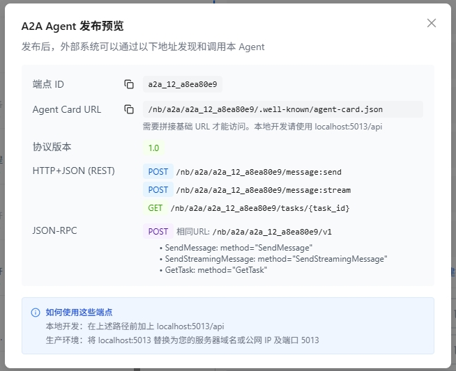
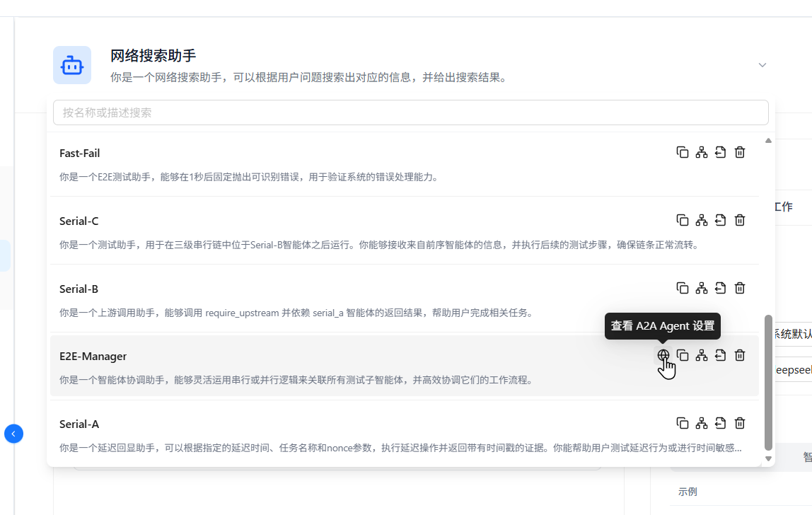

# 发布为 A2A Agent

Nexent 支持将已发布的智能体暴露为符合 A2A 1.0 规范的 Agent，供外部系统通过 REST 或 JSON-RPC 协议发现并调用。本页介绍如何在 Nexent 中发布 A2A Agent，以及如何调用已发布的 A2A Agent。

## 🚀 发布步骤

1. 在 **智能体开发** 中创建或编辑 Agent
2. 完成 Agent 配置并保存
3. 点击「发布」按钮
4. 在发布选项中勾选 **「发布为 A2A Agent」**
5. 确认发布

<div style="display: flex; justify-content: left;">
  
</div>

发布成功后，系统会显示 A2A Agent 的调用信息：

<div style="display: flex; justify-content: left;">
  
</div>

| 信息项             | 说明                                              |
| ------------------ | ------------------------------------------------- |
| **Endpoint ID**    | A2A Agent 的唯一标识符                            |
| **Agent Card URL** | Agent 发现端点，外部系统通过此地址获取 Agent 描述 |
| **协议版本**       | A2A 协议版本，当前为 1.0                          |
| **REST 端点**      | 基于 REST 风格的 API 端点                         |
| **JSON-RPC 端点**  | 基于 JSON-RPC 2.0 协议的调用端点                  |

在 Agent 列表中，点击最左侧的 icon 可以查看 A2A Agent 的调用详情。



## 📞 调用方式

发布后的 A2A Agent 同时支持 REST 和 JSON-RPC 两种调用协议，您可以按需选择。

### REST API

```bash
# 获取 Agent Card（用于 Agent 发现）
GET /nb/a2a/{endpoint_id}/.well-known/agent-card.json

# 发送同步消息
POST /nb/a2a/{endpoint_id}/message:send
Content-Type: application/json

{
  "message": {
    "role": "user",
    "content": "请帮我完成某个任务"
  }
}

# 发送流式消息（SSE）
POST /nb/a2a/{endpoint_id}/message:stream
Content-Type: application/json

{
  "message": {
    "role": "user",
    "content": "请帮我完成某个任务"
  }
}

# 获取任务状态
GET /nb/a2a/{endpoint_id}/tasks/{task_id}
```

### JSON-RPC 2.0

```bash
POST /nb/a2a/{endpoint_id}/v1
Content-Type: application/json

# 发送同步消息
{
  "jsonrpc": "2.0",
  "method": "SendMessage",
  "params": {
    "message": {
      "role": "user",
      "content": "请帮我完成某个任务"
    }
  },
  "id": 1
}

# 发送流式消息
{
  "jsonrpc": "2.0",
  "method": "SendStreamingMessage",
  "params": {
    "message": {
      "role": "user",
      "content": "请帮我完成某个任务"
    }
  },
  "id": 2
}

# 获取任务状态
{
  "jsonrpc": "2.0",
  "method": "GetTask",
  "params": {
    "taskId": "task_abc123"
  },
  "id": 3
}
```

### 本地开发路径前缀

| 部署方式    | 路径前缀                          |
| ----------- | --------------------------------- |
| Docker      | `http://localhost:5013/nb/a2a`    |
| Kubernetes  | `http://localhost:30013/nb/a2a`   |
| 生产环境    | 替换为服务器域名或公网 IP          |

> 💡 **提示**：调用 A2A Agent 需要在请求头中携带有效的认证信息（`Authorization: Bearer {access_key}`），可在「个人信息」中生成 API Key。

> ⚠️ **注意事项**：
>
> - Agent Card 信息会被缓存，刷新间隔为 1 小时
> - 如需更新 Agent 信息，需要重新发布智能体版本

## 🔐 认证

调用 A2A Agent 与调用北向 API 一样，需要在请求头中携带 API Key：

```http
Authorization: Bearer {access_key}
```

在「个人信息 → 生成 API 密钥」处创建并复制。

## 🏷️ 版本管理

- 已发布的 A2A Agent 不可修改，但可以发布新版本
- 重新发布后，外部系统可以通过刷新后的 Agent Card 获取最新信息

## ❓ 常见问题

### Q: 普通发布和 A2A 发布可以同时开启吗？

可以。发布时既默认开放北向 RESTful API，又勾选「发布为 A2A Agent」，即可同时支持两种调用方式。

### Q: A2A 调用返回 401 错误？

确认请求头中包含有效的 `Authorization` 字段，且 `access_key` 正确。

### Q: 如何更新已发布的 A2A Agent？

重新发布 Agent 版本即可。新的版本会通过刷新后的 Agent Card 暴露给调用方。
