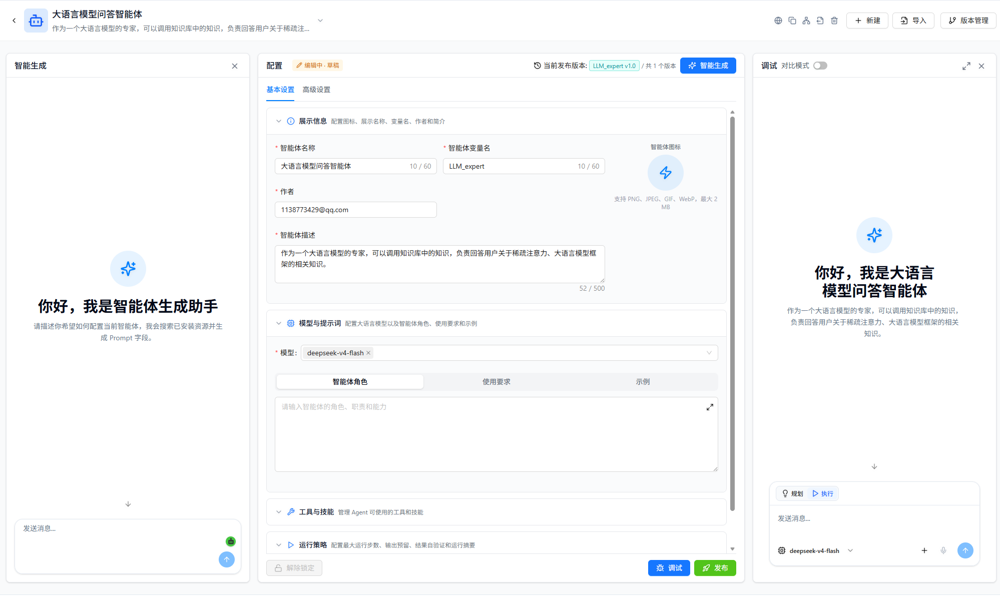

# 智能体开发

在智能体开发页面中，您可以创建、配置和管理智能体。页面由“智能生成”和“配置”面板组成：智能生成负责把自然语言需求转换为配置草稿，配置面板用于手动调整参数，在配置完成后，可在配置页面右下角点击“调试”，调出“调试”面板用于验证实际运行效果。

  

## 🔧 创建智能体

在“智能体开发”的“智能体配置”页签下，点击右上角的“新建”创建空白智能体。创建或选择一个可编辑的智能体后，可以在智能生成面板描述需求，也可以直接在配置面板中手动填写。若当前智能体只有只读权限，页面会显示配置内容，但不会允许生成或修改。

如果您有现成的智能体配置，也可以点击“导入”，使用 JSON 或 ZIP 文件创建智能体。有关导出文件、导入步骤、重名处理和依赖检查的完整说明，请参阅 [Agent 导出与导入](../../integration/integration-out/agents-export.md)。

## 👥 配置协作智能体/工具

您可以为创建的智能体配置其他协作智能体，也可以为它配置可使用的工具，以赋予智能体能力完成复杂任务。

### 🤝 协作 Agent

协作智能体用于帮助当前智能体完成复杂任务。协作智能体的来源分为两类：

- **内部 Agent**：平台已发布的智能体
- **外部 A2A Agent**：通过 A2A 协议发现的第三方 Agent

1. 点击"协作 Agent"页签下的加号，弹出可选择的智能体列表
2. 智能体列表分为"内部 Agent"和"外部 A2A Agent"两个页签，您可以根据需要选择
3. 在下拉列表中选择要添加的智能体
4. 允许选择多个协作智能体
5. 可点击 × 取消选择此智能体

  

#### 🌐 添加外部 A2A Agent

Nexent 支持通过 URL 或 Nacos 发现第三方 A2A Agent，再将其添加为协作智能体。有关发现、认证、协议配置、连通性测试和 DataAgent 接入示例，请参阅 [添加外部 A2A Agent](./a2a-external.md)。如需了解 A2A 接入流程和协议概念，请参阅 [Agent 智能体接入](../../integration/integration-in/agents.md)。

### 🛠️ 选择智能体的工具或技能

智能体可以使用各种工具与技能来完成任务，如知识库检索、文件解析、图片解析、收发邮件、文件管理等本地工具，也可接入第三方或自行开发的 MCP 工具或技能。

1. 在"选择智能体的工具"页签右侧，点击"刷新工具"来刷新可用工具列表
2. 点击"选择工具"或"选择技能"按钮，可根据标签分组浏览当前可用的工具或技能清单
3. 点击 ⚙️ 查看工具或技能的描述，并配置工具或技能参数
4. 点击即可选中工具或技能，回到智能体已选择工具或已选择技能处可执行删除
   - 如果工具有必填参数没有配置，选择时会弹出弹窗引导进行参数配置
   - 如果所有必备参数已配置完成，选择则会直接选中

> 💡 **小贴士**：
>
> 1. 请选择 `knowledge_base_search` 工具，启用知识库的检索功能。
> 2. 请选择 `analyze_text_file` 工具，启用文档类、文本类文件的解析功能。
> 3. 请选择 `analyze_image` 工具，启用图片类文件的解析功能。
>
> ⚠️ **注意**：使用 `knowledge_base_search` 工具时，需要事先创建知识库。请务必确保**创建知识库时使用的向量化模型**与当前生效的向量化模型一致。否则将会导致检索失败或结果不准确。
>
> 📚 想了解系统已经内置的所有本地工具能力？请参阅 [本地工具概览](../local-tools/index.md)。
> 📚 想了解技能能力？请参阅 [技能管理](../resource-repository/skill-repository.md)。

### 🔌 添加 MCP 工具

在“选择智能体的工具”页签中点击“MCP 配置”，可以接入远程 MCP、容器化 MCP，或将已有 API 转换为 MCP 工具。有关三种接入方式、OpenAPI 要求、服务管理和工具测试，请参阅 [MCP 服务接入](../../integration/integration-in/mcp.md)。

### ⚙️ 自定义工具

您可参考以下指导文档，开发自己的工具，并接入 Nexent 使用，丰富智能体能力。

- [LangChain 工具指南](../../backend/tools/langchain)
- [MCP 工具开发](../../backend/tools/mcp)
- [SDK 工具文档](../../sdk/core/tools.md)

### 🔌 创建或导入技能

在智能体的高级配置中切换到“选择技能”页签，点击“构建技能”，可以通过对话创建 Skill，也可以上传 `.md` 或 `.zip` 文件。创建完成后，需要选择该 Skill 并保存智能体配置，智能体才能使用它。

有关文件格式、`SKILL.md` 结构、上传限制和关联步骤，请参阅 [Skill 技能接入](../../integration/integration-in/skills.md)。有关技能的查看、编辑、权限和删除，请参阅 [技能管理](../resource-repository/skill-repository.md)。

### 🧪 工具测试

无论是什么类型的工具（内置工具、外部接入的 MCP 工具，还是自定义开发工具），Nexent 都提供了"工具测试"能力。如果您在创建智能体时不确定某个工具的效果，可以使用测试功能来验证工具是否按预期工作。

1. 点击工具的小齿轮按钮 ⚙️，进入工具的详细配置弹窗
2. 首先确保已经配置了工具的必备参数（带红色星号的参数）
3. 在弹窗的左下角点击"工具测试"按钮
4. 右侧会新弹出一个测试框
5. 在测试框中输入测试工具的入参，例如：
   - 测试本地知识库检索工具 `knowledge_base_search` 时，需要输入：
     - 测试的 `query`，例如"维生素C的功效"
     - 检索的模式 `search_mode`（默认为 `hybrid`）
     - 目标检索的知识库列表 `index_names`，如 `["医疗", "维生素知识大全"]`
   - 若不输入 `index_names`，则默认检索知识库页面所选中的全部知识库
     - 是否启用重排模型（默认为 `false`），启用后配置重排模型，实现对检索结果的重排优化
6. 输入完成后点击"执行测试"开始测试，并在下方查看测试结果

  

## 📝 描述业务逻辑

### ✍️ 描述智能体应该如何工作

在“智能生成”面板中直接描述业务目标、使用对象、输入输出和限制条件。系统既可以生成完整配置，也可以只优化指定字段或资源。

首次生成完整配置时，按以下步骤操作：

1. **描述需求**：说明智能体要解决的问题，例如“创建一个面向售后人员的产品问答助手，优先使用内部知识库，回答时给出来源”。
2. **澄清需求**：系统在信息不足时显示问题卡片。选择合适的选项，也可以在“其他”中补充说明后提交。
3. **应用草稿**：系统生成智能体描述、职责提示词、约束提示词、示例、开场白和示例问题后，点击“应用到草稿”，再在配置面板中检查结果。

生成或资源绑定进行中时，配置表单会暂时锁定，避免人工编辑与生成结果互相覆盖。如生成异常或不想继续等待，可点击“解除锁定”；该操作会停止当前生成，再恢复手动编辑。

对于已有配置，可以使用智能生成面板中的快捷操作进行局部优化。点击卡片后，系统会把对应指令填入输入框；您可以直接发送，也可以先补充要求再发送。

| 快捷操作 | 处理内容 |
| --- | --- |
| **生成提示词** | 根据当前角色以及已绑定的工具和 Skill，生成职责提示词、约束提示词和示例提示词，其他配置保持不变 |
| **推荐可用工具** | 根据当前角色搜索并推荐工具；确认绑定后，重新生成受资源变化影响的提示词 |
| **推荐可用技能** | 根据当前角色搜索并推荐 Skill；确认绑定后，重新生成受资源变化影响的提示词 |
| **生成会话引导** | 生成开场白和示例问题，其他配置保持不变 |

智能生成会根据本轮要求执行最小范围的修改，不会自动重新生成整套配置。如果新增或替换资源，系统会同步更新与该资源相关的提示词；如需移除工具或 Skill，请在右侧配置面板的“工具与技能”区域操作。

  

#### 📋 智能体基础信息配置

配置面板的“基本设置”包含五个可折叠区域：

| 区域 | 主要配置 |
| --- | --- |
| **展示信息** | 图标、展示名称、变量名、作者和简介 |
| **模型与提示词** | 大语言模型、职责提示词、约束提示词和示例提示词 |
| **工具与技能** | 智能体可以调用的工具、Skill 及其参数 |
| **运行策略** | 最大步数、输出预留、运行摘要、自验证和会话 Metadata 开关 |
| **发布属性** | 用户组、组内权限、是否为主智能体以及 A2A 发布设置 |

智能体变量名只能包含字母、数字和下划线，且必须以字母或下划线开头。建议使用能体现用途的英文名称，例如 `code_assistant` 或 `data_analyst`。

如果智能体原先配置的模型已被删除，配置面板顶部会显示“智能体不可用：部分已配置的模型已删除”。点击提示中的“刷新”可以重新检查可用状态；随后需要在“模型与提示词”区域选择可用模型并保存配置。刷新只更新状态，不会恢复已删除的模型。

“允许会话 Metadata”默认关闭。开启后，使用者可以在开始问答页面为每个会话填写 JSON 对象，并把业务标识、渠道或其他运行参数传给模型。Metadata 对模型可见，大小不能超过 64 KiB；不要在其中填写密码、访问令牌或其他敏感信息。

#### ⚙️ 高级设置

“高级设置”页签用于配置智能体与其他资源之间的关系：

##### 高级配置区域

| 区域 | 主要配置 |
| --- | --- |
| **协作智能体** | 添加内部智能体或外部 A2A Agent，并配置协作关系 |
| **知识库** | 选择智能体可检索的知识库；选择后会启用知识库检索能力并建立关联 |
| **会话引导** | 设置用户首次进入问答页面时看到的开场白和示例问题 |
| **安全护栏** | 配置内容匹配规则、命中后的处理动作和规则测试 |

知识库和协作智能体必须在当前账号的可访问范围内。导入或复制智能体后，应重新检查这些关联资源，因为其他环境中的资源标识和权限不会自动迁移。

##### 🚧安全护栏

安全护栏使用按顺序执行的正则表达式规则，检查发送给模型的内容以及工具调用过程中的数据。安全护栏默认关闭，且不依赖"自验证"开关；需要单独打开"规则列表"旁的开关，并至少配置一条有效规则。规则按列表顺序匹配，同一段内容以首个命中的规则为准。

每条规则包含以下配置：

| 配置项           | 说明                                                                                                                      |
| ---------------- | ------------------------------------------------------------------------------------------------------------------------- |
| **规则名称**     | 规则的唯一标识。名称重复时界面会给出提示，建议使用能表达检测目标的名称。                                                  |
| **正则表达式**   | 使用 Python `re` 语法描述要匹配的内容。运行时默认忽略大小写；语法无效的规则不会参与运行时检查。                          |
| **严重级别**     | 指定命中后的处理方式：**阻断**、**脱敏**或**放行**。新建规则默认为"阻断"。                                             |
| **说明**         | 可选的规则用途说明，便于维护和审查。                                                                                      |

不同严重级别在各检查位置的实际行为如下：

| 严重级别 | 最新用户输入             | 历史消息                   | 工具入参                         | 工具输出                         |
| -------- | ------------------------ | -------------------------- | -------------------------------- | -------------------------------- |
| **阻断** | 终止本次运行并返回拒绝说明 | 降级为脱敏后再发送给模型   | 阻止本次工具调用                 | 因工具已经执行，降级为脱敏       |
| **脱敏** | 将命中内容替换为 `***` 后继续 | 将命中内容替换为 `***` 后继续 | 将命中的字符串参数替换为 `***` 后调用工具 | 将命中内容替换为 `***` 后写入智能体上下文 |
| **放行** | 不修改内容，继续运行     | 不修改内容，继续运行       | 不修改参数，继续调用             | 不修改输出，继续运行             |

安全护栏还提供以下辅助能力：

- **智能生成**：选择用于生成的模型，并用自然语言描述要匹配或拦截的内容。系统会自动判断生成单个候选表达式还是多条规则；确认候选或勾选规则后再导入列表。
- **规则管理**：支持手动添加、编辑、复制、单条删除和批量删除规则，并显示阻断、脱敏、放行规则的数量分布。
- **正则测试预览**：粘贴样本文本后，可以实时查看命中的文本、规则名称和命中次数。预览仅用于验证匹配效果，不会执行阻断或脱敏动作。

> ⚠️ **注意**：安全护栏是基于正则表达式的内容筛查，不等同于完整的语义安全审核。AI 生成的规则也可能存在误报或漏报；请先在"正则测试预览"中使用正常样本和风险样本进行验证，再保存配置。

## 🐛 调试与保存

配置面板顶部的“草稿”表示当前修改尚未形成正式发布版本。完成初步配置后：

1. 点击“调试”。系统先校验并保存当前草稿，再打开调试面板。
2. 使用具有代表性的问题验证提示词、知识检索、工具调用和协作流程。
3. 根据运行过程和错误提示修改配置，然后再次调试。
4. 点击“发布”。系统再次保存草稿，并打开版本发布窗口。

只有发布成功的主智能体才会出现在“开始问答”等正式使用入口中。调试不会启用记忆检索和写入，因此跨会话记忆效果需要在“开始问答”中验证。

## 🐛 版本管理

Nexent 支持智能体的版本管理，您可以在调试过程中，保存不同版本的智能体配置。

确认智能体配置无误后，您可点击"发布"按钮正式发布智能体。发布后智能体将在 Agent 仓库、开始问答中可见，并可进行历史版本管理。

点击"版本管理"栏目右下角的版本对比按钮，可以回顾历史版本的信息，并与最新版本的问答效果进行对比。

若需回滚到其他版本，可在版本右侧的菜单中点击"回滚"。

### 🚀 发布为 A2A Agent

发布版本时勾选“发布为 A2A Agent”，可以让外部系统通过 REST 或 JSON-RPC 协议发现并调用该智能体。发布步骤、调用信息、认证和版本更新方法请参阅 [发布为 A2A Agent](./a2a-publish.md)。

如果需要通过普通北向 RESTful API 开放智能体，请参阅 [Agent 发布](../../integration/integration-out/agents-publish.md)；接口参数和完整请求示例请参阅 [调用 Agent 北向 API](../../integration/integration-out/northbound-api.md)。

## 🔧 管理智能体清单

点击"选择智能体"，您可浏览当前环境中可以编辑的完整智能体清单。你可以在上方的搜索框中

智能体条目右侧的一系列icon按钮代表了你可以对智能体执行的所有管理操作。从左至右分别为：

### 📋 复制

创建完全一致的 Agent 克隆体，便于多版本备份或并行测试。

### 🔗 查看调用关系

查看智能体所使用的协作智能体/工具，以树状图形式明晰查看智能体调用关系。

  

### 📤 导出

可将调试成功的智能体导出为 JSON 或 ZIP 文件，并在其他环境中重新导入。有关格式选择、依赖处理和导入限制，请参阅 [Agent 导出与导入](../../integration/integration-out/agents-export.md)。

### 🗑️ 删除

从本地环境中彻底删除智能体。

## 🚀 下一步

完成智能体开发后，您可以：

1. 在 **[Agent仓库](../agent-development.md)** 中管理、发布你的智能体，或获取更多其他开发者的智能体
2. 在 **[开始问答](../start-chat.md)** 中与智能体进行交互
3. 在 **[记忆管理](./memory-configuration.md)** 配置记忆以提升智能体的个性化能力

如果您在使用程中遇到任何问题，请参考我们的 **[常见问题](../../quick-start/faq.md)** 或在 [GitHub Discussions](https://github.com/ModelEngine-Group/nexent/discussions) 中进行提问获取支持。
