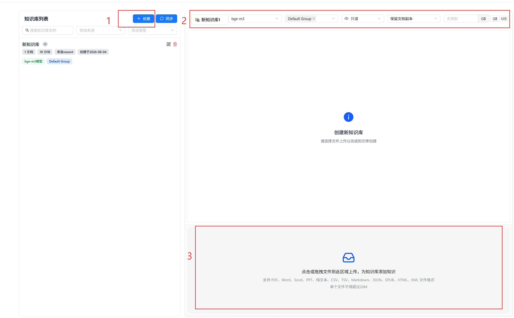
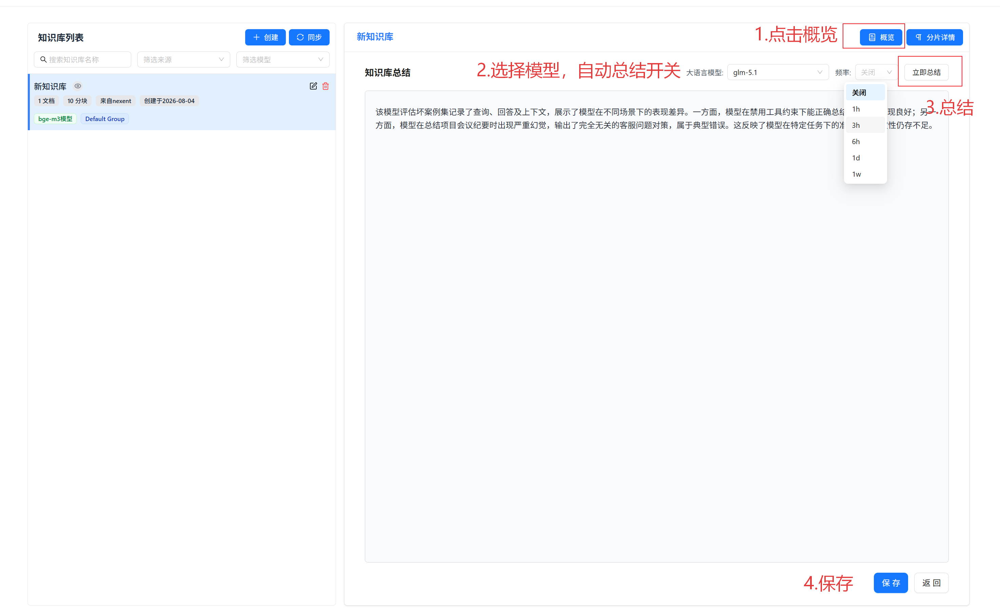
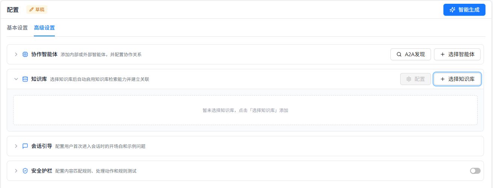
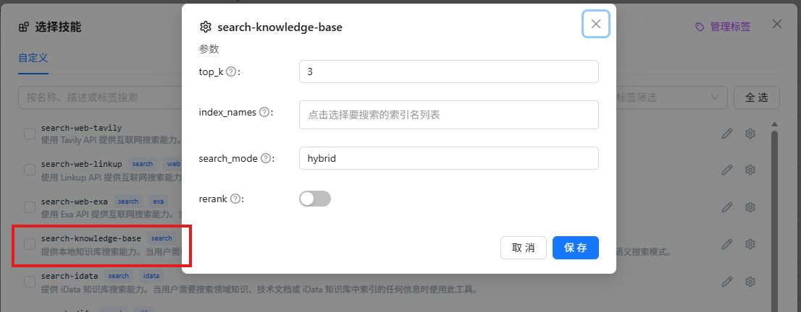
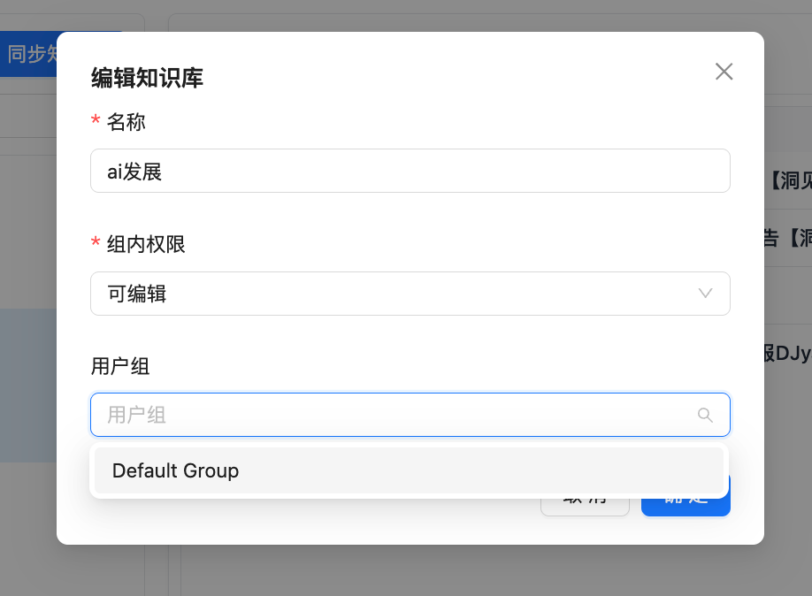

# 知识库配置

在知识库模块，您可以创建和管理知识库、上传文件、查看处理状态、维护 Chunk（分片），并生成内容总结。管理员和开发者可按用户组共享知识库；普通用户也可以创建和管理自己的私有知识库。

普通用户在知识库列表底部可以看到“个人知识库容量”，其中显示当前已用空间和有效配额。若管理员没有设置上限，页面显示“无限制”；达到配额后，系统会阻止继续创建内容或上传文件，但不会删除已有数据。

## 🔧 创建知识库

1. 点击左侧知识库列表上方的“创建知识库”按钮
2. 在弹出的创建面板中，填写以下配置项：

| 配置项         | 说明                                                                                                                                                                                                                             |
| -------------- | -------------------------------------------------------------------------------------------------------------------------------------------------------------------------------------------------------------------------------- |
| **知识库名称** | 必填，名称必须唯一，且只能包含中文字符或小写字母，不允许空格、斜杠等特殊字符。系统会在输入时自动检测名称是否重复                                                                                                                 |
| **向量模型**   | 选择用于文档向量化的 Embedding 模型。模型分为两类：**文本向量模型（embedding）** 和 **多模态向量模型（multi_embedding）**。选择多模态向量模型后，知识库将自动支持图片等非文本内容的向量化处理。详见[向量模型说明](#向量模型说明) |
| **用户组**     | 选择知识库可见的用户组（多选），控制哪些用户组可以查看和使用该知识库；普通用户创建个人知识库时不显示该项                                                                                                                         |
| **组内权限**   | 设置用户组内成员的操作权限：**可编辑（EDIT）**可维护内容，**只读（READ_ONLY）**只能查看和检索，**私有（PRIVATE）**仅创建者和管理员可用；普通用户的知识库固定为私有                                                                 |
| **保留源文件** | 开启后，上传的原始文件会被保留存储在系统中，方便后续重新处理或下载；关闭则仅保留向量化后的数据                                                                                                                                   |
| **存储配额**   | 可选，为该知识库设置存储上限（支持 GB/MB 单位切换）。当上传文件导致存储用量接近配额时，系统会发出预警提示                                                                                                                        |

3. 配置完成后，在下方文件上传区域选择要上传的文件（可跳过，后续再上传）
4. 文件上传后系统自动创建知识库并开始处理文件

## 📁 上传文件

### 上传文件

1. 在知识库列表中选择要上传文件的知识库
2. 点击文件上传区域，选择要上传的文件（支持多选），或直接拖拽文件到上传区域
3. 系统会自动处理上传的文件，提取文本内容并进行向量化
4. 可在列表中查看文件的处理状态

:::tip 文件大小限制
单个文件上传大小限制为 **20 MB**。超过此限制的文件将无法上传。
:::

上传前系统还会检查知识库自身配额、租户容量和个人知识库容量。若页面提示容量不足，请先删除不再需要的文件，或联系管理员调整相应配额。

### 文件处理状态

文件上传后会经过多个处理阶段，共有 6 种状态：

| 状态         | 说明                                                                 |
| ------------ | -------------------------------------------------------------------- |
| 等待处理     | 文件已上传，排队等待开始解析                                         |
| **解析中**   | 系统正在提取文件文本内容                                             |
| **入库中**   | 文本内容正在进行向量化并写入向量数据库                               |
| **已就绪**   | 文件处理完成，可正常检索使用                                         |
| **解析失败** | 文件解析过程中出错。将光标移至状态图标可查看详细错误原因和排查建议   |
| **入库失败** | 向量化入库过程中出错。将光标移至状态图标可查看详细错误原因和排查建议 |

将光标移到状态图标上，可以查看当前进度，例如“已处理 23/50 个切片”。解析失败或入库失败时，提示框会同时给出错误原因和建议处理方式。常见情况包括：

- 文件不存在、超过 20 MB 或类型不受支持
- 文件无法提取有效文本，或包含不受支持的换行格式
- 向量模型繁忙、维度不匹配或单次切片数量超过模型并行度
- Elasticsearch、对象存储或数据处理服务不可用
- 知识库、租户或个人知识库容量已达上限

根据提示修复问题后重新上传；如果问题指向平台服务或存储空间，请联系管理员处理，不要连续重复提交相同文件。

### 支持的文件格式

知识库上传区域当前支持：

- **文本与结构化数据**：`.txt`、`.md`、`.csv`、`.json`、`.xml`
- **网页**：`.html`
- **PDF 与电子书**：`.pdf`、`.epub`
- **Word**：`.doc`、`.docx`
- **PowerPoint**：`.pptx`
- **Excel**：`.xlsx`

文件后缀受支持不代表一定能提取有效内容。例如纯扫描 PDF 可能没有可解析文本，需要先完成 OCR 或使用支持图像内容的处理方式。

## 📊 知识库总结

建议您为每个知识库配置准确且完整的总结描述，这有助于后续智能体在进行检索时，准确选择合适的知识库。

### 手动生成与编辑总结

1. 点击知识库名称右侧的"详细内容"按钮，进入知识库概览页面
2. 在概览页面选择合适的大语言模型（LLM），点击"自动总结"按钮为知识库自动生成内容总结
3. 您可对生成的内容总结进行编辑修改，使其更准确
4. 最后记得点击"保存"将您的修改保存

### 自动总结频率

除了手动触发总结，您还可以为知识库设置**定时自动总结**，让系统在后台定期重新生成知识库的内容总结：

| 频率选项 | 说明                                     |
| -------- | ---------------------------------------- |
| 1 小时   | 高频更新，适用于内容变化频繁的知识库     |
| 3 小时   | 中高频更新                               |
| 6 小时   | 中频更新                                 |
| 1 天     | 每天更新一次，适用于大多数场景           |
| 1 周     | 每周更新一次，适用于内容较为稳定的知识库 |

在概览页面的总结区域选择频率即可。系统会智能判断知识库是否有文档更新，若无新文档变更则跳过本次自动生成，避免不必要的资源消耗。

## 📂 Chunk 分片管理

文档上传后，系统会将文档拆分为多个 **Chunk（分片）**，每个分片包含一段文本内容并生成对应的向量索引。您可以对分片进行精细化管理：

### 查看分片

1. 点击知识库名称进入文档列表
2. 点击上方"Chunk 详情"标签页
3. 页面顶部会列出知识库中的所有文档，点击某个文档即可查看其分片
4. 分片以卡片形式分页展示，包含内容、字符数、来源和相关性评分等信息

### 搜索分片

在 Chunk 详情页使用搜索框进行搜索，系统会同时进行关键词与语义匹配，并按综合相关性展示结果。清空搜索框后会返回当前文档的分页列表。

### 手动管理分片

| 操作     | 说明                                       |
| -------- | ------------------------------------------ |
| **创建** | 在 Chunk 详情页手动添加自定义分片；创建后跳转到最后一页查看新内容 |
| **编辑** | 修改分片文本并重新生成对应向量 |
| **删除** | 删除不需要的分片，并同步更新知识库分片数 |
| **下载** | 将单个分片内容下载为 `.txt` 文件 |

## 🧩 向量模型说明

系统中的 Embedding 模型分为两类：

- **文本向量模型（embedding）**：用于纯文本文档的向量化，如 BGE、M3E 等
- **多模态向量模型（multi_embedding）**：可同时处理文本和图片内容，如 DashScope、Jina 等

知识库创建时选择的向量模型会与该知识库绑定。建议在创建知识库时根据文档类型选择合适的模型，创建后该模型将贯穿知识库的整个生命周期。

## 🔧 使用知识库

Nexent 支持知识库与智能体绑定。创建智能体时，在工具配置区域的**高级设置**启用对应的知识库检索工具，并选择关联的知识库。

根据知识库来源的不同，系统提供对应的检索工具。Nexent 原生知识库使用 **knowledge_base_search** 工具：

在工具配置弹窗中，您可看到已绑定的知识库列表，支持搜索和勾选操作。每个知识库旁边会显示其向量模型信息，帮助您确认兼容性。

## 🔍 知识库管理

### 查看知识库

1. **知识库列表**
   - 知识库页面左侧展示了所有已创建的知识库
   - 知识库列表处支持按名称搜索、按知识库来源和向量模型筛选
   - 每张知识库卡片展示以下信息：

   | 信息项       | 说明                                                   |
   | ------------ | ------------------------------------------------------ |
   | 知识库名称   | 创建时设定的名称                                       |
   | 文档数量     | 已上传的文档总数                                       |
   | 分片数量     | 文档拆分后的 chunk 总数                                |
   | 来源         | 知识库来源（Nexent 原生 / 外部来源）                   |
   | 创建时间     | 知识库创建日期                                         |
   | 向量模型     | 绑定的 Embedding 模型名称                              |
   | 多模态标签   | 若启用多模态则显示                                     |
   | 用户组标签   | 该知识库可见的用户组名称                               |
   | 权限图标     | 当前用户对该知识库的操作权限（将光标移至图标查看说明） |
   | 无源文件标签 | 若已关闭"保留源文件"则显示                             |

2. **知识库详情**
   - 点击知识库名称，可查看知识库中全部文档信息
   - 点击"详细内容"，可进入知识库概览页面查看和编辑内容总结

> 点击编辑，可管理知识库的名称、可见的用户组及组内权限

### 编辑知识库

1. **删除知识库**
   - 点击知识库名称右侧"删除"按钮
   - 确认删除操作（此操作不可恢复）

2. **删除或新增文件**
   - 点击知识库名称，在文件列表中点击"删除"按钮，可从知识库中删除文件
   - 点击知识库名称，在文件列表下方文件上传区域，可新增文件到知识库中

## 🚀 下一步

完成知识库配置后，建议您继续配置：

1. **[智能体开发](../agent-development)** - 创建和配置智能体
2. **[开始问答](../start-chat)** - 与智能体进行交互

如果您在使用过程中遇到任何问题，请参考我们的 **[常见问题](../../quick-start/faq.md)** 或在[GitHub Discussions](https://github.com/ModelEngine-Group/nexent/discussions)中进行提问获取支持。
