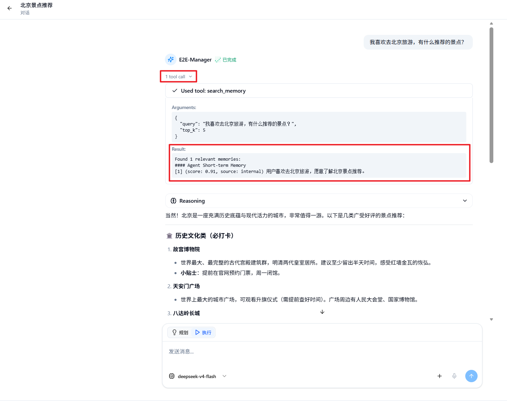

# 记忆配置

Nexent 的记忆功能用于保留跨轮次、跨会话仍有价值的信息。当前系统采用 **Tenant、User、Agent 三层架构**：Tenant 和 User 层以可版本化的长期记忆文档提供稳定上下文，Agent 层保存当前用户与智能体交互时自动归纳的短期记忆。

开启记忆后，系统会在智能体运行前加载 Tenant、User 长期记忆，并根据本轮问题检索相关的 Agent 短期记忆；在运行结束前，智能体还会判断是否产生了值得保存的新信息。

## 🎯 运作机制

一次正式问答中的记忆流程如下：

1. 加载当前租户的 Tenant 活跃版本和当前用户的 User 活跃版本。
2. 使用用户的最新问题，在该用户的 Agent 短期记忆中检索相关内容。
3. 将筛选后的记忆加入智能体上下文。
4. 智能体结合记忆、当前问题、历史消息和工具结果生成回答。
5. 输出最终回答前，智能体判断是否出现新的偏好、目标、计划、进展或纠错信息；有价值时，将其归纳为简洁的 Agent 短期记忆。

记忆检索失败时，系统会跳过记忆并继续当前任务，避免记忆服务异常中断整个问答。

> 💡 **说明**：智能体调试模式不会检索或写入记忆，避免测试数据影响正式记忆。请在“开始问答”中验证跨会话效果。

## ⚙️ 进入记忆配置

1. 在左侧导航栏中点击“记忆配置”。
2. 页面包含“基础设置”“Tenant”“User”和“Agent”四个页签。
3. “Tenant”和“User”页签显示长期记忆文档及版本；“Agent”页签显示短期记忆记录。

### 基础设置

“记忆能力”是总开关：

| 配置项 | 默认值 | 说明 |
| --- | --- | --- |
| **记忆能力** | 开启 | 开启后，正式问答会加载、检索和写入记忆；关闭后不再使用记忆，但已有内容不会被删除。 |

开关修改后会立即保存。如果保存失败，页面会恢复到修改前的状态并显示提示。

基础设置页还提供 Dreaming 的执行计划和高级参数，详见下文。

## 📚 三层记忆架构

| 层级 | 可见与生效范围 | 主要来源 | 使用方式 |
| --- | --- | --- | --- |
| **Tenant** | 当前租户内共享 | 具有权限的用户手动维护 | 加载活跃版本，作为组织级长期上下文 |
| **User** | 仅当前用户可见 | 用户手动维护或 Dreaming 生成 | 加载活跃版本，作为个人长期上下文 |
| **Agent** | 当前用户与智能体之间隔离 | 正式问答自动归纳 | 根据当前问题检索相关短期记忆 |

### Tenant 记忆

Tenant 记忆适合保存组织范围内稳定、通用的信息，例如企业术语、统一口径、工作规范和长期约束。它以 Markdown 文档形式维护，并保留版本历史。

只有具备 Tenant 记忆编辑权限的用户才能修改或切换活跃版本。普通成员可以在智能体运行时使用当前活跃版本，但不能修改组织级记忆。

### User 记忆

User 记忆只属于当前用户，适合保存跨智能体复用的语言偏好、工作习惯和持续性项目背景。用户可以直接编辑该长期记忆，也可以通过 Dreaming 从短期记忆中整理生成新版本。

### Agent 记忆

Agent 记忆由正式问答自动生成，同时绑定当前用户和产生它的智能体。它主要保存：

- 用户对该智能体表达的偏好
- 当前任务目标、行动计划和最新进展
- 根据用户反馈、报错或失败结果形成的纠错与反思

同一用户的 Agent 记忆不会自动共享给其他用户。主智能体和协作智能体分别保存自己的短期记忆。系统会先判断、归纳并去重，再写入单条简洁内容；单次运行最多自动保存 3 条短期记忆。

## 🌙 使用 Dreaming 整理长期记忆

Dreaming 会分析当前用户积累的 Agent 短期记忆，筛选反复被召回、由不同问题验证且与近期任务相关的内容，再生成新的 User 长期记忆版本。它始终可用，但只有开启自动计划后才会定时运行。

### 手动运行与自动计划

- 点击“立即 Dreaming”可把任务加入后台队列。页面会显示排队、运行阶段、完成或失败状态。
- 自动计划支持每天、每周和固定小时间隔三种方式，并按页面显示的时区计算下次执行时间。
- 同一用户已有 Dreaming 任务运行时，重复请求会被跳过，避免同时修改同一个长期记忆版本。
- 如果本轮没有短期记忆达到稳定性门槛，系统不会创建空版本；积累更多有效交互后再运行即可。
- Dreaming 失败不会破坏当前活跃的长期记忆版本。

Dreaming 依次完成短期信号收集、稳定模式识别、候选筛选和长期记忆生成。执行依赖专用后台 worker；若长时间停留在排队状态，请联系管理员检查对应服务。

### 高级参数

默认值适合大多数用户。只有在纳入内容过多、过少或输出长度不合适时，才建议调整：

| 参数 | 默认值 | 作用 |
| --- | ---: | --- |
| **最低评分** | 0.75 | 低于综合稳定性评分的记忆不会提升 |
| **最低召回** | 3 | 要求短期记忆至少被再次使用的次数 |
| **最低查询** | 3 | 要求有多少个不同问题支撑这条记忆 |
| **单次记忆数** | 10 | 每次最多处理的候选短期记忆数 |
| **输出上限** | 10,000 字符 | 限制 User 长期记忆文档的最大长度 |
| **总结重试** | 2 | 模型总结结果无效时的最大重试次数 |

调低前三项会更快生成长期记忆，但可能纳入尚未稳定的信息；调高会更保守。增加单次记忆数、输出上限或总结重试次数，通常也会增加执行时间和模型成本。

## 🗂️ 查看和筛选记忆

Agent 页签以表格展示短期记忆，包括内容、状态、智能体、来源对话和创建时间。支持：

- 按内容搜索
- 按状态筛选
- 按智能体、来源对话和创建日期范围筛选
- 分页浏览，每页显示 10、20 或 50 条记录
- 点击来源对话标题返回产生该记忆的历史对话

### 记忆状态

| 状态 | 说明 |
| --- | --- |
| **生效中** | 可以参与短期记忆检索，也可以成为 Dreaming 的候选内容。 |
| **已归档** | 记录仍保留，但不会参与智能体运行时的检索。 |
| **已停用** | 暂时不可用，可能由用户手动设置，也可能因为向量模型不兼容而产生。 |

## ✍️ 维护长期与短期记忆

### 编辑长期记忆

Tenant 和 User 页签展示当前活跃版本。点击“编辑”后，可以直接修改 Markdown 内容，在编辑与预览之间切换，并保存为新的手动版本。单份长期记忆最多 10,000 个字符。

保存前若活跃版本已被其他操作更新，系统会拒绝覆盖，避免并发修改导致内容丢失。重新加载最新版本后再合并修改即可。

### 版本历史与切换

版本下拉框会显示版本号、来源和创建时间。来源包括手动编辑和 Dreaming。选择历史版本可以查看内容；点击“设为活跃版本”并确认后，后续智能体运行将使用该版本，同时保留其他历史版本。

### 编辑和删除 Agent 记忆

- 点击记录右侧的“编辑”可修改内容或状态；每条内容最多 500 个字符。
- 点击“删除”并确认后，记录不会再参与检索，页面也不提供恢复入口。
- Agent 页签不支持手动新建短期记忆；短期记忆由正式问答自动产生。
- 与当前向量模型不兼容的记录不能编辑，但仍可删除。

## 🔍 记忆检索与上下文使用

- **Tenant / User 长期记忆**：直接加载各自的活跃版本，不经过语义相似度筛选。
- **Agent 短期记忆**：使用本轮最新问题执行向量检索，再结合相关性、时间、重复度和上下文预算选出结果。

因此，长期记忆应保持精炼、稳定，避免直接占用过多模型上下文；短期记忆可以随交互逐步积累，系统会优先召回更相关、更新且不重复的内容。

## 🧩 向量模型与 Agent 记忆

Agent 短期记忆的生成和检索依赖租户当前配置的向量模型。未配置可用向量模型时：

- Tenant 和 User 长期记忆仍可查看和维护。
- Agent 短期记忆无法正常生成或检索。

切换向量模型后，旧模型生成的 Agent 记忆可能与当前索引不兼容。页面会将不兼容记录标记为“已停用”；切回兼容模型后，记录会重新变为“生效中”。

## 💡 使用建议

### 编写高质量记忆

每条短期记忆或长期记忆段落应尽量表达一个清楚、可复用的事实。

✅ `用户希望技术方案先给出结论，再说明风险。`

❌ `用户喜欢简洁回答、经常晚上工作、正在做多个项目，而且希望所有内容都用表格。`

建议遵循以下原则：

1. **保持原子性**：一个条目只描述一个偏好、事实、目标或进展。
2. **避免临时信息**：一次性计算结果和短期无关信息不应长期保留。
3. **定期维护**：归档或删除已经过期、重复或互相矛盾的短期记忆。
4. **谨慎切换版本**：切换长期记忆版本前先预览内容，确认不会丢失仍然有效的约束。
5. **保护隐私**：不要保存密码、访问令牌、密钥或不必要的敏感个人信息。

## 🚀 下一步

配置好记忆后，您可以：

1. 在 **[开始问答](../start-chat)** 中使用同一智能体发起多次对话，验证跨会话效果。
2. 在 **[模型配置](./model-configuration.md)** 中检查向量模型配置。
3. 在 **[智能体配置](./agent-configuration.md)** 中继续创建和调整智能体。

如果使用过程中遇到问题，请参考 **[常见问题](../../quick-start/faq.md)**，或前往 [GitHub Discussions](https://github.com/ModelEngine-Group/nexent/discussions) 获取支持。
