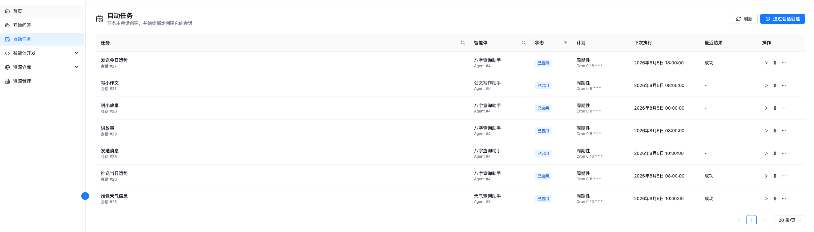
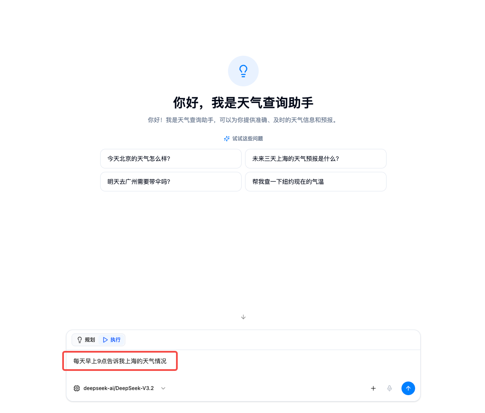
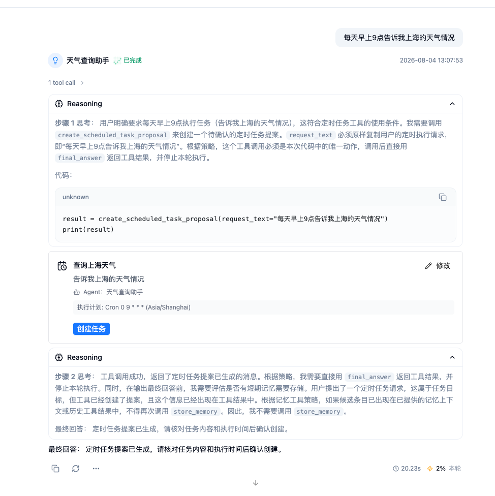
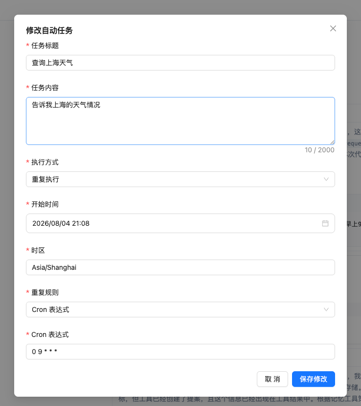
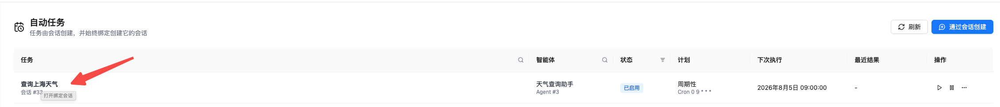
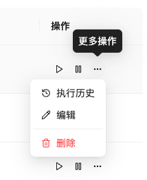
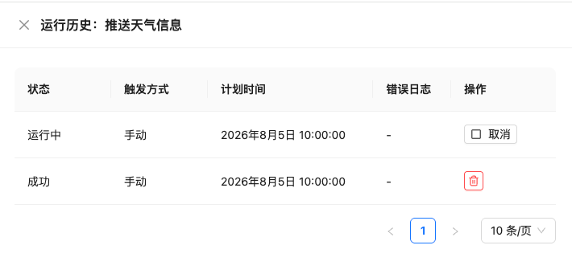

# 自动任务

自动任务让智能体在未来指定时间或按照固定周期自动执行工作。您只需在会话中用自然语言说明“做什么”和“什么时候做”，系统会生成一张待确认的任务提案；确认后，任务会持续绑定当前会话，并把每次执行结果写回该会话。

例如，您可以让智能体：

- 每天上午 9 点汇总项目进展；
- 每隔 30 分钟检查一次服务状态；
- 明天下午 3 点生成一次周报。

> **重要说明**：自动任务提案只用于创建计划，不会立即执行您描述的业务动作。任务将在您确认创建后，按照设定的时间运行。

## 使用前准备

创建任务前，请确认：

1. 已在 [模型配置](./agent-development/model-configuration) 中配置可用的语言模型；
2. 已在 [智能体开发](./agent-development) 中创建并保存可用于问答的智能体；
3. 智能体已经配置任务需要的工具、知识库、Skill、记忆或其他智能体；
4. 您可以访问用于创建任务的会话。

如果任务依赖的能力不完整，提案会提示您先配置智能体，暂时不能创建任务。

## 创建自动任务

### 1. 进入创建入口

在左侧导航栏打开 **自动任务**，然后点击页面右上角的 **通过会话创建**。系统会进入新的会话页面。

您也可以直接打开 [开始问答](./start-chat)，选择智能体后提出自动执行请求。

<div style="display: flex; justify-content: center;">
  
</div>

### 2. 选择智能体并描述任务

选择负责执行任务的智能体，然后在输入框中同时写明：

- **业务动作**：每次触发时具体要完成什么；
- **执行时间**：一次性任务需要明确的未来日期和时间；
- **执行周期**：周期任务需要说明固定间隔或日历周期；
- **时区**：如需使用非当前默认时区，请明确写出，例如 `Asia/Shanghai` 或 `UTC`；
- **结束条件**：如有截止时间或执行次数限制，请在请求中明确说明。

推荐写法：

```text
每天上午 9 点，汇总昨天的项目进展，输出简短摘要并列出需要关注的问题。
```

一次性任务示例：

```text
明天下午 3 点生成一份本周项目周报。
```

固定间隔任务示例：

```text
每隔 30 分钟检查一次服务状态，并给出异常项。
```

如果请求缺少业务动作、日期、时间或周期，智能体会提示您补充最关键的信息。立即执行的普通请求、询问某个时间点的数据或仅解释时间表达式，不会被识别为自动任务。

<div style="display: flex; justify-content: center;">
  
</div>

### 3. 检查任务提案

系统识别到自动执行意图后，会在会话中生成任务提案。请重点检查：

- **任务标题**：在自动任务列表中显示的名称；
- **任务内容**：智能体每次触发时实际执行的单次指令；
- **智能体**：负责执行任务的智能体；
- **执行计划**：单次或重复执行、开始时间、时区及重复规则；
- **能力状态**：当前智能体是否具备完成任务所需的能力。

请注意，系统会从任务内容中去除“每天上午 9 点”等调度描述，并把它们保存为独立的执行计划，这是正常行为。

<div style="display: flex; justify-content: center;">
  
</div>

### 4. 修改提案

如需调整提案，点击卡片右上角的 **修改**。当前编辑窗口支持修改：

- 任务标题；
- 任务内容；
- 执行方式：单次执行或重复执行；
- 开始时间；
- 时区；
- 重复规则：Cron 表达式或固定间隔。

固定间隔以秒为单位，页面和后端会按照系统配置校验最小间隔。Cron 使用标准五字段格式：

```text
分钟 小时 日 月 星期
```

常用示例：

| 执行要求 | Cron 表达式 |
| --- | --- |
| 每天 9:00 | `0 9 * * *` |
| 每个工作日 18:30 | `30 18 * * 1-5` |
| 每小时整点 | `0 * * * *` |
| 每月 1 日 9:00 | `0 9 1 * *` |

Cron 表达式会按照提案中的时区计算。一次性任务的执行时间必须晚于当前时间。

<div style="display: flex; justify-content: center;">
  
</div>

### 5. 确认创建

确认信息无误后，点击 **创建任务**。创建成功后，提案卡片会显示任务编号。返回 **自动任务** 页面后，新任务会出现在任务列表中；点击任务名称可以打开它所绑定的会话。

如果卡片提示能力不足，请点击 **配置智能体**，补充所需能力后回到会话重新创建。一个会话只能绑定一个有效的自动任务；如果当前会话已绑定任务，请新建会话再创建另一个任务。

<div style="display: flex; justify-content: center;">
  
</div>

## 管理自动任务

打开左侧导航栏中的 **自动任务**，可以查看当前用户创建的任务。列表展示：

- 任务名称和绑定会话；
- 执行智能体；
- 当前状态；
- 单次或周期计划；
- 下次执行时间；
- 最近一次运行结果。

任务名称可直接打开绑定会话。列表支持按任务名称、智能体名称和状态筛选，并支持分页和刷新。

### 立即运行

点击操作列中的 **立刻运行** 按钮，可以不等待计划时间，手动启动一次任务。手动运行成功不会改变周期任务原定的下一次执行时间。

同一绑定会话不能同时运行多个任务。如果会话中已有智能体任务或自动任务正在运行，新触发的运行会被跳过，并在运行历史中记录为 **已跳过**。

### 暂停和恢复

- 点击 **暂停** 后，任务不再按计划触发；
- 点击 **恢复** 后，系统会根据当前时间和原计划重新计算下一次执行时间；
- 周期任务连续失败或超时达到 5 次时，会变为 **系统暂停**。修复智能体配置或任务内容后，可手动恢复；
- 已完成的一次性任务没有未来执行时间，不能恢复。如需再次执行，请创建新任务或点击 **立刻运行**。

### 使用更多操作菜单

任务的 **更多操作** 菜单集中提供 **执行历史**、**编辑** 和 **删除** 入口。

<div style="display: flex; justify-content: center;">
  
</div>

### 编辑任务

点击 **更多操作** > **编辑**，可以修改：

- 任务名称；
- 执行指令；
- 任务类型和首次执行时间；
- 周期规则、固定间隔或 Cron 表达式；
- 单次运行超时时间。

执行智能体不可在编辑窗口中切换。如需更换智能体，请通过新的会话重新创建任务。

超时时间以秒为单位，默认值为 1800 秒（30 分钟），当前页面允许填写的最小值为 60 秒。运行超时后，记录状态会变为 **已超时**。

### 查看运行历史

点击 **更多操作** > **执行历史**，可以查看：

- 运行状态；
- 触发方式：手动或计划触发；
- 计划执行时间；
- 错误日志；
- 可执行的运行操作。

处于 **排队中** 或 **运行中** 的记录可以取消。已经结束的记录可以删除；删除运行记录不会删除自动任务。运行记录删除后无法恢复。

<div style="display: flex; justify-content: center;">
  
</div>

### 删除任务

点击 **更多操作** > **删除** 并确认后，任务将停止后续自动执行。绑定会话和历史消息会保留；如果任务正在运行，系统会同时请求停止当前运行。

反过来，删除绑定会话也会删除对应的自动任务并取消活动运行，请谨慎操作。

## 状态说明

### 任务状态

| 状态 | 说明 |
| --- | --- |
| 已启用 | 任务已创建，正在等待下一次计划执行 |
| 运行中 | 当前有一次运行正在执行 |
| 已暂停 | 用户主动暂停了任务 |
| 系统暂停 | 任务因连续失败、超时或计划异常被系统暂停 |
| 已完成 | 一次性任务已经结束，或周期任务已达到结束条件 |

### 运行状态

| 状态 | 说明 |
| --- | --- |
| 排队中 | 运行已创建，正在等待执行 |
| 运行中 | 智能体正在执行任务 |
| 成功 | 本次运行正常完成 |
| 失败 | 本次运行因能力、配置或执行错误而失败 |
| 已跳过 | 绑定会话已有其他运行，系统未并行启动本次任务 |
| 已取消 | 用户取消了本次运行 |
| 已超时 | 运行超过任务设置的超时时间 |

## 使用限制和注意事项

- **一个会话一个任务**：同一个会话只能绑定一个有效自动任务；多个任务请分别使用不同会话创建。
- **临时附件不可长期使用**：当前版本不能把创建提案时上传的临时附件作为自动任务的长期输入。请在指令中描述稳定的数据来源，或让智能体使用已配置的知识库、工具等能力。
- **依赖会在运行前检查**：如果任务依赖的工具、知识库、Skill、记忆或其他智能体被删除或不可用，本次运行会失败，请在运行历史中查看错误日志。
- **结果写回绑定会话**：每次执行的指令和智能体输出会保存到绑定会话，可从任务名称进入会话查看完整上下文。
- **错过的周期不补跑**：服务重启期间错过的周期执行会被跳过，系统恢复后会计算下一次未来执行时间。
- **仅创建者可见**：在正常多用户模式下，任务列表和运行历史按当前租户和创建用户隔离。

## 常见问题

### 为什么没有生成任务提案？

请确认消息同时包含明确的业务动作和未来时间或执行周期。像“帮我定期关注一下”缺少具体动作和周期，系统会要求补充信息；立即执行的普通请求不会生成自动任务。

### 为什么使用附件时不能创建任务？

临时附件不能保证在未来每次运行时仍然适合作为输入。请把资料放入知识库或其他稳定数据源，配置到智能体后，再在任务指令中说明需要处理的内容。

### 为什么任务无法创建？

常见原因包括：执行时间已经过去、时间或周期信息不完整、Cron 表达式无效、固定间隔低于系统限制、智能体缺少必要能力，或当前会话已经绑定其他任务。

### 为什么本次运行显示“已跳过”？

绑定会话中已有智能体任务或自动任务正在执行。为避免同一会话的上下文被并发写入，系统不会同时启动另一次运行。

### 为什么任务变成“系统暂停”？

周期任务连续失败或超时达到 5 次，或者恢复时发现计划配置无效。请查看运行历史和最近错误，修复智能体能力、模型、工具或执行指令后再恢复任务。

### 删除任务会删除会话吗？

不会。删除自动任务会停止后续执行，但会保留绑定会话。请注意，删除绑定会话会同时删除对应的自动任务。

## 下一步

- [开始问答](./start-chat)：选择智能体并通过自然语言创建自动任务。
- [智能体开发](./agent-development)：为任务配置模型、工具、知识库、Skill 和记忆。
- [模型配置](./agent-development/model-configuration)：检查任务使用的语言模型。
