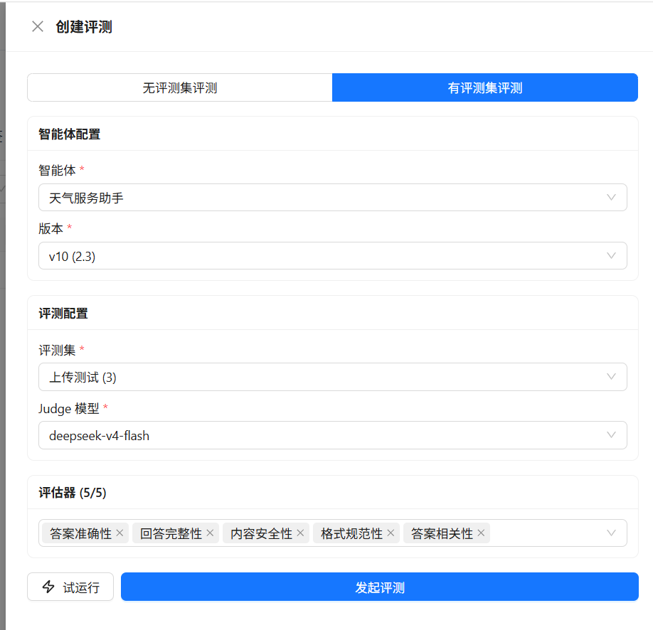
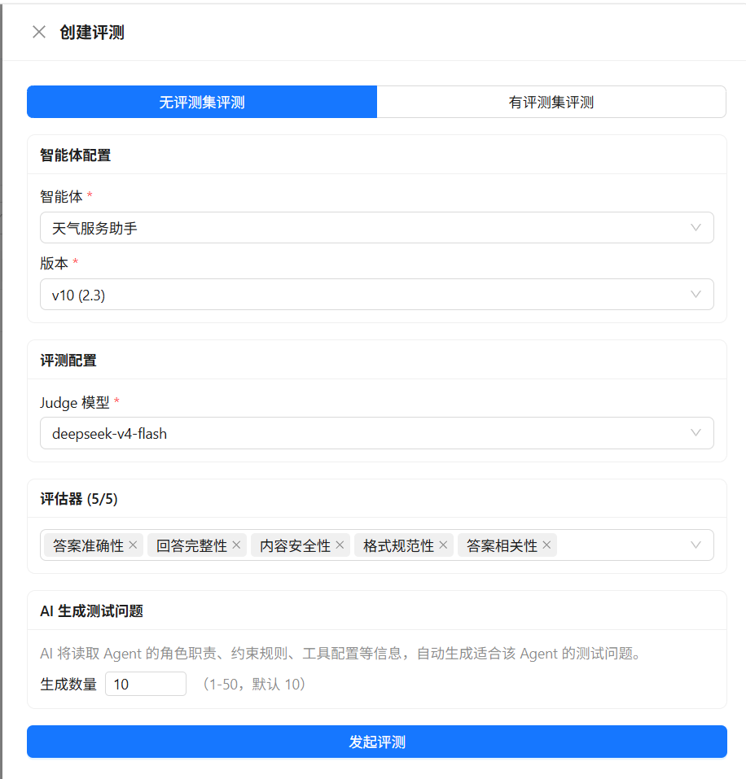

# 创建评估任务

评估任务用于运行指定版本的智能体，并使用评估器对运行结果进行评分。创建任务前，请先阅读[智能体评估概览](../evaluation)。

## 选择评估模式

在 **评估任务** 页签中单击 **创建评测**，先选择评估模式：

| 模式 | 说明 |
|------|------|
| **有评测集评测** | 使用已有评测集中的问题运行智能体，适合回归测试和发布前验证 |
| **无评测集评测** | 由 AI 根据智能体配置生成测试问题后运行智能体，适合快速探索 |

以下为有评测集评测的创建界面示例：

  

以下为无评测集评测的创建界面示例。系统会根据智能体配置生成测试问题，并按设置的数量运行评估：

  

## 创建任务

1. 在左侧导航栏选择 **智能体开发 > 智能体评估**，打开 **评估任务** 页签。
2. 单击 **创建评测**，选择评估模式。
3. 在 **智能体** 中选择要评估的智能体和版本。版本必须已发布；未指定版本时，系统使用该智能体最新的已发布版本。
4. 在 **评估配置** 中选择 **Judge 模型**。有评测集模式还需要选择评测集；无评测集模式需要设置 AI 生成问题的数量（1～50 条）。
5. 在 **评估器** 中选择一个或多个已发布评估器，最多 5 个。
6. 检查配置后，单击 **开始评估**。

任务提交后会在后台执行，并返回 **评估任务** 列表。任务会保存创建时的智能体版本、Judge 模型和评估器配置，之后修改这些对象不会改变历史任务。

## 评估器输入

系统为评估器提供以下标准输入：

| 字段 | 数据来源 |
|------|----------|
| `query` | 评测集的 `问题` / `query` |
| `expected` | 评测集的 `答案` / `answer`；无评测集模式为空 |
| `actual` | 智能体本次运行的实际回答 |
| `runtime_stats` | 智能体本次运行的过程统计信息 |

当前页面按照上述标准字段自动准备输入。创建自定义评估器时，请使用这些字段名。

## 试运行

有评测集模式可以先单击 **试运行**，使用一条问题检查智能体回答和评估器结果。试运行不会创建评估历史记录。

建议先用一条代表性问题试运行，确认智能体版本、Judge 模型和评估器配置正确，再开始完整评估。

## 任务状态

| 状态 | 含义 |
|------|------|
| **等待中** | 任务已创建，等待后台执行 |
| **运行中** | 正在运行智能体和评估器 |
| **已完成** | 任务已完成，可以查看评估结果 |
| **失败** | 任务或关键执行阶段失败，可以根据错误信息修正配置后重新创建 |

更多结果信息请参见[查看结果与标注](./results)。
