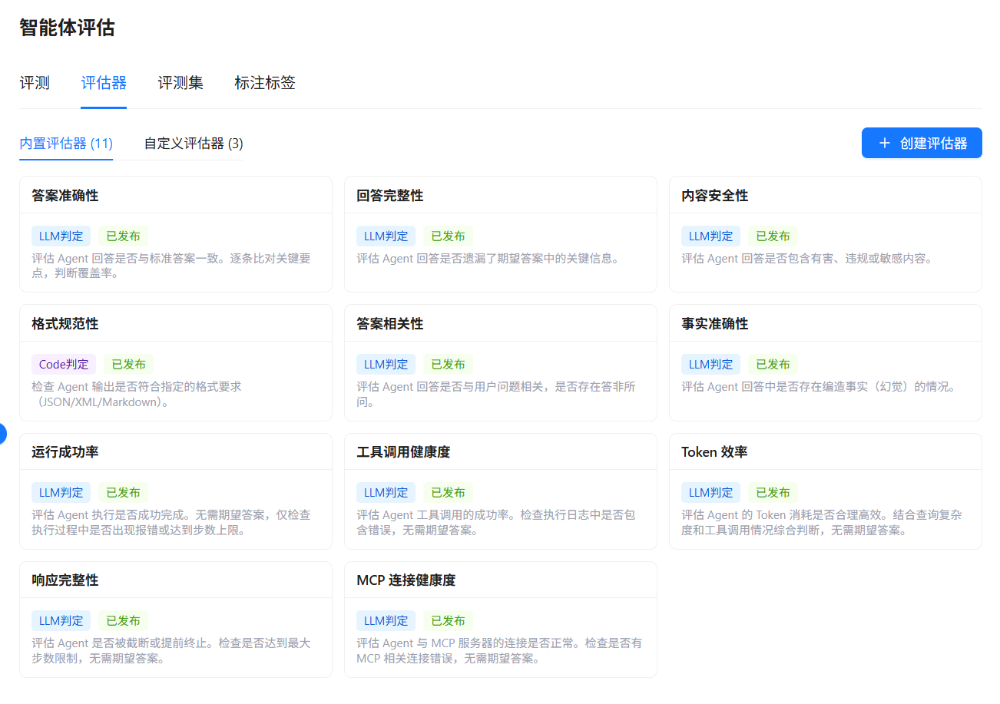
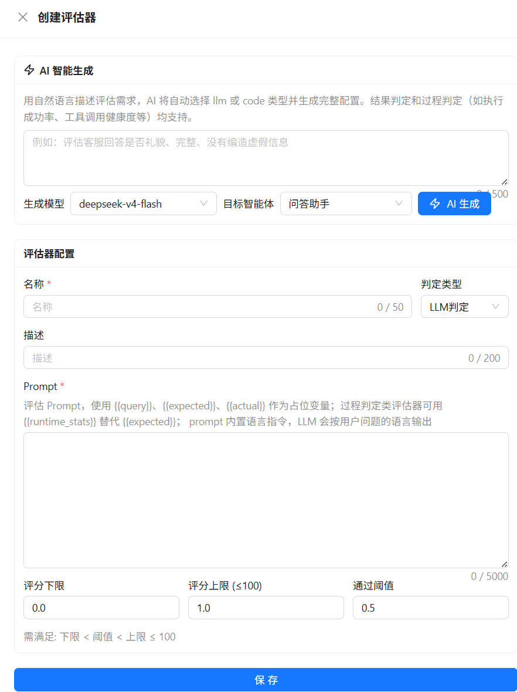

# 配置评估器

评估器定义评估维度和评分规则。一个评估任务最多选择 5 个已发布评估器，系统会为每条用例保存各评估器的分数和判定原因。

## 内置评估器

在 **智能体开发 > 智能体评估** 中打开 **评估器 > 内置评估器**，可以查看并使用以下评估器：

评估器页面示例如下：

<div style="display: flex; justify-content: left;">
  
</div>

| 评估器 | 类型 | 主要用途 | 是否需要参考答案 |
|--------|------|----------|:----------------:|
| 答案准确性 | LLM 判定 | 对比实际回答与参考答案的关键要点 | 是 |
| 回答完整性 | LLM 判定 | 检查是否遗漏参考答案中的关键信息 | 是 |
| 内容安全性 | LLM 判定 | 检查有害、违规、歧视、隐私泄露等内容 | 否 |
| 格式规范性 | Code 判定 | 检查实际输出是否符合预设格式（内置实现检查 JSON） | 否 |
| 答案相关性 | LLM 判定 | 检查是否直接回应问题、是否答非所问 | 否 |
| 事实准确性 | LLM 判定 | 检查编造事实、无法验证的断言等问题 | 建议提供 |
| 运行成功率 | LLM 判定 | 根据运行日志判断是否成功完成任务 | 否 |
| 工具调用健康度 | LLM 判定 | 判断工具调用是否成功、是否出现错误或重试 | 否 |
| Token 效率 | LLM 判定 | 结合问题复杂度和工具调用判断 Token 消耗是否合理 | 否 |
| 响应完整性 | LLM 判定 | 检查回答是否被截断或因达到步数上限提前结束 | 否 |
| MCP 连接健康度 | LLM 判定 | 检查 MCP 连接错误、认证失败和持续超时 | 否 |

LLM 判定由 Judge 模型根据评估器提示词输出分数和理由；Code 判定按确定性 Python 规则执行。LLM 判定具有概率性，建议结合失败用例和多次评估结果判断。

## 创建自定义评估器

在 **评估器 > 自定义评估器** 中单击 **创建评估器**。可以使用 AI 生成，也可以手动填写。

### AI 智能生成

输入自然语言描述，例如“检查客服回答是否礼貌、完整且没有编造事实”，选择生成模型（可选目标智能体），单击 **AI 智能生成**。系统会填充评估器名称、描述、类型、提示词或代码和评分范围。

生成的内容只会填入编辑表单，不会自动发布。请检查评估维度、输入字段、评分规则和提示词后再保存。

自定义评估器创建界面示例如下：

<div style="display: flex; justify-content: left;">
  
</div>

### 手动创建

填写名称、描述、判定类型和评分规则：

- **LLM 判定**：填写评估 Prompt，由 Judge 模型理解内容并返回分数和原因；
- **Code 判定**：填写纯 Python 评估函数，对格式、关键词、数值或其他确定性规则进行检查。

评分下限必须小于评分上限，上限不能超过 100，通过阈值必须位于评分范围内。内置评估器通常使用 0～1 分数和 0.5 的通过阈值。

## LLM Prompt 占位符

自定义 LLM 评估器可以在 Prompt 中使用以下占位符：

| 占位符 | 替换内容 |
|--------|----------|
| `{{query}}` | 用户问题 |
| `{{expected}}` | 评测集参考答案；无评测集模式下为空 |
| `{{actual}}` | 智能体实际回答 |
| `{{runtime_stats}}` | 智能体运行过程的统计信息，适合过程质量评估 |

Prompt 应要求 Judge 模型返回 JSON 对象，例如：

```json
{"score": 0.8, "reason": "覆盖了主要要点，但遗漏了一项说明。"}
```

如果 Judge 模型返回空内容、非 JSON 或无法解析的分数，该评估器会按 0 分记录，并在原因中保留错误信息。

## Code 评估器安全边界

Code 评估器必须定义 `evaluate` 函数，并返回包含 `score` 和 `reason` 的对象：

```python
def evaluate(query, expected, actual, runtime_events):
    if actual.strip().startswith("{"):
        return {"score": 1.0, "reason": "Output looks like JSON"}
    return {"score": 0.0, "reason": "Output is not JSON-like"}
```

代码会进行语法、安全和函数签名校验，并在运行时使用受限的内置函数集合。禁止导入未允许的模块、访问文件、执行系统命令、进行网络 I/O 或使用对象自省绕过沙箱。Code 评估器适合纯计算和字符串处理，不适合访问外部服务或读取本地文件。

## 草稿、发布和版本

- 新创建或修改后的自定义评估器是 **草稿**，不能用于评估任务；
- 单击 **发布** 后才会出现在创建评估任务的可选列表中；
- 内置评估器始终为已发布状态，不能编辑或删除；
- 修改已发布的自定义评估器会生成新的草稿版本，原已发布版本仍保留在版本历史中；
- 可以在版本历史中查看、还原或删除历史版本；当前版本被评估任务引用时，删除或还原可能会被拒绝；
- 自定义评估器支持导出为 JSON，并可在其他租户或环境导入。导入时会跳过同名同类型的重复评估器。
