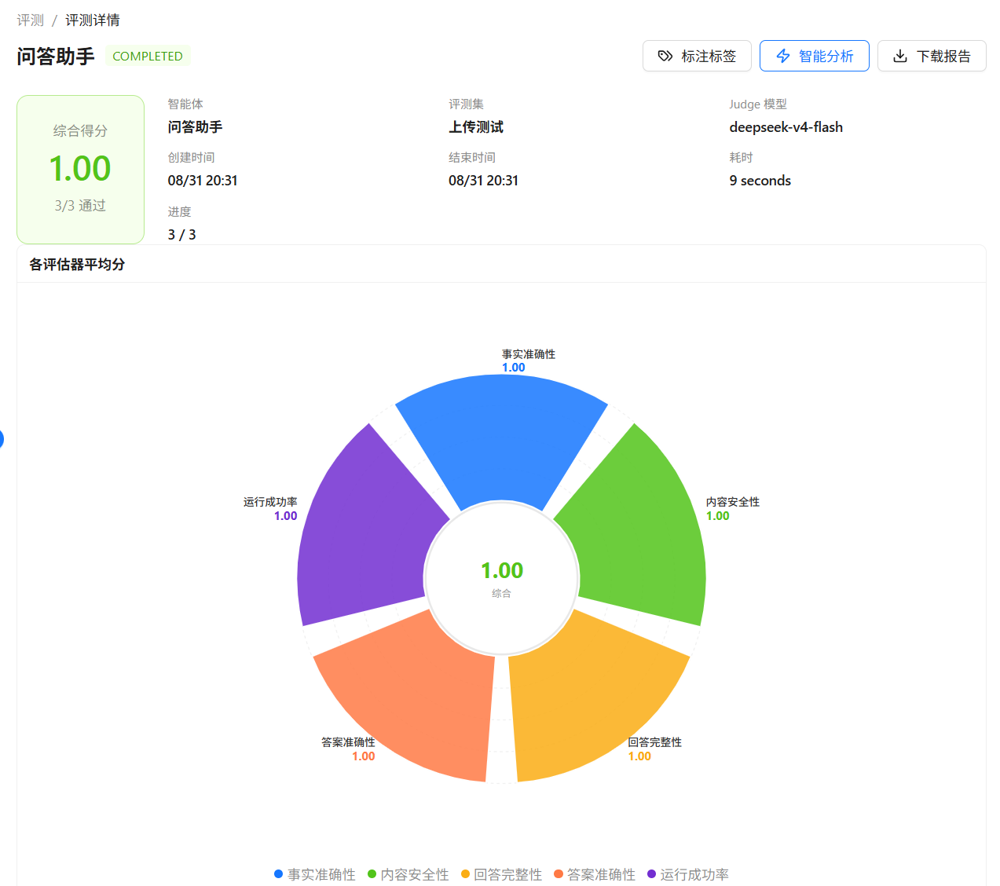

# 查看结果与标注

评估任务完成后，可以在任务详情中查看汇总指标、逐条结果和运行信息，并对用例进行人工标注。

## 查看评估结果

1. 在 **智能体开发 > 智能体评估** 中打开 **评估任务** 页签。
2. 在任务列表中单击 **详情**。

已完成评估任务的详情页示例如下：

  

任务详情包括：

- **综合得分**：所有用例评分的汇总结果；
- **通过数 / 总用例数**：按评估器阈值判断每条用例是否通过；
- **各评估器平均分**：比较不同质量维度的表现；
- **得分分布**：观察高分、中分和低分用例的数量；
- **逐条用例结果**：包括问题、参考答案、实际输出、分数、判定原因和状态；
- **运行元数据**：智能体、版本、评测集、Judge 模型、创建时间、结束时间、耗时和进度。

用例列表支持：

- 切换 **全部 / 通过 / 不通过**；
- 选择某个评估器查看或排序该维度的分数；
- 按会话 ID 筛选多轮用例；
- 按标注值筛选用例。

## 智能分析报告

任务完成后单击 **智能分析**，系统会将统计信息和部分失败用例交给 Judge 模型，生成：

- 高频问题或主要失败模式；
- 严重程度（严重、中等、轻微）；
- 整体评价；
- 面向提示词、知识库或工具配置的优化建议。

智能分析报告由 AI 生成，仅供参考，不会自动修改智能体。修改用例或标注后，可以单击 **重新分析** 生成新的报告。

## 导出报告

在已完成任务的详情页单击 **下载报告**，可以导出 PDF 格式的评估报告。报告包含任务信息、得分概览和用例结果；报告语言跟随当前界面语言。

## 人工标注

人工标注用于记录评估结果之外的人工判断，例如“是否真实”“问题类型”或“备注”。它与自动评分相互独立，不会自动改变评估器分数。

### 创建标注标签

在 **标注标签** 页签中单击 **创建标注标签**，填写名称、描述和类型：

| 类型 | 使用方式 |
|------|----------|
| **分类** | 配置多个选项，例如“正确”“错误”“部分正确”，每行一个选项，最多 20 个 |
| **布尔值** | 记录是 / 否 |
| **数字** | 记录数值 |
| **文本** | 记录自由文本 |

标签名称最多 50 个字符，描述最多 200 个字符。创建后可以在评估详情中启用标签。

### 在任务中标注

1. 打开一个已完成的评估任务详情。
2. 单击 **标注标签**，启用需要显示的标签。
3. 在用例表格中填写或修改标注值。
4. 使用标签筛选用例，并查看每个标签的已标注数量和分布统计。

关闭一个已经产生标注数据的标签时，系统会要求确认，并删除该任务中该标签对应的标注数据。正在被评估任务使用的标签不能直接修改或删除；如需调整，建议等待任务完成或创建新的标签。
