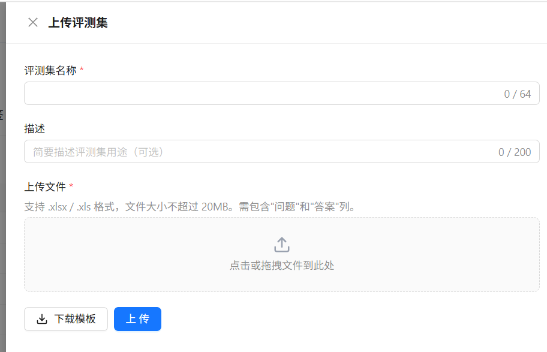
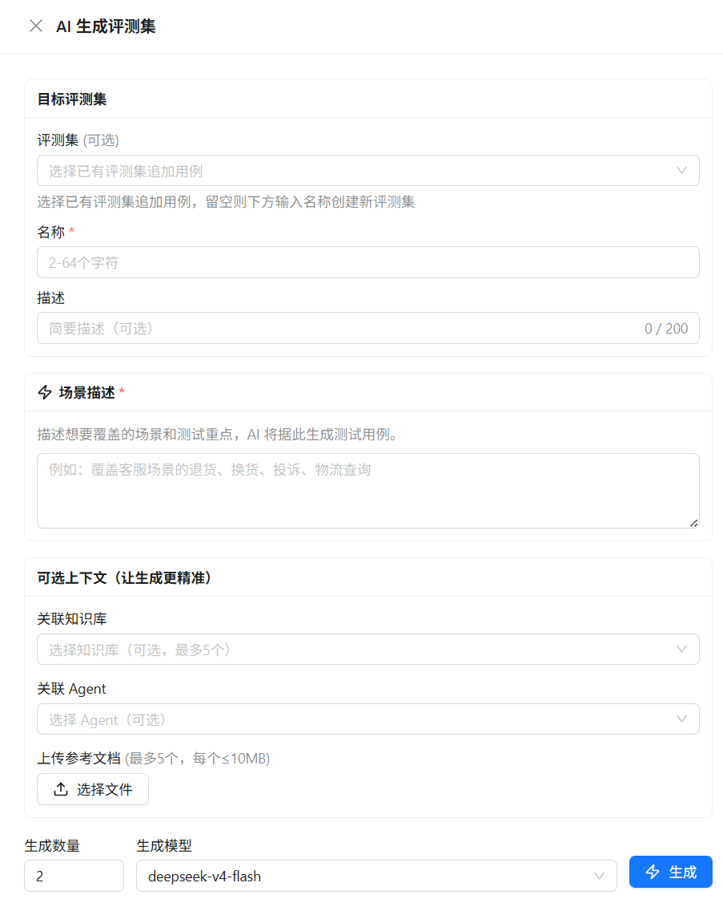

# 管理评测集

评测集是一组用于驱动评估的测试用例。每条用例至少需要一个问题；参考答案不是所有评估器都必需，但对于答案准确性、回答完整性和事实准确性等评估非常重要。

## 从 Excel 导入

1. 在 **智能体开发 > 智能体评估** 中打开 **评测集** 页签。
2. 单击 **上传**，填写评测集名称和可选描述。
3. 选择 `.xlsx` 或 `.xls` 文件后上传。也可以先单击 **下载模板**，使用模板填写数据。

上传评测集弹窗示例如下：

  

导入文件支持以下列名，中英文表头均可：

| 字段 | 中文列名 | 是否必填 | 说明 |
|------|----------|:--------:|------|
| `session_id` | 会话ID | 否 | 多轮对话中，同一会话的多条用例使用相同 ID |
| `request_id` | 请求顺序 | 否 | 多轮对话中标记每一轮的顺序，从 1 递增 |
| `query` | 问题 | **是** | 发送给智能体的用户输入 |
| `answer` | 答案 | 否 | 参考答案，也可使用 `reference_output` 或 `expected_output` |

单轮用例可以不填写 `session_id` 和 `request_id`。使用多轮用例时，请保证同一会话的请求顺序连续；一次评估运行时，每个会话最多处理 10 轮。

## 使用 AI 生成评测集

1. 在 **评测集** 页签中单击 **AI 生成评测集**。
2. 填写场景描述并选择生成模型。
3. 选择将结果追加到已有评测集，或输入名称创建新的评测集。
4. 设置生成数量（1～200 条）并开始生成。

AI 生成评测集弹窗示例如下：

  

可以提供以下上下文，帮助 AI 生成更贴合业务的用例：

- 选择知识库，让系统先检索知识库内容；
- 选择智能体，将智能体配置、工具、技能和子智能体等信息作为上下文；
- 上传一个 `.docx` 参考文档。

生成任务在后台执行，评测集列表会显示 **生成中**、**就绪** 或 **失败** 状态。生成完成后打开评测集详情，检查并修改用例。

> AI 生成的问题和参考答案可能存在遗漏或错误。将其作为正式基准集使用前，请进行人工抽查。

## 查看和维护用例

打开评测集的 **查看** 操作，可以：

- 按问题搜索用例；
- 添加单条用例；
- 编辑问题、答案、会话 ID 和请求顺序；
- 删除单条或批量删除用例；
- 导出为 Excel。

如果评测集正被运行中的评估任务使用，系统会限制可能影响任务一致性的修改操作。建议复制或导出后再维护长期使用的基准数据。

## 数据限制

| 项目 | 当前限制 |
|------|----------|
| 文件格式 | 仅支持 `.xlsx` 和 `.xls` |
| 上传文件 | 单个文件不超过 20 MB |
| 评测集数量 | 每个租户最多 50 个评测集 |
| 用例数量 | 每个评测集最多 2,000 条 |
| 问题长度 | 不超过 2,000 个字符 |
| 参考答案长度 | 不超过 5,000 个字符 |
| 评测集名称 | 2～64 个字符 |
| 多轮会话 | 一次评估运行时每个会话最多 10 轮 |
