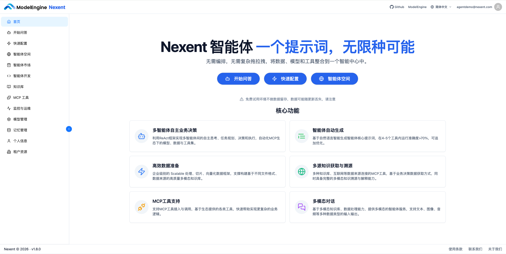

# 👏 欢迎来到 Nexent

**Nexent** 是一款面向未来的零代码智能体开发平台

致力于让每个人都能轻松✏️构建和部署专属的AI智能体

无需编程，无复杂操作，点击几下，就能让 AI 为你工作💪

👉 本用户指南将带您快速上手 Nexent，让智能体为您的工作和生活带来新的惊喜与价值🎉

## 🏠 首页概览

Nexent首页展示了平台的核心功能，为您提供快速入口：

### 🔘 功能按钮

1. **开始问答**：进入对话页面，选择智能体进行交互
2. **快速配置**：按顺序完成模型管理、知识库和智能体开发配置
3. **智能体空间**：查看和管理所有已开发的智能体

### ➡️ 左侧导航栏

以管理员账号为例，页面左侧提供了完整的导航栏，包含以下模块：

- **首页**：返回平台首页
- **开始问答**：进入对话页面，选择智能体进行交互
- **快速配置**：按步骤完成模型 -> 知识库 -> 智能体配置，几分钟即可开始
- **智能体空间**：集中查看和管理您开发的所有智能体
- **智能体市场**：探索并获取现有的智能体
- **智能体开发**：创建和配置智能体
- **智能体评估**：使用评测集和评估器批量验证智能体表现
- **知识库**：上传文档和资料，让智能体理解你的专属知识
- **MCP 工具**：连接服务器、同步工具、查看状态，一目了然（即将上线）
- **监控与运维**：实时掌控智能体的运行状态（即将上线）
- **模型管理**：管理应用信息与模型配置，连接你需要的 AI 能力
- **记忆管理**：控制智能体的长期记忆，让对话更高效
- **个人信息**：查看和管理您的个人信息，如邮箱、角色、用户组等
- **租户资源**：查看和管理您的租户资源，如用户、模型、知识库、智能体等

页面右上角支持**语言切换**（简体中文/English）

页面左下角展示了当前 Nexent 版本号，有助于您寻求帮助或报告问题。

## 👤 账号准备（首次使用）

首次使用 Nexent 时，需要先创建租户管理员账号，才能进行大模型接入、智能体创建、问答交互等操作：

1. 使用超级管理员账号 `suadmin@nexent.com` 登录平台（默认密码见 [安装指南](../quick-start/installation.md)）；
2. 进入【租户资源】，创建租户并创建租户管理员账号；
3. 退出超级管理员账号；
4. 使用新建的租户管理员账号登录。

完成以上步骤后，即可开始后续配置与使用。角色权限详情参见 [资源管理](./resource-management.md)。

## 🚀 快速开始

建议按照以下顺序完成配置，也可以直接点击“快速配置”按钮：

1️⃣ **[模型管理](./agent-development/model-configuration.md)**，配置应用信息并接入模型

2️⃣ **[知识库](./agent-development/knowledge-configuration.md)**，上传您的文档和资料

3️⃣ **[智能体开发](./agent-development.md)**，创建您的专属智能体

4️⃣ **[开始问答](./start-chat)** 立即与智能体互动，体验成果

## 🙋 获取帮助

遇到问题时，您可以：

- 查看 **[常见问题](../quick-start/faq.md)**
- 在 [GitHub Discussions](https://github.com/ModelEngine-Group/nexent/discussions) 中提问

💡 保持您的 Nexent 处于最新版本，我们会修复已知问题
