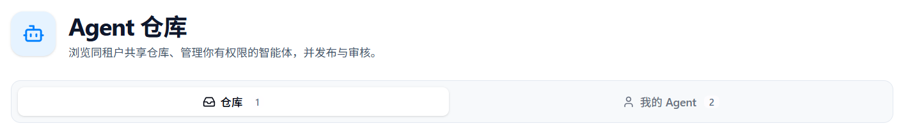
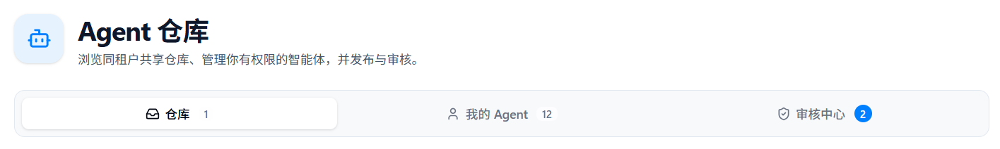
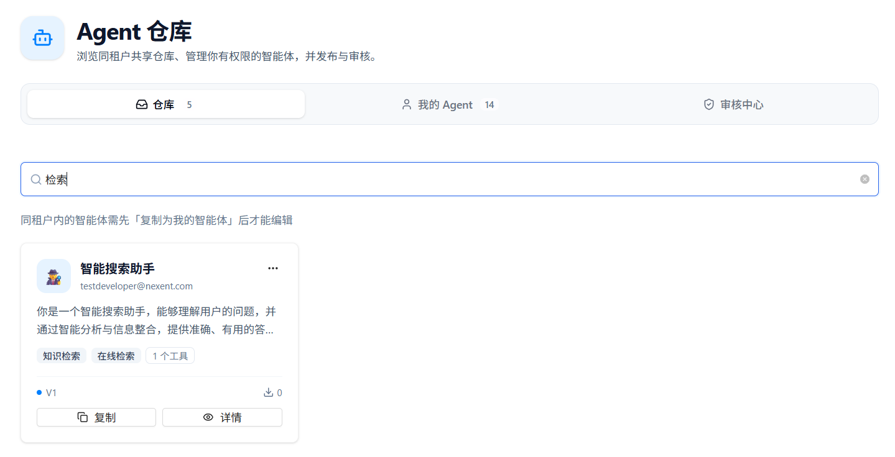
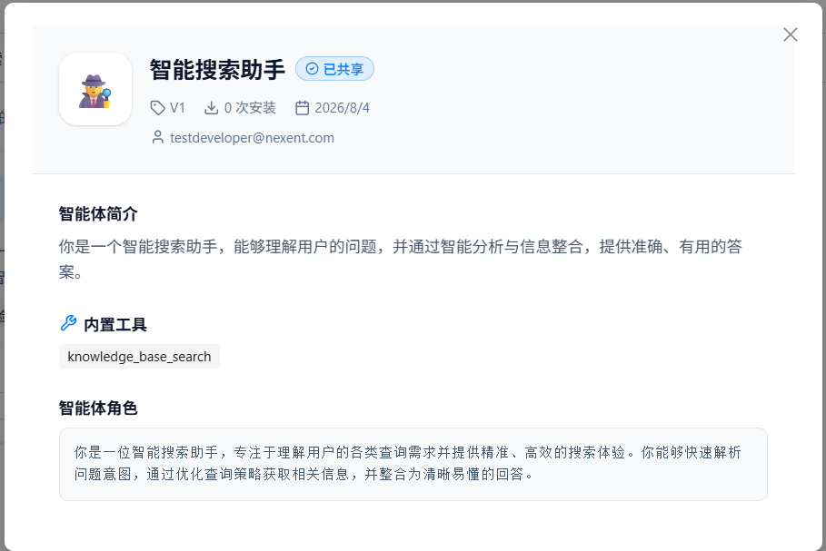
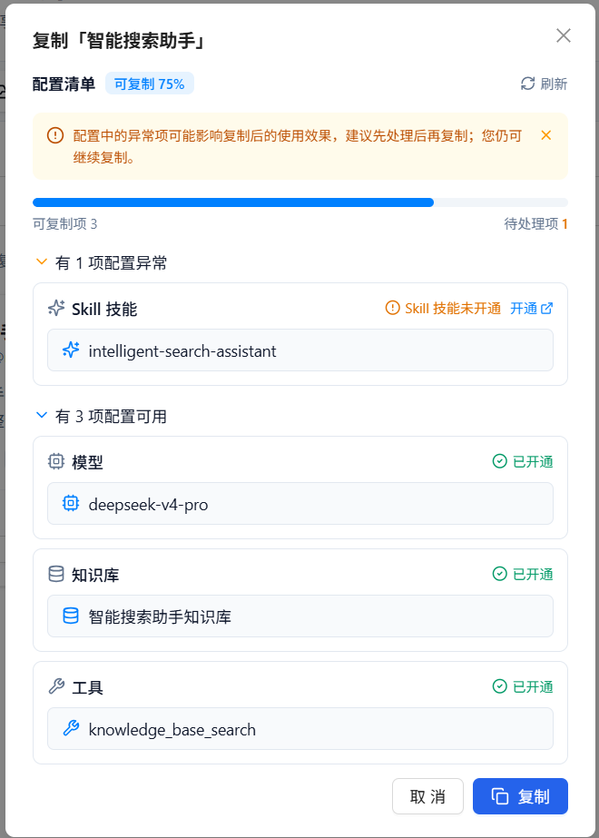
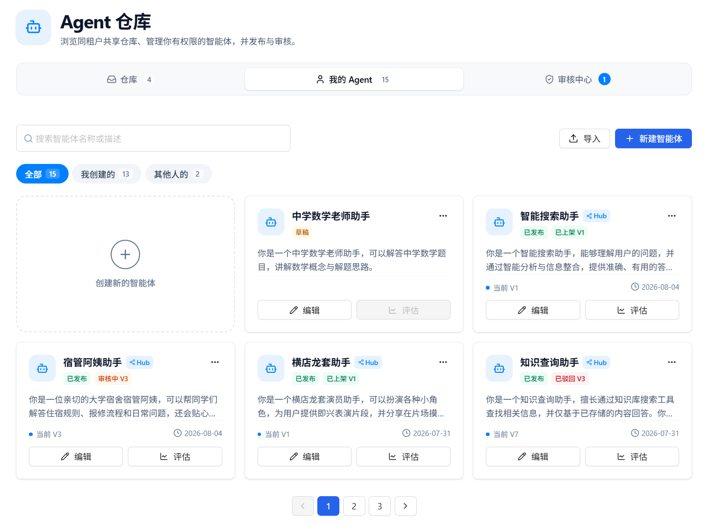
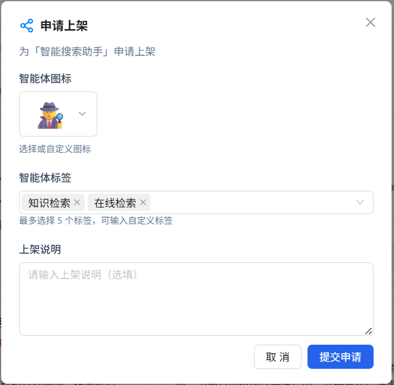
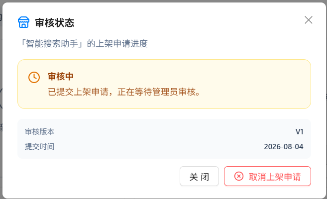

# 智能体仓库

智能体仓库是同租户内共享、管理与审核智能体的中心。您可以浏览已上架的智能体并复制到自己的工作区，管理自己有权限编辑的智能体，以及（管理员）审核上架申请。

## 👥 管理员与开发者的界面差异

进入 **Agent 仓库** 后，页面顶部会按角色展示不同页签：

| 角色 | 可见页签 | 额外能力 |
|------|----------|----------|
| **开发者** | 仓库、我的 Agent | 浏览共享仓库、复制智能体、管理自己的智能体并申请上架 |
| **管理员** | 仓库、我的 Agent、审核中心 | 在开发者能力基础上，还可审核上架申请，并从仓库中直接下架智能体 |

> 提示：审核中心页签仅对管理员可见；开发者通过「我的 Agent」中的「查看审核进度」跟踪自己的申请结果。

**开发者视角**（仓库 / 我的 Agent）：

  

**管理员视角**（仓库 / 我的 Agent / 审核中心）：

  

---

## 📦 仓库

「仓库」页签展示当前租户内已上架（共享）的智能体。同租户成员可浏览、查看详情，并复制到自己的「我的 Agent」中再进行编辑。

> 同租户内的智能体需先「复制为我的智能体」后才能编辑。

### 浏览与搜索

- 以卡片形式展示已上架智能体
- 支持按**智能体名称、描述或标签**搜索
- 每张卡片展示：图标、名称、作者、描述、标签、工具数量、版本号与安装次数

  

### 查看详情

点击卡片上的「详情」，可查看该智能体的完整信息，包括：

- **基础信息**：名称、图标、作者、版本、模型、安装次数、创建时间
- **智能体简介**：描述说明
- **内置工具**：已启用的工具列表
- **智能体角色**：角色设定（Duty Prompt）等相关配置

  

### 复制智能体

点击卡片上的「复制」，系统会先对依赖配置做预检，并展示配置清单：

1. 查看**可复制比例**，以及可用项 / 待处理项数量
2. 若存在异常项（如模型未开通、知识库未开通、MCP 未开通、Skill 名称冲突、工具不可用等），可按提示前往开通或处理
3. 处理完成后可点击刷新重新预检；也可在知晓风险的情况下继续复制
4. 复制成功后，智能体会出现在「我的 Agent」中，供您编辑与使用

依赖类型通常包括：**模型**、**知识库**、**MCP 服务**、**Skill 技能**、**工具**。

  

### 管理员下架

管理员可在仓库卡片右上角的更多菜单中选择「下架」。下架后，该智能体将不再对同租户成员可见，也无法继续被复制。

开发者若需下架自己已上架的智能体，请在「我的 Agent」中通过「查看审核进度」弹窗操作下架。

---

## 🧑 我的 Agent

「我的 Agent」页签用于管理您有权限编辑的智能体，包括自己创建的，以及从仓库复制而来的智能体。

### 筛选与搜索

- **全部 / 我创建的 / 其它**：按归属筛选
- 支持按智能体名称或描述搜索
- 列表以卡片形式展示，并可分页浏览

### 创建与导入

在「全部」筛选且无搜索条件时，页面会提供入口：

- **新建智能体**：跳转到智能体开发页创建新智能体
- **导入智能体**：通过导入向导上传并导入智能体配置

  

### 智能体卡片状态

每张卡片会展示生命周期与上架相关状态，便于快速识别：

| 标识 | 说明 |
|------|------|
| **草稿 / 已发布** | 智能体是否已发布版本（仅已发布版本可申请上架） |
| **Hub** | 该智能体存在仓库相关记录（曾申请或已上架） |
| **审核中** | 首次上架申请待管理员审核 |
| **更新审核中** | 已有上架版本，新版本再次申请上架待审核 |
| **已上架** | 当前已在仓库中共享 |
| **审核驳回** | 上架申请未通过，可修改后重新申请 |

### 常用操作

在智能体卡片上，您可以：

- **编辑**：进入智能体开发页修改配置（只读权限时不可编辑）
- **查看**：查看已发布版本的详情
- **评估**：跳转到智能体评估页面
- **更多操作**：
  - **申请上架**：将当前已发布版本提交到仓库审核
  - **查看审核进度 / 查看更新审核进度**：查看申请状态，并可取消申请或下架
  - **删除**：删除该智能体

### 申请上架

仅当智能体已有已发布版本，且当前版本尚未上架时，可发起申请：

1. 在更多菜单中点击「申请上架」
2. 填写上架信息：
   - **智能体图标**（必填）：选择预设 emoji 或自定义单个 emoji
   - **智能体标签**（必填）：最多 5 个，可选择预设标签或输入自定义标签
   - **上架说明**（选填）：补充给审核人的说明
3. 点击「提交申请」，等待管理员审核

  

### 查看审核进度

在更多菜单中打开审核状态弹窗后，可看到：

- 当前状态：审核中 / 已通过 / 已驳回
- 审核版本、提交时间、上架说明与审核意见（如有）

根据状态，您还可以：

- **取消申请上架**：撤销待审核或已驳回的申请
- **下架**：将已上架的智能体从仓库撤回

  

---

## ✅ 审核中心

「审核中心」仅对**管理员**可见，用于处理同租户用户提交的上架申请。

### 待审核队列

页面以列表形式展示待处理申请，包含：

- 智能体名称与图标
- 申请版本
- 提交人
- 上架说明
- 操作按钮：详情、通过、驳回

页签上会显示待处理数量角标，便于管理员及时处理。

### 审核操作

1. 点击「详情」可预览智能体配置，确认能力与工具是否合适
2. 点击「通过」：可选填审核意见，确认后智能体将上架到「仓库」
3. 点击「驳回」：可选填审核意见，驳回后提交者可在「我的 Agent」中修改并重新申请

  

---

## 🚀 下一步

在智能体仓库中完成管理后，您可以：

1. 在 **[开始问答](../start-chat)** 中与智能体进行交互
2. 继续 **[智能体配置](../agent-development/agent-configuration)** 创建或迭代更多智能体
3. 配置 **[记忆配置](../agent-development/memory-configuration)** 以提升智能体的记忆能力

如果您在使用过程中遇到任何问题，请参考我们的 **[常见问题](../../quick-start/faq)** 或在 [GitHub Discussions](https://github.com/ModelEngine-Group/nexent/discussions) 中进行提问获取支持。
