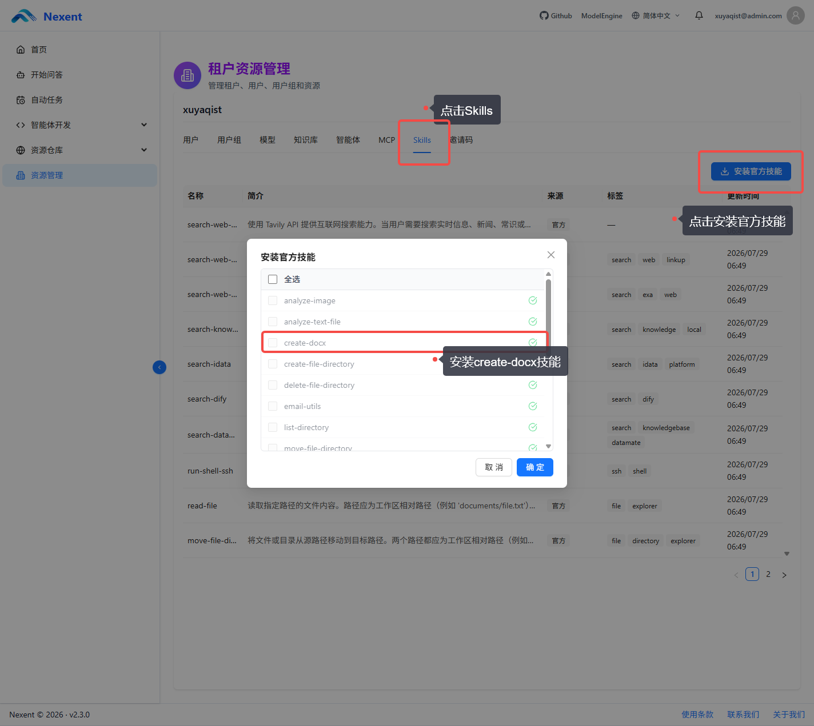
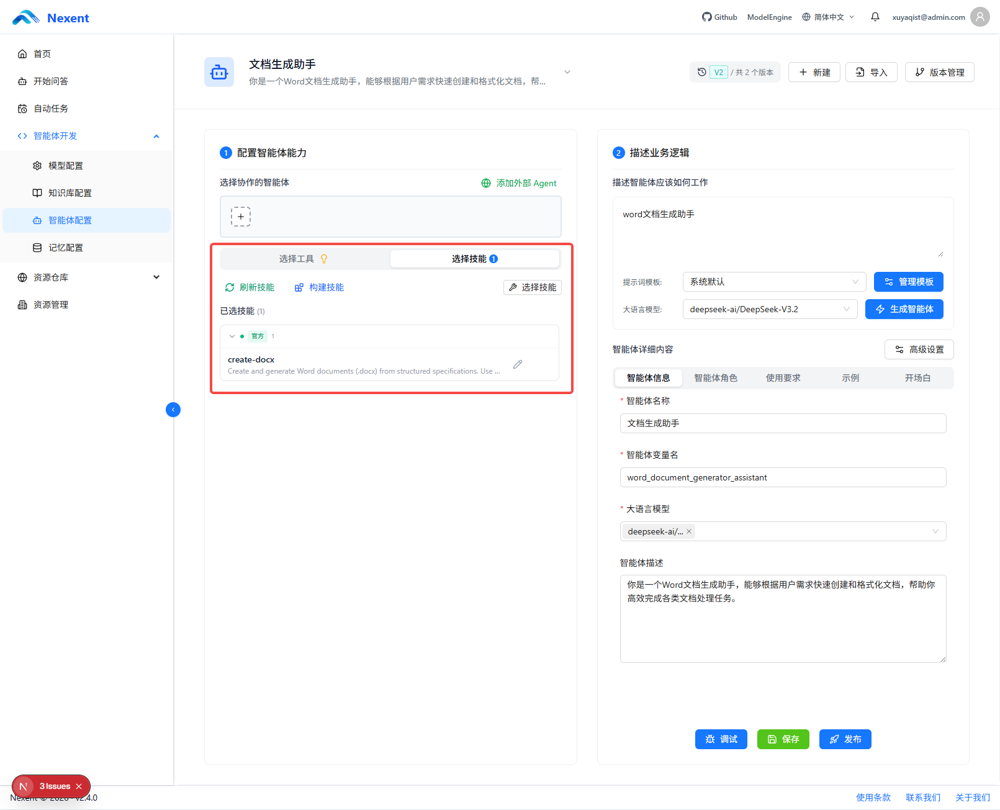
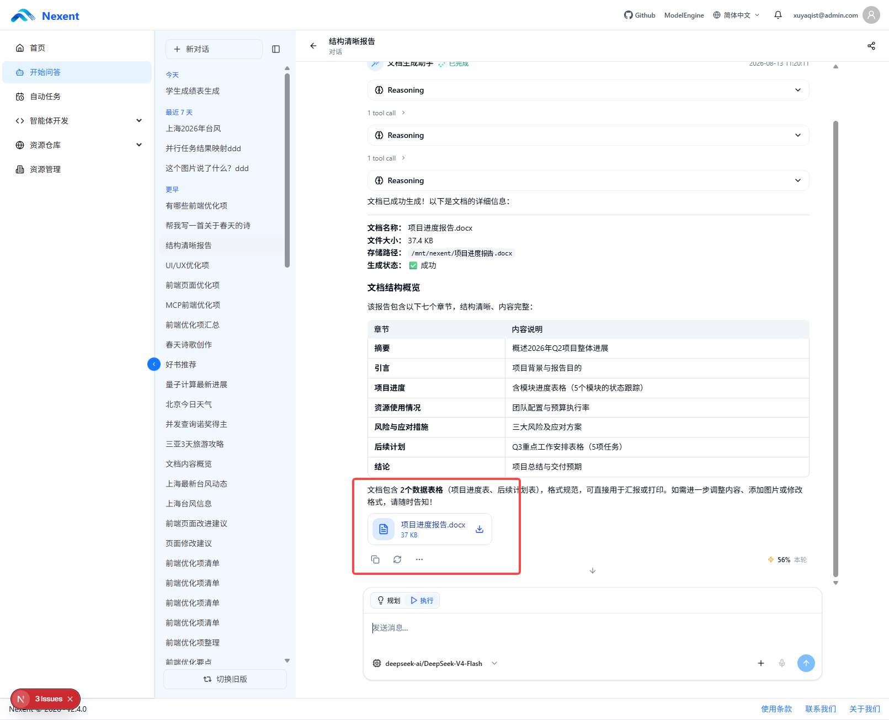

# create-docx 官方技能

`create-docx` 是 `official-skills-zip` 提供的官方文件生成技能，用于根据结构化需求创建或编辑 Word 文档。智能体可以根据用户提供的主题、内容和格式要求调用该技能，生成 `.docx` 文件并将结果作为 Nexent artifact 推送到对话前端，同时保存到会话历史。

## 使用 create-docx

使用 `create-docx` 前，需要先在资源管理中安装该官方技能，再将其添加到目标 Agent 的配置中。

### 1. 在资源管理中安装技能

1. 打开 **资源管理**，进入 **资源仓库** 的 **Skill 仓库**。
2. 在官方技能列表中找到 `create-docx`。
3. 选择该技能并完成安装。

### 2. 在 Agent 配置中启用技能

1. 打开需要使用文档生成能力的 Agent 配置。
2. 进入 **技能** 配置区域，选择已安装的 `create-docx`。
3. 保存 Agent 配置，使该 Agent 可以调用技能。

### 3. 生成并下载 Word 文档

配置完成后，在与该 Agent 的对话中直接描述需要创建或编辑的 Word 文档，例如报告、方案、通知或会议纪要。请提供主题、正文内容、章节结构和格式要求等必要信息。

技能生成成功后，`.docx` 文件会作为对话附件显示。可在附件区域下载文件；文件也会保存到该会话的历史记录中。

具体的脚本参数、支持的文档能力和运行约束以 `create-docx` 技能包中的 `SKILL.md` 为准。

## 扩展 create-docx Skill

`create-docx` 提供了构建 Word 文档的基础脚本，包括完整文档生成、空白文档创建、添加标题、段落、表格和图片，以及文本替换、标题重命名和表格单元格更新等能力。若现有能力无法满足业务需求，您可以基于 `create-docx.zip` 中的 Skill 包自行开发和扩展脚本，例如增加企业模板、页眉页脚、复杂排版、图表或特定格式的内容生成能力。

扩展时，请将新增脚本放入 Skill 包的 `scripts/` 目录，并在 `SKILL.md` 中说明其适用场景、参数和调用方式。若新增脚本需要将最终文件作为对话附件发布，请参阅[自定义文件生成 Skill 指南](./custom-file-generation-skill.md)。

## 自定义文件生成 Skill

如需开发用于生成或导出其他类型文件（Markdown、PPT 等）的自定义 Skill，请参阅[自定义文件生成 Skill 指南](./custom-file-generation-skill.md)。

## 相关文档

- [官方技能](./official-skills.md)
- [技能系统概览](/zh/backend/skills/overview)
- [Skill 仓库](./skill-repository.md)
