# MCP 仓库

MCP 仓库是同租户内共享、管理与审核 MCP（Model Context Protocol）服务的中心。您可以浏览社区中已上架的 MCP 服务并一键安装，管理自己有权限编辑的 MCP 服务，以及（管理员）审核上架申请。

## 👥 管理员与开发者的界面差异

进入 **MCP 仓库** 后，页面顶部会按角色展示不同页签：

| 角色 | 可见页签 | 可用能力                                    |
|------|----------|-----------------------------------------|
| **开发者** | 仓库、我的MCP | 浏览共享仓库、安装 MCP 服务、添加 MCP 服务、管理自己的服务并申请上架 |
| **管理员** | 仓库、我的MCP、审核中心 | 在开发者能力基础上，还可审核上架申请，并从仓库中直接下架服务          |

> 提示：审核中心页签仅对管理员可见；开发者通过「我的MCP」中MCP卡片右上角的「查看审核进度」跟踪自己的申请结果。

**开发者视角**（仓库 / 我的MCP）：

  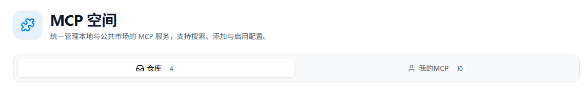

**管理员视角**（仓库 / 我的MCP / 审核中心）：

  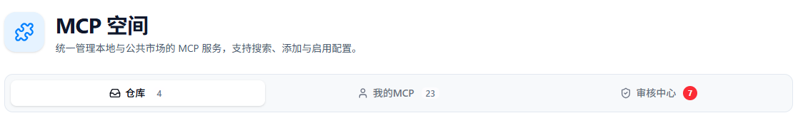

---

## 📦 仓库

「仓库」页签展示租户中已上架（共享）的 MCP 服务。您可浏览、查看详情，并一键安装到自己的「我的MCP」中使用。

### 浏览与搜索

- 以卡片形式展示已上架 MCP 服务
- 支持按**名称或标签**搜索
- 每张卡片展示：名称、描述、标签与安装量

  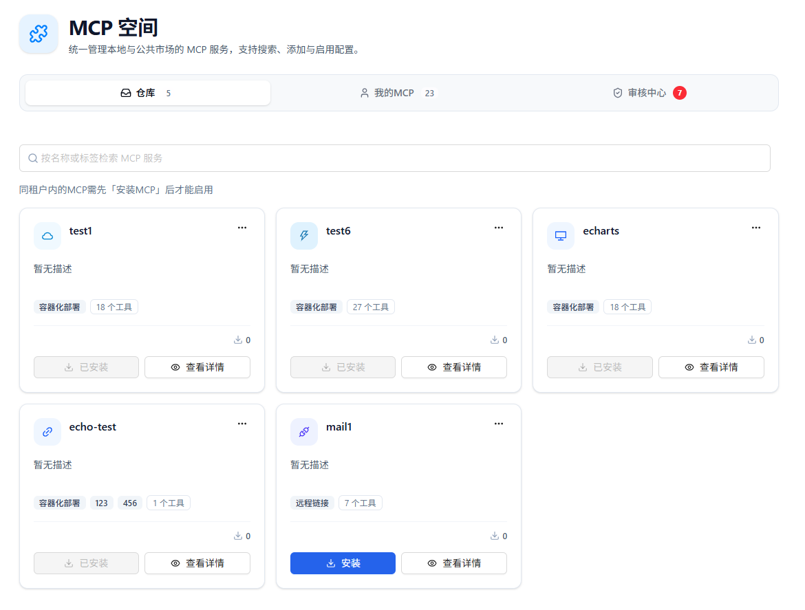

### 查看详情

点击卡片的查看详情按键，可查看该 MCP 服务的完整信息

  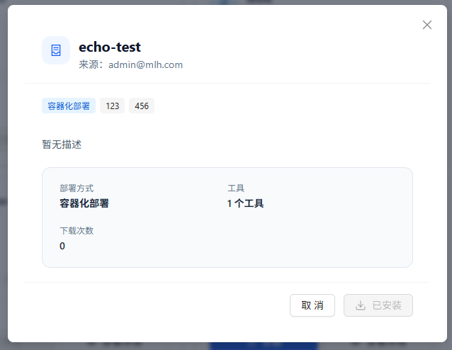

### 安装服务

点击卡片上的「安装」，填写必要信息后点击确认添加，系统会自动安装并配置该服务。已安装的服务会显示「已安装」状态，避免重复导入。

安装完成后，服务会出现在「我的MCP」中，其提供的工具也会自动同步到智能体的工具选择列表。

  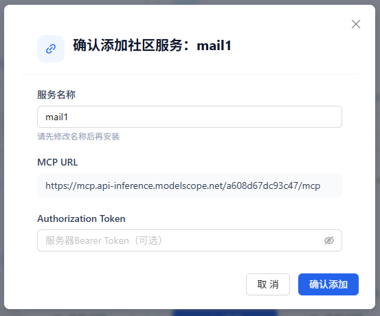

### 管理员下架

管理员可在仓库卡片中直接「下架」已上架的服务。下架后，该服务将不再对租户成员可见，也无法继续被安装。

开发者若需下架自己已上架的服务，请在「我的MCP」中通过「查看审核进度」弹窗操作下架。

  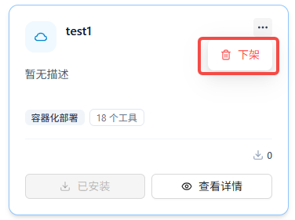

---

## 🧑 我的MCP

「我的MCP」页签用于管理您有权限编辑的 MCP 服务，包括自己创建的，租户成员给予您编辑权限的，以及从仓库安装而来的服务。

### 添加服务

点击「添加 MCP 服务」打开添加弹窗，支持多种接入来源。

#### 自定义添加

支持四种部署类型：

| 部署类型 | 适用场景 | 关键配置 |
|----------|----------|----------|
| **远程链接** | 已有独立部署的 MCP 服务（HTTP / SSE） | 服务 URL、Authorization Token、自定义请求头 |
| **容器** | 以容器方式运行的 MCP 服务 | 容器配置 JSON（mcpServers）、端口号 |
| **API** | 以 OpenAPI 规范描述的 HTTP API | 服务 URL、OpenAPI JSON（必填，自动校验格式） |
| **本地上传镜像** | 已有 Docker 镜像（.tar 文件） | 上传 .tar 镜像文件、端口号 |

> 本地上传镜像需管理员在部署中开启「上传镜像」功能后才会显示。

#### 端口说明

端口行为根据 Nexent 自身的部署方式自动区分：

- **Docker / Kubernetes 部署**：容器端口为统一默认端口，由系统自动分配并锁定，不可修改。多个 MCP 服务可复用同一端口，互不冲突。
- **本地部署**：端口由用户设置，提供「推荐端口」按钮一键获取可用端口，并自动检测端口占用情况。

#### 从 MCP 外部市场导入

浏览社区维护的 MCP 外部市场，选择「远程」或「容器」接入方式，填写所需的环境变量参数，一键导入。

  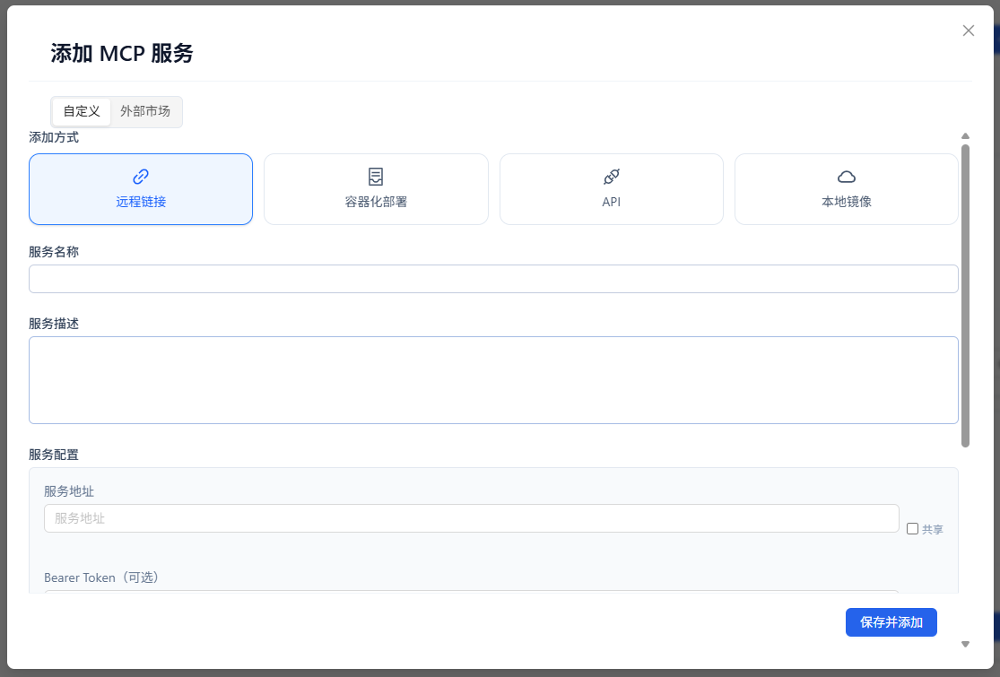

### 服务卡片状态

每张卡片会展示运行与上架相关状态：

| 标识           | 说明                        |
|--------------|---------------------------|
| **启用 / 已启用** | 服务是否启用，禁用后工具不再出现在智能体工具选择中 |
| **审核中**      | 申请上架待管理员审核                |
| **已上架**      | 当前已在仓库中共享                 |
| **审核驳回**     | 上架申请未通过，可修改后重新申请          |

  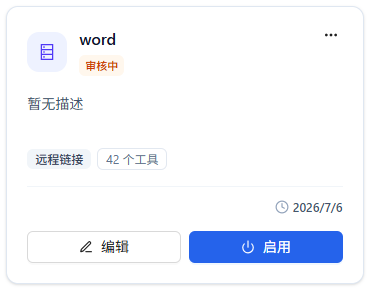

### 常用操作

在服务卡片或详情弹窗中，您可以：

- **编辑**：修改名称、描述、URL、Authorization Token 与标签等内容
- **启用 / 已启用**：通过开关控制服务状态
- **查看工具列表**：查看该服务提供的所有工具
- **容器管理**：查看容器日志与创建时的配置 JSON（容器化服务）

  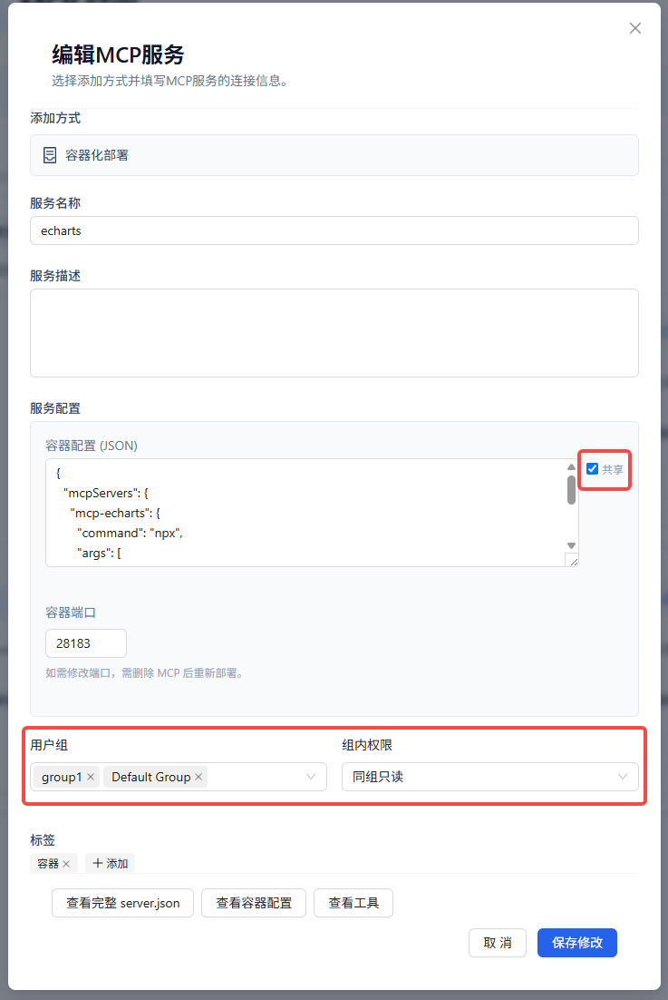

- **更多操作**：
  - **申请上架**：将服务提交到仓库审核
  - **连通性校验**：发起连接测试，测试 MCP 服务连接状态
  - **查看审核进度**：查看申请状态，并可取消申请或下架
  - **删除**：删除服务，容器化服务会同步清理容器资源

  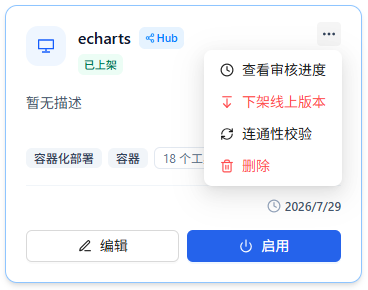

### 分享配置

添加或编辑服务时，可勾选用户组和用户权限，将服务配置共享给其他成员，便于团队内复用。

### 申请上架

1. 在创建或编辑页面，勾选 MCP 的服务配置（服务 URL、Authorization Token、自定义请求头、容器配置），被勾选的配置信息会被分享到仓库中。
2. 在更多菜单中点击「申请上架」
3. 填写上架信息：
   - **上架说明**（选填）：补充给审核人的说明
4. 点击「提交申请」，等待管理员审核

> 申请上架前需至少勾选一项共享配置字段。

### 查看审核进度

在更多菜单中打开审核状态弹窗后，可看到：

- 当前状态：审核中 / 已通过 / 已驳回
- 审核意见（如有）

根据状态，您还可以：

- **取消申请上架**：撤销待审核或已驳回的申请
- **下架**：将已上架的服务从仓库撤回

  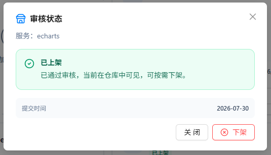

---

## ✅ 审核中心

「审核中心」仅对**管理员**可见，用于处理用户提交的上架申请。

### 待审核队列

页面以列表形式展示待处理申请，包含：

- 服务名称与部署方式
- 提交人
- 上架说明
- 操作按钮：详情、通过、驳回

页签上会显示待处理数量角标，便于管理员及时处理。

### 审核操作

1. 点击「详情」可预览服务配置，确认是否合适
2. 点击「通过」：可选填审核意见，确认后服务将上架到「仓库」
3. 点击「驳回」：可选填审核意见，驳回后提交者可在「我的MCP」中修改并重新申请

  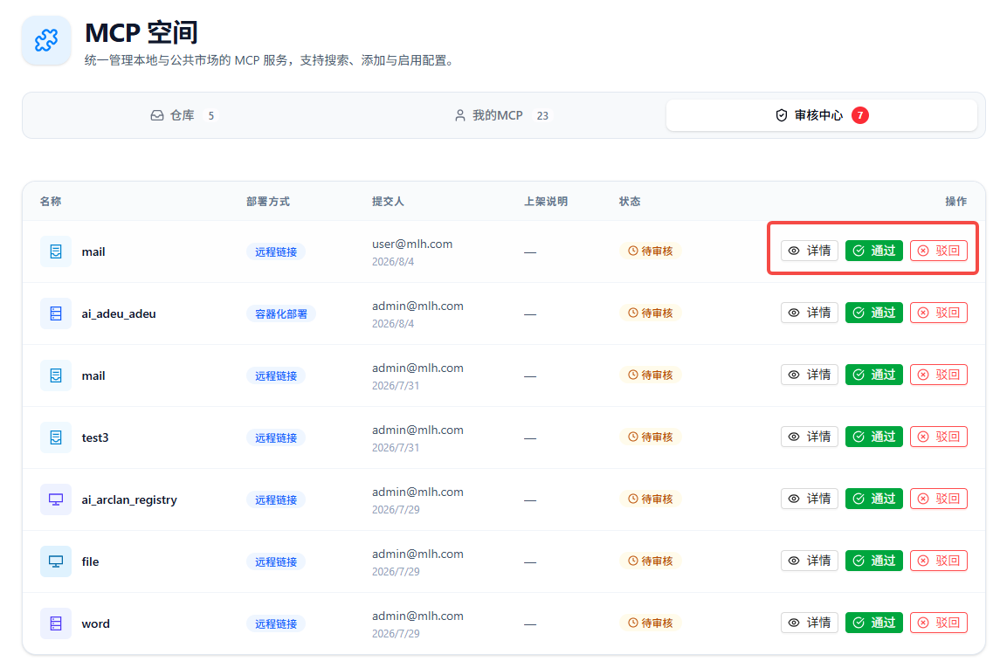

---

## 🚀 下一步

在 MCP 仓库中完成管理后，您可以：

1. 在 **[智能体开发](../agent-development)** 中为智能体配置 MCP 工具
2. 在 **[开始问答](../start-chat)** 中体验智能体调用 MCP 工具的效果
3. 继续浏览 **[技能仓库](./skill-repository)** 了解技能与 MCP 的协作

如果您在使用过程中遇到任何问题，请参考我们的 **[常见问题](../../quick-start/faq)** 或在 [GitHub Discussions](https://github.com/ModelEngine-Group/nexent/discussions) 中进行提问获取支持。
