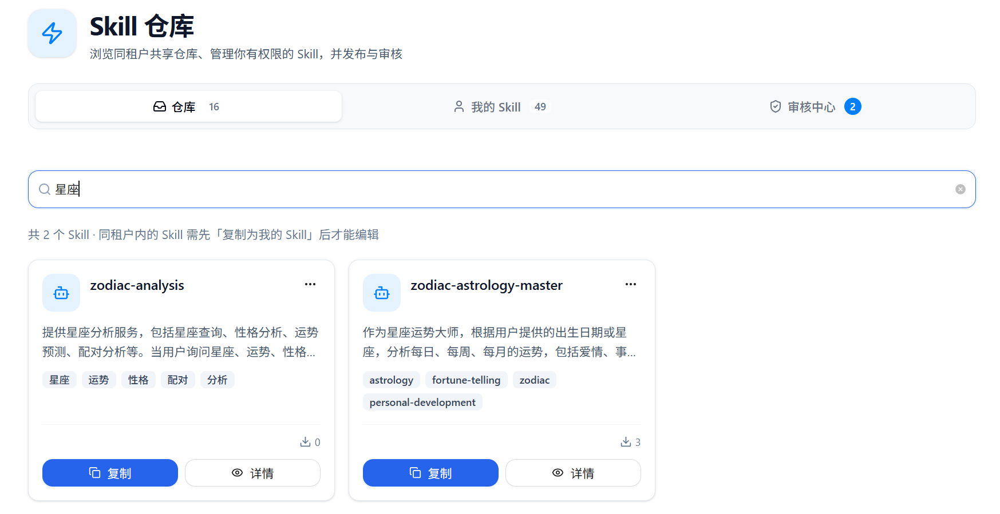
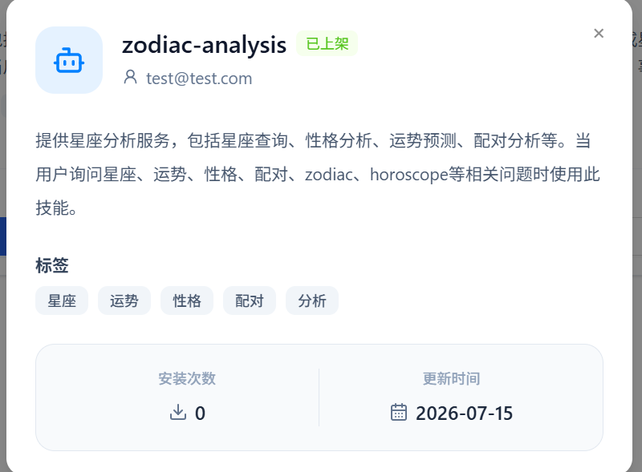
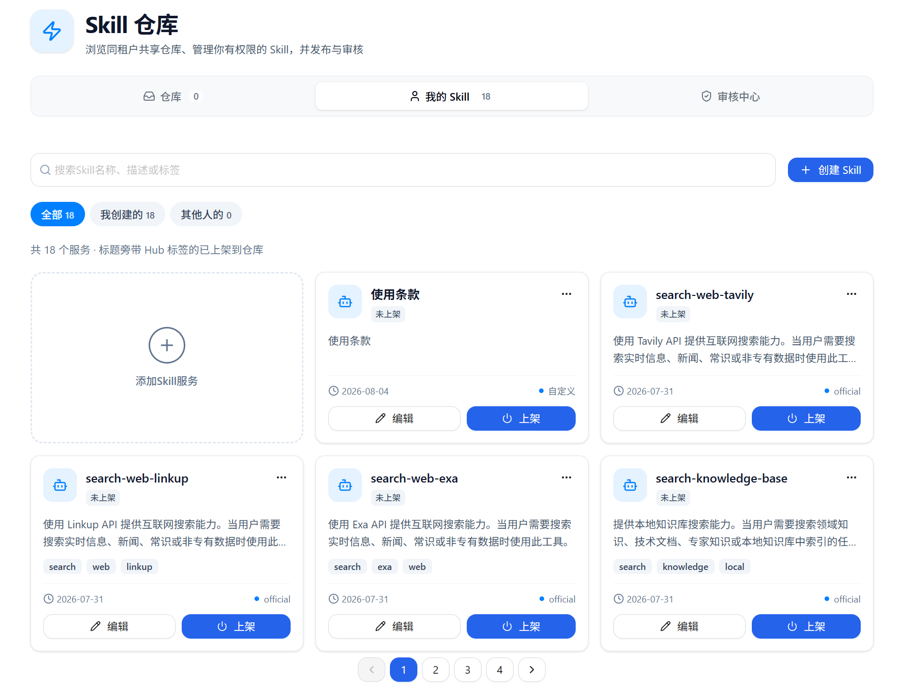
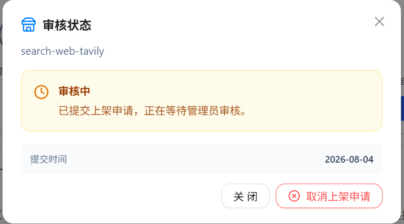
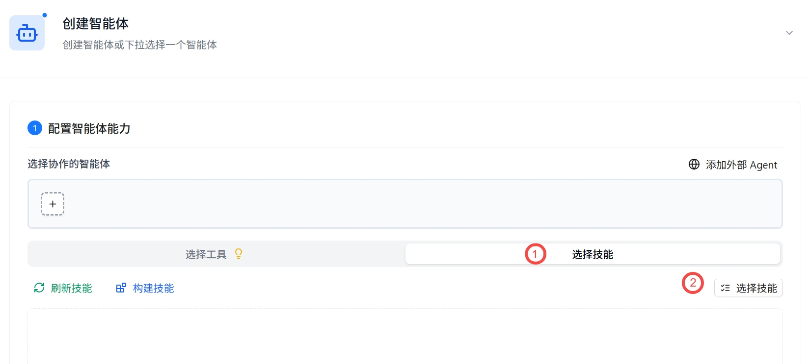
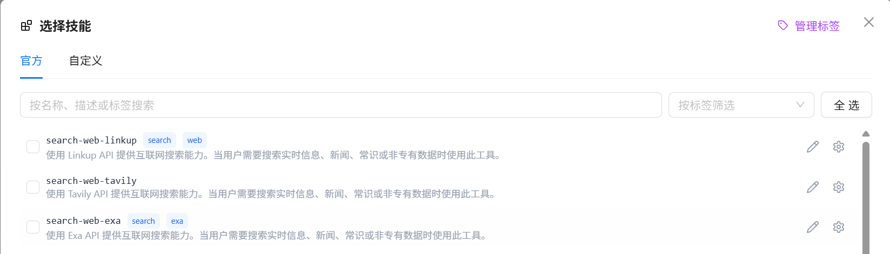
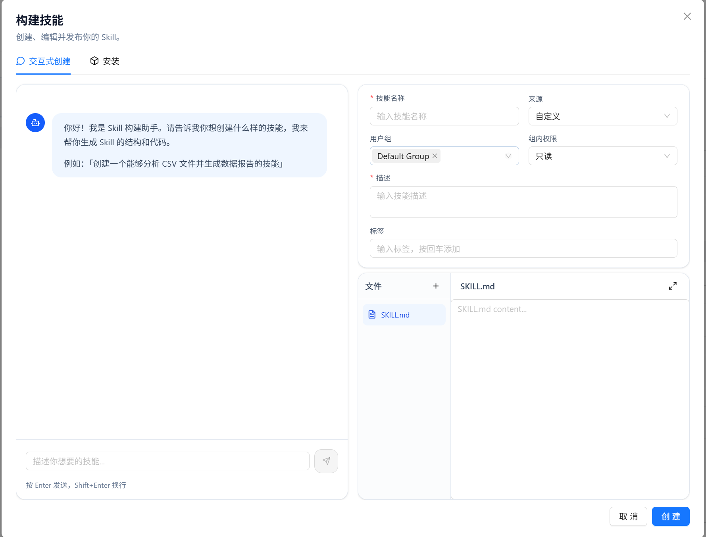

# Skill 仓库

技能（Skill）是 Nexent 为智能体扩展能力的核心机制。Skill 仓库用于在同一租户内浏览、复制、管理和审核 Skill；每个 Skill 可以将工具、配置和使用文档打包为可复用的能力单元。

## 目录

- [技能与工具的关系](#技能与工具的关系)：理解技能的核心概念
- [管理员与开发者的界面差异](#-管理员与开发者的界面差异)：了解不同角色的可用功能
- [仓库](#-仓库)：浏览、复制和下架已上架 Skill
- [我的 Skill](#-我的-skill)：创建、编辑和申请上架
- [审核中心](#-审核中心)：管理员审核 Skill 上架申请
- [技能使用指南](#-技能使用指南)：如何在智能体开发中使用技能
- [技能上传指南](#-技能上传指南)：SKILL.md 格式、ZIP 结构、特殊标签与书写规范
- [NL-to-Skill](#-nl-to-skill)：通过自然语言描述自动生成技能

## 技能与工具的关系

在 Nexent 中，**工具（Tool）** 与 **技能（Skill）** 是两个不同层次的概念，理解它们的区别有助于更好地为智能体配置能力。

**工具**是智能体可调用的单个原子操作。为智能体启用工具时，LLM 的每次思考都会在工具列表中搜索——这意味着即使某个工具本次对话完全不需要，LLM 仍然会消耗上下文额度去"看到"它。

**技能**则通过 `SKILL.md` 将多个工具的能力组合为一个完整的工作流，并附带参数配置与使用文档。LLM 不需要预先"看到"所有工具，而是根据用户的实际需求，自行判断是否激活某个技能。激活后，系统才会加载对应的工具集——从而有效节省 Token 消耗。

| 维度 | 工具 | 技能 |
|------|------|------|
| 粒度 | 单个原子操作 | 多个工具 + 配置 + 文档的组合 |
| Token 消耗 | 每次对话都占用上下文 | 仅在激活时才加载 |
| 参数 | 固定参数 schema | 可自定义参数模板 |
| 分发 | 代码级 | ZIP 包分发，即插即用 |

## 👥 管理员与开发者的界面差异

进入 **Skill 仓库** 后，页面顶部会按角色显示不同页签：

| 角色 | 可见页签 | 额外能力 |
|------|----------|----------|
| **开发者** | 仓库、我的 Skill | 浏览同租户已上架 Skill、复制为自己的 Skill、管理有编辑权限的 Skill、申请上架 |
| **管理员** | 仓库、我的 Skill、审核中心 | 在开发者能力基础上，审核上架申请，并可下架仓库中的 Skill |

> 提示：审核中心仅对管理员可见；开发者可在「我的 Skill」中查看自己申请的审核进度。

**开发者视图**（仓库 / 我的 Skill）：

<div style="display: flex; justify-content: left;">
  
</div>

**管理员视图**（仓库 / 我的 Skill / 审核中心）：

<div style="display: flex; justify-content: left;">
  
</div>

---

## 📦 仓库

「仓库」页签展示当前租户内已上架并可共享的 Skill。当前租户的开发者和管理员可以浏览、查看详情，并复制到自己的 Skill 列表后再编辑。

> 同租户共享的 Skill 必须先「复制为我的 Skill」才能编辑。

### 浏览与搜索

- 使用卡片浏览已上架 Skill
- 支持按 **Skill 名称、描述或标签** 搜索
- 卡片展示名称、描述、标签、来源、下载次数等摘要信息

 <div style="display: flex; justify-content: left;">
  
</div>

### 查看详情

点击卡片上的「详情」可查看 Skill 的基本信息，包括名称、创建者、描述、标签、安装次数和更新时间。详情仅用于查看；如需修改，请先复制到「我的 Skill」。

 <div style="display: flex; justify-content: left;">
  
</div>

### 复制为我的 Skill

1. 在目标 Skill 卡片上点击「复制」
2. 填写新的 Skill 名称；如系统提示名称冲突，请修改名称后重试
3. 复制成功后，该 Skill 会出现在「我的 Skill」中，可继续编辑、配置和申请上架

### 管理员下架

管理员可在仓库 Skill 卡片的更多操作菜单中选择「下架」。下架后，该 Skill 不再对当前租户的开发者和管理员开放浏览或复制；原有的个人副本不受影响。

---

## 🧑 我的 Skill

「我的 Skill」用于管理您有权限编辑的 Skill，包括自己创建的 Skill，以及被授予编辑权限的其他 Skill。

### 筛选与搜索

- **全部 / 我创建的 / 其他人的**：按归属筛选
- 支持按 Skill 名称、描述或标签搜索
- 列表以卡片形式展示，并支持分页浏览

<div style="display: flex; justify-content: left;">
  
</div>

### 创建、上传与编辑

在「我的 Skill」页签中点击「创建 Skill」，可选择：

- **交互式创建**：通过自然语言与 Skill 构建助手协作生成或完善 Skill
- **上传技能文件**：上传单个 `SKILL.md` 或包含完整文件结构的 ZIP 包

创建后可通过卡片上的「编辑」修改名称、描述、标签、组内权限、`SKILL.md` 正文及附属文件。详细的文件格式和上传规则见后文的[技能上传指南](#-技能上传指南)。

### 申请上架

有权限编辑的 Skill 可以申请上架到租户仓库：

1. 在 Skill 卡片上点击「上架」
2. 可选填写上架说明，帮助管理员了解本次申请
3. 点击「提交申请」，等待管理员审核

提交后，卡片会显示「审核中」状态；同一个 Skill 同时只会有一条待审核的上架记录。

<div style="display: flex; justify-content: left;">
  
</div>

### 查看审核进度

在已提交申请的 Skill 卡片上打开审核状态，可查看当前状态、提交时间、上架说明和审核意见（如有）。

- **审核中**：可取消上架申请
- **已上架**：可下架该 Skill
- **已驳回**：先编辑 Skill 进行修改；随后取消当前上架申请，再重新点击「上架」提交

<div style="display: flex; justify-content: left;">
  
</div>

---

## ✅ 审核中心

「审核中心」仅对管理员可见，用于处理当前租户开发者提交的 Skill 上架申请。

### 待审核队列

待审核列表会展示 Skill 名称、申请人、上架说明和提交时间等信息；页签上的角标显示当前待处理数量。

### 审核操作

1. 点击「详情」查看 Skill 的基本信息
2. 点击「通过」并确认后，Skill 将上架到「仓库」
3. 点击「驳回」时可填写审核意见；提交者可在「我的 Skill」中查看意见、修改后重新申请

<div style="display: flex; justify-content: left;">
  
</div>

---

## 技能使用指南

### 为智能体配置技能

1. 打开 **[智能体开发](../agent-development.md)** 页面。
2. 在「选择智能体的工具」中切换到 **Skills** 页签，点击「选择 Skill」。
3. 选择需要配置的 Skill；再次选择可取消。
4. 若 Skill 存在必填参数，选择时会自动打开参数配置窗口。完成填写并保存后，Skill 才会加入当前智能体。
5. 已添加的 Skill 可点击右侧齿轮图标，修改该智能体使用的参数。
6. 保存智能体配置。

<div style="display: flex; justify-content: left;">
  
</div>

### 查看已安装的技能

在「选择技能」的 **Skills** 页签中，可查看当前租户可用的官方 Skill 和自定义 Skill，并将其添加到当前智能体。

<div style="display: flex; justify-content: left;">
  
</div>

> 不同智能体可以为同一个 Skill 分别保存不同的参数配置。

## 技能上传指南

### 技能包结构

技能包可以是单个文件，也可以是包含多个文件的 ZIP 包：

```
skill-name/
├── SKILL.md              # 技能定义文件（必需）
├── config/
│   ├── config.yaml       # 参数默认值
│   └── schema.yaml        # 参数类型与说明
├── scripts/
│   └── *.py              # Python 脚本
├── examples.md            # 使用示例
└── assets/                # 静态资源
```

### SKILL.md 格式详解

`SKILL.md` 是技能的核心文件，分为 YAML 元数据区和正文两部分。

**YAML 元数据（必需）**

文件顶部必须有 YAML frontmatter，格式如下：

```yaml
---
name: skill-name
description: |
  一段描述，说明这个技能是做什么的、什么时候该用它。
  建议用第三人称书写。
tags:
  - tag1
  - tag2
---
```

| 字段 | 必填 | 说明 | 示例 |
|------|------|------|------|
| `name` | 是 | 技能名称，全英文、小写、单词间用连字符 | `github-repo-analyzer` |
| `description` | 是 | 技能功能描述，建议 1-3 句话，包含使用场景 | `这个技能用于分析 GitHub 仓库并提取关键指标` |
| `tags` | 否 | 技能标签列表，便于分类检索 | `["code", "github", "analysis"]` |

**正文**

元数据下方可以写 Markdown 正文，包含技能的使用说明、最佳实践、示例代码等。

### 两种技能类型

根据用途，技能分为两类，书写方式有所不同：

**工具类技能**：用于暴露工具能力。正文应包含工具的参数说明、调用示例、返回格式、错误处理等。

**智能体类技能**：用于教智能体执行复杂任务。正文应包含工作流程、领域知识、边界条件、最佳实践等。

### config/schema.yaml：定义参数表单

如果技能需要用户填写参数，可以创建 `config/schema.yaml` 文件。系统会根据此文件在前端自动生成参数配置表单。

```yaml
param_name:
  type: string | number | boolean | array | object
  required: true | false
  default: <默认值>
  description: "参数的英文说明"
  description_zh: "参数的中文说明"
```

**支持的类型**：`string`、`number`、`boolean`、`array`、`object`

**完整示例**：

```yaml
query:
  type: string
  required: true
  description: "Search query string"
  description_zh: "搜索关键词"
  default: ""

top_k:
  type: number
  required: false
  description: "Number of results to return"
  description_zh: "返回结果数量"
  default: 3

enable_rerank:
  type: boolean
  required: false
  description: "Enable result reranking"
  description_zh: "是否启用结果重排序"
  default: false
```

### config/config.yaml：设置参数默认值

如果希望某些参数有默认值，可以创建 `config/config.yaml`：

```yaml
# Initial workspace path
init_path: "/mnt/nexent"

# Maximum number of results
top_k: 5
```

### 特殊标签

在 SKILL.md 正文中，可以使用以下特殊标签：

#### `<reference>`：按需加载示例文件

使用 `<reference>` 标签引用外部文件，该文件仅在需要时才被加载，不会增加 SKILL.md 的主文件大小。

```markdown
## 示例参考

<reference path="examples.md" />
```

#### `<use_script>`：声明捆绑的脚本

如果技能包中包含 Python 或 Shell 脚本，需要在 SKILL.md 中声明：

```markdown
<use_script path="scripts/analyze.py" />
```

#### `<code>`：展示可执行代码示例

使用 `<code>` 标签包裹可执行的代码示例（通常为 Python 代码）：

```markdown
<code>
result = run_skill_script(
    "code-reviewer",
    "scripts/analyze.py",
    {"--target": "/path/to/file.py", "--verbose": True}
)
print(result)
</code>
```

### 辅助函数

在智能体类技能的正文和示例中，可以使用以下函数：

**`run_skill_script(skill_name, script_path, params)`**：执行技能包中的脚本

```python
# 执行 Python 脚本
result = run_skill_script(
    "code-reviewer",
    "scripts/analyze.py",
    {"--target": "/path/to/file.py"}
)

# 执行 Shell 脚本
result = run_skill_script(
    "database-migration",
    "scripts/migrate.sh",
    {"--direction": "up", "--steps": 1}
)
```

**`read_skill_md(skill_name, files)`**：读取技能包中的文件内容

```python
# 默认只读取 SKILL.md（如果存在引用文件，不会自动包含）
content = read_skill_md("my-skill")

# 显式指定要读取的文件
full_content = read_skill_md("my-skill", [
    "SKILL.md",
    "reference/api-reference.md"
])
```

### 书写规范与最佳实践

**SKILL.md 书写规范**：

1. **描述要具体**：说明技能在什么场景下使用，而不是仅仅描述功能
   - ✓ "当用户需要分析 GitHub 仓库的流行度指标时使用"
   - ✗ "GitHub 搜索功能"

2. **避免时间敏感信息**：不要包含具体日期、版本号等会过期的内容

3. **保持简洁**：SKILL.md 正文建议控制在 500 行以内。复杂内容用 `<reference>` 按需加载

4. **路径格式**：始终使用正斜杠 `/`，即使在 Windows 下也如此
   - ✓ `src/services/payment_service.py`
   - ✗ `src\services\payment_service.py`

5. **参数命名一致**：全文统一使用相同的术语和命名风格

6. **包含边界条件**：说明技能的适用范围和限制

**参数描述最佳实践**：

```yaml
# ✓ 好：明确说明用途和格式
query:
  type: string
  required: true
  description: "GitHub repository owner/name or full URL"
  description_zh: "GitHub 仓库的 owner/name 格式或完整 URL"

# ✗ 差：过于模糊
query:
  type: string
  required: true
  description: "Search query"
  description_zh: "查询"
```

**代码示例最佳实践**：

- 每个工具至少提供 2 个不同场景的示例
- 示例中包含常见参数组合
- 示例展示成功调用和常见错误处理

### 从现有技能学习

系统内置了多个完整技能的参考示例，您可以在 `test_skill_examples/official-skills/` 目录下找到它们：

| 技能名 | 参考价值 |
|--------|---------|
| `create-file-directory` | 工具类技能的标准写法，包含完整参数表、调用示例、错误处理表 |
| `search-knowledge-base` | 搜索类技能的参数配置，包含 schema.yaml 和 config.yaml 的完整示例 |
| `analyze-image` | 多模态工具的示例，包含 `<code>` 调用格式 |
| `code_review_expert` | 智能体类技能的参考，包含捆绑脚本和 `<use_script>` 标签用法 |

### 常见问题

**Q: 上传 ZIP 包时报错"缺少 SKILL.md"**

确保 ZIP 包根目录下包含 `SKILL.md` 文件，而不是将其放在子文件夹中。

**Q: 技能描述不生效**

技能描述应写在 YAML frontmatter 的 `description` 字段中，而非正文的 Markdown 部分。正文内容不会被解析为技能描述。

## NL-to-Skill

NL-to-Skill 是 Nexent 提供的一项智能创建功能。您只需要用**自然语言描述**一个技能的需求，系统就能自动生成完整的技能包，包括技能定义、参数配置、甚至配套的脚本代码。整个生成过程实时可见，就像有一个 AI 助手在帮您写代码一样。

简单来说：

> 您说"我想要一个能搜索 GitHub 仓库并提取 Star 数的技能"，系统就自动为您生成一个完整可用的技能。

<div style="display: flex; justify-content: left;">
  
</div>

### 快速上手

#### 第一步：描述您的需求

在输入框中，用自然语言描述您想要的技能。描述越清晰，生成效果越好。

**正例**：
- "创建一个技能，可以根据关键词搜索 GitHub 仓库并返回 Star 数、描述和链接"
- "创建一个读取 Excel 文件、统计各列数据并生成图表的技能"
- "创建一个技能，能从邮件中提取订单号、金额和日期，汇总成表格"

**反例**：
- "帮我做一个聊天技能"（太模糊）
- "搜索工具"（缺少具体能力描述）

#### 第二步：查看生成过程

点击"生成"后，页面会实时展示 AI 的思考和编写过程：
- 看到 AI 在分析您的需求
- 看到它正在编写技能定义文件
- 看到它在规划参数结构

这个过程就像看 AI 现场写代码，您可以随时点击"停止"中断。

#### 第三步：预览并保存

生成完成后，系统会展示技能的完整内容：
- 技能名称和描述
- 参数列表（每个参数是什么、是否必填）
- 使用示例

仔细检查预览内容：
- 如需调整，点击"编辑"微调
- 如符合预期，点击"保存"将技能添加到您的技能库

### 写作技巧

#### 如何写好技能描述

**1. 明确输入输出**

告诉系统这个技能需要什么信息、会返回什么结果。

```
✓ "输入一个 GitHub 仓库地址，返回仓库名称、Star 数、Fork 数和最新更新时间"
✗ "搜索 GitHub"（太模糊）
```

**2. 说明使用场景**

让 AI 理解在什么情况下会用到这个技能。

```
✓ "用于快速查询开源项目的流行程度，帮助做技术选型决策"
✗ "查数据"（没有场景）
```

**3. 描述边界条件**

如果有特殊的处理逻辑或限制，一并说明。

```
✓ "如果仓库不存在，返回友好提示而不是报错"
✓ "图片 URL 无效时跳过该图片并记录日志"
```

**4. 显式要求生成示例**

如果技能使用场景复杂，且对边缘场景响应准确率要求较高，则可以在要求中明确提出生成更详细的示例。

```
✓ "生成全面且详细的使用示例"
```

#### 适用场景举例

| 场景 | 描述示例 |
|------|---------|
| **数据采集** | "输入关键词，在知乎上搜索相关问答并提取最高赞回答的摘要" |
| **文件处理** | "上传一个 CSV 文件，自动统计各列数据并生成折线图" |
| **API 封装** | "创建一个调用天气 API 并返回未来三天预报的技能" |
| **多工具组合** | "输入商品链接，自动比价（调用多个电商搜索）并返回最低价链接" |
| **数据清洗** | "读取一段混乱的文本，提取其中的邮箱、手机号、日期并格式化输出" |

### 生成过程中可以做什么

#### 实时预览

生成过程中，技能内容会逐步显示在预览区域：
- `SKILL.md` 内容：技能定义、描述、标签
- `examples.md`：技能使用示例
- `scripts/*.py`：工具脚本（复杂模式下）

#### 随时停止

如果生成方向偏离预期：
- 点击"停止"按钮，AI 立即停止
- 已有生成结果会保留，您可以查看或放弃

#### 多次尝试

如果第一次生成结果不理想：
- 直接补充需求细节，在原有基础上直接修改
- 或者在预览中手动调整
- 不满意当前生成的技能，希望重新再来时，您可以点击右上角的"垃圾桶"图标清空所有技能内容

### 使用限制与注意事项

#### 模型能力影响质量

NL-to-Skill 使用您租户配置的 LLM 模型来生成技能。模型的能力直接决定生成质量：
- 聪明的模型能准确理解需求，生成结构清晰、易于理解的技能
- 较弱的模型可能生成不完整或有误导性的内容，影响智能体的效率与准确率

如果生成结果不理想，可以尝试：
1. 简化需求描述
2. 切换到更聪明、更强大的模型
3. 分步骤创建（先做简单版本，再手动扩展）

#### Token 消耗

复杂技能生成会消耗更多 Token：
- **简单模式**：通常消耗较少，适合快速验证
- **复杂模式**：消耗较多，适合正式创建完整技能

建议先用简单模式测试想法，确认可行后再用复杂模式正式创建。

#### 并非所有需求都能实现

NL-to-Skill 擅长生成以下类型的技能：
- 单一工具的包装（如封装一个搜索能力）
- 多工具的简单串联（如搜 → 读 → 总结）
- 常见数据处理流程（如文件格式转换、数据提取）

以下类型的技能可能超出能力范围：
- 需要调用未接入的外部 API
- 涉及复杂的状态管理或并发逻辑
- 需要访问平台未开放的底层接口

遇到无法实现的需求时，系统会给出提示，您可以考虑手动创建或联系技术支持。

#### 技能修改

在「我的 Skill」中找到需要修改的 Skill，点击「编辑」。在智能体配置页面的 Skills 列表中，对具有编辑权限的 Skill 也可点击右侧铅笔图标进入编辑。系统会加载该 Skill 的基本信息、`SKILL.md` 正文和附属文件；您可以通过交互式创建页使用自然语言完善内容，也可以直接编辑文件后保存。

新建或上传 Skill 时，如名称与已有 Skill 重名，系统会提示修改名称后再提交。

## 安全与最佳实践

- **知识库访问控制**：导入包含知识库工具的技能时，实际检索范围受当前用户权限限制
- **公网搜索**：Tavily / Linkup / Exa 等公网搜索需先在平台安全配置中填写对应 API Key
- **路径安全**：技能包内文件操作仅限技能目录范围内，无法访问系统任意路径

## 相关参考

- [智能体开发](../agent-development.md)
- [本地工具概览](../local-tools/index.md)
- [MCP 仓库配置](./mcp-repository)
- [技能系统概览](/zh/backend/skills/overview)
