# 开始问答

开始问答页面是用户与智能体交互的主要入口。通过该页面，用户可以与智能体进行对话、上传文件与附件、使用语音输入、管理对话历史，并完成文件处理、知识检索、文档生成等多种任务。

## 一、选择智能体

### 1. 进入开始问答主页

进入开始问答页面后，默认显示智能体列表页。用户需要先选择一个智能体才能开始对话。

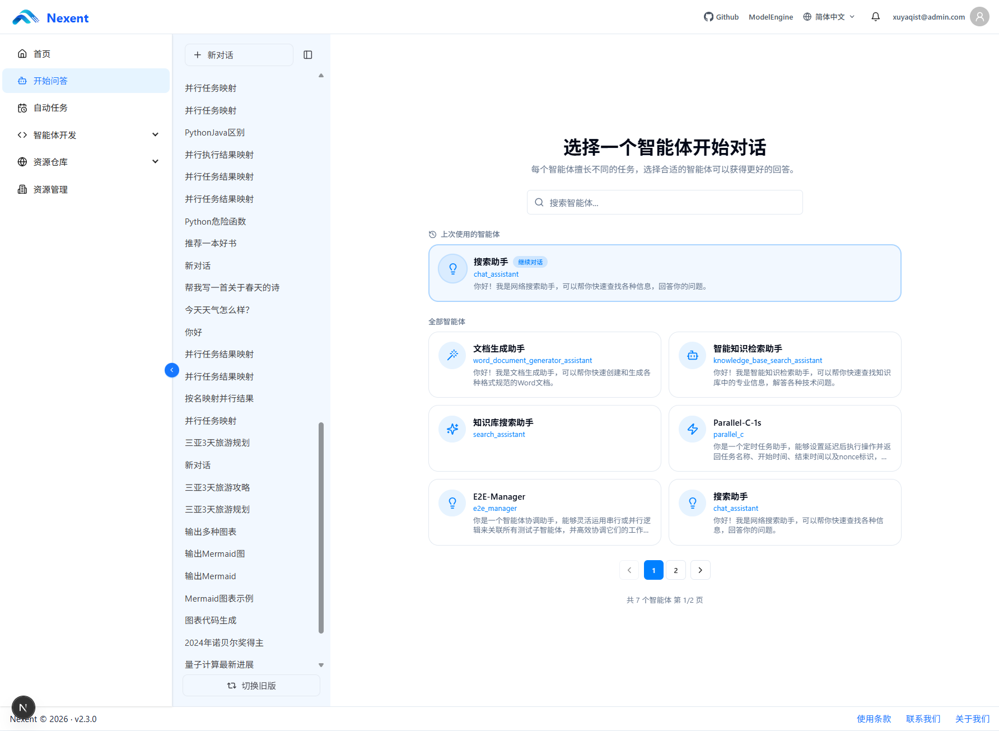

### 2. 选择可用智能体

只有同时满足以下条件的智能体，才会出现在开始问答页面中：

- **已发布**：智能体已发布
- **被设置为主智能体**：智能体为主智能体
- **当前用户可用**：当前用户有权限使用该智能体

智能体卡片展示：智能体图标、显示名称、英文标识、功能描述或问候语。

支持通过关键词（名称、描述、开发者）实时搜索。系统会记录最近使用的智能体并提供快速入口，列表超过一页时自动分页。

## 二、智能体首页

选择智能体后进入对应的智能体首页。该页面主要由以下区域组成：

- **左侧对话历史区域**：管理对话历史
- **右侧欢迎区域**：展示智能体信息和示例问题
- **底部输入区域**：输入问题、上传附件、选择对话模式

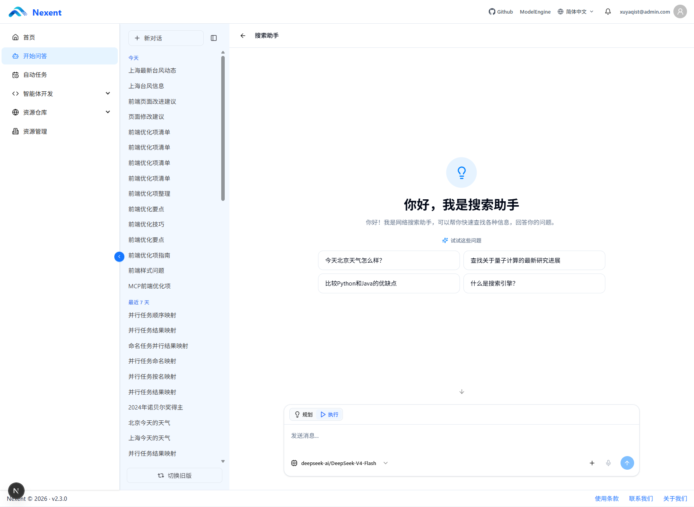

### 1. 对话历史区域

左侧边栏显示当前智能体的对话历史记录。

#### 创建新对话

- 点击边栏顶部的「新对话」按钮可创建新对话
- 新对话默认使用当前选择的智能体
- 开始新任务时，可以通过新建对话避免受到历史上下文影响

#### 查看对话列表

- 首次进入时默认加载最近 30 个对话，继续向下浏览时按页加载更多
- 对话按照最近活动时间分为“今天”“最近 7 天”和“更早”
- 点击已有对话，可继续查看或继续提问
- 对话标题由系统自动生成

#### 管理对话记录

目前支持以下对话管理操作：

| 操作 | 说明 |
| --- | --- |
| 重命名对话 | 修改单个对话标题 |
| 删除对话 | 删除单个对话及其消息记录 |
| 批量管理 | 勾选当前已加载的多个对话，也可以“全选”后统一删除 |

> **注意**：删除操作无法撤销。批量删除还会取消并清理绑定到所选对话的自动化任务；确认前请检查选择数量。

### 2. 智能体开场白和示例问题

智能体首页中央区域会显示该智能体的开场白（介绍用途和能力）以及预设的示例问题。开场白和示例问题由智能体开发者在智能体配置页面中设置。点击示例问题会自动填入输入框，用户可修改后发送或直接发送。

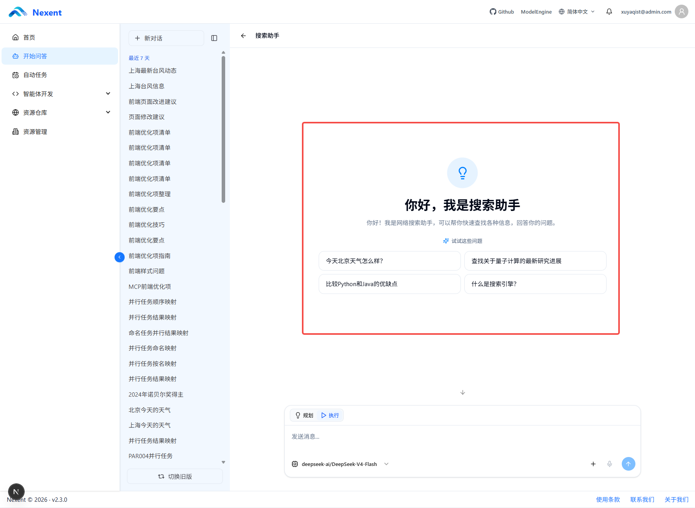

### 3. 输入框及对话模式

底部输入区域用于输入问题、上传附件、使用语音输入和发送消息。

#### 执行模式与规划模式

输入框上方提供「执行」和「规划」两个模式切换按钮。

- **执行模式**：智能体直接进入 ReAct 循环，直到任务完成或达到最大步骤数。适合简单明确的问题。

- **规划模式**：适合复杂任务。智能体在执行前会先将任务拆解为多个有序步骤，输入框上方会以卡片形式展示计划和各步骤执行状态（等待中/进行中/已完成/已跳过）。计划步骤数量要求至少 3 步，最多 8 步。智能体按计划逐步执行，并在每个步骤完成后会自动更新状态。

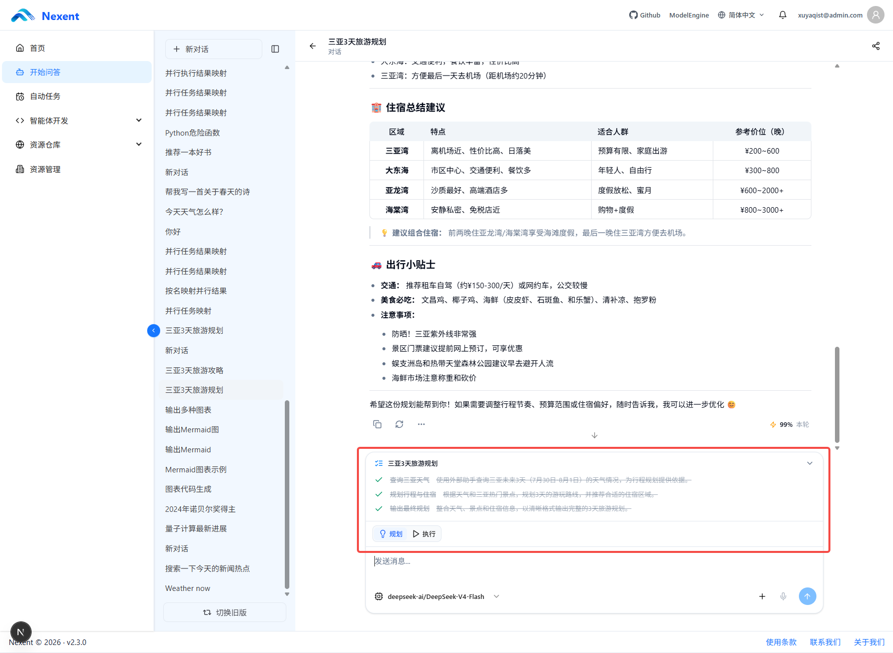

#### 选择模型

如果智能体在配置页面中预先添加了多个可用模型，用户可以在输入框下方切换具体使用的模型。模型选择器中只展示该智能体已配置的模型。

#### 设置会话 Metadata

如果智能体开发者在“运行策略”中开启了“允许会话 Metadata”，输入区域会显示“Metadata”按钮。点击后填写 JSON 对象，例如：

```json
{
  "channel": "customer-service",
  "request_id": "REQ-2026-001"
}
```

- Metadata 绑定当前会话，保存后会用于该会话后续的智能体运行。
- 内容必须是 JSON 对象，不能填写数组、字符串或其他顶层类型。
- 大小不能超过 64 KiB；保存空对象 `{}` 会清除当前会话已存储的 Metadata。
- Metadata 对模型可见，请勿填写密码、访问令牌、个人隐私或其他敏感信息。


#### 上传附件

用户可以在输入框中上传附件，让智能体根据附件内容完成分析、总结或其他任务。

**上传方式**：

- 点击输入框右侧的文件上传按钮
- 将文件直接拖拽到输入框区域

**支持的文件类型**：

| 类型 | 文件格式                                                                          |
| ---- | --------------------------------------------------------------------------------- |
| 图片 | image/\* (JPG, PNG, GIF 等)                                                       |
| 文档 | PDF, Word (.docx), Excel (.xlsx), PowerPoint (.pptx), EPUB (.epub)                |
| 文本 | Markdown (.md), 纯文本 (.txt), JSON (.json), CSV (.csv), XML (.xml), HTML (.html) |
| 其他 | 其他格式文件将作为普通附件处理                                                    |

**文件数量和大小限制**：

- 单次消息最多可上传 **50 个附件**。
- 单个附件最大支持 **100 MB**。超过该大小时，系统会拒绝上传。
- 部署管理员可以通过上传配置设置更低的前端上传限额；如果页面提示的限制低于 100 MB，请以当前环境的提示为准。

> **注意**：
>
> - 不同文件类型所需的解析能力由智能体配置决定
> - 图片类文件需要智能体配置视觉模型和图片解析工具
> - 文档类文件需要智能体配置相应的文档解析工具

**附件内容参与对话**：上传的附件会作为上下文发送给智能体，智能体可以读取和分析附件内容并据此回答问题或执行任务。

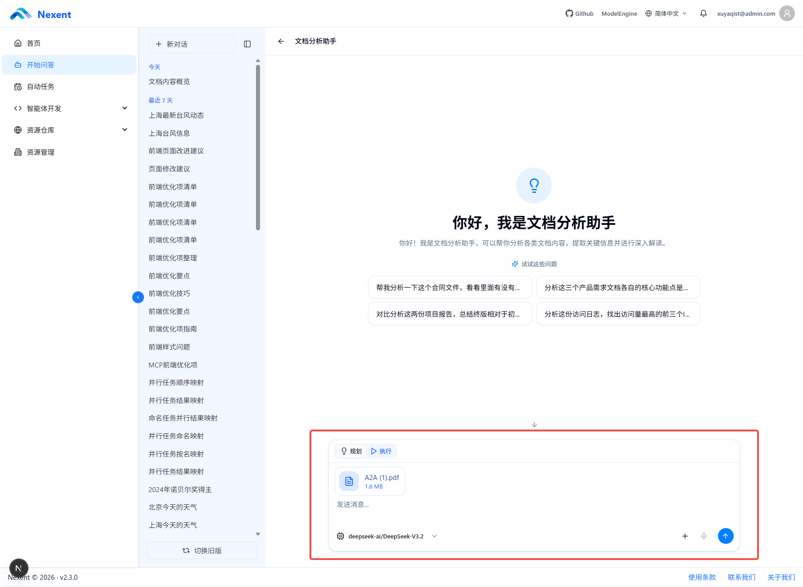

#### 语音输入

用户可以使用麦克风图标输入语音问题。

**使用前提**：

- 需要在系统配置中启用语音识别（STT）功能
- 首次使用时需要授权浏览器访问麦克风

**使用流程**：

1. 点击输入框右下角的麦克风按钮
2. 如果是首次使用，浏览器会请求麦克风权限，点击「允许」
3. 清晰地说出需要询问的内容
4. 系统实时将语音转换为文字显示在输入框中
5. 检查并编辑识别结果
6. 点击发送按钮或按 Enter 键发送

> **提示**：为了获得更好的语音识别效果，请确保在安静的环境中使用，并清晰地发音。

#### 发送消息

**发送方式**：

- 点击输入框右侧的发送按钮
- 直接按键盘上的 Enter 键发送

**快捷键**：

| 快捷键        | 功能     |
| ------------- | -------- |
| Enter         | 发送消息 |
| Shift + Enter | 换行     |

**发送状态**：

- 当智能体正在处理时，发送按钮会变为停止按钮
- 点击停止按钮可以中断当前的执行过程

发送成功后，用户消息和智能体回复都会显示消息时间。跨日期的消息之间还会显示日期分隔线，便于在历史对话中确认上下文发生的时间。

## 三、问答执行过程

智能体采用 ReAct 工作模式，执行任务时可能包含多轮「思考」和「执行」过程。

### 1. 记忆检索

如果智能体配置了记忆功能，用户发送问题后，系统会在正式执行任务前检索相关记忆。

检索到的记忆可能包括：

- 用户过去提供的信息
- 用户的偏好设置
- 历史任务中的相关内容
- 智能体保存的长期信息

相关记忆会作为当前任务的上下文，帮助智能体生成更符合用户需求的回复。


### 2. ReAct 执行流程

Nexent 智能体基于 [smolagents](https://github.com/huggingface/smolagents) 的 CodeAgent 实现，采用 ReAct（Reasoning + Acting）工作模式。核心循环为：

- **Think**：模型分析当前任务状态，确定下一步行动。对于启用了规划模式的智能体，模型会先评估任务复杂度——如果预计需要超过三个步骤才能完成，则会生成结构化计划。

- **Code**：模型以 Python 代码形式输出行动指令，通过 `<code>...</code>` 标签包裹执行代码，通过 `<DISPLAY:语言>...</DISPLAY>` 标签包裹仅用于展示的代码。

- **Observe**：代码执行后，系统返回真实结果（标记为 `Observation:`）。模型必须基于真实执行结果继续推理，禁止在执行前伪造观察结果。

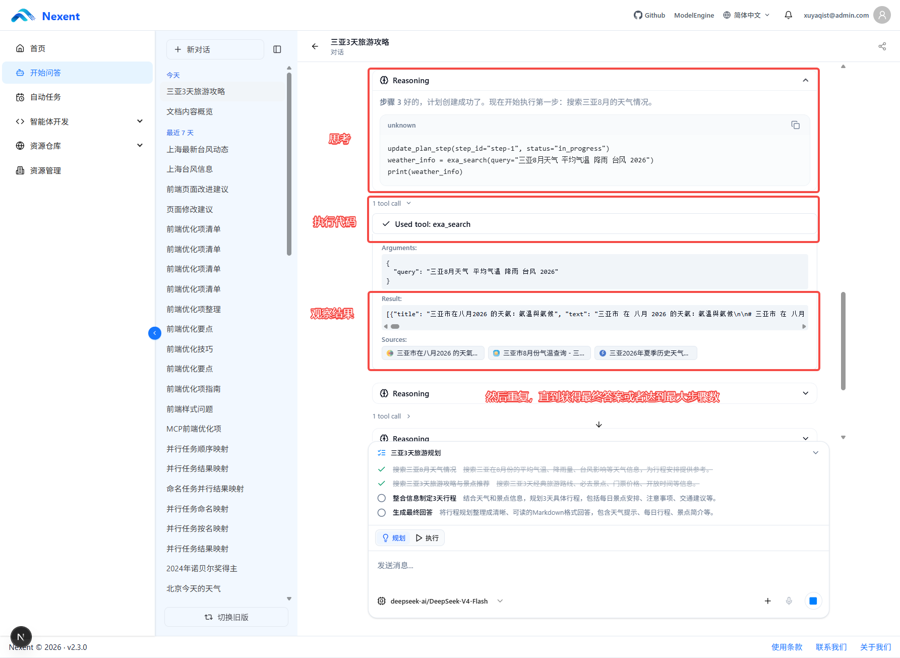

循环逻辑在前端是Reasoning重复直到模型判断可以直接生成最终答案，或达到最大步骤数。最终答案以 Markdown 格式输出，支持标题、列表、表格、代码块和链接；若使用了检索工具，还需在对应内容后添加引用标记 `[[字母+数字]]`，以支持溯源。

### 3. 查看代码和工具调用过程

在问答页面中，用户可以查看智能体执行过程中的关键信息：

- **思考过程**：智能体的推理分析
- **生成的可执行代码**：智能体编写的执行代码
- **调用的工具**：使用的具体工具名称
- **工具输入参数**：传递给工具的参数
- **工具输出结果**：工具返回的执行结果

这些信息以折叠卡片的形式展示在对话区域中：

- **思考卡片**（带脑图图标）：显示智能体的推理过程
- **工具调用卡片**（带工具图标）：显示工具名称、调用状态和执行结果


### 4. 自动纠错

如果智能体生成的代码存在问题，系统具备一定的自动纠错能力。

智能体可能会根据执行错误：

1. 分析错误原因
2. 修改生成的代码或参数
3. 重新执行任务
4. 根据新的执行结果继续处理


> **注意**：自动纠错能力受模型能力、工具实现和任务复杂度影响，并不能保证所有错误都能自动修复。

### 5. 最大执行步骤

智能体开发者可以在智能体配置页面设置最大的执行步骤数。

当智能体达到最大执行步骤后：

- 系统会停止继续执行
- 当前问答可能无法完成全部任务
- 页面会返回当前已经获得的执行结果或停止提示

> **建议**：对于复杂任务，应根据任务复杂度合理设置最大执行步骤。

### 6. 多工具并行

当一个任务需要同时调用多个相互独立的工具时，智能体可以并行调用多个工具，以减少整体等待时间。

例如，可以同时进行：

- 多个知识库检索
- 多个网页检索
- 多个文件分析
- 多个数据处理操作

并行调用会以合并的工具调用卡片形式展示，显示调用的工具数量和各自的执行状态。

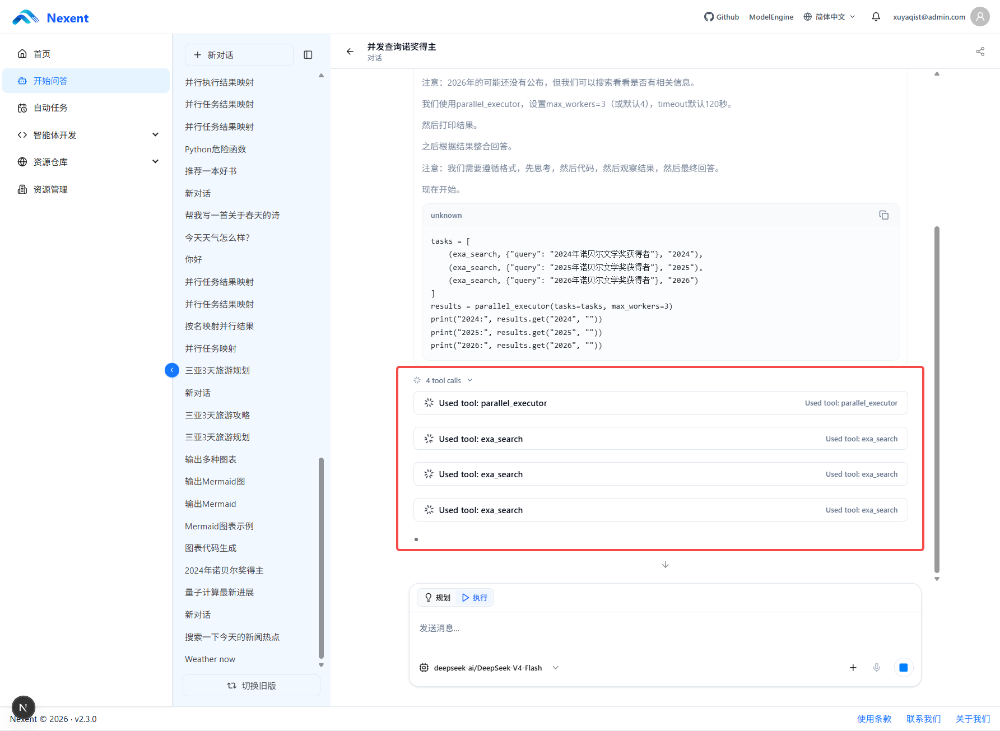

### 7. 多子智能体并行

智能体可以根据任务需要调用多个子智能体分别处理不同子任务。

多个子智能体可以并行工作，主智能体负责：

- 拆分复杂任务
- 分配子任务给不同的子智能体
- 汇总子智能体的结果
- 生成最终回复

子智能体的调用会以嵌套卡片形式展示，显示：

- 子智能体名称
- 子智能体执行的任务描述
- 执行状态（运行中/已完成）


### 8. 自检

自检是智能体配置的分层 ReAct 自验证能力，用于在关键执行节点和生成最终答案前检查当前结果是否存在明显问题。该功能默认关闭，只有智能体启用自验证配置后，问答页面才会显示自检过程。

#### 触发时机

启用自检后，系统会根据智能体配置，在以下关键节点进行检查：

- **工具调用前**：检查生成的执行代码是否为空、Python 语法是否正确，以及是否存在明显的越权或危险操作；如果配置了工具相关检查，还会检查是否调用了相关工具或输出了必要信息。
- **工具调用或代码执行后**：检查执行结果是否为空，以及结果中是否包含错误信号。
- **知识检索后**：检查检索结果是否包含可用证据。
- **子智能体交接后**：检查子智能体是否返回了有实质内容的结论。
- **生成最终答案前**：检查答案是否为空、是否残留内部执行标记或未替换的占位符，以及之前发生的错误是否已在答案中说明。

#### 最终答案检查

对于需要证据或较复杂的任务，系统还可以使用验证模型对候选答案进行进一步检查。验证模型会结合用户任务和执行过程，评估：

- 答案是否覆盖用户目标
- 结论是否有足够的证据支撑
- 工具错误是否已经处理
- 引用格式是否正确
- 输出格式是否安全、完整

轻量级问候等对话会进行基础检查，不一定需要外部证据。最终是否进行验证、验证严格程度和验证模型的使用方式由智能体的自验证配置决定。

#### 自检结果

自检面板会以折叠卡片形式显示检查过程及结果。面板可能显示以下状态：

- **正在自检**：系统正在准备或执行检查
- **基础自检通过**：关键检查项通过
- **最终自检通过**：最终答案通过验证
- **自检发现需关注项**：发现问题，但当前问题不会阻断执行
- **自检未通过，正在修正**：当前候选答案未通过，智能体会根据反馈继续修正
- **自检已阻断当前动作**：当前执行动作未通过阻断性检查，系统不会继续执行该动作
- **最终自检未通过**：达到允许的验证轮次后仍未通过

面板中还可能显示验证评分、未通过的检查项、用户可见提示和修复建议。验证事件不会展示验证模型的内部推理文本，而是展示结构化的检查结果。

#### 自检失败后的处理

当关键检查未通过时，系统会将失败标准和修复指令作为反馈交给智能体。智能体可能会：

1. 修改执行代码或工具参数
2. 重新调用工具或补充检索证据
3. 重新生成最终答案
4. 在无法通过验证时返回受控说明，指出未通过项、原因和建议

最终答案验证的最大尝试次数由智能体配置决定，默认最多进行 2 轮最终答案验证。自检不能保证发现所有业务错误，也不会替代用户对文件内容、数据准确性或业务结果的人工确认。

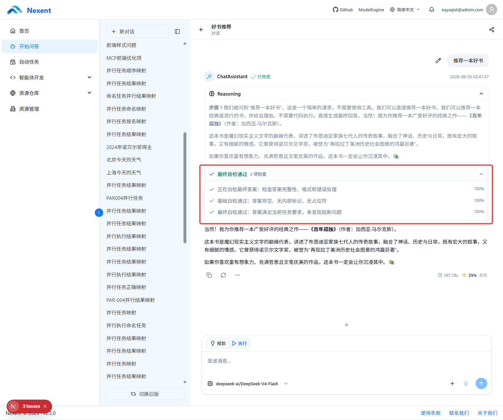

### 9. 执行完成标识

当智能体完成任务后：

- 回复末尾会显示「完成」标识（绿色圆点+文字）
- 显示本次执行的运行时长
- 显示本次对话的 Token 消耗统计


## 四、知识检索与来源溯源

当智能体配置了知识检索工具后，用户可以在问答过程中查看回复所引用的信息来源。


### 1. 查看引用来源

问答完成后，如果智能体调用了知识检索工具，回复区域会显示「查看来源」按钮。点击该按钮可以在右侧面板查看智能体使用过的知识内容。

### 2. 右侧来源面板

来源面板分为两个标签页：

#### 来源标签页

显示智能体回答所引用的知识来源：

**本地知识库检索**：

- 知识库名称
- 来源文件名称
- 文本块标题
- 匹配到的文本内容
- 相关引用片段

**网络检索结果**：

- 网页标题
- 来源网址
- 网页摘要或引用内容
- 相关图片或其他网络资源

用户可以通过来源链接查看原始网页。

#### 图片标签页

- 展示从网络检索中获取的相关图片
- 点击图片可进行大图预览
- 显示图片来源网页标题

## 五、图像处理功能

当智能体配置了视觉模型和图像解析工具后，用户可以上传图片并让智能体进行分析。

### 1. 上传图片

支持以下方式上传图片：

| 上传方式     | 操作说明                                   |
| ------------ | ------------------------------------------ |
| 点击上传按钮 | 点击输入框右侧的文件上传按钮，选择图片文件 |
| 拖拽上传     | 将图片文件直接拖拽到对话区域               |
| 输入框选择   | 在输入框的文件选择器中选择图片             |

### 2. 图像分析

智能体可以根据图片内容执行以下类型的任务：

- **描述图片内容**：识别并描述图片中的场景、人物、物品等
- **识别图片中的文字**：提取图片中的文字信息（OCR）
- **分析图像中的物体、场景或结构**：识别图片中的物体类别、场景类型、图表结构等
- **回答与图片相关的问题**：根据图片内容回答用户的提问
- **根据图片内容进行整理或判断**：基于图片信息进行分析、总结或推理

> **注意**：图像处理能力取决于智能体是否配置了视觉模型和对应工具。


### 3. 图片来源引用

如果图片来源于网络检索，右侧来源面板的图片标签页中会显示相关图片缩略图，点击可查看大图。

## 六、文档处理与生成

### 1. 文档分析

> **提示**：如需分析文档，需要在智能体中配置官方的 `analyze_text_file` 工具。

用户可以上传文档，让智能体进行以下处理：

- **内容总结**：提取文档的主要内容和要点
- **关键信息提取**：从文档中抽取关键数据、事实或信息
- **文档问答**：根据文档内容回答用户的问题
- **结构分析**：分析文档的组织结构、章节关系等
- **内容对比**：对比多个文档的内容差异
- **数据整理**：将文档中的数据整理为表格或其他格式


### 2. 文档生成

> **提示**：如需生成 Word 文档（.docx），需要在智能体中配置官方的 `create-docx` Skill。文档生成能力取决于智能体所配置的工具和 Skill。

智能体可以根据用户需求或对话内容生成文档，例如报告、方案、说明文档、表格、演示文稿等。

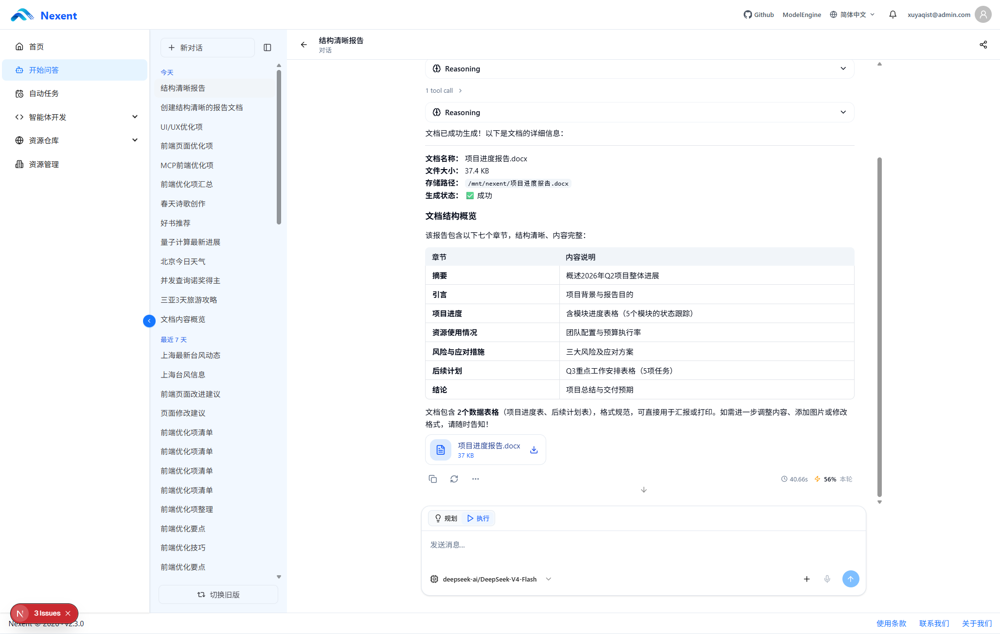

工具或 Skill 生成的文件会先写入本次运行的沙箱工作区，再上传到平台文件存储。智能体回复中的文件链接使用稳定的存储引用，页面会在打开或下载时转换为当前可访问的地址，避免历史消息中的临时签名链接过期。

### 3. 文档预览与下载

文件生成后，用户可以在问答页面中：

- **查看文件内容**：点击文件卡片或链接，在支持的格式下直接预览
- **检查生成效果**：确认文档内容是否符合需求
- **继续修改**：要求智能体对文档进行修改或补充
- **下载文档**：点击下载按钮保存到本地

如果某种格式不能在浏览器中预览，仍可直接下载后使用本地应用打开。生成文件是否可用取决于智能体配置的工具或 Skill；普通文本回答不会自动产生文件。


## 七、Mermaid 图表

当智能体生成 Mermaid 图表代码时，问答页面可以将其渲染为可视化图表。

### 支持的图表类型

可用于生成以下类型的图表：

| 图表类型                  | 说明                   |
| ------------------------- | ---------------------- |
| 流程图 (Flowchart)        | 展示流程和决策路径     |
| 时序图 (Sequence Diagram) | 展示对象之间的交互顺序 |
| 类图 (Class Diagram)      | 展示类之间的结构和关系 |
| 状态图 (State Diagram)    | 展示状态转换过程       |
| 甘特图 (Gantt)            | 展示项目时间计划       |
| 思维导图 (Mindmap)        | 展示主题的层级关系     |
| 实体关系图 (ER Diagram)   | 展示数据实体之间的关系 |

### 图表交互

生成后的图表支持以下交互：

- **悬停放大**：鼠标悬停时显示放大按钮
- **全屏查看**：点击放大按钮可全屏查看图表
- **拖拽平移**：在全屏模式下可拖拽移动视图
- **滚轮缩放**：支持滚轮缩放图表
- **重置视图**：可重置缩放和位置

> **提示**：如果图表渲染失败，会显示原始代码并提示「图表无法渲染」。


## 八、对话交互

### 1. 刷新回答

当用户对当前回答不满意，或者希望智能体重新生成结果时，可以使用刷新功能。

**操作方式**：

- 点击智能体回复下方的刷新按钮（带旋转箭头的图标）
- 或使用输入框重新发送相同的问题

**刷新效果**：

- 重新提交当前问题
- 重新执行智能体处理流程
- 生成新的回答结果

> **注意**：刷新回答会消耗额外的 Token 资源。


### 2. 复制回答

用户可以复制智能体的回复内容。

**操作方式**：点击回复下方的复制按钮（带剪贴板的图标）。

复制成功后按钮图标会短暂变为勾选状态。

### 3. 导出 Markdown

用户可以将完整的对话内容导出为 Markdown 格式。

**操作方式**：点击回复下方「更多」菜单中的「导出 Markdown」选项。

### 4. 分享对话

支持用户生成分享链接，将对话分享给其他人查看。

**分享模式**：

1. 点击对话标题旁的分享按钮进入分享模式
2. 可以选择分享全部问答或选择特定的问答对
3. 点击「复制链接」生成分享链接
4. 分享链接会被复制到剪贴板

**分享内容**：

- 被选中的用户问题和智能体回复
- 智能体使用的来源引用
- 相关图片（如果涉及）

**分享页面特性**：

- 分享页面为只读模式
- 其他用户可以查看但无法继续对话
- 来源面板仍可正常查看


### 5. 批量管理对话

对话管理页面支持批量删除对话。进入批量管理模式后，可以逐个勾选需要删除的对话，也可以全选当前已加载的对话，然后统一删除。

操作步骤如下：

1. 在对话历史区域进入批量管理模式。
2. 勾选需要删除的对话，或使用“全选”选择当前已加载的全部对话。
3. 检查已选数量，点击“删除”，然后在确认窗口中完成删除。

> **注意**：删除操作无法撤销。批量删除还会取消并清理绑定到所选对话的自动化任务，请在确认前仔细检查所选对话。

<div style="display: flex; justify-content: center; align-items: flex-start; gap: 16px;">
  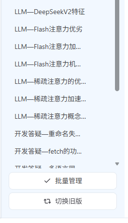
  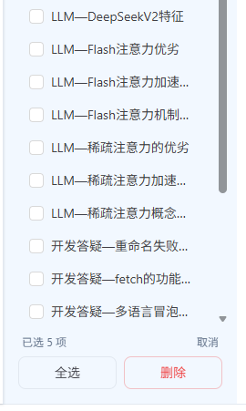
</div>


## 九、后台运行模式

当智能体处理复杂任务或生成文件时，任务可能需要较长时间执行。用户可以离开当前对话页面，系统会继续在后台处理任务。

### 1. 继续执行任务

用户离开当前对话页面后，智能体可以继续执行未完成的任务。

- 任务会在服务器端继续运行
- 不受用户关闭浏览器或切换页面影响

### 2. 返回查看结果

用户重新进入原对话后，可以查看：

- 已经生成的执行过程记录
- 各步骤的执行状态
- 最终生成的结果

### 3. 停止执行

如果用户仍在当前页面，可以随时停止智能体的执行：

- 智能体执行时，发送按钮变为停止按钮（方形图标）
- 点击停止按钮可以中断当前的执行过程
- 已执行完成的部分结果会保留

## 十、快捷操作与导航

### 1. 返回智能体列表

在对话页面中，点击左上角的返回按钮可以返回智能体选择列表。

### 2. 切换到旧版界面

左侧边栏底部提供「切换到旧版」入口，用户可以切换回旧版的对话界面。

### 3. 侧边栏折叠

在桌面端，侧边栏支持折叠/展开操作。点击折叠按钮可以将对话历史区域收起，扩大主对话区域。

在移动端，侧边栏默认折叠，点击展开按钮可临时展开。

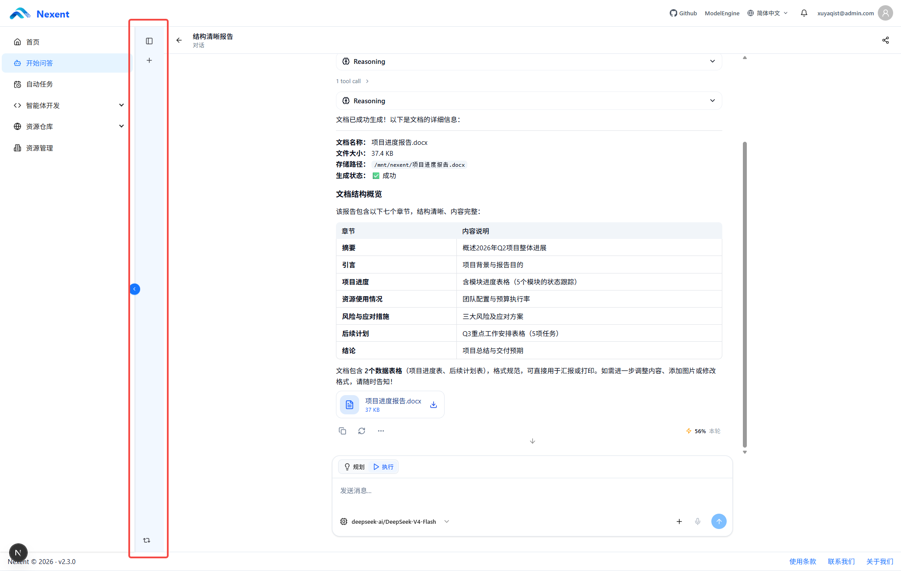
