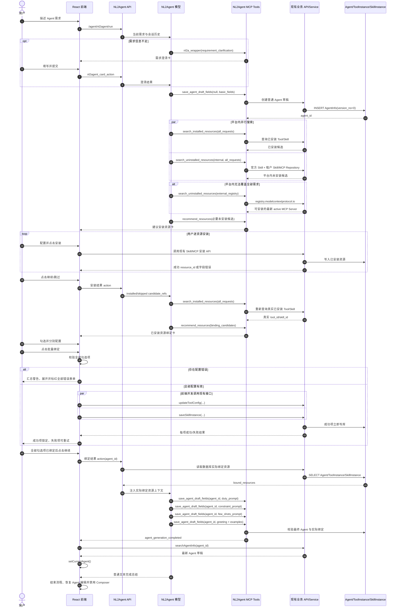
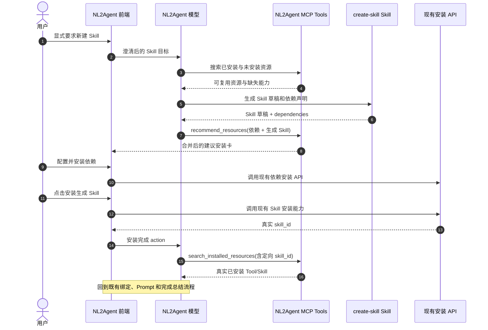

# NL2Agent 能力发现、安装、绑定与 Agent 草稿设计方案

> 日期：2026-08-17  
> 更新：2026-08-20（最终确认阶段改为总结阶段）
> 状态：两阶段迁移完成，作为 `/newagents` 当前开发设计基线
> 历史方案：`2026-08-11-nl2agent-capability-design-handoff.md` 仅保留作决策演进记录  
> 前端示意：`2026-08-12-nl2agent-card-prototype.html`

## 0. 文档定位

本文记录当前已确认的 NL2Agent 首版方案，并替代 08-11 文档中的以下旧设计：

1. 不再使用完整 Agent Snapshot。
2. 不再使用 `revision`、`agent_revision` 或 `based_on_agent_revision`。
3. 不持久化 NL2Agent 会话、卡片状态或流程进度。
4. Agent 数据库草稿是 Agent 配置的唯一事实来源。
5. 需求澄清结束后立即创建 Agent 草稿，不再等到绑定卡出现时才创建。
6. Prompt 由模型通过 MCP Tool 分批写入数据库；全部字段校验成功后由模型直接输出总结，不生成最终确认卡。
7. NL2Agent 专用 MCP Tool 从四个调整为五个。
8. 外部资源来源首版只有 MCP 官方 Registry，不接入 ModelScope 或 MCP.so 搜索适配器。
9. 安装卡采用逐资源安装；绑定卡采用多选、分项配置、前端批量触发绑定。
10. 前端不展示推荐百分比，只展示“推荐/可选”和需求对应关系。

本文仍是本地设计 handoff。正式编码前，应按项目 `spec-coding` 流程将最终需求、功能设计、技术设计和开发计划同步到 Nexent Development SPECs Wiki。

### 0.1 两阶段完成边界

两阶段前端统一落在 `/newagents`，只使用 `useAgentStore` 和自动保存队列。`/agents` 保持目标分支原状，仅作为回退入口，不承载 NL2Agent 状态、卡片或双 Store 适配。

1. `/newagents` 默认挂载 `Nl2AgentFlowProvider` 和 `Nl2AgentChatPanel`。
2. 需求澄清、草稿创建、资源发现、配置、绑定和完成总结共享同一个临时对话 Runtime。
3. 普通表单、旧推荐卡、Draft 卡和新绑定卡统一写 `useAgentStore`；Store 同时维护编辑快照、服务端快照和自动保存队列。
4. 草稿首次获得真实 ID 时只升级页面身份，不重建 Runtime；选择、新建或删除 Agent 时才重置对话。

旧 `local_mcp_recommendation`、`agent_draft` 和 `/agent/nl2agent/run` payload 保持兼容。旧推荐卡仍可整体替换当前工具列表，旧 Draft 卡仍可整体更新当前表单字段，但持久化统一由 `useAgentStore` 自动保存，不再依赖手动保存按钮。

---

## 1. 产品目标与版本范围

### 1.1 产品目标

用户用自然语言描述 Agent 需求后，NL2Agent 应完成：

```text
澄清需求
→ 创建普通 Agent 数据库草稿
→ 搜索已安装资源和平台内未安装资源
→ 必要时搜索 MCP 官方 Registry
→ 建议并安装缺失资源
→ 重新搜索真实已安装资源
→ 用户配置并批量绑定资源
→ 模型基于数据库中的实际绑定资源分批生成 Prompt
→ 模型直接输出新智能体总结并结束流程
```

### 1.2 首版包含

1. 一轮一张 `<nl2a>` 交互卡。
2. 三种卡片 subtype：需求澄清、建议安装、已安装资源绑定。
3. 五个 NL2Agent MCP Tool。
4. 平台内资源优先、MCP 官方 Registry 按需补充的两阶段搜索。
5. Tool、Skill 和 MCP Server 候选的统一排序与覆盖判断。
6. Skill 和 MCP Server 的逐资源配置与安装。
7. 已安装 Tool/Skill 的多选、分项配置和批量绑定。
8. 需求澄清后创建 `version_no=0` 的普通 Agent 草稿。
9. ToolInstance/SkillInstance 绑定成功后立即写库。
10. 五组 Prompt 字段在完成总结前分批写库。
11. Agent 编辑表单无刷新同步。
12. 完成事件触发后禁用 NL2Agent 输入、刷新并解锁右侧表单，但不关闭对话面板，也不显示额外结束界面或新流程入口。

### 1.3 首版不包含

1. 定时任务、Automation Proposal 或 Task 创建。
2. Agent Snapshot、revision 或基于 revision 的冲突合并。
3. NL2Agent 会话恢复、刷新恢复或跨设备恢复。
4. ModelScope、MCP.so 或其他社区目录搜索适配器。
5. 外部社区 Skill 搜索和安装。
6. 推荐匹配度百分比。
7. 候选 `fingerprint`。
8. 后端批量绑定 API。
9. 对 Prompt 自然语言进行未绑定资源名称扫描。
10. `create-skill` 主流程集成；该能力保留为可选开发项。

---

## 2. 当前系统事实与复用边界

### 2.1 可直接复用的基础设施

| 能力 | 当前入口 | 复用方式 |
|---|---|---|
| NL2Agent 运行入口 | `POST /agent/nl2agent/run` | 保留现有临时 Agent 运行链路 |
| NL2A SSE 提取 | `MessageObserver(enable_nl2a_wrapper=True)` | 继续提取 `<nl2a>` JSON |
| 前端 NL2A 解析 | `remote-chat-model-adapter.ts` | 扩展 payload 联合类型 |
| 卡片挂载 | `thread.tsx` | 扩展三种 subtype 分支 |
| Agent 创建/更新 | `/agent/update` 和 `update_agent_info_impl()` | 由受限 MCP Tool adapter 复用底层能力 |
| Agent 详情读取 | `searchAgentInfo()` | 用于无刷新同步编辑表单 |
| Tool 绑定 | `updateToolConfig()` | 前端批量编排现有单资源接口 |
| Skill 绑定 | `saveSkillInstance()` | 前端批量编排现有单资源接口 |
| 官方 Skill 安装 | `POST /skills/install` | 安装卡逐资源调用 |
| Skill Repository 安装 | `POST /skill-repository/{id}/install` | 安装卡逐资源调用 |
| MCP Server 安装 | `/mcp/add`、`/mcp/add-from-config` | 安装卡逐资源调用 |
| MCP 官方 Registry | `/mcp/management/registry/list` | 未安装资源搜索 Tool 复用 |

### 2.2 需要替换或扩展的窄版实现

1. 当前 `search_installed_mcp_tools_by_query()` 只搜索 `source=mcp` 的已安装 Tool，需要扩展到用户可见的 Local Tool、已安装 MCP Tool 和 Skill。
2. 当前只有 `search_installed_mcp_tools` 与 `nl2a_wrapper` 两个专用 Tool，需要调整为五个 Tool。
3. 当前前端只有旧推荐工具卡和 Agent Draft 卡，需要替换为三种新卡。
4. 当前 `AgentDraftCard` 直接修改前端 Store，新方案改为数据库草稿先写库，再同步 Store。
5. 当前 NL2Agent `max_steps=5`，新流程同一轮需要多次保存 Prompt，调整为 `max_steps=8`。

整体上可复用约 70% 的现有系统能力；可直接复用的代码约 50%～60%。新增工作集中在流程编排、统一候选 Schema、搜索聚合、三张交互卡和完成总结。

---

## 3. 事实来源、状态和 Agent 生命周期

### 3.1 唯一事实来源

```text
Agent 基本信息与 Prompt
→ AgentInfo(version_no=0)

实际 Tool 绑定
→ ToolInstance(version_no=0)

实际 Skill 绑定
→ SkillInstance(version_no=0)
```

NL2Agent 不维护第二份 Agent Snapshot。搜索结果、卡片选择、表单草稿、安装状态和批量绑定状态只存在于当前页面内存。

### 3.2 Agent 草稿创建时点

需求澄清完成后的下一次模型执行中：

```text
save_agent_draft_fields(
  agent_id=null,
  fields={
    name,
    display_name,
    description
  }
)
```

后端创建普通 `version_no=0` Agent，并返回真实 `agent_id`。名称冲突复用现有后缀生成逻辑，不额外调用 LLM。

新流程只生成并维护 `description`：

```text
description
→ /newagents Agent 信息区的 description（Agent 简介）
```

`business_description` 是旧前端字段，不进入 NL2Agent Tool 白名单、可信上下文或 `/newagents` 编辑 Store。数据库列和通用 Agent API 暂时保留该字段以兼容旧页面、导入和市场数据，新流程不会读取、写入或清空历史值。

创建时后端补齐：

```text
租户默认 LLM
普通 Agent max_steps=15
is_main_agent=true
provide_run_summary=false
enabled=true
系统默认 Prompt 模板
当前用户默认分组
version_no=0
```

首版不设计创建失败恢复、幂等键、重复草稿清理或会话恢复。

### 3.3 前端编辑状态同步

数据库更新不会自动改变 React 表单。前端在以下检查点执行：

```text
searchAgentInfo(agent_id)
→ useAgentStore.initialize(agent)
→ 原子替换 editedAgent 与 savedAgent
→ invalidate Agent、Tool/Skill Instance 查询
```

同步时点：

1. Agent 草稿创建成功后，收到后端生成的 `agent_draft_created` 状态事件时立即同步，不等待下一张资源卡。
2. 绑定卡成功继续后。
3. 收到受信任的 `agent_generation_completed` 状态事件时。

Agent 草稿创建后，前端立即从无 ID 状态升级为可编辑草稿。NL2Agent 流程锁与数据库 `READ_ONLY` 权限分别计算，但共同禁用普通表单、Tool/Skill、协作 Agent、知识库和发布操作；只读 Agent 同时禁用 Composer 和交互卡。

页面执行 `searchAgentInfo(agent_id, version_no=0) → useAgentStore.initialize()`，更新 URL 并刷新相关查询。该身份升级必须保留当前临时对话；用户选择其他 Agent、新建或删除 Agent 时重置对话。

每次 NL2Agent 请求都携带当前 `agent_id`。后端校验它属于当前租户、是 `version_no=0` 草稿且当前用户可编辑，并向内部 Local MCP 注入受信任的当前草稿 ID Header。存在该上下文时，所有保存、搜索和 Wrapper 调用必须复用同一 ID；模型传空 ID 时强制更新当前草稿，传入不同 ID 时返回 `agent_context_mismatch`，不得创建第二个 Agent。

---

## 4. 用户交互和模型执行主流程

### 4.1 主流程

1. 用户描述 Agent 需求。
2. 模型判断信息是否足够；不足时输出需求澄清卡。
3. 用户提交澄清卡；单选和多选可提供默认展开的“其他...”文本框，文本题不再增加第二个“其他”输入框。
4. 模型调用 `save_agent_draft_fields(agent_id=null, fields=...)` 创建 Agent 草稿。
5. 模型通过当前官方 `parallel_executor` 并行执行：
   - `search_installed_resources`
   - `search_uninstalled_resources(scope=internal)`
6. 若平台内候选无法覆盖全部需求，模型自动调用 `search_uninstalled_resources(scope=external_registry)`。
7. 模型选择必要的未安装资源，调用 `recommend_resources` 获取详情和配置 Schema。
8. 若存在必要安装项，模型输出建议安装资源卡；否则直接进入已安装资源绑定卡。
9. 用户逐资源配置和安装，点击“继续”或“跳过”。
10. 模型重新搜索真实已安装资源。若仍有未覆盖需求，则排除用户已跳过候选并搜索替代资源；没有替代资源时输出需求澄清卡，由用户放弃、修改需求或结束流程。
11. 模型输出统一的已安装资源绑定卡。
12. 用户多选资源、分别配置，并点击“批量绑定”。
13. 所有勾选项均已绑定，或当前无任何勾选项时，用户才可继续。
14. 后端根据 `agent_id` 从数据库重新读取实际已绑定资源，并注入下一轮 NL2Agent 上下文。
15. 模型分批调用 `save_agent_draft_fields` 写入五组 Prompt 字段。
16. 最后一批字段写库后，后端从数据库校验描述、五组 Prompt 和真实绑定资源，并发送 `agent_generation_completed` 状态事件。
17. 模型收到完成事件后直接输出“生成完成、智能体总结、请在右侧表单更新”三段普通文本，不再调用 wrapper。
18. 前端禁用 Composer，刷新 Agent Store，刷新成功后解锁右侧表单并结束流程；后续修改只通过右侧表单完成。

### 4.2 Mermaid 时序图



---

## 5. NL2Agent MCP Tool 集合

首版固定为五个模型可见 Tool：

```text
search_installed_resources
search_uninstalled_resources
recommend_resources
save_agent_draft_fields
nl2a_wrapper
```

所有 Tool 入口统一注册在 `backend/tool_collection/mcp/nl2agent_mcp_tools.py`。MCP Tool 文件只负责参数边界、当前用户/租户解析和结构化输出；数据库查询与业务编排调用 `backend/services/` 现有能力，不在 Tool 文件直接写 SQL。

### 5.1 `search_installed_resources`

职责：一次接收全部需求，搜索当前租户已经可绑定的 Tool/Skill。

输入模型：

```python
class ResourceRequirement(BaseModel):
    requirement_id: str
    query: str
    resource_name_hint: str | None = None
    search_terms: list[str] = []


class SearchInstalledResourcesInput(BaseModel):
    requirements: list[ResourceRequirement]
```

必须：

1. 返回真实 `tool_id` 或 `skill_id`。
2. 只返回 `is_available=true` 且用户可见的资源。
3. 排除 System Managed、运行时 builtin 和 NL2Agent 自己的内部 MCP Tool。
4. Skill/MCP 类型分流在 Tool 内完成，不增加模型搜索轮数。
5. 一个资源覆盖多个需求时只返回一个候选，并携带多个 `requirement_id`。

### 5.2 `search_uninstalled_resources`

职责：按 `scope` 搜索尚未安装但可由当前平台安装的资源。

输入模型：

```python
class SearchUninstalledResourcesInput(BaseModel):
    requirements: list[ResourceRequirement]
    scope: Literal["internal", "external_registry"]
    exclude_refs: list[str] = []
```

两个搜索 Tool 的共同约束：

1. 一次最多接收 8 个需求。
2. `requirement_id` 和 `query` 必填。
3. `search_terms` 可选；为空时后端至少使用 `query` 搜索。
4. `resource_name_hint` 只表示用户疑似点名但可能记错的资源名称。
5. `exclude_refs` 只用于未安装资源的替代搜索，并按完整 `candidate_ref` 精确过滤。
6. Top K、分页数、阈值和来源适配器选择均由后端常量控制，不允许模型传入。

```text
scope=internal
→ Nexent 官方 Skill
→ 当前租户 Skill Repository
→ 当前租户 MCP Repository

scope=external_registry
→ MCP 官方 Registry
```

ModelScope 和 MCP.so 仅保留现有前端外链，不进入该 Tool。

### 5.3 `recommend_resources`

职责：根据模型已经选定的少量候选，读取最新详情并生成卡片所需数据：

```text
名称与说明
需求对应关系
推荐/可选标签
安装或绑定配置 Schema
安装方式列表
资源当前状态
```

该 Tool 不重新执行全量搜索，也不直接安装或绑定资源。

输入固定为 `candidates + recommended_refs`。模型必须原样回传
`search_*_resources` 返回的候选快照；后端不建立 NL2Agent session
缓存，只保留快照中的 `requirement_ids` 与 `score`，并按
`candidate_ref` 重新解析当前租户真实资源。`recommended_refs` 必须唯一且为
`candidates` 的子集，候选总数最多 12 个。

`recommend_resources` 的成功结果不是可见卡片。模型必须将结果与真实
`agent_id` 再传给 `nl2a_wrapper(subtype="installed_resource_binding")`；
Wrapper 会再次解析资源并覆盖名称、说明、来源和配置 Schema，防止模型修改
资源身份或展示字段。

配置表单不再设计一套覆盖 Tool、Skill 和 MCP 的新通用 JSON Schema。`recommend_resources` 对每个资源返回 `form_kind + config`，由前端 NL2Agent 卡片按类型分派：

```text
TOOL_CONFIG
SKILL_CONFIG
MCP_REMOTE
MCP_PACKAGE
MCP_CONTAINER
```

数据契约复用规则：

1. `TOOL_CONFIG` 的 `config` 直接使用现有 `ToolParam[]` 结构。
2. `SKILL_CONFIG` 的 `config` 直接使用现有 `SkillParam[]` 结构。
3. `MCP_REMOTE` 和 `MCP_PACKAGE` 对 MCP 官方 Registry 候选复用现有 `RegistryQuickAddOption`、`RegistryRemoteVariable` 与 `RegistryPackageArgumentInput` 描述；其中 `stdio Package` 最终通过 Nexent Container 部署。
4. `MCP_REMOTE` 和 `MCP_CONTAINER` 对租户 MCP Repository 候选复用现有 `CommunityQuickAddDraft` 或 `LocalAddMcpDraft` 对应分支的可序列化字段子集。
5. `File` 等浏览器运行时对象不得进入 MCP Tool payload；需要时由前端根据用户交互补入本地 Draft。
6. NL2Agent 卡片实现自己的弹窗布局，不直接嵌入现有页面级 Modal；参数解析、校验 helper、Draft 转换和安装/绑定 Service 应复用现有实现。
7. `form_kind` 只决定前端表单和提交适配器，不改变资源的 `candidate_ref`、来源或安装状态语义。

### 5.4 `save_agent_draft_fields`

签名：

```text
save_agent_draft_fields(agent_id, fields)
```

字段白名单：

```text
name
display_name
description
duty_prompt
constraint_prompt
few_shots_prompt
greeting_message
example_questions
```

规则：

1. `agent_id=null` 时创建普通 Agent 草稿并返回 `agent_id`。
2. `agent_id` 存在时只更新 `fields` 中明确传入的字段。
3. 不允许用 `null` 清空字段；字段未传表示不修改，列表使用 `[]` 明确清空。
4. 不写 Tool/Skill 绑定关系。
5. 后端校验 Agent 属于当前租户。
6. Prompt 允许同一轮分多次更新，不要求一次生成完整 PromptSet。

### 5.5 `nl2a_wrapper`

职责：生成需求澄清、建议安装和已安装资源绑定三种 `<nl2a>` payload。资源绑定时从数据库重新解析真实资源身份和配置 Schema。

Wrapper 不负责流程完成或 Prompt 完整性校验，不接收模型重新提交的完整 Agent 内容，也不扫描 Prompt 自然语言判断是否提到未绑定资源。最终数据库校验由最后一批 `save_agent_draft_fields` 成功后触发，不新增完成卡 subtype。

PR2 的 `installed_resource_binding` Wrapper 只接收 `agent_id` 与
`RecommendResourcesOutput`，验证成功后输出绑定卡；旧
`local_mcp_recommendation` 与 `agent_draft` subtype 在迁移期继续兼容。

---

## 6. 资源来源与搜索阶段

### 6.1 来源边界

| 阶段 | 来源 | 状态 | 是否需要安装 |
|---|---|---|---|
| 已安装 | Local Tool | 已有真实 `tool_id` | 否 |
| 已安装 | 已安装 MCP Tool | 已有真实 `tool_id` | 否 |
| 已安装 | 已安装 Skill | 已有真实 `skill_id` | 否 |
| 平台内未安装 | Nexent 官方 Skill | 可安装 | 是 |
| 平台内未安装 | 租户 Skill Repository | 可安装 | 是 |
| 平台内未安装 | 租户 MCP Repository | 可安装 | 是 |
| 外部 | MCP 官方 Registry | 可安装的最新 active Server | 是 |

“Nexent 官方 Skill”和“MCP 官方 Registry”中的“官方”不是同一语义：前者属于 Nexent 平台资源，后者属于 MCP 官方外部 Registry。

### 6.2 两阶段搜索

平台内阶段先执行：

```text
parallel_executor(
  search_installed_resources(all_requests),
  search_uninstalled_resources(scope=internal, all_requests)
)
```

只有平台内结果不能覆盖全部需求时，模型才自动执行：

```text
search_uninstalled_resources(
  scope=external_registry,
  requests=uncovered_requests
)
```

用户不需要手动触发外部搜索。

### 6.3 文本规范化与 RapidFuzz

查询和候选文本统一执行：

```text
Unicode NFKC
→ 转小写
→ 将 _ - / . : 规范为空格
→ 合并连续空格
→ 生成 normalized 与 compact 文本
```

基础相似度：

```text
sim(a, b) = max(
  fuzz.ratio(compact(a), compact(b)),
  fuzz.WRatio(normalized(a), normalized(b)),
  fuzz.token_set_ratio(normalized(a), normalized(b))
) / 100
```

名称匹配保留模糊匹配，避免用户记错资源名称。首版不新增向量索引，跨语言和别名由模型在一次请求中提供 `search_terms`。

### 6.4 相关度与覆盖

能力相关度：

```text
term_score = max(
  1.00 × 名称相似度,
  0.95 × 标签相似度,
  0.90 × 描述相似度,
  0.80 × 接口信息相似度
)

C = 0.65 × 最高 term_score
  + 0.35 × 得分最高三个 term_score 的平均值
```

有名称提示：

```text
R = 0.65 × C + 0.30 × N + 0.03 × installed + 0.02 × quality
```

无名称提示：

```text
R = 0.82 × C + 0.13 × N + 0.03 × installed + 0.02 × quality
```

覆盖阈值：

```text
R >= 0.65          → 强覆盖
0.50 <= R < 0.65  → 弱相关
R < 0.50           → 丢弃匹配关系
```

一个资源覆盖多个需求时，对每个需求分别计算 `R`；统一列表中只出现一次。候选总体排序允许根据额外强覆盖需求数增加覆盖奖励。

`0.50/0.65` 为首版暂定阈值。建立固定中英文检索集并校准阈值属于 P2 优化项，不阻塞核心流程首版实现。

### 6.5 用户可见列表

搜索分数只用于后端排序和模型 observation，不进入前端：

```text
前端显示：推荐 / 可选、满足的需求、推荐原因
前端不显示：candidate_score、匹配度百分比、全量候选评分表
```

安装卡只展示模型选定的必要安装资源，不展示全量搜索结果。

绑定卡只展示与当前需求相关的已安装资源：

1. 最小覆盖组合标记为“推荐”。
2. 每项需求最多补充两个合格替代资源，标记为“可选”。
3. 多需求资源去重。
4. 统一列举 Tool/Skill，不按类型分区。
5. 总数最多 12 项，超过时按覆盖需求数和内部评分截断。

---

## 7. 候选身份与 MCP Registry 规则

### 7.1 `candidate_ref`

首版完全删除 `candidate_fingerprint`。`candidate_ref` 是后端生成、模型只透传的唯一候选标识，使用来源命名空间与来源原生稳定键：

```text
tool:{tool_id}
skill:{skill_id}
nexent_official_skill:{url_encoded_name}
tenant_skill_repository:{skill_repository_id}
tenant_mcp_repository:{market_id}
mcp_official_registry:{url_encoded_server_name}@{version}
```

Local Tool 与已安装 MCP Tool 统一使用 `tool:{tool_id}`；已安装 Skill 使用 `skill:{skill_id}`。资源来源另由 `source=LOCAL_TOOL | MCP_TOOL | INSTALLED_SKILL` 表达，不进入已安装资源主引用。名称或能力相似只参与排序，不用于身份合并。MCP Server 与安装后暴露的 Tool 是不同资源，不得合并。

Skill Repository 安装后的精确来源只在当前流程内映射：

```text
tenant_skill_repository:{skill_repository_id}
→ 安装 API 返回 skill_id
→ 已安装资源使用 skill:{skill_id}
```

数据库中的新 Skill 只沿用现有 `source="repository"`，不新增 `skill_repository_id` 或其他来源字段。该映射用于当前流程的重新搜索、展示和绑定，不持久化；刷新后仍可通过已安装资源语义搜索找到 Skill，但无法追溯到原仓库条目。精确来源追踪不影响首版安装、绑定或 Agent 运行。

### 7.2 跳过候选与放弃需求

跳过候选不等于放弃需求：

1. 安装卡提交 `installed_candidate_refs` 与 `skipped_candidate_refs`。
2. 后续搜索将已跳过候选加入 `exclude_refs`，本次流程不重复推荐。
3. 模型继续为原需求搜索其他候选。
4. 没有替代候选时复用需求澄清卡，让用户明确放弃需求、修改需求或结束流程。
5. 只有用户明确放弃后，该需求才从覆盖判断中移除。

排除列表只保存在当前页面会话，不写数据库。

### 7.3 Registry 搜索与版本

MCP 官方 Registry 固定使用：

```text
https://registry.modelcontextprotocol.io/v0.1/servers
```

规则：

1. 搜索携带 `version=latest`。
2. 只接受 `status=active` 的条目。
3. 同一 `server.name` 最多出现一次。
4. 每个需求先取 30 条；严格过滤后没有合格候选时，在同一次 Tool 调用中自动取第二页。
5. 每个需求最多检查 60 条，不无限翻页。
6. 搜索时固定完整 Registry JSON、`server.name` 与 `version` 到卡片 payload。
7. 用户安装时使用卡片中的版本快照，不重新解析当时的 latest。

### 7.4 可安装性严格过滤

Registry 条目只有能够转换为现有 Nexent 安装路径时，才进入候选和需求覆盖：

1. 可用的 Streamable HTTP Remote。
2. 可用的 SSE Remote。
3. 带 HTTP/SSE Transport URL 的 Package，按 Remote 路径处理。
4. Nexent 已支持的 npm/PyPI `stdio Package`，通过 Container 路径部署。

缺少机器可读安装配置的条目不进入安装卡，也不算作需求已覆盖。

同一个 Registry Server 在安装卡只显示一行。存在多种安装方式时，在齿轮弹窗中选择，默认优先级为：

```text
Streamable HTTP → SSE → stdio Package（Container 部署）
```

同一种方式存在多个地址时，弹窗显示地址下拉菜单。切换安装方式时重新生成对应表单，不改变 Server 级 `candidate_ref`。

MCP 官方 Registry 当前不存在独立的任意 Docker 镜像安装分支。`Package` 是 Registry 安装描述，`Container` 只是 Nexent 执行 `stdio Package` 的部署方式；当前运行时命令仅支持 npm 的 `npx` 和 PyPI 的 `uvx`。

---

## 8. `<nl2a>` 卡片与 action 协议

### 8.0 草稿身份同步事件

Agent 草稿创建不是交互卡，使用独立 SSE 类型同步真实身份：

```json
{
  "type": "nl2a_state",
  "content": {
    "event": "agent_draft_created",
    "agent_id": 1042
  }
}
```

该事件只能由 `save_agent_draft_fields(agent_id=null)` 成功结果中的专用 `<nl2a_state>` 标记触发。最后一批 Prompt 写库并通过数据库校验后，同一可信通道发送 `agent_generation_completed`。SDK Observer 只从 Tool execution log 提取并移除状态标记，拒绝非法结构，并对创建和完成事件去重；模型普通输出不能触发事件。

前端 adapter 校验事件后通过 `Nl2AgentChatPanel` 回调通知 `/newagents` 页面。页面原子刷新 `useAgentStore` 快照并更新 URL，但不重建 Chat Runtime。事件不写入消息卡 metadata，不创建可见消息，也不进入数据库中的流程状态。

### 8.1 三种卡片 subtype

```text
requirement_clarification
suggested_resource_installation
installed_resource_binding
```

所有 payload 顶层包含：

```json
{
  "subtype": "installed_resource_binding",
  "agent_id": 1042
}
```

澄清卡 `agent_id=null`；其余卡片 `agent_id` 必须为正整数。

PR1 新增 `requirement_clarification` 渲染和 action；PR2 新增 `installed_resource_binding`，安装卡由后续 PR 实现。旧 `local_mcp_recommendation` 与 `agent_draft` 分支在过渡期继续可解析和渲染。

### 8.2 一轮一张卡

1. 每轮最多保留一张有效交互卡。
2. 卡片正确执行后触发下一轮对话。
3. 不使用 `card_id`、revision 或 NL2Agent session 字段。
4. 已执行的旧卡片保留只读展示，不再允许重复提交。

统一 action：

```json
{
  "type": "nl2agent_card_action",
  "subtype": "installed_resource_binding",
  "agent_id": 1042,
  "action": "continue",
  "result": {}
}
```

### 8.3 需求澄清卡

1. 单选、多选和文本问题由 payload Schema 驱动；一次最多 5 个问题，优先不超过 4 个聚焦问题。
2. 单选和多选问题提供“其他...”选项，其文本框默认展开。
3. 文本问题的主文本框已经是开放输入，不再渲染或提交独立的“其他...”文本框。
4. 提交成功后立即触发下一轮。
5. 未覆盖需求阻塞时复用同一 subtype，不增加第五种卡。

### 8.4 建议安装资源卡

安装卡采用逐资源安装，不提供统一批量安装：

```text
not_started → configuring → installing → installed
                                  ↓
                                failed → installing
                                  ↓
                                skipped
```

规则：

1. 每个 Skill/MCP Server 单独配置并点击安装。
2. 配置按钮为圆角正方形齿轮 icon。
3. 无配置项资源直接显示安装按钮。
4. `installed` 必须来自后端安装成功并返回真实资源结果，不能由前端自行判定。
5. 已成功资源不因其他资源失败而回滚。
6. `failed` 必须显式重试或跳过，不能直接继续。
7. `not_started` 在用户点击卡片继续时视为主动跳过。
8. 全部没有安装成功时右下角显示“跳过”；存在已安装项时显示“已完成安装，继续”。
9. 表单结构校验可在前端完成；连接和业务校验由后端返回。
10. 校验失败必须定位到具体资源、弹窗和字段。

安装状态机是纯 React 内存状态，建议在卡片组件内用 `useReducer` 实现。刷新页面后状态丢失，已完成安装仍可通过数据库重搜获得。

### 8.5 已安装资源绑定卡

绑定卡采用“多选 + 分项配置 + 批量绑定”。状态分为两个维度：

```text
配置状态：unconfigured / valid / invalid
绑定状态：idle / binding / bound / failed
```

规则：

1. 用户通过复选框勾选待绑定资源。
2. 每项通过齿轮按钮打开独立配置表单。
3. 点击“批量绑定”时，前端先校验全部勾选项。
4. 只要存在一个无效配置，就不发送任何绑定请求；统一警告列出全部错误资源，并展开、标红所有错误表单。
5. 全部配置有效后，前端用 `Promise.allSettled` 并发调用现有 `updateToolConfig()` 与 `saveSkillInstance()`。
6. 不新增后端批量绑定 API。
7. 允许部分成功；成功项立即写库，保持勾选并自动禁用。
8. 失败项保持可选和错误状态，可再次点击批量绑定重试。
9. 再次批量绑定只请求尚未成功的勾选项。
10. 未勾选项不要求配置。

继续条件固定为：

```text
selected_count == 0
OR
selected_items.every(item => item.binding_status == "bound")
```

没有任何勾选时按钮显示“跳过”；存在勾选且全部已绑定时显示“继续”；任何勾选项未绑定时禁止推进。

### 8.6 完成总结阶段

最后一批 `greeting_message + example_questions` 写库后，后端从数据库验证 `description` 和五组 Prompt；存在真实绑定资源时，`constraint_prompt` 与 `few_shots_prompt` 也必须非空。验证成功后发送：

```json
{
  "type": "nl2a_state",
  "content": {
    "event": "agent_generation_completed",
    "agent_id": 1042
  }
}
```

该事件不是卡片 subtype。模型收到事件后直接输出三段普通文本：新智能体已完成生成、新智能体职责与真实能力总结、如需更新请在右侧表单修改。总结不得展示 Prompt 原文或声称拥有未绑定能力。

前端收到完成事件后立即禁用 Composer，并通过 `searchAgentInfo(agent_id) → replaceServerSnapshot()` 刷新右侧表单。刷新成功后解除流程锁；失败时保持表单锁定并显示非卡片式重试提示。

完成后的界面规则：

1. 保留现有对话历史和普通文本总结，不增加最终确认卡。
2. Composer 禁止输入、附件、语音和发送操作。
3. 不增加完成页、状态入口、“开始新流程”或“新建另一个 Agent”按钮。
4. 不清空或持久化当前内存对话；刷新或组件卸载后历史自然丢失。
5. 后续修改只通过同页面右侧 Agent 编辑表单完成，首版不支持完成后继续通过 NL2Agent 修改当前 Agent。

---

## 9. 安装、绑定与错误结果契约

### 9.1 安装结果

```json
{
  "installed": [
    {
      "candidate_ref": "mcp_official_registry:example%2Fserver@1.0.0",
      "resource_type": "mcp_server",
      "resource_id": 123
    }
  ],
  "skipped": [
    {
      "candidate_ref": "nexent_official_skill:daily-report",
      "reason": "not_selected"
    },
    {
      "candidate_ref": "tenant_mcp_repository:81",
      "reason": "install_failed"
    }
  ]
}
```

### 9.2 绑定结果

前端提交 `agent_id` 和已确认结果；模型不提交或覆盖 `enabled_tool_ids`、`enabled_skill_ids`。后端下一轮从数据库重新读取真实绑定。

```json
{
  "bound": [
    {"resource_type": "tool", "resource_id": 301},
    {"resource_type": "skill", "resource_id": 77}
  ],
  "skipped_candidate_refs": [
    "skill:88"
  ]
}
```

### 9.3 前端错误边界

错误处理沿用 Nexent 现有分层，不新增 NL2Agent 专用的通用错误协议：

```text
后端业务错误：AppException(code, message, details)
→ 前端传输错误：ApiError(code, message, details?)
→ 卡片资源状态：candidate_ref + status + ApiError
→ 字段展示：Ant Design Form.setFields()
```

具体规则：

1. `candidate_ref` 属于安装卡或绑定卡的资源状态，不进入 `ApiError`。
2. `ApiError` 兼容扩展可选 `details`；现有只读取 `code` 和 `message` 的调用方无需修改。
3. NL2Agent 前端适配器兼容解析现有 `{code, message, details}`、`{message}`、FastAPI `422 detail` 和普通 `Error`，统一转换为 `ApiError`。
4. 前端必填和格式校验直接使用现有 Ant Design Form 规则；批量校验失败时使用 `Form.setFields()` 展开并标红对应字段。
5. 后端能够可靠提供字段信息时，放入 `details.field_errors`，适配器再转换为 Ant Design 字段错误。
6. 名称冲突、端口冲突等已有明确语义的业务错误可映射到对应字段；连接失败、Docker 不可用和未知异常只显示资源级错误，不猜测字段。
7. 不要求首版统一改造所有后端安装接口；现有 Skill/MCP Service 只需保留足以完成上述映射的状态码、消息和原始详情。
8. 模型不参与安装或绑定错误字段判断。

---

## 10. Prompt 分批生成、写库与完成校验

### 10.1 绑定后上下文注入

绑定卡继续后，前端只发送 `agent_id` 和操作结果。`backend/services/nl2agent_service.py` 在构建下一轮 `AgentRunInfo` 时：

1. 校验 Agent 属于当前租户。
2. 从数据库读取 Agent 基本信息。
3. 读取 enabled ToolInstance/SkillInstance。
4. 读取这些资源的真实名称、描述、输入和已配置字段名，不把凭据或原始密钥值注入模型。
5. PR2 将最小 `bound_resources` 作为请求级 NL2Agent 上下文注入 `context_input`，只包含数据库确认的资源身份、说明、输入或配置字段名，不包含任何配置值或默认值；该上下文只用于确认绑定闭环，PR3 再补充 Agent 基本信息并用于 Prompt 生成。

模型生成 Prompt 时不再使用搜索阶段的未安装候选或用户未绑定资源。

### 10.2 同一轮分批写入

推荐顺序：

```text
1. duty_prompt
2. constraint_prompt
3. few_shots_prompt
4. greeting_message + example_questions
5. 普通文本完成总结
```

`save_agent_draft_fields` 允许同一轮多次调用，避免模型一次生成体量过大的 PromptSet。

失败规则：

1. 当前字段失败时阻塞后续字段。
2. 已成功写入字段不回滚。
3. 模型在同一轮最多修正重试一次。
4. 第二次失败不输出完成总结；绑定卡区域提供“重试生成”入口触发新一轮。
5. 最后一批保存成功且数据库完整性校验通过后，才发送 `agent_generation_completed`。

### 10.3 校验边界

后端不解析 Prompt 自然语言来判断是否提到未绑定资源。首版通过正确输入边界保证一致性：

1. Prompt 生成前只注入数据库实际绑定资源。
2. 最后一批保存后，Service 从数据库校验描述、Prompt 完整性和真实绑定关系。
3. 完成校验不做资源名称关键词扫描，不处理别名或间接描述。
4. 模型只基于已确认需求与真实绑定资源输出简洁总结，不重新提交 Agent 内容。

该逻辑属于后端业务边界，不属于 React：

```text
nl2agent_service.py
→ 读取数据库事实并注入模型上下文

nl2agent_mcp_tools.py
→ MCP 参数边界、最终批次保存和可信完成事件

observer.py
→ 只提取 <nl2a>

React
→ 解析、渲染、交互和 searchAgentInfo/setCurrentAgent 同步
```

React 在收到可信完成事件后读取数据库并同步右侧表单；安装和绑定写操作仍由明确的用户点击 handler 触发，不在渲染副作用中自动执行。

---

## 11. 用户需求无法覆盖时的行为

如果平台内搜索和最多两页 Registry 搜索后仍没有可安装资源：

1. 不生成能力不完整的最终 Agent 方案。
2. 复用 `requirement_clarification` 卡片，列出所有未覆盖需求。
3. 用户可以明确放弃需求、修改需求描述或结束流程。
4. 只有用户明确放弃后，才允许继续绑定和 Prompt 生成。
5. 完成总结必须说明被用户明确放弃的范围。

---

## 12. User Story：GitHub 项目报告 Agent

用户输入：

> 检索 GitHub 上最新的相关项目，汇总成报告，每天发送到我的邮箱。

首版不创建定时任务，因此需求澄清卡必须说明本版本只创建可手动运行的 Agent，并询问用户是否接受暂不包含“每天自动执行”。用户接受后：

1. 创建 GitHub 项目报告 Agent 数据库草稿。
2. 搜索 GitHub 查询、报告生成和邮件发送能力。
3. 平台内已有资源不足时搜索 MCP 官方 Registry。
4. 安装卡只展示必要的 Skill/MCP Server。
5. 用户完成安装后，模型重新搜索真实 Tool/Skill。
6. 绑定卡统一展示相关资源，用户勾选并配置 GitHub Token、邮箱参数等。
7. 前端批量绑定；成功项立即写库，失败项保留重试。
8. 后端从数据库读取真实绑定，模型分批生成 Prompt。
9. 模型输出普通文本总结，说明 Agent 的职责、真实能力，并注明未包含定时调度；用户后续通过右侧表单修改。

---

## 13. 前后端实现落点

### 13.1 后端

| 文件 | 计划职责 |
|---|---|
| `backend/tool_collection/mcp/nl2agent_mcp_tools.py` | 五个 MCP Tool 参数和输出边界 |
| `backend/tool_collection/mcp/local_mcp_service.py` | 注册五个内部 Tool |
| `backend/services/nl2agent_service.py` | 搜索编排、统一评分、草稿上下文注入、完成校验编排 |
| `backend/agents/nl2agent_agent.py` | Tool 配置、系统 Prompt、`max_steps=8` |
| `backend/apps/agent_app.py` | 保留现有 NL2Agent SSE HTTP 边界 |
| `backend/services/agent_service.py` | 复用普通 Agent 创建/更新能力 |
| `backend/services/mcp_management_service.py` | 复用 MCP 官方 Registry 查询 |
| `backend/services/skill_service.py` | 复用官方 Skill 与 SkillInstance 能力 |
| `backend/services/skill_repository_service.py` | 复用租户 Skill Repository 安装 |

不新增数据库表或迁移。

### 13.2 前端

| 文件/目录 | 计划职责 |
|---|---|
| `frontend/app/[locale]/newchat/adapter/remote-chat-model-adapter.ts` | 三种 NL2A payload、action 和可信完成事件类型 |
| `frontend/app/[locale]/newchat/assistant-ui/thread.tsx` | 三种卡片挂载 |
| `frontend/app/[locale]/newchat/ui/` | 新增三种卡片组件 |
| `frontend/services/agentConfigService.ts` | 复用 Tool/Skill 绑定与 Agent 读取；保留结构化错误 |
| `frontend/services/mcpService.ts` | 复用 MCP 安装和刷新能力 |
| `frontend/stores/agentConfigStore.ts` | Agent 编辑表单事实同步，不保存 NL2Agent 流程 |

卡片内部状态使用局部 React state/`useReducer`，不新增持久化 Store。

---

## 14. 开发与合并计划

### 14.1 开发前置约束

最新 `develop` 已隐藏 Agent 管理页中的 NL2Agent 入口，但保留运行 API、SSE 提取、前端 Panel 和旧版两张卡。开发期间采用以下约束：

1. Gate 0 先恢复 Agent 创建页中的 NL2Agent Panel，并在页面加载后默认打开，不等待用户点击入口，也不延后到 PR5 切换。
2. 新协议采用增量扩展；Gate 0 及后续所有 PR 均保留现有 `/agent/nl2agent/run` 和 `nl2a` SSE 边界的兼容性。
3. `save_agent_draft_fields` 更新已有 Agent 前必须按 `agent_id + tenant_id + version_no=0` 校验普通草稿及用户权限，不能直接依赖仅按 `agent_id` 更新的数据库函数。
4. NL2Agent 流程只读状态与 Agent 权限只读状态分离。前者是当前页面内存中的流程锁，不能覆盖数据库返回的 Agent 权限。
5. 在安装卡和绑定卡开发前，先将前端 `ApiError` 兼容扩展为可携带 `details`，并统一解析现有后端错误形态。
6. 卡片和流程状态只保存在当前页面的 React Context/`useReducer` 中，不写入持久化 Zustand Store 或数据库。

### 14.2 PR 合并策略

本功能拆为 Gate 0 和五个可独立审查、按顺序合入 `develop` 的功能 PR：

```text
Gate 0 默认打开 NL2Agent Panel
→ PR1 协议与 Agent 草稿闭环
→ PR2 已安装资源搜索与绑定闭环
→ PR3 Prompt 写库与完成总结闭环
→ PR4 未安装资源搜索与安装闭环
→ PR5 完整 E2E 与检索校准
```

合并规则：

1. 每个 PR 最终都以最新 `develop` 为基线并单独合入。
2. 可以使用 stacked PR 提前并行审查，但前置 PR 合入后，后续 PR 必须 rebase 到最新 `develop` 并重新设置目标分支。
3. 严格按照 Gate 0、PR1 至 PR5 的顺序合并，不让多个长期分支重复携带相同前置提交。
4. 每个 PR 必须保持生产可部署、通过自身范围内的测试，并且不得依赖尚未合入的后续 PR 才能恢复原有功能。
5. 单元测试、集成测试和必要的 Playwright 验证随对应功能 PR 一起提交；PR5 只补完整流程验收和校准，不承接前四个 PR 遗漏的基础测试。
6. Gate 0 合入后 NL2Agent Panel 始终默认打开；后续 PR 不再增加入口开关或 Cutover 步骤。

### 14.3 Gate 0：默认打开 NL2Agent Panel（P0）

实现范围：

1. 在 Agent 创建页重新挂载 `Nl2AgentChatPanel`。
2. 页面加载后默认打开 Panel，不依赖顶部按钮、URL 参数或 feature flag。
3. 恢复 Panel 与 Agent 配置区、Agent 信息区并列的响应式布局，窄屏下按自然顺序纵向排列。
4. 保留现有临时会话、旧版推荐卡和 Agent Draft 卡行为，作为 PR1 新协议接入前的可运行基线。

验收门槛：

1. 进入 Agent 创建页后无需额外操作即可看到 NL2Agent Panel。
2. Panel、Agent 配置区和 Agent 信息区在桌面及移动视口均无重叠或内容溢出。
3. 现有 `/agent/nl2agent/run` 请求和两种旧 payload 仍可正常执行和渲染。
4. 使用 Playwright 验证 Panel 默认打开、基础对话发送和响应式布局。

### 14.4 PR1：协议与 Agent 草稿闭环（P0）

实现范围：

1. 冻结五个 MCP Tool 的 Pydantic 入参和返回类型。
2. 冻结三种 NL2A payload、可信完成事件和统一 action TypeScript 类型。
3. 实现需求澄清卡及页面级 NL2Agent 流程状态容器。
4. 实现租户安全的 `save_agent_draft_fields`，复用普通 Agent 创建能力和名称后缀生成逻辑。
5. 创建草稿时补齐默认 LLM、默认 Prompt 配置、`max_steps=15`、默认分组和其他普通 Agent 默认字段。
6. Agent 草稿创建后执行 `searchAgentInfo() → setCurrentAgent()`，从创建模式切换为编辑模式，并施加流程只读锁。
7. 删除新流程对 Snapshot/revision 的依赖。

验收门槛：

1. 自然语言输入可以经过澄清后创建真实正整数 `agent_id` 的普通草稿。
2. 跨租户、非草稿和只读 Agent 更新被拒绝。
3. 页面无需刷新即可展示数据库草稿，流程期间普通编辑表单不可写。
4. 修改模块单元测试覆盖率达到 90%，并完成草稿创建/更新 API 验证和需求澄清卡 Playwright 验证。

### 14.5 PR2：已安装资源搜索与绑定闭环（P0）

实现范围：

1. 实现 `search_installed_resources`，覆盖用户可见的 Local Tool、已安装 MCP Tool 和已安装 Skill。
2. 实现文本规范化、`candidate_ref`、统一评分、多需求覆盖、推荐/可选标签和最多 12 项绑定候选。
3. 实现 `recommend_resources` 的已安装资源详情和 `TOOL_CONFIG`/`SKILL_CONFIG` 表单数据。
4. 实现统一绑定卡、全量前端预校验、错误表单展开和标红。
5. 使用 `Promise.allSettled` 编排现有 Tool/Skill 绑定 API，支持部分成功、成功项锁定和失败项重试。
6. 绑定卡继续后由后端重新读取 ToolInstance/SkillInstance 事实，不信任前端提交的 enabled ID 集合。

验收门槛：

1. 仅依赖已安装资源的需求可以完成搜索、配置和绑定闭环。
2. 无选择、全部成功、部分失败、重试成功和字段错误场景均有测试。
3. 修改的后端模块单元测试覆盖率达到 90%，并完成绑定 API 验证。
4. 本阶段按项目决策使用 `npm run check-all` 与桌面、平板、移动端人工验收，不新增或运行 Vitest/Playwright；该例外不延伸到后续阶段。

### 14.6 PR3：Prompt 写库与完成总结闭环（P0）

实现范围：

1. 在 NL2Agent run 构建阶段注入数据库中的 Agent 基本信息和真实绑定资源。
2. 保持 NL2Agent `max_steps=8`。
3. 实现五组 Prompt 字段分批写库、当前字段一次修正重试和失败后新一轮重试入口。
4. 在最后一批保存后实现租户、草稿、Prompt 完整性和真实绑定校验，并发送可信 `agent_generation_completed` 事件。
5. 模型收到完成事件后直接输出本地化普通文本总结，不调用 wrapper 或生成额外卡片。
6. 前端收到完成事件后禁用 Composer，再次执行 `searchAgentInfo() → replaceServerSnapshot()`，同步成功后解除编辑表单流程锁。

验收门槛：

1. Prompt 生成只使用数据库实际绑定资源，前端无法覆盖该事实。
2. 任一字段二次写入或完成校验失败时不输出完成总结，已成功字段不回滚。
3. 完成事件、普通文本总结、Store 刷新、右侧表单解锁、同步失败重试和 Composer 禁用均有测试。
4. 修改模块单元测试覆盖率达到 90%，并完成 Prompt 写库 API 验证和完成总结 Playwright 验证。

在 PR4 合入前，当前已安装资源无法覆盖的需求仍沿用“明确放弃、修改需求或结束流程”，不得自动生成能力不完整的 Agent。

### 14.7 PR4：未安装资源搜索与安装闭环（P0）

实现范围：

1. 实现 `search_uninstalled_resources(scope=internal)`，聚合 Nexent 官方 Skill、租户 Skill Repository 和租户 MCP Repository。
2. 实现 `scope=external_registry`，接入 MCP 官方 Registry 的 latest active、双页和可安装性过滤。
3. 实现未安装候选的 `candidate_ref`、排除列表、统一评分和多需求覆盖。
4. 扩展 `recommend_resources`，返回 MCP/Skill 安装方式、`form_kind` 和现有配置 Schema。
5. 实现逐资源安装卡，复用现有 Skill/MCP 安装 API，并支持安装失败重试、显式跳过和安装后真实资源重搜。
6. 实现未覆盖需求回到澄清卡的分支，要求用户明确放弃、修改或结束流程。
7. 安装或绑定变化后使当前 Prompt 失效，基于新的数据库事实全量重建 Prompt 并重新输出完成总结。

验收门槛：

1. 平台内优先、Registry 按需补充的两阶段搜索顺序不可被模型绕过。
2. Registry latest active、两页上限、安装方式选择和不可安装条目过滤均有集成测试。
3. 修改模块单元测试覆盖率达到 90%，并完成安装 API 验证和安装卡 Playwright 验证。

### 14.8 PR5：完整 E2E 与检索校准（P1/P2）

P1 完整验收：

1. 验证进入流程、草稿创建、编辑区只读、安装、绑定、完成总结和恢复编辑的完整页面生命周期。
2. 使用 `curl` 验证后端创建、搜索、绑定上下文、完成校验和可信状态事件路径。
3. 使用 Playwright 验证默认打开的 Panel、三张卡、批量绑定部分失败、字段错误展开、普通文本总结和完成后禁用状态。
4. 回归 Gate 0 的桌面和移动端响应式布局，确认后续卡片没有引入重叠或溢出。

P2 校准：

1. 新增固定中英文检索集。
2. 校准 RapidFuzz 权重和 `0.50/0.65` 阈值。
3. 根据检索集回归结果调整 Top K 和绑定卡最多 12 项的配额。

---

## 15. 已确认决策

1. 一轮只保留一张有效交互卡，卡片成功执行后触发下一轮。
2. NL2Agent 流程、卡片状态和排除列表完全不持久化。
3. 普通 Agent 数据库草稿是唯一配置事实来源。
4. 需求澄清后立即创建包含基本信息的 Agent，不创建空 Agent。
5. Tool/Skill 绑定不通过 `save_agent_draft_fields`。
6. Prompt 允许模型在同一轮多次写入。
7. 专用 Tool 固定为五个，卡片 subtype 固定为三个。
8. 内部搜索可以使用官方 `parallel_executor`。
9. 外部来源首版只有 MCP 官方 Registry。
10. ModelScope 与 MCP.so 暂不适配。
11. Registry 每项需求最多自动搜索两页。
12. Registry 只推荐 latest active 且当前 Nexent 可安装的资源。
13. 同一 Registry Server 一行，安装方式在弹窗选择。
14. 删除 `candidate_fingerprint`，只保留 `candidate_ref`。
15. 跳过资源不等于放弃需求。
16. 无法覆盖的需求必须由用户显式放弃或修改，不能自动生成降级 Agent。
17. 前端不展示推荐百分比，只展示“推荐/可选”。
18. 安装卡逐资源配置和安装。
19. 绑定卡只展示相关已安装资源，Tool/Skill 统一列举。
20. 绑定卡多选、分项配置、前端批量绑定，不新增后端批量 API。
21. 批量绑定前校验所有勾选项；存在错误时零请求、汇总警告、展开并标红全部错误表单。
22. 批量绑定允许部分成功；成功项锁定，失败项可重试。
23. 只有全部勾选项已绑定或无任何勾选项时才可继续。
24. 完成总结前 Prompt 已全部写库并通过数据库校验；流程不再提供最终确认按钮。
25. Prompt 生成只使用数据库实际绑定资源。
26. 后端不扫描 Prompt 自然语言中的资源名称。
27. 完成总结后不关闭 NL2Agent 面板，不显示结束界面或新流程入口。
28. 完成事件后禁用 NL2Agent Composer，后续修改通过右侧普通 Agent 编辑区完成。
29. 定时任务不参与首版。
30. Gate 0 恢复并默认打开 Agent 创建页中的 NL2Agent Panel，不在 PR5 增加入口 Cutover 或开关。

---

## 16. 非 P0 可选修复

当前没有未解决的 P0 设计决策。

MCP Registry `stdio Package` 通过 Container 快速安装时，现有分支没有保存完整 `registry_json`，但 `source=mcp_registry`、运行配置、Container 信息和 `_toolNames` 已满足 NL2Agent 的安装、重搜、绑定和运行闭环。因此首版不补齐完整快照。

后续可作为独立 MCP 管理体验修复：在现有 `/mcp/add-from-config` 调用中补传不含用户 Secret 的 Registry 原始元数据，以恢复版本、官网、代码仓库、Server JSON 展示和再次发布时的完整来源信息。该项不属于 NL2Agent P0 验收范围。

---

## 17. 可选开发项：NL2Agent 内新建 Skill

### 17.1 状态

该能力不进入首版主流程，不修改第 4.2 节主时序图。只有用户显式声明“需要新建 Skill”时才考虑调用现有 `create-skill` Skill。

### 17.2 可选流程

```text
澄清需求
→ 搜索平台内和必要的 Registry 资源
→ 调用 create-skill 生成 Skill 草稿及依赖声明
→ 将缺失依赖与生成 Skill 合并进同一张建议安装卡
→ 先安装依赖，再由用户点击安装生成 Skill
→ 重新搜索已安装资源
→ 进入既有绑定、Prompt 和完成总结流程
```

新建 Skill 不直接视为匹配度 100%；安装后必须通过真实 `skill_id` 定向进入已安装资源搜索结果，但不再参加普通模糊匹配排序。

### 17.3 独立时序图



启用该可选项前必须冻结 Skill 草稿 Schema、依赖引用、安装顺序和失败返回契约。
